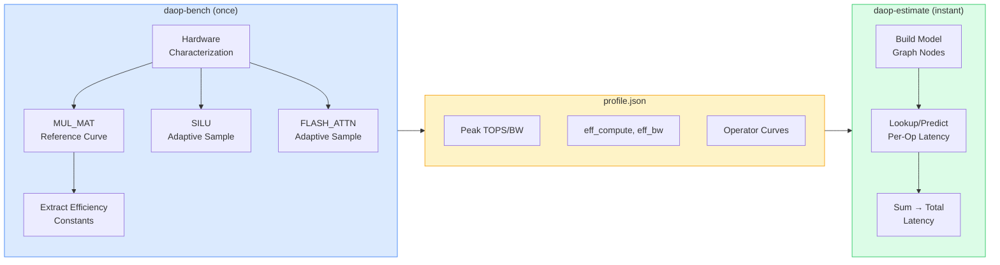

# DAOP: Device-Aware Operator Performance

**Predict LLM inference speed on your hardware — before downloading the model.**

DAOP calibrates your GPU/CPU once (~10 minutes), then instantly estimates tokens/sec for any model.

## How It Works

```
┌─────────────┐     ┌──────────────┐     ┌─────────────────┐
│  daop-bench  │────▶│ profile.json │────▶│  daop-estimate   │
│ (run once)   │     │ (reusable)   │     │  (any model)     │
└─────────────┘     └──────────────┘     └─────────────────┘
  ~10 min              hardware            instant result:
  calibration          fingerprint         "Llama 3 8B q4_0:
                                            42 tok/s decode,
                                            850ms prefill"
```

## Quick Start

```bash
# Step 1: Calibrate your hardware (once)
ollama daop-bench

# Step 2: Estimate any model
ollama daop-estimate llama3:8b-q4_0

# Step 3: Compare options interactively
ollama daop-viewer
```

## What Gets Measured

DAOP benchmarks the core compute operators that dominate LLM inference:

| Operator | What It Does | Method |
|----------|-------------|--------|
| **MUL_MAT** | Matrix multiplication (70-90% of inference time) | Roofline model + efficiency constants |
| **SILU** | Activation function | Direct adaptive sampling |
| **FLASH_ATTN** | Attention mechanism | Direct adaptive sampling |

The **hybrid approach** uses a physics-based roofline model for MUL_MAT (where it's empirically validated at ±10% accuracy) and direct measurement for everything else.

## Why Not Just Run the Model?

| | DAOP Estimate | Actually Running |
|---|---|---|
| **Time** | Instant (after calibration) | Minutes to download + load |
| **Storage** | 0 bytes (model not needed) | GBs of disk space |
| **Compare models** | Seconds per model | Hours of downloading |
| **Quantization choice** | Compare q4_0/q8_0/f16 instantly | Download each variant |

## Output Example

```
Model: llama3:8b-instruct (q4_0)
Hardware: Intel UHD 770 (Vulkan)

Prefill (512 tokens):  280ms  (1,829 tok/s)
Decode (per token):     24ms  (42 tok/s)

Breakdown:
  MUL_MAT      92.1%   (predicted via roofline)
  FLASH_ATTN    5.3%   (measured curve)
  SILU          2.6%   (measured curve)
```

## Documentation

- **[Design Document](design.md)** — Full technical design with reasoning chain, empirical data, and architecture decisions
- **[Engineering Spec](../superpowers/specs/2026-04-03-daop-v2-empirical-design.md)** — Detailed implementation specification

## Architecture Overview



## Key Design Decisions

1. **Hybrid model**: Roofline for MUL_MAT (validated ±10%), direct measurement for others — balances accuracy with calibration speed
2. **Calibrate once, estimate many**: Hardware profile is reusable across all models
3. **Adaptive sampling**: Concentrates measurements where performance changes most, avoiding wasted benchmarking time
4. **Log-space interpolation**: Performance scaling is multiplicative; log space linearizes the relationships

See the [Design Document](design.md) Section 3 for the full empirical justification of these choices.
