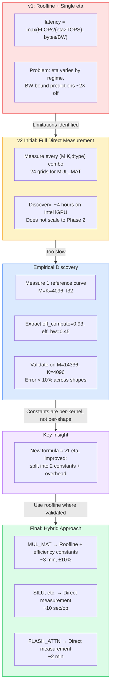
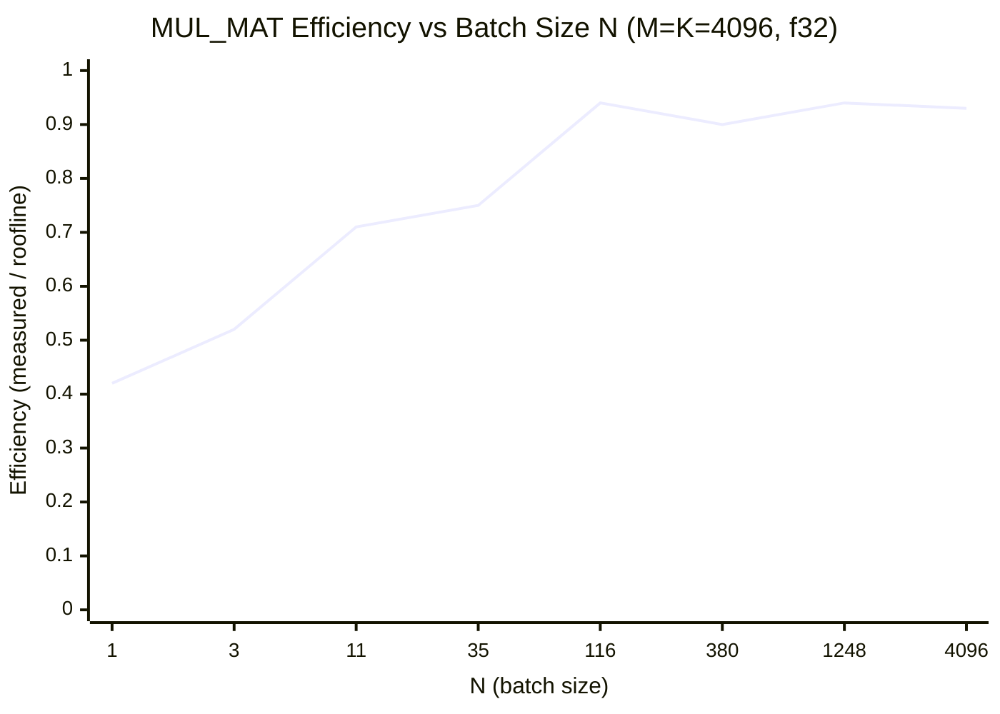
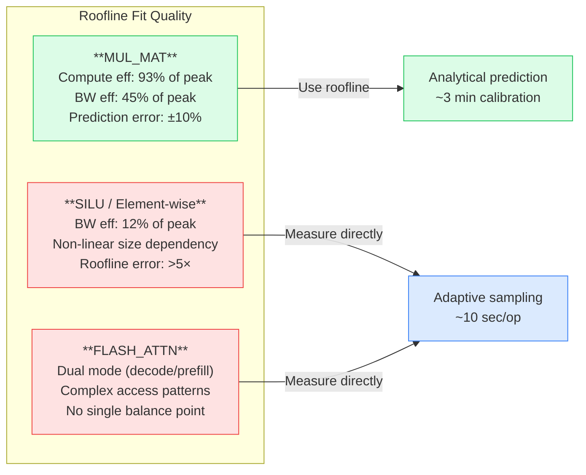
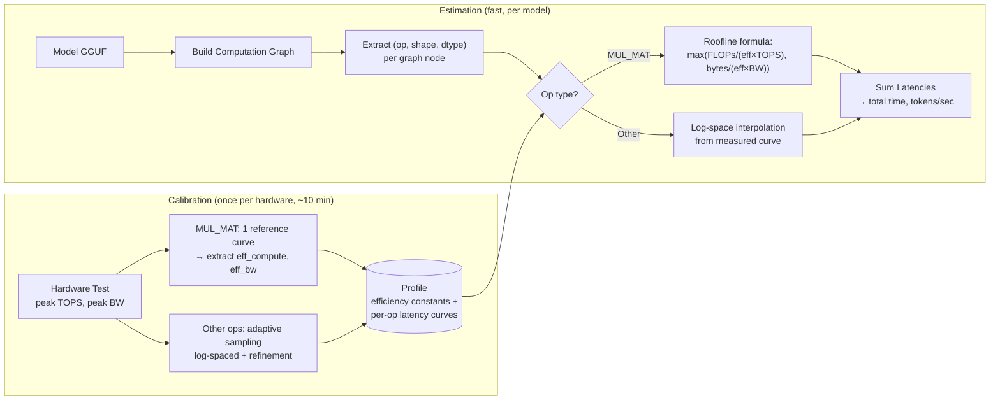
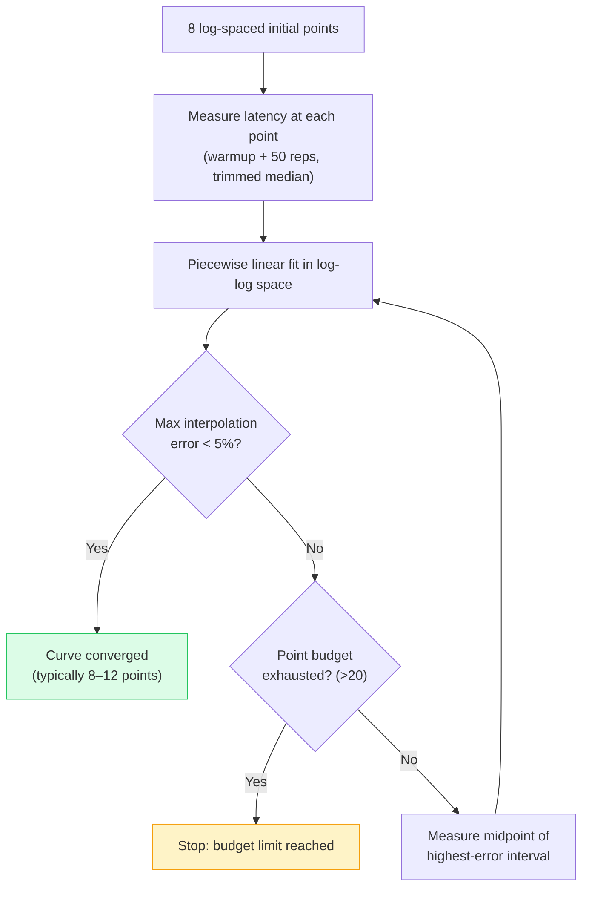
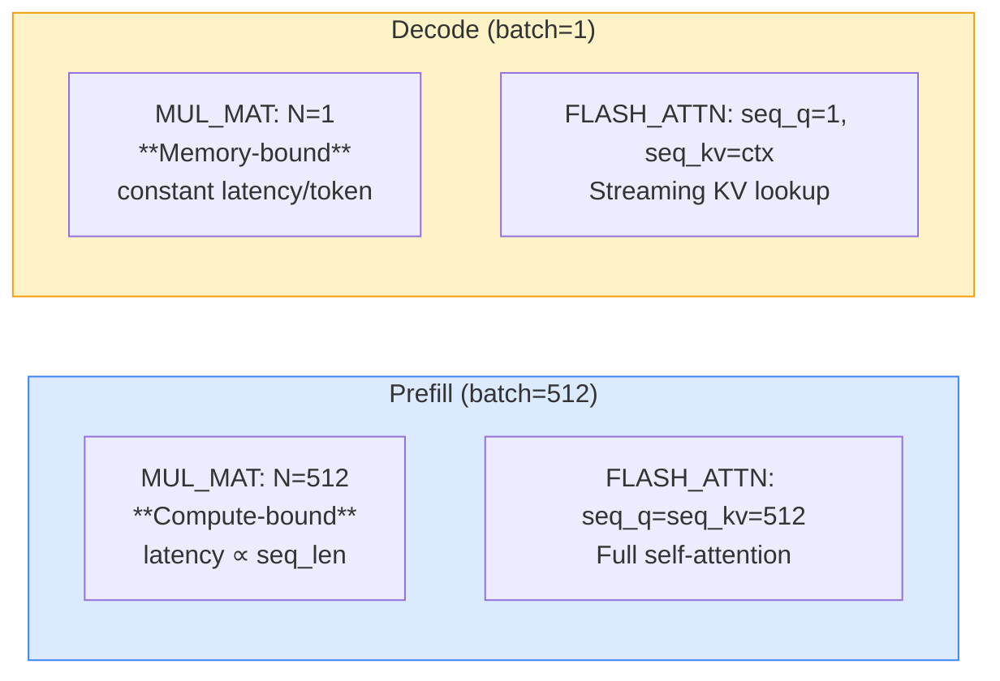
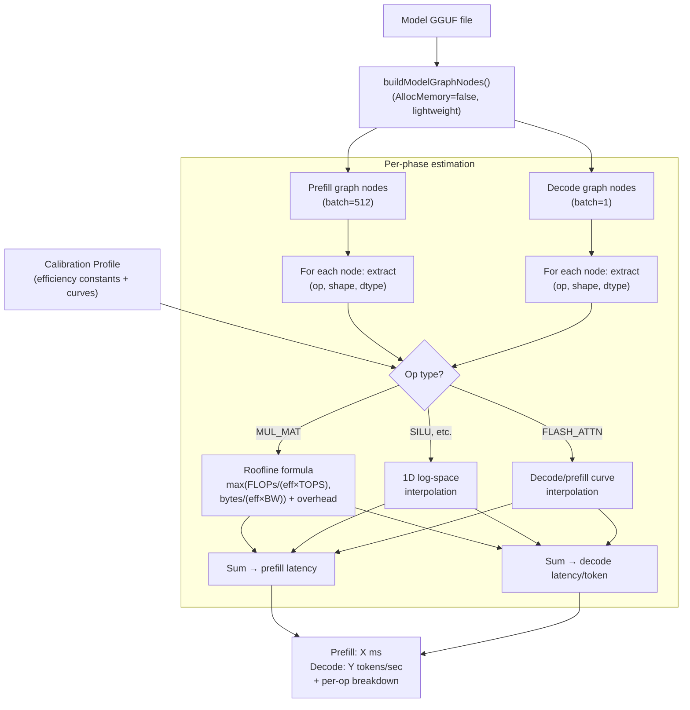

# DAOP Performance Estimation: High-Level Design

## 1. Goals

Predict model inference latency **before running the model**, enabling users to make informed decisions about model selection, quantization, and hardware utilization.

Specifically:

- **Calibrate once**: Benchmark operators on this hardware, store results as a reusable profile
- **Estimate any model**: Load a model's computation graph, look up calibrated latency data, predict total inference time and tokens/sec
- **Accuracy over theory**: Prefer empirical measurements over theoretical models

## 2. Limitations of the Original Roofline Approach

The original design used a Roofline model:

```
T_actual = max(FLOPs / peak_FLOPS, bytes / peak_BW) / eta
```

where `eta` (efficiency factor) captures the gap between theory and reality.

### 2.1 eta Is Not a Constant — But It Is Predictable

`eta` varies with tensor size, shape, and dtype:

- **Small tensors**: GPU kernel launch overhead dominates (3-5us fixed cost), `eta` is very low
- **Large tensors**: Execution approaches hardware peak, `eta` is near 1.0
- **Shape-dependent**: Matrix tiling, cache behavior, and memory access patterns all depend on the specific dimensions, not just total element count

Storing a single scalar `eta` per operator loses this critical size/shape dependency. However, as empirical testing later revealed (see [Section 3](#3-design-evolution-from-theory-to-empirical-hybrid)), `eta` is predictable enough for some operators: for MUL_MAT, the compute-bound efficiency consistently reaches 0.90–0.93 across shapes, and the BW-bound efficiency stabilizes around 0.40–0.52. This led to the improved two-constant model described in Section 3.3.

### 2.2 Shape Matters, Not Just Size

Consider MUL_MAT with inputs of the same total element count:

| Configuration | Shapes | FLOPs | Character |
|---------------|--------|-------|-----------|
| A | [100, 100] x [100, 100] | 2M | Balanced |
| B | [1, 10000] x [10000, 1] | 20K | Memory-bound |

Same input size, 100x difference in FLOPs. The Roofline model uses arithmetic intensity (FLOPs/bytes) to distinguish compute-bound vs memory-bound, but the actual GPU behavior (tiling strategy, shared memory usage, warp scheduling) depends on the specific M, K, N values.

### 2.3 Theoretical Formulas: High Maintenance, Low Value

Each operator requires hand-written `ComputeFLOPs()` and `ComputeBytes()` formulas (~300 lines of code for ~25 operators). These theoretical values are only used to compute arithmetic intensity, which is then multiplied by an inaccurate `eta`. The formulas add maintenance burden without proportional accuracy benefit.

> **Note**: For MUL_MAT specifically, the FLOPs/bytes formulas are simple and well-defined (`FLOPs = 2MKN`, `bytes = (MK+KN+MN) × elem_size`). The "high maintenance" argument applies mainly to complex operators like FLASH_ATTN, RoPE, and other ops with non-trivial computational patterns.

### 2.4 The benchSingleOp Bottleneck

Go's Tensor interface is strongly typed -- each operator has a unique method signature:

```go
SILU(ctx Context, up ...Tensor) Tensor
Mulmat(ctx Context, t2 Tensor) Tensor
RMSNorm(ctx Context, weight Tensor, eps float32) Tensor
```

The original `benchSingleOp()` required a hardcoded switch case per operator for tensor construction. This is unavoidable due to Go's type system, but the original design conflated this with shape selection and the Roofline model, making the code harder to extend.

### 2.5 Summary: Roofline Has Limitations, Not Fatal Flaws

The problems above led to the initial v2 design direction: replace roofline entirely with direct measurement. However, as documented in the next section, empirical testing showed that:

1. **Full direct measurement is prohibitively slow** for operators with many shape combinations (MUL_MAT)
2. **Roofline works well enough** for MUL_MAT when improved with separate compute/BW efficiency constants
3. **Roofline fails** for operators with complex memory access patterns (element-wise ops, attention)

This motivated the hybrid approach: improved roofline for MUL_MAT, direct measurement for everything else.

## 3. Design Evolution: From Theory to Empirical Hybrid

This section documents the iterative design process that led to the final approach. Understanding this evolution is important because the final design appears to "go back" to a roofline model — but it does so with empirical justification that the original v1 approach lacked.



### 3.1 v1: Roofline + Single eta

The original DAOP used a single efficiency constant per operator:

```
latency = max(FLOPs / (eta × peak_TOPS), bytes / peak_BW)
```

**Strengths**: Fast calibration (one measurement per op), simple model.
**Weaknesses**: See [Section 2](#2-limitations-of-the-original-roofline-approach) — `eta` conflates compute and BW efficiency, no overhead term, BW-bound predictions are inaccurate because raw `peak_BW` doesn't reflect matmul memory access patterns.

### 3.2 v2 Initial Design: Replace Roofline with Direct Measurement

To address the limitations, v2 was designed to **eliminate the roofline model entirely**:

```
For each operator:
  For each (M, K) pair from model architectures:
    For each dtype (f16, f32, q4_0, q8_0):
      Adaptively sample latency vs N → store as a piecewise linear curve
```

For MUL_MAT, this means: 6 (M,K) pairs × 4 dtypes = **24 sampling grids**, each measured via adaptive refinement.

**Running `daop-bench` on real hardware (Intel UHD 770 iGPU, Vulkan) revealed the cost:**

| Component | Duration |
|-----------|----------|
| Hardware characterization | ~4 min |
| 1 MUL_MAT grid (M=K=4096, f32, adaptive → 11 points) | ~10 min |
| 24 MUL_MAT grids (projected) | **~4 hours** |
| SILU (1 grid) | ~10 sec |
| FLASH_ATTN_EXT (1 grid) | ~2 min |

**~4 hours for MUL_MAT alone.** Phase 2 adds ~22 more operators. This approach does not scale.

### 3.3 The Discovery: Roofline Efficiency Is Consistent Across Shapes

Rather than measure every (M,K,dtype) combination, we hypothesized that a single reference curve could capture the GPU kernel's efficiency characteristics, which could then predict other shapes analytically.

**Test**: Measure one reference curve (M=K=4096, f32), extract efficiency constants, and validate predictions against a different shape (M=14336, K=4096).

**Reference curve data** (Intel iGPU, peak_TOPS_f32 = 64.3 GFLOPS, peak_BW = 40.7 GB/s):

| N | Arith. Intensity | Ideal Compute (us) | Ideal BW (us) | Roofline (us) | Measured (us) | Regime | Regime Eff. |
|---|---|---|---|---|---|---|---|
| 1 | 0.50 | 524 | **1,570** | 1,570 | 3,754 | BW-bound | BW: **0.42** |
| 3 | 1.50 | 1,572 | **1,571** | 1,572 | 3,007 | BW/transition | BW: **0.52** |
| 11 | 5.43 | **5,740** | 1,649 | 5,740 | 8,028 | Transition | Compute: 0.71 |
| 35 | 16.8 | **18,260** | 1,891 | 18,260 | 24,217 | Transition | Compute: 0.75 |
| 116 | 50.8 | **60,527** | 2,555 | 60,527 | 64,610 | Compute | Compute: **0.94** |
| 380 | 130 | **198,290** | 4,719 | 198,290 | 219,651 | Compute | Compute: **0.90** |
| 1,248 | 248 | **651,263** | 11,829 | 651,263 | 695,931 | Compute | Compute: **0.94** |
| 4,096 | 342 | **2,137,466** | 35,266 | 2,137,466 | 2,302,781 | Compute | Compute: **0.93** |

> **How to read this table**: "Regime Eff." compares measured latency against the **dominant bottleneck** for that point. For BW-bound points (small N), it's `Ideal_BW / Measured` — how close the kernel gets to the memory bandwidth ceiling. For compute-bound points (large N), it's `Ideal_Compute / Measured` — how close to the compute ceiling. The two efficiencies measure different things: GPU matmul kernels achieve ~93% of peak compute but only ~45% of peak BW, because matmul's tiled memory access patterns are less efficient than sequential copy (CONT).

From this data, we extract two separate efficiency constants:
- **eff_compute = 0.93** (median of compute-bound points, N ≥ 116)
- **eff_bw = 0.45** (median of BW-bound points, N ≤ 3)



> The chart shows a clear two-regime pattern: BW-bound efficiency ~0.45 at small N, converging to compute-bound efficiency ~0.93 at large N. The transition region (N=11–35) shows anomalously low efficiency — explained below.

#### Why Is Transition Zone Efficiency So Low?

At N=11, `Ideal_Compute (5,740) >> Ideal_BW (1,649)` — the roofline model says this is firmly compute-bound. Yet measured efficiency is only 0.71. If compute efficiency is truly ~0.93, the predicted latency should be ~6,172 us, not 8,028 us. What accounts for the gap?

The answer lies in the **`max()` assumption**. The roofline formula `max(compute_time, bw_time)` implicitly assumes that compute and memory operations **overlap perfectly** — the GPU loads data while simultaneously computing on previously loaded data, so total time equals whichever is larger. This is an idealization.

Using the extracted efficiency constants to estimate the real time for each component at N=11:

| Component | Ideal (us) | With efficiency | Fraction of compute |
|-----------|-----------|-----------------|---------------------|
| Compute | 5,740 | 5,740 / 0.93 = **6,172** | 100% |
| Memory | 1,649 | 1,649 / 0.45 = **3,664** | 59% |

Three predictions bracket the measured value:

```
Full overlap (max model):  max(6,172, 3,664) =  6,172 us  ← roofline assumes this
Partial overlap:                                 8,028 us  ← measured
No overlap (sum model):    6,172 + 3,664      =  9,836 us
```

The measured 8,028 us falls between full and no overlap, indicating **partial overlap** at N=11.

Contrast with N=116, where memory is negligible:

```
Full overlap:  max(65,082, 5,678) = 65,082 us
No overlap:    65,082 + 5,678     = 70,760 us  (only 8% more)
Measured:                           64,610 us   ← matches max model
```

**When one component dominates (compute >> memory or memory >> compute), the `max()` model is accurate regardless of overlap behavior. The model only breaks down in the transition zone where both components are significant.**

This is a known limitation of the roofline model. For DAOP, the practical impact is bounded:

- **Compute-bound points (N ≥ ~100)**: `max()` model works well, error < 10%
- **BW-bound points (N ≤ ~3)**: `max()` model works well, error < 15%
- **Transition zone (N ≈ 10–50)**: `max()` underestimates latency, error can reach ~30%

In real transformer inference, MUL_MAT operates predominantly in the extremes: **N=1 for decode** (firmly BW-bound) and **N=prompt_length for prefill** (firmly compute-bound). The transition zone is rarely hit in practice, so this limitation has minimal impact on estimation accuracy.

**Cross-shape validation** (M=14336, K=4096 — a completely different shape):

| N | Predicted (us) | Measured (us) | Error |
|---|----------------|---------------|-------|
| 1 | 11,618 | 12,046 | **−3.6%** |
| 380 | 735,150 | 784,416 | **−6.3%** |
| 4,096 | 7,508,000 | 7,509,203 | **−0.02%** |

**Key finding**: The efficiency constants are **per-kernel properties** (reflecting GPU matmul tiling/dispatch characteristics), not per-shape properties. They transfer across (M,K) shapes within <10% error.

### 3.4 The Key Insight: This IS v1 eta, Improved

At this point we recognized that the improved model:

```
latency = max(FLOPs / (eff_compute × peak_TOPS), bytes / (eff_bw × peak_BW)) + overhead
```

is structurally the same as v1's eta model. The `max()` inherits the overlap assumption discussed above — accurate in the extremes (±10%), less so in the transition zone (up to ~30% underestimate). The differences are targeted improvements:

| Aspect | v1 (single eta) | v2 (two-constant) |
|--------|-----------------|-------------------|
| Compute efficiency | Single `eta` covers both regimes | Dedicated `eff_compute` for compute-bound |
| BW efficiency | Uses raw `peak_BW` (from CONT benchmark) | Dedicated `eff_bw` (corrects for matmul access patterns) |
| Kernel overhead | Not modeled | Explicit `overhead_us` term |
| Calibration data | 1 large matmul → 1 number | Full reference curve (8–11 points) → 3 numbers |
| BW-bound accuracy | ~2× error (raw peak_BW ≠ matmul BW) | ~15% error (eff_bw accounts for tiling) |

This is not a regression to v1 — it is v1's principle (analytical roofline), empirically validated and improved with regime-specific constants.

### 3.5 Why Roofline Works for MUL_MAT but Not for Other Ops



**MUL_MAT** (roofline works, ±10% error):
- Well-optimized GPU kernels with predictable FLOPs/memory scaling
- Clear compute-bound / BW-bound transition at a definable balance point
- Efficiency constants are stable across shapes (tiling strategy is shape-independent for large-enough matrices)

**SILU / element-wise ops** (roofline fails):
- Measured effective BW is only ~12% of peak CONT bandwidth
- The gap is too large and variable — it reflects cache hierarchy effects, strided access patterns, and tensor layout overhead that vary non-linearly with tensor size
- A single efficiency constant cannot capture this behavior

**FLASH_ATTN_EXT** (roofline fails):
- Two distinct operating modes: decode (seq_q=1, streaming KV) and prefill (full self-attention)
- Involves softmax, masking, and multi-head dispatch — computational patterns don't reduce to simple FLOPs/bytes
- No single balance point or efficiency constant describes the behavior

### 3.6 Final Decision: Hybrid Approach

| Operator Type | Strategy | Rationale | Calibration Time |
|--------------|----------|-----------|-----------------|
| **MUL_MAT** | Roofline + efficiency constants | ±10% accuracy, consistent across shapes | ~3 min (1 reference curve) |
| **Element-wise** (SILU, ADD, etc.) | Direct adaptive sampling | Roofline doesn't fit (12% peak BW) | ~10 sec per op |
| **FLASH_ATTN_EXT** | Direct adaptive sampling | Dual-mode, complex access patterns | ~2 min |

**Total calibration: ~10 minutes** (vs ~4 hours with full measurement for MUL_MAT alone).

This is the best of both worlds: the analytical model (improved roofline) where it is empirically validated to work, and direct measurement where it does not. The decision is data-driven, not ideological.

### 3.7 Design Principles Confirmed

1. **"Accuracy over theory" still holds** — but accuracy includes the constraint that calibration must complete in reasonable time. A 4-hour benchmark that users won't run provides zero accuracy.
2. **Roofline is not inherently wrong** — it fails when a single constant cannot capture the operator's behavior. For MUL_MAT, where GPU kernels are heavily optimized and exhibit consistent efficiency, roofline with measured constants works well.
3. **The empirical data justifies the model choice** — we don't assume roofline works; the reference curve data proves it works for MUL_MAT and shows it fails for SILU.

---

## 4. Approach: Hybrid Latency Model

### 4.1 Core Idea

**Use the right prediction strategy per operator, based on empirical evidence:**

- **MUL_MAT**: Improved roofline model with measured efficiency constants (see [Section 3.3–3.4](#33-the-discovery-roofline-efficiency-is-consistent-across-shapes))
- **Other ops** (SILU, FLASH_ATTN, etc.): Direct empirical measurement via adaptive sampling

Both strategies produce `latency = f(op, shape, dtype)`. Calibration populates the profile; estimation looks up latency for each operator in a model's computation graph.



### 4.2 What This Changes from v1

| Component | v1 Status | v2 Status | Reason |
|-----------|-----------|-----------|--------|
| `ComputeFLOPs()` / `ComputeBytes()` | Per-op formulas (~300 LOC) | Removed for most ops; kept implicitly for MUL_MAT roofline | Only MUL_MAT has simple, reliable formulas |
| Single `eta` per operator | Used for all ops | Replaced by `eff_compute` + `eff_bw` + `overhead` for MUL_MAT | Two-constant model captures regime-specific behavior |
| `SelectBenchmarkShapes()` (hardcoded) | Fixed grid | Adaptive sampling with informed grid | Concentrates measurements where they matter |
| Roofline prediction | Used for all ops | Used only for MUL_MAT (empirically validated) | Roofline fails for element-wise and attention ops |
| Direct measurement | Not used | Used for non-MUL_MAT ops | Captures complex hardware behavior that roofline misses |

### 4.3 What This Keeps

| Component | Role Change |
|-----------|-------------|
| Hardware peak test (TOPS, BW) | Used for MUL_MAT roofline prediction (with measured efficiency constants), initial grid placement for other ops, and sanity-check lower bounds |
| `buildModelGraphNodes()` | Essential: provides (op, shape, dtype) for estimation |
| Operator registry | Simplified: only method dispatch, no shape construction |
| Profile storage (JSON) | Same concept, richer content (efficiency constants + latency curves) |

## 5. Why Log Space?

### 5.1 Performance Relationships Are Multiplicative

Doubling tensor size roughly doubles latency for memory-bound ops (`latency ~ N`). For compute-bound matmul, latency scales as the **cube** of the dimension scale factor: if M, K, N each scale by factor `s`, FLOPs = `2(sM)(sK)(sN) = 2s^3 MKN`, so latency grows as `s^3`. These multiplicative/power-law relationships become **linear** in logarithmic space:

- Memory-bound: `latency ~ N * elem_size / BW` --> `log(latency) = log(N) + const`
- Compute-bound: `latency ~ M*K*N / TOPS` --> `log(latency) = log(M) + log(K) + log(N) + const`

### 5.2 Sampling Coverage

Linear spacing `{1K, 8M, 16M, 24M, ..., 64M}` gives excellent coverage at large sizes but misses the small-size regime entirely. Log spacing `{1K, 4K, 16K, 64K, 256K, 1M, 4M, 16M, 64M}` covers the full range uniformly.

### 5.3 Example: Element-wise Op (SILU) in Log-Log Space

```
log(latency)
    |
    |                              / slope ~ 1 (bandwidth-limited)
    |                            /
    |                          /
    |                        /
    |      ================/   <-- knee = kernel launch overhead threshold
    |      slope ~ 0
    |      (overhead-dominated)
    +-------------------------------- log(N)
         1K    16K   256K   4M   64M
```

- **Flat region** (small N): Latency is constant, dominated by kernel launch overhead (~3-5us)
- **Linear region** (large N): Latency grows proportionally with N, limited by memory bandwidth
- **Knee point**: The transition, where useful throughput begins to dominate

### 5.4 Example: MUL_MAT in Log-Log Space (Fixed M=K=4096, Varying N)

```
log(latency)
    |
    |                              / slope ~ 1 (compute-bound)
    |                            /
    |                          /
    |                        /
    |      ================/   <-- knee = balance point
    |      slope ~ 0
    |      (memory-bound: weight loading dominates)
    +-------------------------------- log(N)
         1    16    256   1K    4K
```

- **Flat region** (small N, e.g., decode with batch=1): Must read the entire M*K weight matrix regardless of N. Latency ~ M*K*elem_size/BW
- **Linear region** (large N, e.g., prefill): Compute (2MKN) grows with N while weight loading is amortized. Latency ~ 2MKN/TOPS
- **Knee point**: Where memory time equals compute time. This is the **balance point** from Roofline analysis

### 5.5 Emergent Hardware Characterization

The piecewise linear fit in log-log space **reveals hardware characteristics from data**, without requiring theoretical models:

| Observable | Physical Meaning |
|------------|-----------------|
| Flat region height | Kernel launch overhead or weight loading time |
| Linear region slope | Effective bandwidth or effective compute throughput |
| Knee position | Balance point (memory-bound <--> compute-bound transition) |

This gives the same insight as Roofline analysis, but derived bottom-up from measurements rather than top-down from theory.

## 6. Piecewise Linear Interpolation in Log Space

### 6.1 Model

For a 1D operator (element-wise), we store N measured points:

```
points = [(log(N_1), log(lat_1)), (log(N_2), log(lat_2)), ..., (log(N_n), log(lat_n))]
```

sorted by `log(N)`. For a query size `N_q`:

1. Compute `x = log(N_q)`
2. Find the two adjacent points `(x_i, y_i)` and `(x_{i+1}, y_{i+1})` where `x_i <= x <= x_{i+1}`
3. Linear interpolation: `log(lat_q) = y_i + (y_{i+1} - y_i) * (x - x_i) / (x_{i+1} - x_i)`
4. Return `lat_q = exp(log(lat_q))`

For extrapolation beyond the measured range, extend the slope of the nearest segment.

### 6.2 Multi-dimensional Operators

**MUL_MAT** `[M,K]×[K,N]`: Latency depends on `(M, K, N, dtype)`. In transformers, M and K take specific values per layer type:

- **Q/K/V projections**: M = K = hidden_size (e.g., 4096)
- **FFN up projection**: M = intermediate_size (e.g., 14336), K = hidden_size
- **FFN down projection**: M = hidden_size, K = intermediate_size

MUL_MAT uses the **improved roofline model** ([Section 3.3–3.4](#33-the-discovery-roofline-efficiency-is-consistent-across-shapes)) rather than multi-curve interpolation:

```
latency(M, K, N, dtype) = max(
    2MKN / (eff_compute × peak_TOPS[dtype]),
    (MK + KN + MN) × elem_size / (eff_bw × peak_BW)
) + overhead
```

This formula works for **any** (M, K, N, dtype) directly — no multi-curve interpolation needed. The efficiency constants (`eff_compute`, `eff_bw`, `overhead`) are extracted from a single reference curve measured during calibration (see [Section 3.3](#33-the-discovery-roofline-efficiency-is-consistent-across-shapes) for validation data showing <10% error across shapes).

For FLASH_ATTN_EXT, head_dim (128) and num_heads are fixed per model. In practice, transformer inference only produces two regimes:

- **Decode**: seq_q = 1, seq_kv = context_length (single token attends to full context)
- **Prefill**: seq_q = seq_kv = prompt_length (full self-attention)

We sample two 1D curves (decode and prefill), each sweeping seq_kv. For a query, if seq_q == 1 use the decode curve; if seq_q == seq_kv use the prefill curve; otherwise interpolate between them. See spec Section 7.3 for implementation.

### 6.3 Why Not More Complex Models?

| Option | Pros | Cons |
|--------|------|------|
| Lookup + linear interpolation | Simple, no libraries, robust | No extrapolation beyond range |
| Parametric fit (`a + b*N^c`) | Smooth, extrapolates | Must choose correct functional form |
| Gaussian Process | Flexible, uncertainty estimates | External dependency, overkill |
| Neural network | Handles high-dimensional input | Way overkill, needs training data |

Piecewise linear interpolation in log space is sufficient because:
- The underlying functions are smooth and low-dimensional
- Pure Go implementation, no external dependencies
- Interpolation (not extrapolation) is the primary use case -- model shapes fall within the benchmarked range
- Accuracy is limited by measurement noise, not by interpolation method

## 7. Adaptive Sampling

### 7.1 Motivation

Fixed grids either waste time measuring uninteresting regions or miss important transitions. Adaptive sampling concentrates measurements where they matter most.

### 7.2 Initial Grid Construction

The initial sampling grid is **not arbitrary** -- it is informed by hardware characteristics and common model parameters:

**Step 1: Hardware characterization** (fast, ~30 seconds)
- Measure peak TOPS per dtype (via large MUL_MAT)
- Measure peak memory bandwidth (via large CONT/copy)
- Compute balance point: `beta = peak_TOPS / peak_BW` (units: FLOPs/byte)

**Step 2: Determine range and initial points per operator type**

For **1D operators** (SILU, ADD, SOFTMAX, RMS_NORM, ...):
- Range: [1K, 64M] elements (covers real model usage; lower bound ~smallest meaningful GPU kernel, upper bound ~VRAM limit)
- Initial points: 8-10 log-spaced within range
- Extra density near the overhead-to-throughput transition (estimated from peak_BW: `N_transition ~ kernel_overhead * peak_BW / elem_size`)

For **MUL_MAT** (reference curve only — see [Section 3.3](#33-the-discovery-roofline-efficiency-is-consistent-across-shapes)):
- ONE reference (M, K) pair: (4096, 4096), dtype: f32
- N values: log-spaced from 1 to 4096, 8 initial points
- Use `beta` (balance point) to ensure points bracket the compute/BW transition
- This single curve provides the efficiency constants (`eff_compute`, `eff_bw`, `overhead`) used to predict all other (M, K, dtype) combinations analytically

For **FLASH_ATTN_EXT**:
- head_dim fixed at 128 (standard for most architectures)
- seq_len: {1, 32, 128, 512, 2048, 8192} (log-spaced)

### 7.3 Adaptive Refinement



After measuring initial points:

```
for each operator:
    while max_interpolation_error > threshold (e.g., 5%):
        1. Fit piecewise linear in log-log space
        2. Estimate interpolation error between each pair of adjacent points
           (e.g., measure midpoint, compare actual vs interpolated)
        3. Find the interval with highest error
        4. Add a measurement at the midpoint of that interval
        5. Re-fit
```

**Convergence criterion**: When the maximum relative error between any two adjacent points drops below the threshold (e.g., 5%), the curve is considered sufficiently characterized.

**Budget limit**: Cap at ~20 points per (operator, dtype) to keep total calibration time reasonable. Most operators converge in 8-12 points.

### 7.4 Illustration

```
Initial (8 points):
    x---x-------x-----------x-----------x-----------x-------x---x
                                   ^
                            high error here

After 1 refinement:
    x---x-------x-----------x-----x-----x-----------x-------x---x
                                   ^
                              error reduced

After 2 refinements:
    x---x-------x--------x--x-----x-----x-----------x-------x---x
                                         ^
                            new high error

... continues until all intervals < 5% error
```

## 8. Operator Registry

### 8.1 The Irreducible Problem

Go's Tensor interface uses distinct method signatures per operator:

```go
SILU(ctx Context, up ...Tensor) Tensor           // activation
Mulmat(ctx Context, t2 Tensor) Tensor             // matrix multiply
RMSNorm(ctx Context, weight Tensor, eps float32) Tensor  // normalization
```

There is no way to dynamically dispatch from a string op name to the correct method call. Each operator needs a registered builder function.

### 8.2 Why Not Reflection?

Go reflection (`reflect.ValueOf(tensor).MethodByName(...)`) was considered but rejected:

1. **Op names don't match method names**: `"MUL_MAT"` -> `Mulmat`, `"FLASH_ATTN_EXT"` -> `ScaledDotProductAttention`, `"GET_ROWS"` -> `Rows`, `"CONT"` -> `Contiguous`
2. **Signatures are not uniform**: `SILU` has a variadic `up ...Tensor` parameter. `RMSNorm` takes a float `eps`. `Conv2D` takes 8 int parameters. Auto-categorization doesn't work reliably.
3. **FLASH_ATTN is on a separate interface**: `ScaledDotProductAttention` interface, requires type assertion.

### 8.3 Simple Function Registry

Each operator registers a runner that knows how to invoke the correct method:

```go
type OpRunner struct {
    NumInputs  int        // how many input tensors to create
    Dimensions []string   // performance-relevant shape dimensions
    Run        func(ctx ml.Context, inputs []ml.Tensor) ml.Tensor
}

var opRegistry = map[string]OpRunner{
    "SILU":      {1, []string{"N"}, func(ctx ml.Context, in []ml.Tensor) ml.Tensor { return in[0].SILU(ctx) }},
    "GELU":      {1, []string{"N"}, func(ctx ml.Context, in []ml.Tensor) ml.Tensor { return in[0].GELU(ctx) }},
    "SOFTMAX":   {1, []string{"N"}, func(ctx ml.Context, in []ml.Tensor) ml.Tensor { return in[0].Softmax(ctx) }},
    "ADD":       {2, []string{"N"}, func(ctx ml.Context, in []ml.Tensor) ml.Tensor { return in[0].Add(ctx, in[1]) }},
    "MUL":       {2, []string{"N"}, func(ctx ml.Context, in []ml.Tensor) ml.Tensor { return in[0].Mul(ctx, in[1]) }},
    "MUL_MAT":   {2, []string{"M", "K", "N"}, func(ctx ml.Context, in []ml.Tensor) ml.Tensor { return in[0].Mulmat(ctx, in[1]) }},
    "RMS_NORM":  {2, []string{"N"}, func(ctx ml.Context, in []ml.Tensor) ml.Tensor { return in[0].RMSNorm(ctx, in[1], 1e-5) }},
    // ... ~25 operators total, ~25 lines
}
```

**Cost of adding a new operator**: 1 line of code. The registry includes a comment block with examples covering unary, binary, and parameterized ops. Future developers (human or AI) can follow the pattern directly from the code -- no separate documentation needed.

**Unregistered operators** (discovered in model graph but not in registry): Cannot be benchmarked. Estimation marks them as "uncalibrated" with a warning. User can add the registration line if needed.

### 8.4 Benchmark Execution Flow

```go
func benchmarkOp(backend ml.Backend, op string, shapes [][]int64,
    computeDtype, weightDtype ml.DType, cfg BenchmarkConfig) (float64, error) {

    runner, ok := opRegistry[op]
    if !ok {
        return 0, fmt.Errorf("no benchmark runner registered for op %s", op)
    }

    ctx := backend.NewContext()
    defer ctx.Close()

    // Create input tensors from shapes (generic, not per-op)
    // For ops like MUL_MAT with quantized weights, the first input (weight)
    // uses weightDtype while subsequent inputs use computeDtype
    inputs := make([]ml.Tensor, runner.NumInputs)
    for i := 0; i < runner.NumInputs && i < len(shapes); i++ {
        dims := make([]int, len(shapes[i]))
        for j, d := range shapes[i] { dims[j] = int(d) }
        dt := computeDtype
        if i == 0 && weightDtype != 0 {
            dt = weightDtype  // e.g., q4_0 for MUL_MAT weight tensor
        }
        inputs[i] = ctx.Zeros(dt, dims...)
    }

    // Invoke the operator
    out := runner.Run(ctx, inputs)
    ctx.Forward(out)

    // Warmup (stabilize GPU clocks, fill caches)
    for i := 0; i < cfg.WarmupReps; i++ { ctx.Compute(out) }

    // Measure with per-iteration timing for outlier detection
    var latencies []float64
    for i := 0; i < cfg.MeasureReps; i++ {
        start := time.Now()
        ctx.Compute(out)
        latencies = append(latencies, time.Since(start).Seconds())
    }

    // Trim outliers (remove top/bottom 10%) and compute median
    sort.Float64s(latencies)
    trim := len(latencies) / 10
    trimmed := latencies[trim : len(latencies)-trim]
    median := trimmed[len(trimmed)/2]

    return median, nil
}
```

Key design choices in this function:
- **Separate `computeDtype` and `weightDtype`**: Quantized MUL_MAT uses e.g. q4_0 weights with f16 activations. The first input tensor uses `weightDtype`, others use `computeDtype`.
- **Per-iteration timing with outlier trimming**: GPU timing has occasional spikes (GC, thermal throttling, OS interrupts). Trimming the top/bottom 10% and taking the median provides a robust estimate.
- **Generic tensor construction + per-op dispatch**: Shapes come from the sampling grid or model graph; only the method call is op-specific.

## 9. buildModelGraphNodes

### 9.1 Purpose

Loads a model GGUF file, constructs the computation graph (prefill + decode), and extracts all operator nodes. This is essential for:

- **Estimation**: Knowing which operators the model uses and at what shapes
- **Update** (`--update`): Discovering operators not yet in the profile

### 9.2 Implementation Approach

```go
func buildModelGraphNodes(modelPath string) (prefill, decode []ml.GraphNode, err error) {
    // Load model with AllocMemory=false: creates tensor metadata
    // without loading weights into memory. A 70B model uses MB not GB.
    // (Precedent: runner.go:1381 uses AllocMemory=false for device info)
    m, err := model.New(modelPath, ml.BackendParams{AllocMemory: false})
    if err != nil { return nil, nil, err }
    defer m.Backend().Close()

    // Capture graph by constructing dummy forward pass + Reserve().
    // Pattern follows runner/ollamarunner/runner.go:reserveWorstCaseGraph().
    // See spec Section 8.1 for full implementation.

    // Prefill graph: batch=512 (representative prompt length)
    prefill, err = captureGraph(m, 512)
    // Decode graph: batch=1 (single token generation)
    decode, err = captureGraph(m, 1)

    return prefill, decode, nil
}
```

Returns prefill and decode graphs **separately** (not merged). Estimation needs both because they operate in fundamentally different performance regimes:



**Why `AllocMemory: false` works**: `Reserve()` only preallocates compute buffers via `ggml_backend_sched_reserve`. `captureGraphNodes()` reads only graph structure metadata (op names, shapes, dtypes, backend assignments) -- it does not access tensor values. With `AllocMemory: false`, `Zeros()` and `FromBytes()` create tensor structures but skip data initialization (`ggml.go:1054,1079`). This reduces memory from tens of GB (full model weights) to a few MB (metadata + compute buffers).

### 9.3 Challenges

- Requires CGo GGML backend (cannot test in pure Go)
- Forward pass construction varies by model architecture (handled by `model.New` which returns the right architecture)
- Must capture both prefill and decode graphs because they have different shapes (especially sequence length dimension)
- `Backend.Load()` cannot be called with `AllocMemory: false` (returns error), so this path is graph-extraction only -- no actual inference

## 10. Estimation Flow

### 10.1 Overview



### 10.2 Per-node Latency Lookup

For each graph node with `(op, inputShapes, dtype)`:

1. Extract the relevant dimensions from inputShapes (e.g., for MUL_MAT: M, K, N)
2. Look up latency using the appropriate strategy:
   - **MUL_MAT**: Compute analytically via roofline formula using efficiency constants from profile
   - **Other ops**: Find the operator's latency curve in the profile, interpolate in log space
3. If operator not found in profile: warn "uncalibrated", use best available estimate (e.g., similar operator's curve)

### 10.3 Cross-backend Transfer (Phase 2)

When consecutive graph nodes are assigned to different backends (e.g., GPU -> CPU -> GPU), add an estimated transfer cost based on tensor size and interconnect bandwidth (PCIe, NVLink, etc.). Interconnect bandwidth is measured during hardware characterization. Phase 1 assumes single backend; this feature is deferred to Phase 2.

## 11. Profile Data Structure

```json
{
  "version": 2,
  "timestamp": "2026-04-02T10:30:00Z",
  "hardware": {
    "backends": [
      {"name": "cuda", "device": "NVIDIA RTX 4090", "vram_bytes": 25769803776}
    ],
    "peak_tops": {"f16": 330e12, "f32": 82.6e12},
    "peak_bandwidth_bytes_sec": 1008e9,
    "interconnect_bandwidth_bytes_sec": 32e9,
    "efficiency_constants": {
      "MUL_MAT": {
        "compute_eff": 0.93,
        "bw_eff": 0.45,
        "overhead_us": 3.2
      }
    }
  },
  "operators": [
    {
      "op": "SILU",
      "backend": "cuda",
      "compute_dtype": "f32",
      "weight_dtype": "",
      "dimensions": ["N"],
      "points": [
        {"shape": [1024], "latency_us": 5.1},
        {"shape": [4096], "latency_us": 5.3},
        {"shape": [16384], "latency_us": 5.8},
        {"shape": [65536], "latency_us": 8.2},
        {"shape": [262144], "latency_us": 28.5},
        {"shape": [1048576], "latency_us": 98.3},
        {"shape": [16777216], "latency_us": 1502.1},
        {"shape": [67108864], "latency_us": 5980.4}
      ]
    },
    {
      "op": "MUL_MAT",
      "backend": "cuda",
      "compute_dtype": "f32",
      "weight_dtype": "f32",
      "dimensions": ["N"],
      "fixed_dims": {"M": 4096, "K": 4096},
      "_comment": "Reference curve — efficiency constants extracted from this data. Other (M,K,dtype) predicted analytically.",
      "points": [
        {"shape": [1], "latency_us": 28.5},
        {"shape": [4], "latency_us": 29.1},
        {"shape": [16], "latency_us": 31.2},
        {"shape": [64], "latency_us": 48.7},
        {"shape": [256], "latency_us": 95.6},
        {"shape": [1024], "latency_us": 342.1},
        {"shape": [4096], "latency_us": 1420.3}
      ]
    }
  ]
}
```

## 12. Summary of Design Decisions

| Decision | Rationale |
|----------|-----------|
| **Hybrid model** (roofline for MUL_MAT, empirical for others) | Empirically validated: roofline achieves ±10% for MUL_MAT but fails for element-wise/attention ops. Full measurement takes ~4 hours — too slow for users. See [Section 3](#3-design-evolution-from-theory-to-empirical-hybrid) for complete derivation. |
| **Two-constant roofline** (eff_compute + eff_bw + overhead) over single eta | Captures regime-specific behavior: BW-bound matmul uses 45% of peak BW (tiling overhead), not 100%. Reduces BW-bound prediction error from ~2× to ~15%. Known limitation: `max()` assumes perfect compute/memory overlap, causing up to ~30% underestimate in the transition zone (N ≈ 10–50) — acceptable because real inference uses extremes (N=1 decode, N=prompt_len prefill). |
| Log-log space for interpolation | Performance relationships are multiplicative; log space makes them linear |
| Piecewise linear interpolation | Sufficient accuracy for smooth low-dimensional functions; no external dependencies |
| Adaptive sampling | Concentrates measurements where they matter; avoids wasting time on flat regions |
| Hardware peak for MUL_MAT prediction and grid placement | Used both for roofline prediction (with efficiency constants) and for initial grid placement of other ops |
| Simple function registry (not reflection) | Go method names don't match op names; signatures are non-uniform; reflection adds complexity without benefit |
| buildModelGraphNodes for estimation | Essential: provides actual (op, shape, dtype) per model; eliminates guessing |
| Calibrate once, estimate many | Users should not re-benchmark for each model. ~10 min calibration time is acceptable. |
