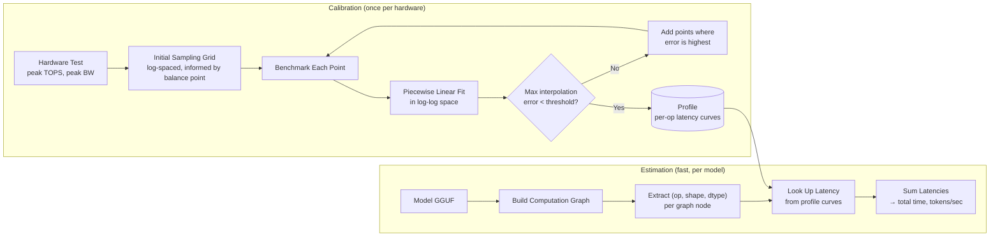
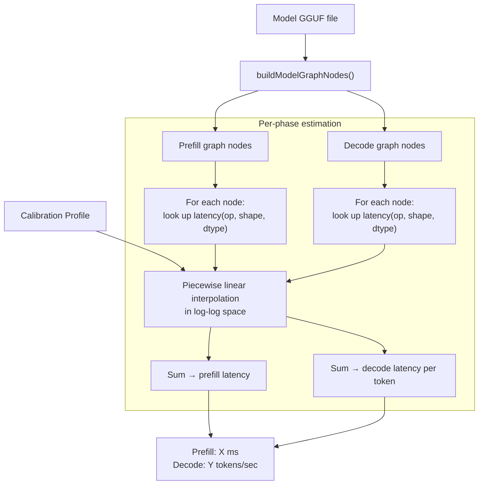

# DAOP Performance Estimation: High-Level Design

## 1. Goals

Predict model inference latency **before running the model**, enabling users to make informed decisions about model selection, quantization, and hardware utilization.

Specifically:

- **Calibrate once**: Benchmark operators on this hardware, store results as a reusable profile
- **Estimate any model**: Load a model's computation graph, look up calibrated latency data, predict total inference time and tokens/sec
- **Accuracy over theory**: Prefer empirical measurements over theoretical models

## 2. Problems with the Original Roofline Approach

The original design used a Roofline model:

```
T_actual = max(FLOPs / peak_FLOPS, bytes / peak_BW) / eta
```

where `eta` (efficiency factor) captures the gap between theory and reality.

### 2.1 eta Is Not a Constant

`eta` varies with tensor size, shape, and dtype:

- **Small tensors**: GPU kernel launch overhead dominates (3-5us fixed cost), `eta` is very low
- **Large tensors**: Execution approaches hardware peak, `eta` is near 1.0
- **Shape-dependent**: Matrix tiling, cache behavior, and memory access patterns all depend on the specific dimensions, not just total element count

Storing a single scalar `eta` per operator loses this critical size/shape dependency. Making `eta` size-dependent (storing multiple eta values, interpolating) effectively turns the Roofline model into an empirical model wearing a theoretical disguise.

### 2.2 Shape Matters, Not Just Size

Consider MUL_MAT with inputs of the same total element count:

| Configuration | Shapes | FLOPs | Character |
|---------------|--------|-------|-----------|
| A | [100, 100] x [100, 100] | 2M | Balanced |
| B | [1, 10000] x [10000, 1] | 20K | Memory-bound |

Same input size, 100x difference in FLOPs. The Roofline model uses arithmetic intensity (FLOPs/bytes) to distinguish compute-bound vs memory-bound, but the actual GPU behavior (tiling strategy, shared memory usage, warp scheduling) depends on the specific M, K, N values.

### 2.3 Theoretical Formulas: High Maintenance, Low Value

Each operator requires hand-written `ComputeFLOPs()` and `ComputeBytes()` formulas (~300 lines of code for ~25 operators). These theoretical values are only used to compute arithmetic intensity, which is then multiplied by an inaccurate `eta`. The formulas add maintenance burden without proportional accuracy benefit.

### 2.4 The benchSingleOp Bottleneck

Go's Tensor interface is strongly typed -- each operator has a unique method signature:

```go
SILU(ctx Context, up ...Tensor) Tensor
Mulmat(ctx Context, t2 Tensor) Tensor
RMSNorm(ctx Context, weight Tensor, eps float32) Tensor
```

The original `benchSingleOp()` required a hardcoded switch case per operator for tensor construction. This is unavoidable due to Go's type system, but the original design conflated this with shape selection and the Roofline model, making the code harder to extend.

## 3. New Approach: Empirical Latency Model

### 3.1 Core Idea

**Replace the theoretical Roofline model with direct empirical measurement:**

```
latency = f(op, shape, dtype)
```

Calibration measures this function at representative points. Estimation looks up the function for each operator in a model's computation graph.



### 3.2 What This Removes

| Component | Status | Reason |
|-----------|--------|--------|
| `ComputeFLOPs()` | Removed | No longer needed for prediction |
| `ComputeBytes()` | Removed | No longer needed for prediction |
| `eta` computation | Removed | Replaced by direct latency measurement |
| `SelectBenchmarkShapes()` (hardcoded) | Replaced | Adaptive sampling with informed grid |
| Roofline prediction | Replaced | Log-space curve lookup |

### 3.3 What This Keeps

| Component | Role Change |
|-----------|-------------|
| Hardware peak test (TOPS, BW) | No longer for Roofline prediction; now used to compute initial sampling grid placement and as sanity-check lower bounds |
| `buildModelGraphNodes()` | Essential: provides (op, shape, dtype) for estimation |
| Operator registry | Simplified: only method dispatch, no shape construction |
| Profile storage (JSON) | Same concept, different content (latency curves instead of eta) |

## 4. Why Log Space?

### 4.1 Performance Relationships Are Multiplicative

Doubling tensor size roughly doubles latency for memory-bound ops (`latency ~ N`). For compute-bound matmul, latency scales as the **cube** of the dimension scale factor: if M, K, N each scale by factor `s`, FLOPs = `2(sM)(sK)(sN) = 2s^3 MKN`, so latency grows as `s^3`. These multiplicative/power-law relationships become **linear** in logarithmic space:

- Memory-bound: `latency ~ N * elem_size / BW` --> `log(latency) = log(N) + const`
- Compute-bound: `latency ~ M*K*N / TOPS` --> `log(latency) = log(M) + log(K) + log(N) + const`

### 4.2 Sampling Coverage

Linear spacing `{1K, 8M, 16M, 24M, ..., 64M}` gives excellent coverage at large sizes but misses the small-size regime entirely. Log spacing `{1K, 4K, 16K, 64K, 256K, 1M, 4M, 16M, 64M}` covers the full range uniformly.

### 4.3 Example: Element-wise Op (SILU) in Log-Log Space

```
log(latency)
    |
    |                              / slope ~ 1 (bandwidth-limited)
    |                            /
    |                          /
    |                        /
    |      ================/   <-- knee = kernel launch overhead threshold
    |      slope ~ 0
    |      (overhead-dominated)
    +-------------------------------- log(N)
         1K    16K   256K   4M   64M
```

- **Flat region** (small N): Latency is constant, dominated by kernel launch overhead (~3-5us)
- **Linear region** (large N): Latency grows proportionally with N, limited by memory bandwidth
- **Knee point**: The transition, where useful throughput begins to dominate

### 4.4 Example: MUL_MAT in Log-Log Space (Fixed M=K=4096, Varying N)

```
log(latency)
    |
    |                              / slope ~ 1 (compute-bound)
    |                            /
    |                          /
    |                        /
    |      ================/   <-- knee = balance point
    |      slope ~ 0
    |      (memory-bound: weight loading dominates)
    +-------------------------------- log(N)
         1    16    256   1K    4K
```

- **Flat region** (small N, e.g., decode with batch=1): Must read the entire M*K weight matrix regardless of N. Latency ~ M*K*elem_size/BW
- **Linear region** (large N, e.g., prefill): Compute (2MKN) grows with N while weight loading is amortized. Latency ~ 2MKN/TOPS
- **Knee point**: Where memory time equals compute time. This is the **balance point** from Roofline analysis

### 4.5 Emergent Hardware Characterization

The piecewise linear fit in log-log space **reveals hardware characteristics from data**, without requiring theoretical models:

| Observable | Physical Meaning |
|------------|-----------------|
| Flat region height | Kernel launch overhead or weight loading time |
| Linear region slope | Effective bandwidth or effective compute throughput |
| Knee position | Balance point (memory-bound <--> compute-bound transition) |

This gives the same insight as Roofline analysis, but derived bottom-up from measurements rather than top-down from theory.

## 5. Piecewise Linear Interpolation in Log Space

### 5.1 Model

For a 1D operator (element-wise), we store N measured points:

```
points = [(log(N_1), log(lat_1)), (log(N_2), log(lat_2)), ..., (log(N_n), log(lat_n))]
```

sorted by `log(N)`. For a query size `N_q`:

1. Compute `x = log(N_q)`
2. Find the two adjacent points `(x_i, y_i)` and `(x_{i+1}, y_{i+1})` where `x_i <= x <= x_{i+1}`
3. Linear interpolation: `log(lat_q) = y_i + (y_{i+1} - y_i) * (x - x_i) / (x_{i+1} - x_i)`
4. Return `lat_q = exp(log(lat_q))`

For extrapolation beyond the measured range, extend the slope of the nearest segment.

### 5.2 Multi-dimensional Operators

For MUL_MAT `[M,K]×[K,N]`, latency depends on `(M, K, N, dtype)`. In transformers, M and K take specific values per layer type:

- **Q/K/V projections**: M = K = hidden_size (e.g., 4096)
- **FFN up projection**: M = intermediate_size (e.g., 14336), K = hidden_size
- **FFN down projection**: M = hidden_size, K = intermediate_size

We handle this by:

1. **Sampling (M, K) pairs from common model architectures**: Representative pairs include (4096, 4096), (8192, 8192), (14336, 4096), (4096, 14336), (28672, 8192), etc.
2. **For each (M, K) pair, sweep N**: N values log-spaced from 1 to 4096 (covering decode to large-batch prefill).
3. **Multi-linear interpolation** in log space: for a query (M, K, N), find nearest (M, K) pairs and interpolate across all dimensions.

For FLASH_ATTN_EXT, head_dim (128) and num_heads are fixed per model. In practice, transformer inference only produces two regimes:

- **Decode**: seq_q = 1, seq_kv = context_length (single token attends to full context)
- **Prefill**: seq_q = seq_kv = prompt_length (full self-attention)

We sample two 1D curves (decode and prefill), each sweeping seq_kv. For a query, if seq_q == 1 use the decode curve; if seq_q == seq_kv use the prefill curve; otherwise interpolate between them. See spec Section 7.3 for implementation.

### 5.3 Why Not More Complex Models?

| Option | Pros | Cons |
|--------|------|------|
| Lookup + linear interpolation | Simple, no libraries, robust | No extrapolation beyond range |
| Parametric fit (`a + b*N^c`) | Smooth, extrapolates | Must choose correct functional form |
| Gaussian Process | Flexible, uncertainty estimates | External dependency, overkill |
| Neural network | Handles high-dimensional input | Way overkill, needs training data |

Piecewise linear interpolation in log space is sufficient because:
- The underlying functions are smooth and low-dimensional
- Pure Go implementation, no external dependencies
- Interpolation (not extrapolation) is the primary use case -- model shapes fall within the benchmarked range
- Accuracy is limited by measurement noise, not by interpolation method

## 6. Adaptive Sampling

### 6.1 Motivation

Fixed grids either waste time measuring uninteresting regions or miss important transitions. Adaptive sampling concentrates measurements where they matter most.

### 6.2 Initial Grid Construction

The initial sampling grid is **not arbitrary** -- it is informed by hardware characteristics and common model parameters:

**Step 1: Hardware characterization** (fast, ~30 seconds)
- Measure peak TOPS per dtype (via large MUL_MAT)
- Measure peak memory bandwidth (via large CONT/copy)
- Compute balance point: `beta = peak_TOPS / peak_BW` (units: FLOPs/byte)

**Step 2: Determine range and initial points per operator type**

For **1D operators** (SILU, ADD, SOFTMAX, RMS_NORM, ...):
- Range: [1K, 64M] elements (covers real model usage; lower bound ~smallest meaningful GPU kernel, upper bound ~VRAM limit)
- Initial points: 8-10 log-spaced within range
- Extra density near the overhead-to-throughput transition (estimated from peak_BW: `N_transition ~ kernel_overhead * peak_BW / elem_size`)

For **MUL_MAT**:
- (M, K) pairs from common model architectures:
  - Square (Q/K/V): (2048, 2048), (4096, 4096), (8192, 8192)
  - Rectangular (FFN): (11008, 4096), (14336, 4096), (4096, 14336), (28672, 8192)
- N values: {1, 4, 16, 64, 256, 1024, 4096} (log-spaced, covering decode to large-batch prefill)
- Use `beta` to estimate the balance point N for each (M, K) pair, ensure points bracket it

For **FLASH_ATTN_EXT**:
- head_dim fixed at 128 (standard for most architectures)
- seq_len: {1, 32, 128, 512, 2048, 8192} (log-spaced)

### 6.3 Adaptive Refinement

After measuring initial points:

```
for each operator:
    while max_interpolation_error > threshold (e.g., 5%):
        1. Fit piecewise linear in log-log space
        2. Estimate interpolation error between each pair of adjacent points
           (e.g., measure midpoint, compare actual vs interpolated)
        3. Find the interval with highest error
        4. Add a measurement at the midpoint of that interval
        5. Re-fit
```

**Convergence criterion**: When the maximum relative error between any two adjacent points drops below the threshold (e.g., 5%), the curve is considered sufficiently characterized.

**Budget limit**: Cap at ~20 points per (operator, dtype) to keep total calibration time reasonable. Most operators converge in 8-12 points.

### 6.4 Illustration

```
Initial (8 points):
    x---x-------x-----------x-----------x-----------x-------x---x
                                   ^
                            high error here

After 1 refinement:
    x---x-------x-----------x-----x-----x-----------x-------x---x
                                   ^
                              error reduced

After 2 refinements:
    x---x-------x--------x--x-----x-----x-----------x-------x---x
                                         ^
                            new high error

... continues until all intervals < 5% error
```

## 7. Operator Registry

### 7.1 The Irreducible Problem

Go's Tensor interface uses distinct method signatures per operator:

```go
SILU(ctx Context, up ...Tensor) Tensor           // activation
Mulmat(ctx Context, t2 Tensor) Tensor             // matrix multiply
RMSNorm(ctx Context, weight Tensor, eps float32) Tensor  // normalization
```

There is no way to dynamically dispatch from a string op name to the correct method call. Each operator needs a registered builder function.

### 7.2 Why Not Reflection?

Go reflection (`reflect.ValueOf(tensor).MethodByName(...)`) was considered but rejected:

1. **Op names don't match method names**: `"MUL_MAT"` -> `Mulmat`, `"FLASH_ATTN_EXT"` -> `ScaledDotProductAttention`, `"GET_ROWS"` -> `Rows`, `"CONT"` -> `Contiguous`
2. **Signatures are not uniform**: `SILU` has a variadic `up ...Tensor` parameter. `RMSNorm` takes a float `eps`. `Conv2D` takes 8 int parameters. Auto-categorization doesn't work reliably.
3. **FLASH_ATTN is on a separate interface**: `ScaledDotProductAttention` interface, requires type assertion.

### 7.3 Simple Function Registry

Each operator registers a runner that knows how to invoke the correct method:

```go
type OpRunner struct {
    NumInputs  int        // how many input tensors to create
    Dimensions []string   // performance-relevant shape dimensions
    Run        func(ctx ml.Context, inputs []ml.Tensor) ml.Tensor
}

var opRegistry = map[string]OpRunner{
    "SILU":      {1, []string{"N"}, func(ctx ml.Context, in []ml.Tensor) ml.Tensor { return in[0].SILU(ctx) }},
    "GELU":      {1, []string{"N"}, func(ctx ml.Context, in []ml.Tensor) ml.Tensor { return in[0].GELU(ctx) }},
    "SOFTMAX":   {1, []string{"N"}, func(ctx ml.Context, in []ml.Tensor) ml.Tensor { return in[0].Softmax(ctx) }},
    "ADD":       {2, []string{"N"}, func(ctx ml.Context, in []ml.Tensor) ml.Tensor { return in[0].Add(ctx, in[1]) }},
    "MUL":       {2, []string{"N"}, func(ctx ml.Context, in []ml.Tensor) ml.Tensor { return in[0].Mul(ctx, in[1]) }},
    "MUL_MAT":   {2, []string{"M", "K", "N"}, func(ctx ml.Context, in []ml.Tensor) ml.Tensor { return in[0].Mulmat(ctx, in[1]) }},
    "RMS_NORM":  {2, []string{"N"}, func(ctx ml.Context, in []ml.Tensor) ml.Tensor { return in[0].RMSNorm(ctx, in[1], 1e-5) }},
    // ... ~25 operators total, ~25 lines
}
```

**Cost of adding a new operator**: 1 line of code. The registry includes a comment block with examples covering unary, binary, and parameterized ops. Future developers (human or AI) can follow the pattern directly from the code -- no separate documentation needed.

**Unregistered operators** (discovered in model graph but not in registry): Cannot be benchmarked. Estimation marks them as "uncalibrated" with a warning. User can add the registration line if needed.

### 7.4 Benchmark Execution Flow

```go
func benchmarkOp(backend ml.Backend, op string, shapes [][]int64,
    computeDtype, weightDtype ml.DType, cfg BenchmarkConfig) (float64, error) {

    runner, ok := opRegistry[op]
    if !ok {
        return 0, fmt.Errorf("no benchmark runner registered for op %s", op)
    }

    ctx := backend.NewContext()
    defer ctx.Close()

    // Create input tensors from shapes (generic, not per-op)
    // For ops like MUL_MAT with quantized weights, the first input (weight)
    // uses weightDtype while subsequent inputs use computeDtype
    inputs := make([]ml.Tensor, runner.NumInputs)
    for i := 0; i < runner.NumInputs && i < len(shapes); i++ {
        dims := make([]int, len(shapes[i]))
        for j, d := range shapes[i] { dims[j] = int(d) }
        dt := computeDtype
        if i == 0 && weightDtype != 0 {
            dt = weightDtype  // e.g., q4_0 for MUL_MAT weight tensor
        }
        inputs[i] = ctx.Zeros(dt, dims...)
    }

    // Invoke the operator
    out := runner.Run(ctx, inputs)
    ctx.Forward(out)

    // Warmup (stabilize GPU clocks, fill caches)
    for i := 0; i < cfg.WarmupReps; i++ { ctx.Compute(out) }

    // Measure with per-iteration timing for outlier detection
    var latencies []float64
    for i := 0; i < cfg.MeasureReps; i++ {
        start := time.Now()
        ctx.Compute(out)
        latencies = append(latencies, time.Since(start).Seconds())
    }

    // Trim outliers (remove top/bottom 10%) and compute median
    sort.Float64s(latencies)
    trim := len(latencies) / 10
    trimmed := latencies[trim : len(latencies)-trim]
    median := trimmed[len(trimmed)/2]

    return median, nil
}
```

Key design choices in this function:
- **Separate `computeDtype` and `weightDtype`**: Quantized MUL_MAT uses e.g. q4_0 weights with f16 activations. The first input tensor uses `weightDtype`, others use `computeDtype`.
- **Per-iteration timing with outlier trimming**: GPU timing has occasional spikes (GC, thermal throttling, OS interrupts). Trimming the top/bottom 10% and taking the median provides a robust estimate.
- **Generic tensor construction + per-op dispatch**: Shapes come from the sampling grid or model graph; only the method call is op-specific.

## 8. buildModelGraphNodes

### 8.1 Purpose

Loads a model GGUF file, constructs the computation graph (prefill + decode), and extracts all operator nodes. This is essential for:

- **Estimation**: Knowing which operators the model uses and at what shapes
- **Update** (`--update`): Discovering operators not yet in the profile

### 8.2 Implementation Approach

```go
func buildModelGraphNodes(modelPath string) (prefill, decode []ml.GraphNode, err error) {
    // Load model with AllocMemory=false: creates tensor metadata
    // without loading weights into memory. A 70B model uses MB not GB.
    // (Precedent: runner.go:1381 uses AllocMemory=false for device info)
    m, err := model.New(modelPath, ml.BackendParams{AllocMemory: false})
    if err != nil { return nil, nil, err }
    defer m.Backend().Close()

    // Capture graph by constructing dummy forward pass + Reserve().
    // Pattern follows runner/ollamarunner/runner.go:reserveWorstCaseGraph().
    // See spec Section 8.1 for full implementation.

    // Prefill graph: batch=512 (representative prompt length)
    prefill, err = captureGraph(m, 512)
    // Decode graph: batch=1 (single token generation)
    decode, err = captureGraph(m, 1)

    return prefill, decode, nil
}
```

Returns prefill and decode graphs **separately** (not merged). Estimation needs both because:
- Prefill: large batch → MUL_MAT compute-bound → latency ∝ seq_len
- Decode: batch=1 → MUL_MAT memory-bound → latency per token is constant

**Why `AllocMemory: false` works**: `Reserve()` only preallocates compute buffers via `ggml_backend_sched_reserve`. `captureGraphNodes()` reads only graph structure metadata (op names, shapes, dtypes, backend assignments) -- it does not access tensor values. With `AllocMemory: false`, `Zeros()` and `FromBytes()` create tensor structures but skip data initialization (`ggml.go:1054,1079`). This reduces memory from tens of GB (full model weights) to a few MB (metadata + compute buffers).

### 8.3 Challenges

- Requires CGo GGML backend (cannot test in pure Go)
- Forward pass construction varies by model architecture (handled by `model.New` which returns the right architecture)
- Must capture both prefill and decode graphs because they have different shapes (especially sequence length dimension)
- `Backend.Load()` cannot be called with `AllocMemory: false` (returns error), so this path is graph-extraction only -- no actual inference

## 9. Estimation Flow

### 9.1 Overview



### 9.2 Per-node Latency Lookup

For each graph node with `(op, inputShapes, dtype)`:

1. Find the operator's latency curve in the profile
2. Extract the relevant dimensions from inputShapes (e.g., for MUL_MAT: M, K, N)
3. Interpolate in log space to get predicted latency
4. If operator not found in profile: warn "uncalibrated", use best available estimate (e.g., similar operator's curve)

### 9.3 Cross-backend Transfer (Phase 2)

When consecutive graph nodes are assigned to different backends (e.g., GPU -> CPU -> GPU), add an estimated transfer cost based on tensor size and interconnect bandwidth (PCIe, NVLink, etc.). Interconnect bandwidth is measured during hardware characterization. Phase 1 assumes single backend; this feature is deferred to Phase 2.

## 10. Profile Data Structure

```json
{
  "version": 2,
  "timestamp": "2026-04-02T10:30:00Z",
  "hardware": {
    "backends": [
      {"name": "cuda", "device": "NVIDIA RTX 4090", "vram_bytes": 25769803776}
    ],
    "peak_tops": {"f16": 330e12, "f32": 82.6e12},
    "peak_bandwidth_bytes_sec": 1008e9,
    "interconnect_bandwidth_bytes_sec": 32e9
  },
  "operators": [
    {
      "op": "SILU",
      "backend": "cuda",
      "compute_dtype": "f32",
      "weight_dtype": "",
      "dimensions": ["N"],
      "points": [
        {"shape": [1024], "latency_us": 5.1},
        {"shape": [4096], "latency_us": 5.3},
        {"shape": [16384], "latency_us": 5.8},
        {"shape": [65536], "latency_us": 8.2},
        {"shape": [262144], "latency_us": 28.5},
        {"shape": [1048576], "latency_us": 98.3},
        {"shape": [16777216], "latency_us": 1502.1},
        {"shape": [67108864], "latency_us": 5980.4}
      ]
    },
    {
      "op": "MUL_MAT",
      "backend": "cuda",
      "compute_dtype": "f16",
      "weight_dtype": "q4_0",
      "dimensions": ["N"],
      "fixed_dims": {"M": 4096, "K": 4096},
      "points": [
        {"shape": [1], "latency_us": 28.5},
        {"shape": [16], "latency_us": 31.2},
        {"shape": [256], "latency_us": 95.6},
        {"shape": [4096], "latency_us": 1420.3}
      ]
    },
    {
      "op": "MUL_MAT",
      "backend": "cuda",
      "compute_dtype": "f16",
      "weight_dtype": "q4_0",
      "dimensions": ["N"],
      "fixed_dims": {"M": 14336, "K": 4096},
      "points": [
        {"shape": [1], "latency_us": 85.1},
        {"shape": [16], "latency_us": 89.4},
        {"shape": [256], "latency_us": 310.7},
        {"shape": [4096], "latency_us": 4920.8}
      ]
    }
  ]
}
```

## 11. Summary of Design Decisions

| Decision | Rationale |
|----------|-----------|
| Empirical model over Roofline | eta is not constant; direct measurement is simpler and more accurate |
| Log-log space for interpolation | Performance relationships are multiplicative; log space makes them linear |
| Piecewise linear interpolation | Sufficient accuracy for smooth low-dimensional functions; no external dependencies |
| Adaptive sampling | Concentrates measurements where they matter; avoids wasting time on flat regions |
| Hardware peak for initial grid | Not for prediction, but for informed grid placement and sanity checks |
| Simple function registry (not reflection) | Go method names don't match op names; signatures are non-uniform; reflection adds complexity without benefit |
| buildModelGraphNodes for estimation | Essential: provides actual (op, shape, dtype) per model; eliminates guessing |
| Calibrate once, estimate many | Users should not re-benchmark for each model |
