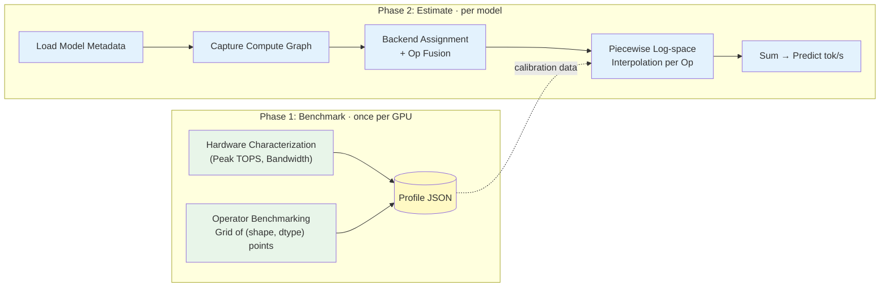
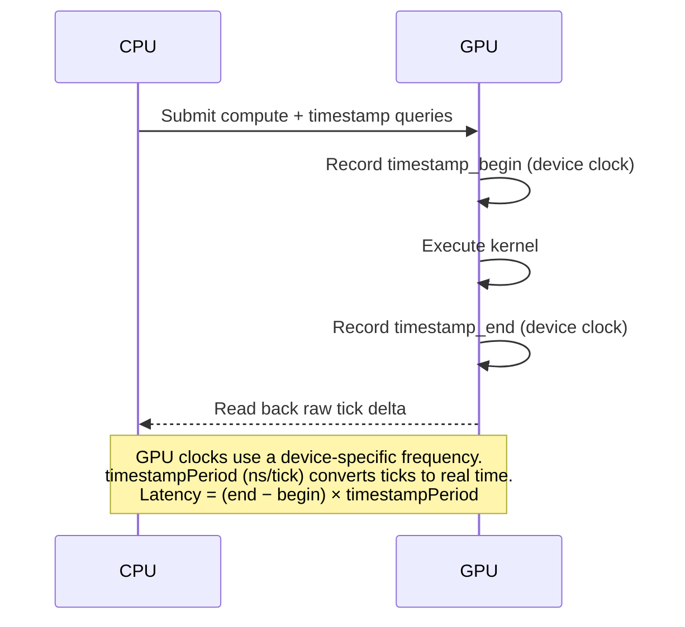
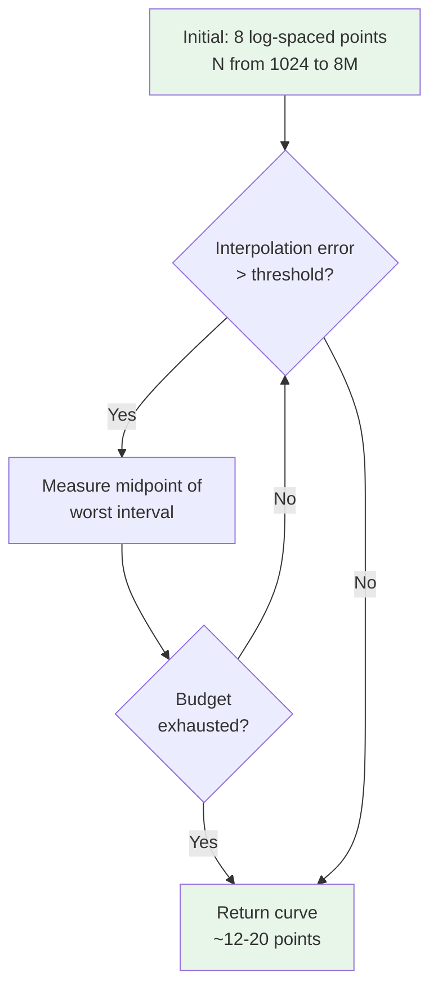
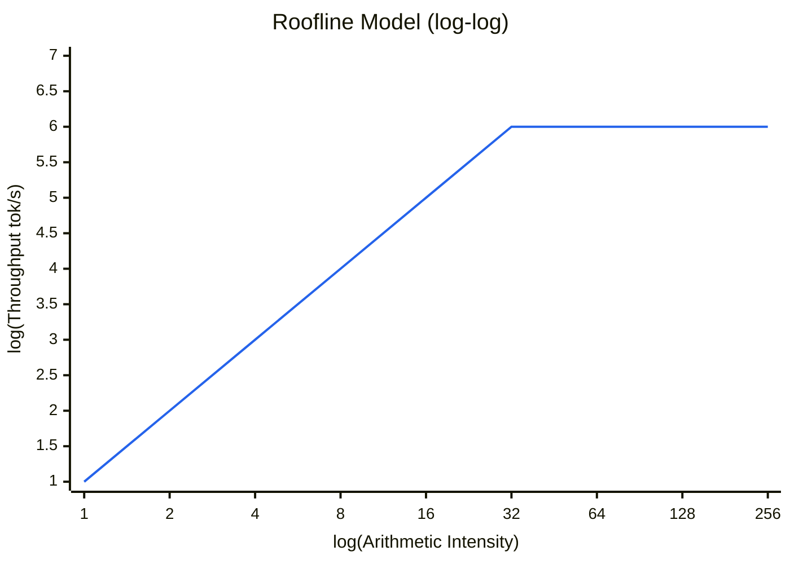
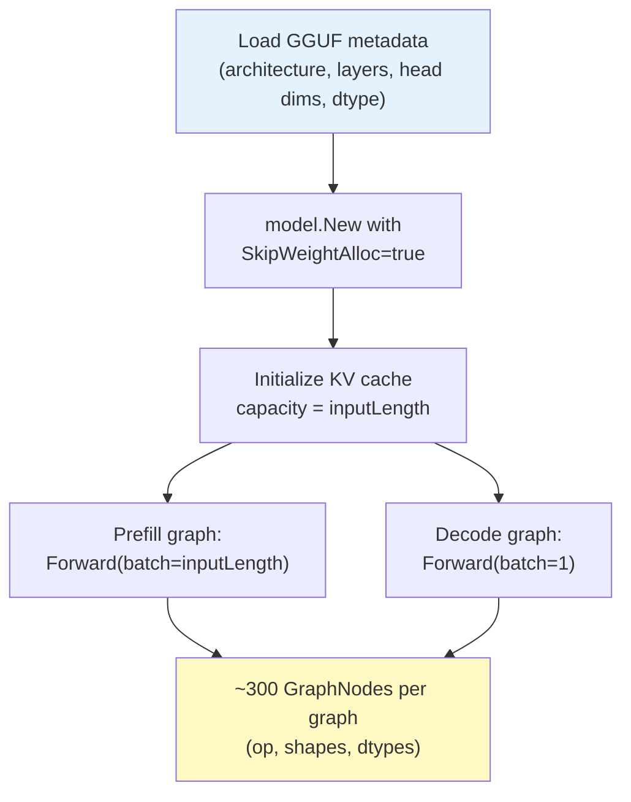
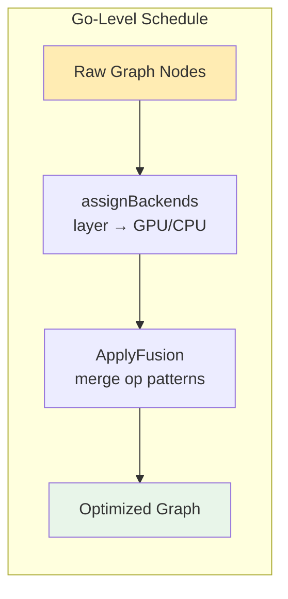
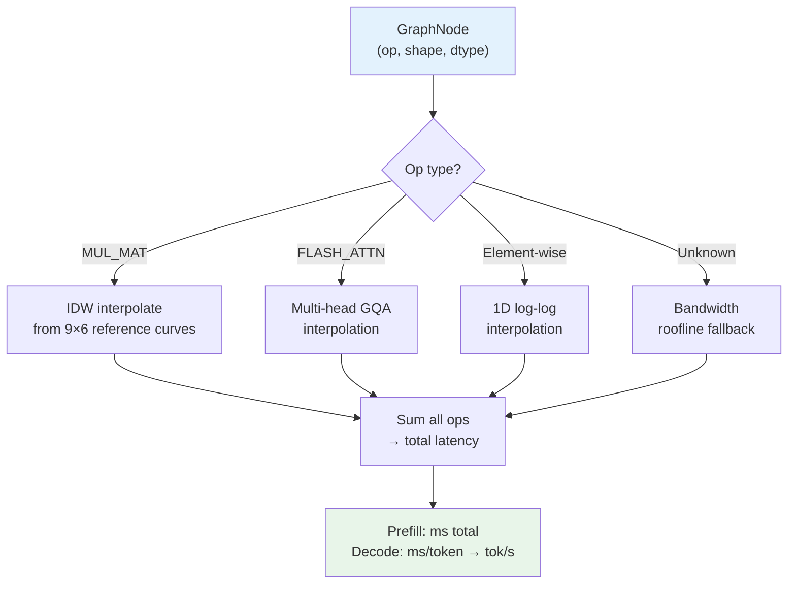

# Microbenchmark-Based LLM Inference Performance Estimation

> **daop-estimate**: Predict LLM inference speed on any GPU — without running inference.

**Version**: v0.3.0  
**Status**: Implemented, validated within 2× accuracy on Intel Arc (Vulkan) for qwen3:1.7b (Q4_K_M)  
**Platform**: [Ollama](https://ollama.com) — Go-based LLM inference engine with llama.cpp backends

---

## 1. Motivation

Deploying LLMs requires answering: *"How fast will model X run on my hardware?"* Current approaches — running actual inference or relying on published benchmarks — are slow, hardware-specific, and unavailable for configurations the user hasn't tried. We want a system that can:

1. **Predict tokens/sec** for any model × hardware combination
2. **No weights download or inference required** — estimate from model metadata (GGUF header) and a one-time GPU profile, before committing to a multi-GB download or GPU compute
3. **Millisecond-level estimation for any new model**, using a pre-computed GPU profile from a one-time ~90s benchmark (run once per hardware, reused for all future estimates)
4. **Work across backends** (Vulkan, CUDA, Metal, CPU) with a single design

The core insight: LLM inference is a sequence of ~300 GPU kernel dispatches per token. If we can predict each kernel's latency from its shape and dtype, we can sum them to predict total latency.

### 1.1 Why Measure, Not Calculate from Specs?

One might ask: why not compute expected latency from hardware spec sheets (peak TFLOPS, memory bandwidth) and operation FLOPs? The answer is that **published specs represent theoretical maximums** that are rarely achieved in practice. The gap between spec and reality comes from many sources:

- **Software stack overhead**: driver compilation, command buffer submission, shader dispatch
- **Hardware utilization**: GPU warp/thread occupancy depends on tensor shapes and tile alignment
- **Quantized dtype complexity**: dequantization (e.g., q4_K → f16) adds overhead not captured by simple FLOP counting
- **Memory hierarchy effects**: L2 cache behavior, bank conflicts, memory coalescing patterns
- **Backend-specific kernel selection**: different GPU vendors choose different shader implementations for the same operation

In practice, we observe that a single "efficiency factor" applied to spec-sheet numbers varies by **3-5× across different tensor shapes** on the same hardware. This makes theoretical prediction unreliable for anything beyond order-of-magnitude estimates, and motivates direct measurement of each operator on the actual hardware+software stack.

### 1.2 Fundamental Limitations of Per-Op Summation

Our approach estimates total latency as `Σ per-op latency`. This assumes operations execute **sequentially and independently**, which is a simplification:

- **Inter-kernel gaps**: Vulkan batches ~100 ops into a single command buffer before submission (`vkQueueSubmit`), so per-submission overhead is amortized. However, within a command buffer, each dispatch still incurs pipeline barrier and descriptor binding costs, and the GPU experiences pipeline bubbles between sequential kernels — gaps that don't exist in single-op benchmarks where the GPU runs one kernel in a tight loop.
- **Pipeline parallelism**: Modern GPUs can overlap compute, memory transfers, and command processing. Summing isolated op times ignores potential overlap.
- **Resource contention**: When ~300 ops share GPU resources in sequence, register pressure, L2 cache thrashing, and compute unit occupancy differ from single-op benchmarks that enjoy exclusive GPU access with warm caches.
- **Copy/sync operations**: Some inter-op memory copies and synchronization points contribute latency not attributed to any compute op.

These effects explain the observed **3× gap** between single-op benchmark predictions and actual multi-op inference on prefill workloads (Section 8.1). Addressing this through **telemetry-based calibration** — using actual inference timing to calibrate or correct per-op estimates — is a key direction for future work.

---

## 2. System Overview

The system has two phases: **Benchmark** (one-time, per-GPU) and **Estimate** (per-model, instant).



---

## 3. Phase 1: Benchmarking

### 3.1 Hardware Characterization

Before measuring individual operators, we characterize the GPU's raw capabilities:

| Metric | Method | Purpose |
|--------|--------|---------|
| **Peak TOPS** (f16, int8) | Large matrix multiply (M=K=N=4096) | Compute-bound ceiling |
| **Peak Bandwidth** (GB/s) | Large vector copy | Memory-bound ceiling |

These are measured — not read from spec sheets — because they capture the actual throughput achievable through the specific software stack (Vulkan/CUDA driver, GGML shader, etc.). They establish the **Roofline Model** bounds used as fallbacks (Section 4.1).

### 3.2 Operator Registry

We identify the operators that dominate LLM inference time:

| Operator | Dimensions | Coverage | Typical Share |
|----------|-----------|----------|---------------|
| `MUL_MAT` | M × K × N per dtype | Weight matmuls | 60-80% |
| `FLASH_ATTN_EXT` | seqQ × seqKV × Q-heads × KV-heads | Fused attention | 10-40% |
| `RMS_NORM_MUL` | N (element count) | Fused normalization | 2-5% |
| `ROPE` | N | Position encoding | 1-2% |
| `ADD`, `SILU`, `SOFT_MAX`, ... | N | Element-wise ops | 1-3% |

### 3.3 Benchmark Parameter Space

Each operator is benchmarked across a parameter grid designed to cover the shapes seen in real models:

**MUL_MAT** — the dominant operator, requiring the richest coverage:

```
(M, K) grid:  {512, 2048, 8192} × {512, 2048, 8192}  = 9 pairs
dtype:        {f32, f16, q4_0, q8_0, q4_K, q6_K}      = 6 types
N (seq len):  Adaptive sampling, ~8-20 points per curve
─────────────────────────────────────────────────────────
Curves: 54       Measurements: 54 × ~12 ≈ 648
```

**MUL_MAT_ADD** (fused bias) — one fixed shape per dtype:

```
(M, K):  fixed (4096, 4096)
dtype:   same 6 types
─────────────────────────────────────────────────────────
Curves: 6        Measurements: 6 × ~12 ≈ 72
```

**FLASH_ATTN_EXT** — requires GQA (Grouped Query Attention) coverage:

```
(Q-heads, KV-heads):  all pairs from {4, 8, 16, 32} where KV ≤ Q = 10 configs
SeqLen:               Adaptive sampling, decode [1,N] + prefill [N,N]
─────────────────────────────────────────────────────────
Curves: 10       Measurements: 10 × ~16 ≈ 160
```

**Element-wise + fused 1D ops** — single N dimension, f32 only:

```
Element-wise: ADD, MUL, SILU, GELU, RELU, SOFT_MAX, CONT, RMS_NORM, ROPE = 9 ops
Fused 1D:     RMS_NORM_MUL, RMS_NORM_MUL_ROPE                            = 2 ops
─────────────────────────────────────────────────────────
Curves: 11       Measurements: 11 × ~12 ≈ 132
```

**Total: ~81 curves, ~1,012 measurements + hardware characterization + orchestration overhead.**

### 3.4 GPU Timestamp Measurement

Wall-clock timing includes CPU overhead and driver queueing. We use **GPU timestamps** for accurate kernel-only timing:



`timestampPeriod` is a Vulkan device property (`VkPhysicalDeviceLimits.timestampPeriod`) expressing nanoseconds per GPU clock tick. For example, Intel Arc reports 83.333 ns/tick (12 GHz clock), so 1000 raw ticks = 83.3 μs.

This matches what `GGML_VK_PERF_LOGGER=1` measures during actual inference, ensuring benchmark and inference use the same clock source.

### 3.5 Adaptive Sampling

Rather than a fixed grid, we use **adaptive refinement in log-space** to concentrate samples where the latency curve has the most curvature:



**Interpolation error metric**: For each internal measured point, we interpolate its value from its two neighbors in log-log space (piecewise linear), then compute the relative error in log space: `|log(interpolated) − log(actual)| / |log(actual)|`. The interval adjacent to the worst-predicted point is selected for refinement.

**Key design choices:**
- **Log-space** — GPU latency follows power-law scaling; linear spacing wastes samples at large N
- **Error-driven refinement** — adds points only where the curve bends (typically at the memory→compute transition)
- **Early convergence** — stops when interpolation error < 5%, typically at 12-15 points
- **Safety threshold** — stops if latency exceeds 500ms (prevents GPU TDR timeout on Windows)

### 3.6 Convergence and Statistical Quality

Each measurement point uses adaptive repetitions:

1. Run warmup iterations until latency stabilizes
2. Collect samples, trimming outliers (top/bottom 10%)
3. Stop when coefficient of variation (CV) < 5% on trimmed samples
4. Minimum 5 repetitions to ensure stability

Total benchmark time: **~90 seconds** for a full GPU profile (~81 curves, ~1,000 measurements).

---

## 4. Theoretical Foundation

### 4.1 Roofline Model

Every GPU operation is bounded by two ceilings. The classic Roofline model visualizes this in **log-log space**:



The knee where the line flattens is the **balance point** — left of it the workload is memory-bound (throughput ∝ AI), right of it compute-bound (throughput = peak TOPS).

**Arithmetic Intensity (AI)** = FLOPs / bytes_transferred.  **Balance Point** = Peak_TOPS / Peak_Bandwidth.

- Left of the knee (`AI < Balance Point`) → **Memory-bound**: throughput scales with AI, latency ≈ data_size / bandwidth
- Right of the knee (`AI > Balance Point`) → **Compute-bound**: throughput saturates at peak TOPS, latency ≈ FLOPs / peak_TOPS

For `MUL_MAT(M, K, N)` with fixed weight matrix (M × K):
- FLOPs = 2 × M × K × N
- Bytes = M × K × bytes_per_element (weight) + K × N × 4 (activation) + M × N × 4 (output)
- At **N=1 (decode)**: AI ≈ 2N/bpe → small → **memory-bound** (loading weights dominates)
- At **N=300 (prefill)**: AI saturates → **compute-bound** (matrix multiply dominates)

### 4.2 Why Theory Alone Is Insufficient

The roofline model gives **theoretical bounds**, but real GPU performance deviates significantly:

| Factor | Impact |
|--------|--------|
| Warp/tile utilization | M=512 vs M=2048 at same FLOPs → 2-3× latency difference |
| Quantized dequant overhead | q4_K→f16 conversion adds time not in FLOP count |
| L2 cache effects | Small tensors benefit from caching; large ones miss entirely |
| Shader kernel selection | Driver picks different kernels for different shapes |

A single efficiency factor η varies by 3-5× across shapes on the same hardware. This is why we measure a **grid of (M, K) pairs × dtypes** rather than fitting a single roofline constant (see Section 6.1 for this design evolution).

### 4.3 Log-Space Interpolation

GPU kernel latency follows **power-law scaling** across most of its range:

```
latency ∝ N^α    (α varies by regime)
```

Taking logarithms: `log(latency) = α · log(N) + c`

This transforms the power-law curve into a **piecewise linear function in log-log space**, enabling accurate interpolation with few sample points. Our `Interpolate1D` function performs piecewise linear interpolation in this log-log space, with power-law extrapolation beyond measured range.

### 4.4 Multi-Dimensional Interpolation

For `MUL_MAT`, latency depends on three dimensions (M, K, N) plus dtype. We decompose this:

1. **Fixed (M, K)**: benchmark at a 3×3 grid of (M, K) pairs per dtype
2. **Variable N**: adaptive 1D curve per (M, K, dtype) — this is the log-space interpolated dimension
3. **Query**: for an arbitrary (M, K, N), find the 2 nearest (M, K) curves and blend using **Inverse Distance Weighting (IDW)** in log(M, K) space

```
Query (M=3000, K=4000, N=200, q4_K):
  → Find nearest curves: (2048,2048) and (2048,8192)
  → Interpolate N=200 on each curve → lat₁, lat₂
  → IDW blend in log(M,K) space → final_latency
```

For `FLASH_ATTN_EXT`, we interpolate across:
- **(seqQ, seqKV)**: blend between decode (seqQ=1) and prefill (seqQ=seqKV) regimes
- **(Q-heads, KV-heads)**: 2D distance in (Q, KV) space, IDW of 2 nearest GQA curves

---

## 5. Phase 2: Estimation

### 5.1 Model Graph Capture

We load the model metadata and forward-pass structure **without allocating weight memory**:



Each `GraphNode` contains:
- **Op**: `MUL_MAT`, `FLASH_ATTN_EXT`, `ADD`, etc.
- **Input shapes**: tensor dimensions (determines M, K, N for matmuls; seqQ, seqKV for attention)
- **Compute/weight dtype**: `f32`, `q4_K`, etc.
- **Backend**: assigned in next step

The graph is an exact replica of what Ollama's inference engine would build — it captures the full computation including KV cache interaction, attention masking, and fused ops. The op count per layer is determined by the model architecture: for a standard transformer, each layer contributes one `FLASH_ATTN_EXT` (when flash attention is enabled), several `MUL_MAT` (QKV projections, feedforward), and assorted element-wise ops.

For **prefill**: a single `Forward(batch=inputLength)` produces one `FLASH_ATTN_EXT` per attention layer with shape `[seqQ=inputLength, seqKV=roundUp(inputLength, CachePadding), Q_heads, KV_heads]`. The KV cache is filled in one pass.

For **decode**: a single `Forward(batch=1)` produces one `FLASH_ATTN_EXT` per layer with shape `[seqQ=1, seqKV=roundUp(inputLength, CachePadding), Q_heads, KV_heads]`. The seqKV reflects the full context the decode token attends to.

### 5.2 Backend Assignment and Op Fusion

We replicate Ollama's scheduling logic without the C-level `split_graph`:



**Backend assignment**: parse weight tensor names to identify layer indices, map layers to devices via the offload schedule. Non-layer ops inherit their neighbor's backend.

**Op fusion** simulates GGML backend fusion rules (3 core patterns):
- `RMS_NORM` + `MUL` → `RMS_NORM_MUL`
- `RMS_NORM_MUL` + `ROPE` → `RMS_NORM_MUL_ROPE`
- `MUL_MAT` + `ADD` → `MUL_MAT_ADD` (bias fusion)

### 5.3 Per-Op Latency Lookup

For each node in the optimized graph, look up estimated latency:



**Fallback chain** (for ops without exact calibration data):
1. Exact dtype match from benchmark curves
2. Approximate dtype (e.g., `q4_K` → `q4_0`)
3. Bandwidth roofline estimate

---

## 6. Design Evolution

The current design emerged through several iterations, each addressing accuracy gaps revealed by validation:

### 6.1 Roofline + η → Direct Empirical Curves

**Initial approach**: Model MUL_MAT with a roofline formula:

```
latency = max(FLOPs / (η × PeakTOPS), DataBytes / (η_bw × PeakBW))
```

where η (compute efficiency) and η_bw (bandwidth efficiency) are fitted constants per dtype.

**Problem**: A single efficiency factor cannot capture the complex shape-dependent behavior. MUL_MAT throughput varies by 3-5× depending on (M, K, N) even at fixed total FLOPs, due to GPU tile/warp utilization effects.

**Solution**: Replace with **direct empirical interpolation** from a 3×3 (M, K) grid of measured curves. The roofline model remains as a fallback for uncalibrated shapes.

### 6.2 Wall-Clock → GPU Timestamps

**Initial approach**: Measure ops using Go `time.Now()` around backend compute calls.

**Problem**: 18× discrepancy between predicted and actual GPU time. Wall-clock includes CPU scheduling, Vulkan command submission, and pipeline stalls.

**Solution**: Use **GPU-side timestamp queries** (`vkCmdWriteTimestamp`) to measure only kernel execution time. This matches the GPU perf logger used to measure actual inference, eliminating the apples-to-oranges comparison.

### 6.3 Fixed Head Count → GQA Grid

**Initial approach**: Benchmark FLASH_ATTN with fixed 32 heads.

**Problem**: Models use varying Q/KV head ratios (GQA). qwen3:1.7b has Q=16, KV=8 — not in the benchmark grid. Decode estimate was 0.16× actual.

**Solution**: Benchmark all (Q, KV) combinations from {4, 8, 16, 32} where KV ≤ Q (10 configs). Interpolate in 2D (Q, KV) space for arbitrary head configurations.

### 6.4 Prefill SeqKV Padding Correction

**Initial approach**: Use raw tensor shapes from graph capture for FLASH_ATTN interpolation.

**Problem**: KV cache size is aligned to `CachePadding=256`, so `seqKV = roundUp(300, 256) = 512`. The prefill interpolation at seqKV=512 gave [512,512] latency (2.08× overestimate), but GPU flash attention skips masked padding positions efficiently.

**Solution**: Prefill component interpolates at **seqQ** (actual token count) rather than seqKV (padded cache size), with a monotonicity floor ensuring the blend never drops below decode latency.

---

## 7. Validation Results

Validated on **qwen3:1.7b** (Q4_K_M quantization) with Intel Xe integrated GPU (Vulkan backend).

### 7.1 End-to-End Accuracy

| Input Length | Phase | Actual (ms) | Estimate (ms) | Ratio (est/actual) |
|---:|---|---:|---:|---:|
| 18 | Prefill | 410.9 | 234.8 | 0.57× |
| 18 | Decode | 81.3 | 94.6 | 1.16× |
| 150 | Prefill | 1,638.3 | 1,032.1 | 0.63× |
| 150 | Decode | 117.2 | 94.6 | 0.81× |
| 300 | Prefill | 4,080.2 | 2,255.9 | 0.55× |
| 300 | Decode | 131.9 | 115.2 | 0.87× |

**Decode accuracy: within 1.2× for all input lengths.** Prefill underestimate is dominated by MUL_MAT single-op benchmark vs. multi-op inference gap (see Section 8).

### 7.2 Per-Op Accuracy (Decode, input_length=300)

| Operator | Actual (μs) | Estimate (μs) | Ratio |
|----------|---:|---:|---:|
| MUL_MAT q4_K | 43,660 | 27,761 | 0.64× |
| FLASH_ATTN_EXT | 41,440 | 51,646 | 1.25× |
| MUL_MAT q6_K | 17,488 | 8,761 | 0.50× |
| MUL_MAT_ADD q4_K | 14,631 | 8,726 | 0.60× |
| **Total** | **131,943** | **115,216** | **0.87×** |

### 7.3 Improvement Journey

```
18× off  ──[GPU timestamps]──▶  3.6×  ──[direct curves]──▶  1.04× (decode)
                                       ──[GQA grid]──▶       1.20× (FLASH_ATTN decode)
                                       ──[seqKV fix]──▶      0.78× (FLASH_ATTN prefill)
```

---

## 8. Known Limitations

### 8.1 MUL_MAT Benchmark vs. Inference Gap

Single-op benchmarks achieve **108% of peak TOPS** (due to aggressive GPU utilization), while multi-op inference achieves only **29%** for the same shapes. This 3× gap cannot be explained by memory bandwidth (roofline analysis confirms compute-bound at large N). Likely causes:

- **Inter-kernel gaps**: Although Vulkan batches ~100 ops per command buffer submission, pipeline barriers and descriptor binding between dispatches create micro-gaps that accumulate across ~300 ops/token
- **Occupancy degradation**: GPU register and shared memory pressure differs between isolated ops and full inference pipelines with ~300 ops competing for resources
- **Cache thrashing**: Single-op benchmarks enjoy warm L2 caches; in multi-op inference, each op evicts the previous op's cached data

This is the dominant source of prefill underestimation (Section 7.1).

### 8.2 CachePadding Effects on Decode

KV cache alignment inflates decode seqKV (e.g., 18 tokens → seqKV=256), causing overestimation for short contexts where the GPU skips masked positions.

### 8.3 Uncalibrated Operators

`GLU` and `SET_ROWS` lack benchmark curves and fall back to bandwidth roofline estimates. Combined impact: <2% of total latency.

---

## 9. Future Work

| Priority | Item | Expected Impact |
|----------|------|----------------|
| **HIGH** | **Multi-model validation**: test on diverse architectures (llama3, gemma, phi, mistral), quantizations (Q4_0, Q5_K, Q8_0), and sizes (1B–70B) to verify generalization | Confidence in cross-model accuracy |
| **HIGH** | **Telemetry-based calibration**: use actual inference GPU timings to derive per-op or pipeline-level correction factors, bridging the single-op benchmark vs. multi-op inference gap | Prefill accuracy 0.55× → ~1× |
| **HIGH** | Decode CachePadding correction (use actual context length, not padded seqKV) | Decode accuracy for short contexts |
| **MED** | Partial offload estimation (CPU+GPU split, data transfer modeling) | Support non-full-offload scenarios |
| **MED** | Extend to CUDA/Metal backends | Cross-platform validation |
| **LOW** | Pre-download estimation (GGUF header only, ~50KB) | True "before download" prediction |
| **LOW** | Multi-user concurrent inference modeling | Server deployment planning |

---

## Appendix A: Profile Data Structure

The benchmark produces a JSON profile containing:

```json
{
  "version": 3,
  "hardware": {
    "peak_tops_f16": 425.3,
    "peak_tops_int8": 671.2,
    "peak_bandwidth_bytes_per_sec": 52e9,
    "efficiency_constants": { "MUL_MAT_f16": 0.87, ... }
  },
  "backend_caps": {
    "Vulkan": { "has_gpu_timestamp": true, "fusion_rules": [...] }
  },
  "operators": [
    {
      "op": "MUL_MAT", "weight_dtype": "q4_K", "backend": "Vulkan",
      "fixed_dims": { "M": 2048, "K": 2048 },
      "points": [
        { "shape": [1], "latency_us": 140.2 },
        { "shape": [32], "latency_us": 280.5 },
        { "shape": [300], "latency_us": 6709.0 }
      ]
    }
  ]
}
```

## Appendix B: Benchmark Operator Coverage

| Category | Operators | Grid | Curves | Pts/Curve | Measurements |
|----------|-----------|------|-------:|----------:|-------------:|
| Matrix multiply | MUL_MAT | 9 (M,K) × 6 dtypes | 54 | ~12 | ~648 |
| Fused bias | MUL_MAT_ADD | 1 (M,K) × 6 dtypes | 6 | ~12 | ~72 |
| Flash attention | FLASH_ATTN_EXT | 10 GQA configs | 10 | ~16 | ~160 |
| Normalization | RMS_NORM | 1D, f32 | 1 | ~12 | ~12 |
| Fused norm | RMS_NORM_MUL, RMS_NORM_MUL_ROPE | 1D, f32 | 2 | ~12 | ~24 |
| Activation | SILU, GELU, RELU, SOFT_MAX | 1D, f32 | 4 | ~12 | ~48 |
| Positional | ROPE, CONT | 1D, f32 | 2 | ~12 | ~24 |
| Element-wise | ADD, MUL | 1D, f32 | 2 | ~12 | ~24 |
| **Total** | | | **81** | | **~1,012** |

Total benchmark time on Intel Arc (Vulkan): **~90 seconds**.
