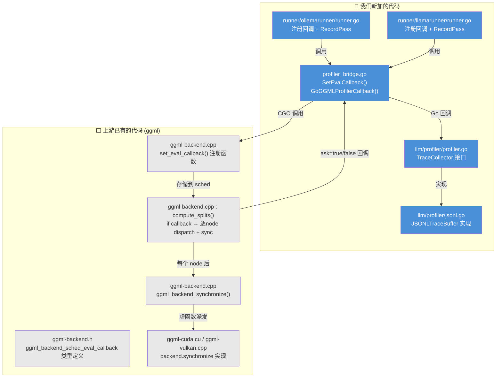
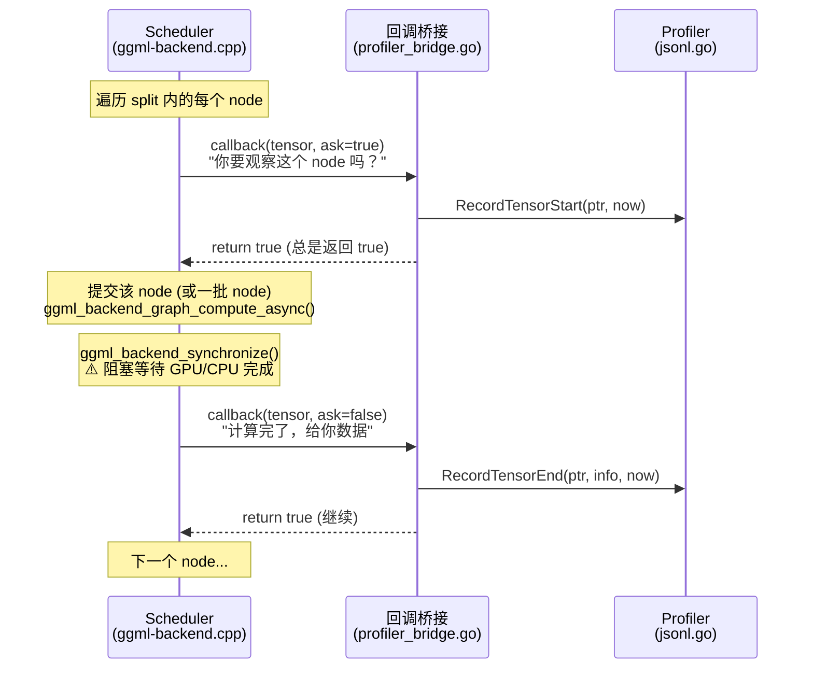
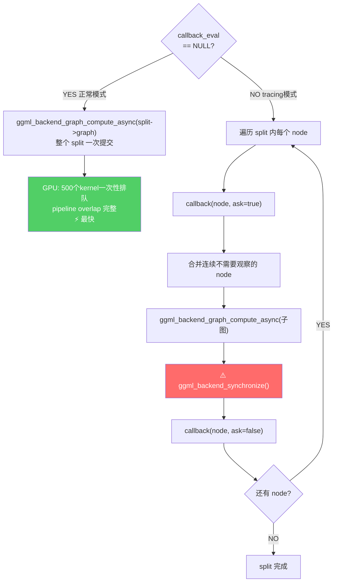
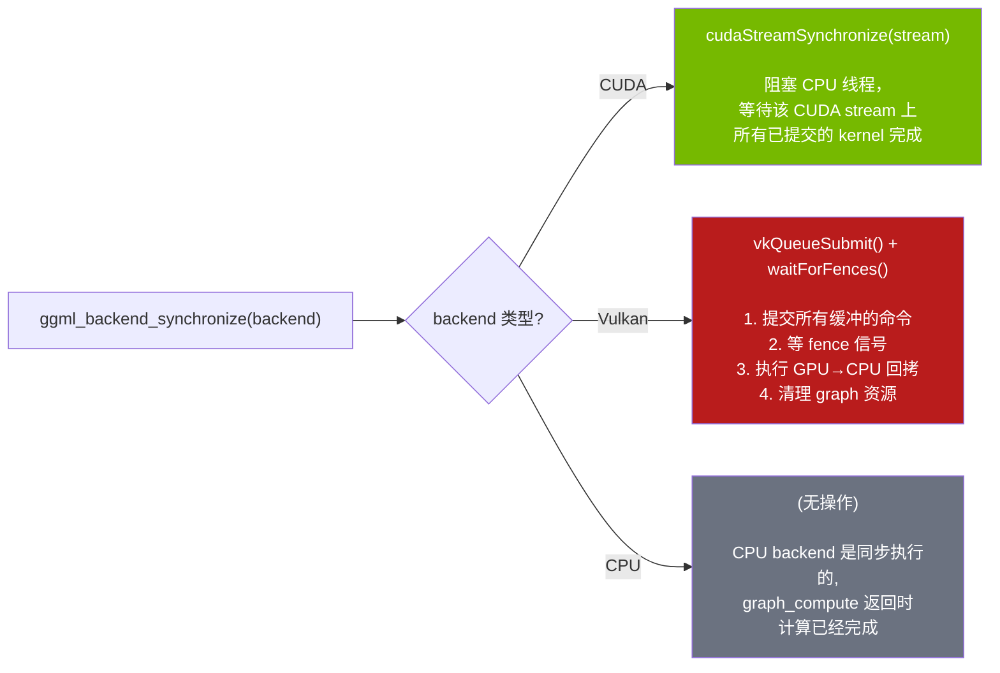
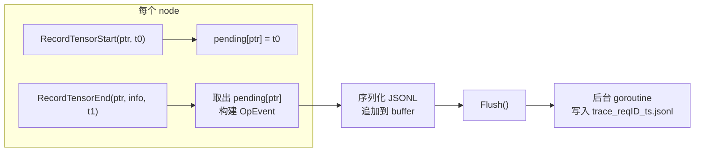

# Eval Callback 追踪机制

### 1.1 整体架构 (上游 vs 我们的代码)



**总结**: 上游 ggml 提供了 eval callback 的完整基础设施（类型定义、注册、调度逻辑、synchronize）。我们只是:
1. 写了 CGO 桥接层把 Go profiler 接入上游回调
2. 实现了 `TraceCollector` 接口和 JSONL 输出
3. 在两个 runner 中注册回调和记录 pass 边界

### 1.2 回调两阶段协议



**关键点**:
- `ask=true` 时 profiler 记录 **开始时间** — 但此时 node 还没开始计算
- 然后 scheduler 提交计算 + synchronize 等待完成
- `ask=false` 时 profiler 记录 **结束时间** — 此时 node 已完成
- 所以 `t_end - t_start` = 提交 + 计算 + 同步的总时间

### 1.3 CGO 桥接层

**文件**: `ml/backend/ggml/profiler_bridge.go` (🔵 我们的代码)

数据流经 3 层:

```
C 回调                    CGO 桥接                  Go Profiler
─────────                ─────────                 ───────────
ggml compute_splits      ggmlProfilerEvalCallbackBridge    GoGGMLProfilerCallback
  │                        │                                │
  ├─ tensor指针 ──────────→├─ uintptr_t(handle) ──────────→├─ cgo.Handle → TraceCollector
  ├─ ask (bool) ──────────→├─ _Bool ──────────────────────→├─ bool(ask)
  └─ user_data ───────────→└─ cast to uintptr ─────────────└─ time.Now() 取时间
```

Go 注册:
```go
// profiler_bridge.go:34-48 (🔵 我们的代码)
func (b *Backend) SetEvalCallback(col profiler.TraceCollector) {
    if b.profilerHandle != 0 {
        b.profilerHandle.Delete()
        b.profilerHandle = 0
    }
    if col == nil {
        C.clearGGMLProfilerEvalCallback(b.sched)
        return
    }
    h := cgo.NewHandle(col)       // Go 对象 → 整数句柄
    b.profilerHandle = h
    C.setGGMLProfilerEvalCallback(b.sched, C.uintptr_t(uintptr(h)))
}
```

C 桥接:
```c
// profiler_bridge.go CGO preamble (🔵 我们的代码)
static _Bool ggmlProfilerEvalCallbackBridge(
    struct ggml_tensor* t, _Bool ask, void* user_data) {
    GoGGMLProfilerCallback((uintptr_t)user_data, (void*)t, ask);
    return 1;  // 永远返回 true，不取消计算
}
```

Go 导出函数:
```go
// profiler_bridge.go:50-68 (🔵 我们的代码)
//export GoGGMLProfilerCallback
func GoGGMLProfilerCallback(handle C.uintptr_t, tensorPtr unsafe.Pointer, ask C.bool) {
    col := cgo.Handle(handle).Value().(profiler.TraceCollector)
    ptr := uintptr(tensorPtr)
    now := time.Now().UnixNano()
    if bool(ask) {
        col.RecordTensorStart(ptr, now)
        return
    }
    t := (*C.struct_ggml_tensor)(tensorPtr)
    col.RecordTensorEnd(ptr, extractGGMLTensorInfo(t), now)
}
```

### 1.4 C 端调度行为变化

**关键逻辑在** `ggml-backend.cpp:1615-1652` (⬜ 上游代码, `compute_splits` 内部):



**性能影响**:

| 场景 | 行为 | 影响 |
|------|------|------|
| GPU (500+ nodes) | 每个 node 后 synchronize | **2x+ 减速**，pipeline overlap 完全丧失 |
| CPU (多线程) | 每个 graph_view 独立 compute | 线程池每次重建，但 per-node 计时准确 |
| CPU (单线程) | 同上 | 影响最小，计时最准确 |

### 1.5 ggml_backend_synchronize 到底做了什么

`ggml_backend_synchronize()` 是上游代码 (`ggml-backend.cpp:346-353`)，通过虚函数表派发到各 backend 的具体实现:

```c
// ggml-backend.cpp:346 (⬜ 上游)
void ggml_backend_synchronize(ggml_backend_t backend) {
    if (backend->iface.synchronize == NULL) return;
    backend->iface.synchronize(backend);
}
```



#### CUDA 实现 (`ggml-cuda.cu:2978-2984`)

```c
static void ggml_backend_cuda_synchronize(ggml_backend_t backend) {
    ggml_backend_cuda_context * cuda_ctx = (ggml_backend_cuda_context *)backend->context;
    CUDA_CHECK(cudaStreamSynchronize(cuda_ctx->stream()));
}
```

非常简单：一个 `cudaStreamSynchronize` 调用。但它的代价是 **阻塞 CPU 直到 GPU stream 上所有 kernel 完成**。在 tracing 模式下，每个 node 后都调用一次，这意味着:
- GPU 无法提前排队后续 kernel
- CPU 和 GPU 之间来回切换
- 彻底摧毁了 GPU pipeline 并行

#### Vulkan 实现 (`ggml-vulkan.cpp:12748-12755`)

```c
static void ggml_backend_vk_synchronize(ggml_backend_t backend) {
    ggml_backend_vk_context * ctx = (ggml_backend_vk_context *)backend->context;
    ggml_vk_synchronize(ctx);   // 提交命令 + 等 fence
    ggml_vk_graph_cleanup(ctx); // 清理资源
}
```

内部做更多事:
1. 结束 transfer context
2. 执行 host→device 内存拷贝
3. `vkQueueSubmit` 提交计算命令
4. `waitForFences` / spin-poll 等待 GPU 完成
5. 执行 device→host 内存拷贝
6. 清理 graph 资源

#### 为什么 tracing 对 GPU 影响大

```
正常模式 (无 callback):
CPU:  [提交 kernel 0] [提交 kernel 1] [提交 kernel 2] ... [提交 kernel 499] [sync 一次]
GPU:  ·····[kernel 0][kernel 1][kernel 2]..............................[kernel 499]
                     ↑ pipeline overlap: kernel 排队后立即开始

Tracing 模式 (有 callback):
CPU:  [提交 k0][===等 GPU===][回调][提交 k1][===等 GPU===][回调][提交 k2]...
GPU:  ·····[k0]··············idle··[k1]··············idle··[k2]····
                            ↑ GPU 大量时间在等 CPU 提交下一个
```

### 1.6 Profiler 数据流

**TraceCollector 接口** (`llm/profiler/profiler.go:9-28`, 🔵 我们的代码):

```go
type TraceCollector interface {
    RecordTensorStart(ptr uintptr, tStart int64)
    RecordTensorEnd(ptr uintptr, info TensorInfo, tEnd int64)
    RecordPassStart(passID int, nTokens int)
    RecordPassEnd(passID int, nNodes int)
    Flush(requestID string, model string) error
    Close() error
}
```

**JSONL 实现** (`llm/profiler/jsonl.go`, 🔵 我们的代码):



每条 JSONL 记录: `{type, pass_id, seq_id, op, name, src_names, out_shape, dtype, backend, t_start, t_end}`

---

