# GGML Backend Scheduler

### 2.1 Scheduler 初始化与 parallel 参数

**Scheduler 创建** (`ggml.go:387-395`):

```go
sched := C.ggml_backend_sched_new_ext(
    &schedBackends[0],     // backend 数组（按优先级排）
    &schedBufts[0],        // buffer 类型数组
    len(schedBackends),    // backend 数量
    maxGraphNodes,         // 图最大节点数
    false,                 // ← parallel=false
    true,                  // op_offload=true
    true,                  // alloc_buffers=true
)
```

#### `parallel=false` 是什么意思？

```c
// ggml-backend.cpp:1701
sched->n_copies = parallel ? GGML_SCHED_MAX_COPIES : 1;
```

`parallel` 控制的是 **pipeline parallelism（流水线并行）的 copy 数量**，不是 split 是否并行执行。

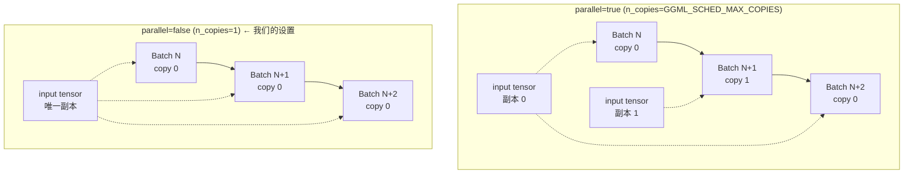

**parallel=true 时**:
- 为每个 backend 的每个 input tensor 创建 `n_copies` 个副本
- Batch N 用 copy 0 计算时，Batch N+1 可以往 copy 1 拷贝 input
- 实现 **compute 和 data transfer 的 overlap**
- 代价: `n_copies` 倍的 input tensor 内存

**parallel=false 时 (Ollama 的选择)**:
- 只有 1 个 copy，必须等当前 batch 完成才能拷贝下一个 batch 的 input
- 更少内存占用
- 对 Ollama 场景够用：因为 Go 层已经通过 `forwardBatch/computeBatch` 的 channel 实现了自己的 pipeline

**为什么不开 parallel**:

Ollama 的 pipeline 策略在 Go 层管理（`forwardBatch` 和 `computeBatch` 通过 channel 交替），不依赖 ggml scheduler 层的 multi-copy。开启 parallel 只会浪费内存而不增加吞吐。

### 2.2 图分割算法 (split_graph)

**函数**: `ggml_backend_sched_split_graph()` (`ggml-backend.cpp:960-1426`, ⬜ 上游代码)

5-pass 算法:

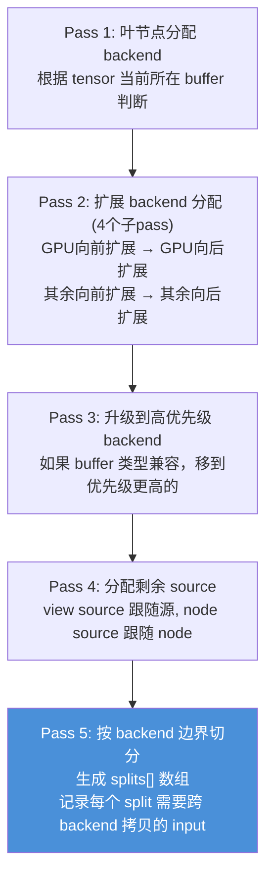

### 2.3 Split 示例图解

#### 场景 1: 模型完全在 GPU 上 (gpu_layers >= 总层数)

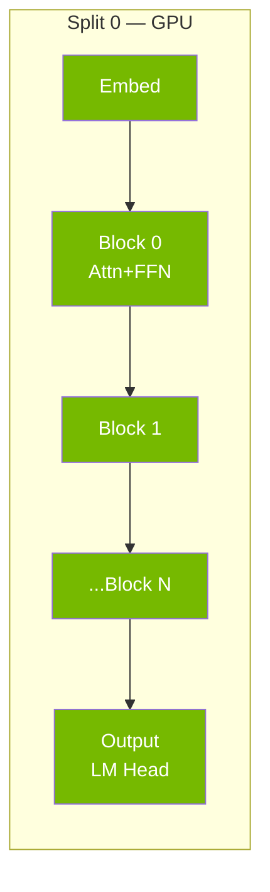

**结果**: 只有 **1 个 split**，全部在 GPU 执行。无跨 backend 拷贝。最优情况。

#### 场景 2: 部分 offload (gpu_layers=20, 模型有 32 层)

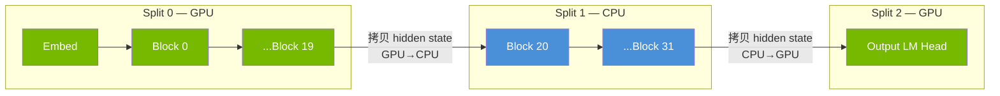

**结果**: **3 个 splits**。Split 边界处需要跨 backend 拷贝 hidden state tensor。
- Split 0 → Split 1: GPU→CPU 拷贝 (hidden state)
- Split 1 → Split 2: CPU→GPU 拷贝 (hidden state)

这就是 **sync events 想要测量的开销** — 每次跨 backend 拷贝的时间。

#### 为什么 Split 2 要回到 GPU？不累吗？

**因为 Output 层 (LM Head) 被分配在 GPU 上。** LM Head 是一个巨大的矩阵乘法 (`[hidden_dim × vocab_size]`，vocab 常常是 128K+），在 GPU 上比 CPU 快 10-100 倍，值得来回拷贝。

```
以 Qwen3 235B 为例 (hidden=8192, vocab=152064):
  LM Head MUL_MAT: 8192 × 152064 = 1.2B 参数
  CPU 执行: ~500ms
  GPU 执行: ~5ms
  GPU↔CPU 拷贝 hidden state: ~0.1ms (只有 8192 floats ≈ 32KB)

  来回拷贝的代价 << GPU 加速的收益
```

层分配的逻辑 (`ggml.go:207-229`):
- Embedding → CPU host memory (需要频繁从 CPU 访问)
- Repeating blocks → 按 `gpu_layers` 分配 (前 N 层 GPU，后面 CPU)
- **Output (LM Head) → 最高优先级 backend (GPU)** ← 这就是为什么要回 GPU

如果不回 GPU，LM Head 就要在 CPU 上做一个 vocab 级别的大矩阵乘法，会成为严重瓶颈。跨 backend 拷贝的只是 hidden state (几十 KB)，而 LM Head 计算量是 GB 级别的，所以这个来回是非常值得的。

#### 场景 3: 模型完全在 CPU (gpu_layers=0)

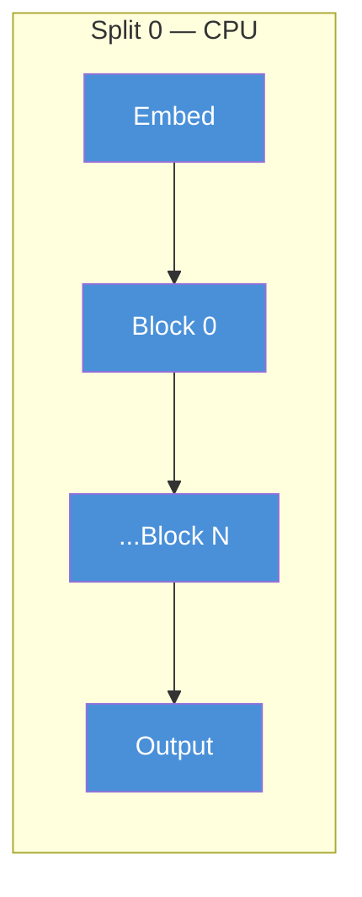

**结果**: 只有 **1 个 split**，全部 CPU。无跨 backend 拷贝。

#### 场景 4: MoE 模型部分 offload

#### 场景 4: MoE 模型部分 offload — 权重按需拷贝

##### 前提：权重跟随层分配，不是按类型分

Expert 权重的设备分配 **完全由 `gpu_layers` 决定**，跟 dense 模型一样是按层分配 (`ggml.go:332-346`)：

```
gpu_layers = 前 20 层在 GPU

层 0-19:  Attention 权重在 GPU ✅  Expert 权重也在 GPU ✅  → 不需要拷贝
层 20-31: Attention 权重在 CPU ✅  Expert 权重也在 CPU ✅  → 默认在 CPU 计算
```

代码通过 tensor 名字提取层号（如 `blk.5.ffn_gate_exps` → 层 5），然后用该层的设备分配：
```go
// ggml.go:332-346
layerIndex := extractFirstNumber(t.Name)  // "blk.5.ffn_gate_exps" → 5
createTensor(tensor{source: t}, layers[layerIndex].bts, layerIndex)
// layers[5] 是 GPU? → GPU buffer。是 CPU? → CPU buffer。
```

##### `op_offload`: CPU 层的计算也可以跑在 GPU 上

关键在于 scheduler 的 `op_offload` 机制 (`ggml-backend.cpp:862-875`):

```c
// 如果权重在 CPU host memory，且 op_offload=true，且 batch_size >= 32
if (sched->op_offload && sched->batch_size >= 32
    && src_backend_id == sched->n_backends - 1  // 在最低优先级 backend (CPU)
    && ggml_backend_buffer_is_host(src->buffer)) {
    // 尝试把计算 offload 到更高优先级 backend (GPU)
    for (b = 0; b < src_backend_id; b++) {
        if (ggml_backend_supports_op(sched->backends[b], tensor)
            && ggml_backend_offload_op(sched->backends[b], tensor)) {
            return b;  // → 在 GPU 上算！
        }
    }
}
```

**这就触发了权重拷贝**: 权重在 CPU 上，但计算被 offload 到 GPU → scheduler 必须把权重从 CPU 拷到 GPU。

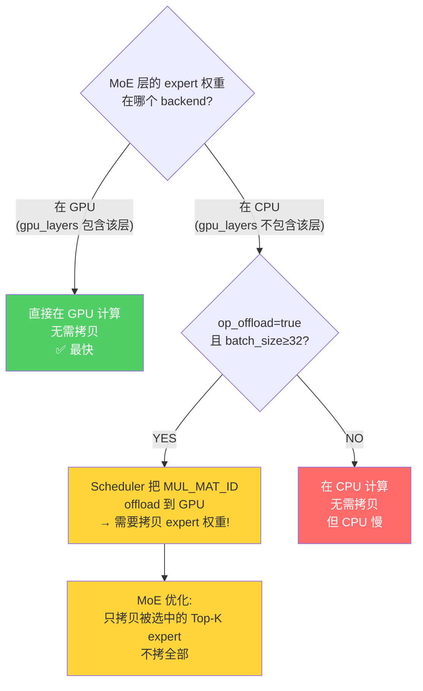

##### MoE 按需拷贝的具体实现

当 op_offload 触发后，scheduler 的 split 机制检测到 expert 权重在 CPU 但计算在 GPU，会把这些权重标记为 split 的 input。然后在 `compute_splits` 中 (`ggml-backend.cpp:1515-1599`):

```c
// 关键判断: input 是 WEIGHTS 且在 host (CPU) 内存，且 op 是 MUL_MAT_ID
if (buffer_usage == GGML_BACKEND_BUFFER_USAGE_WEIGHTS &&
    ggml_backend_buffer_is_host(input->buffer) &&
    node->op == GGML_OP_MUL_MAT_ID) {

    // 1. 读取 routing ids，确定哪些 expert 被选中
    ids = read_routing_ids(ids_tensor);
    used_ids = bitset_from_ids(ids);  // 标记使用到的 expert

    // 2. 只拷贝选中 expert 的权重数据
    for each consecutive group of used experts:
        copy_experts(first_id, last_id);
        // ggml_backend_tensor_set_async: CPU→GPU 异步拷贝
}
```

##### 拷贝量估算

expert 数量差异极大，从 GGUF 的 `expert_count` / `expert_used_count` 读取：

| 模型 | 总 expert | Top-K | 拷贝比例 | 每层拷贝量 (Q4_K_M 估) |
|------|----------|-------|---------|---------------------|
| Mixtral 8x7B | 8 | 2 | 25% | ~350 MB × 25% ≈ 88 MB |
| Qwen3-30B-A3B | 128 | 8 | 6.3% | expert 很小, ≈ 几十 MB |
| DeepSeek-V3 | 256 | 8 | 3.1% | 总量极大, 仍有 ~200 MB |

```
DeepSeek-V3 单层估算 (256 experts, top-8, Q4_K_M):
  总 expert 参数: ~671B × 大部分在 expert ≈ ~600B
  每层 expert: 600B / 61 layers / 256 experts ≈ 38M params/expert
  Q4_K_M: 38M × 0.56 bytes ≈ 21 MB/expert
  Top-8 拷贝: 21 × 8 ≈ 168 MB/层

  PCIe 4.0 x16 (~32 GB/s): 168MB / 32GB/s ≈ 5.3 ms/层
  如果 30 层在 CPU 且 offload: 5.3 × 30 ≈ 159 ms/batch

  对比 generation 一个 token 总耗时 ~30-50 ms
  → 权重拷贝时间 >> 计算时间，严重瓶颈
```

**结论**: MoE 的 op_offload 在 **prefill (batch≥32)** 时触发（GPU 计算快弥补拷贝开销），但在 **generation (batch=1, 或并发用户<32)** 时不触发（`batch_size >= 32` 条件不满足），此时 CPU 层的 expert 在 CPU 上算。

##### 代码中支持 MoE 的模型架构

均从 GGUF 读取 `expert_count` / `expert_used_count`:
- `qwen3` / `qwen3moe` — softmax routing
- `qwen35` / `qwen35moe` / `qwen3next` — 还支持 **shared expert**
- `deepseek2` — sigmoid routing + shared expert
- `glm4moelite` — sigmoid routing
- `llama4` — interleaved MoE (只有部分层是 MoE)
- `lfm2`, `nemotronh`, `gptoss`, `nomicbert` 等

#### 场景 5: 同一层内的 split (特殊情况)

即使同一层内，如果某些 op 不被当前 backend 支持，也会产生额外 split:

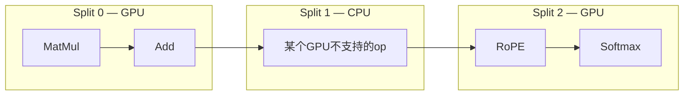

这种情况较少见，因为 Pass 2 的扩展算法会尽量把 op 合并到同一个 backend。

### 2.4 GPU 内存分配与 Split 间的复用

#### 两类内存：权重 vs 中间结果

首先区分两类 GPU 内存占用：

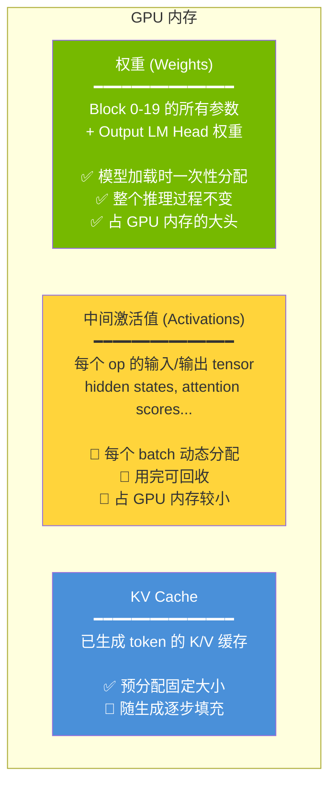

#### Split 间共享同一个 GPU buffer pool

**关键**: 所有 GPU split 共享同一个 GPU buffer pool（通过 `ggml_gallocr` 管理）。不是每个 split 独占自己的内存。

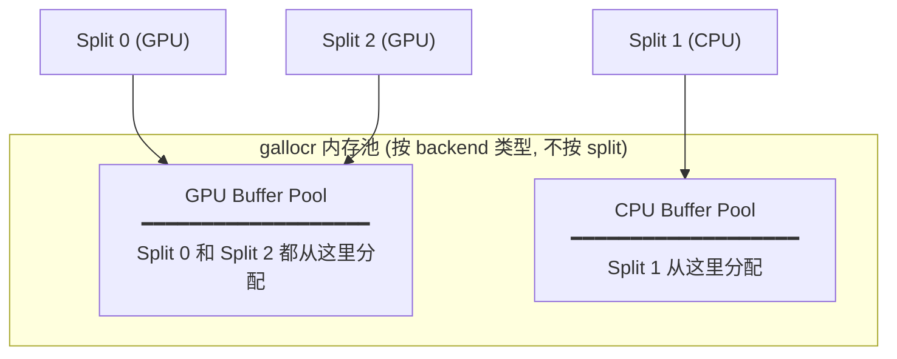

#### 中间激活值的生命周期管理

allocator 做了 **tensor 生命周期分析** (`ggml-alloc.c:631-830`)：追踪每个 tensor 被几个后续 op 引用 (`n_children`)。当引用计数归零，内存立即回收给池子。

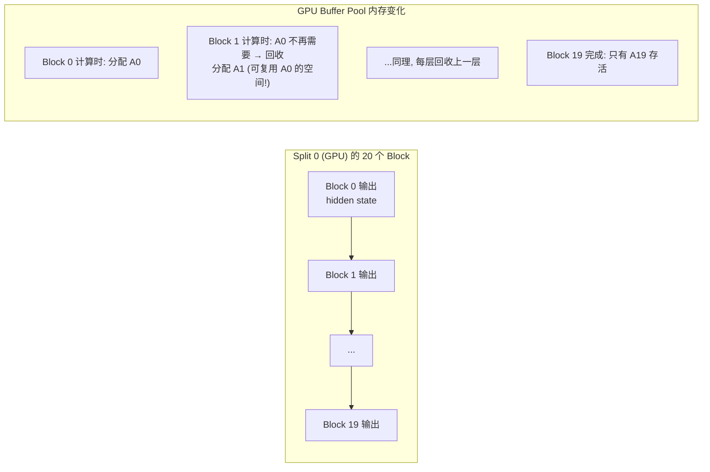

所以 GPU 内存中 **不会同时存在 20 层的中间结果**。每层的中间结果用完就回收，下一层复用同一块内存。GPU buffer pool 大小约等于 **一层的中间激活值**，不是所有层的总和。

#### 回答：Split 0 和 Split 2 的 GPU 内存关系

```
场景 2 (GPU→CPU→GPU) 的内存时间线:

时间 ──────────────────────────────────────────────→

GPU 权重内存:  [Block 0-19 权重][============永久占用============][LM Head 权重]
GPU 激活内存:  [Split0: 逐层分配/回收][空闲][        Split2: LM Head 激活       ]
CPU 权重内存:  [===============Block 20-31 权重==============]
CPU 激活内存:  [空闲][  Split1: 逐层分配/回收  ][空闲]
```

- **权重**: Block 0-19 + LM Head 在 GPU，Block 20-31 在 CPU。各自常驻，不回收。
- **激活值**: Split 0 的激活值在 Split 0 执行完后可以回收（除了要传给 Split 1 的 hidden state）。Split 2 复用同一个 GPU buffer pool。
- **不是"覆盖"**: 更准确地说是 allocator 的生命周期管理——不再需要的 tensor 的内存空间被回收，后续 tensor 可以分配到同一位置。
- **结论**: 所有 GPU split 合在一起占用的 GPU 内存 ≈ 所有 GPU 层的权重 + 峰值激活值 + KV cache。不是翻倍。

#### 权重会在 Split 间换入换出吗？

**不会。** 当前实现中，所有 GPU 层的权重在模型加载时一次性全部放入 GPU，永远不动。

你描述的场景（Split 0 用完 0-20 层权重后释放，Split 2 上传 50-60 层权重）叫做 **"layer swapping / weight offloading"**，这是一种节省显存的策略，但 Ollama 目前**没有实现**：

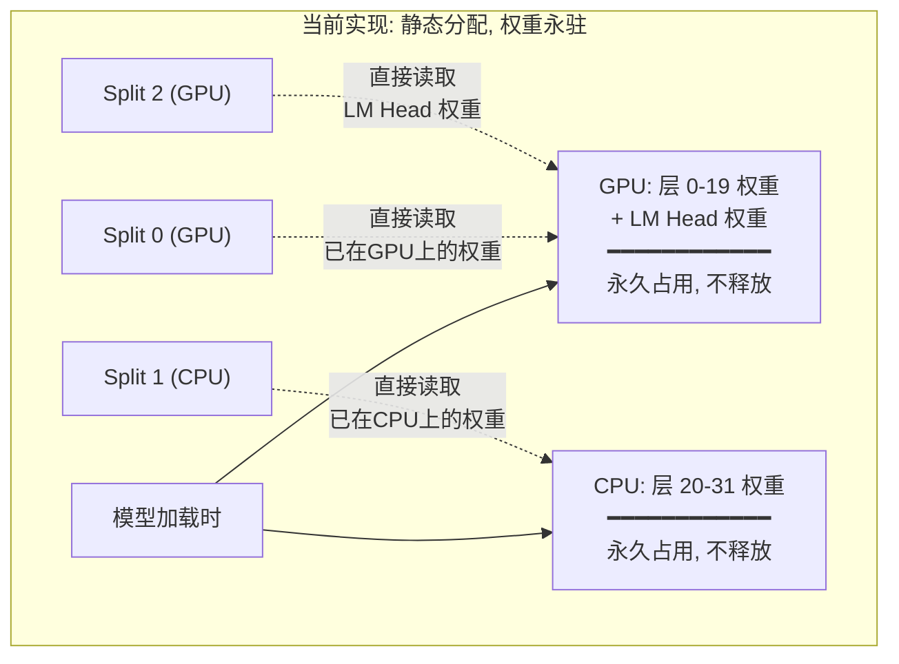

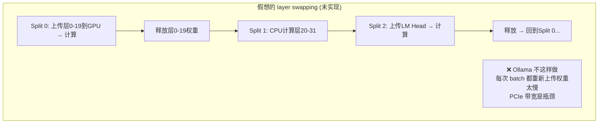

**为什么 dense 模型不这样做？** 权重很大（每层 ~273MB Q4_K_M），PCIe 3.0/4.0 带宽约 12-32 GB/s。上传 20 层权重 ≈ 5.5 GB 需要 ~170-460ms，而 generation 一个 token 只需 ~20ms。来回搬权重的开销远大于计算本身。

所以 `gpu_layers` 参数的意思就是："有多少层的权重**常驻** GPU"。显存不够就少放几层，让那些层永远在 CPU 上算。这是空间换时间的静态决策。

> **例外: MoE + op_offload。** 当 MoE 层被分配到 CPU（expert 权重在 CPU）时，scheduler 的 `op_offload` 机制可能仍然把 `MUL_MAT_ID` 计算节点分配到 GPU（因为 GPU 算得快）。这时才会发生 CPU→GPU 的 expert 权重按需拷贝。详见下文。

#### 权重和激活值的内存隔离

这是代码层面的 **硬保证**，不是优化策略：

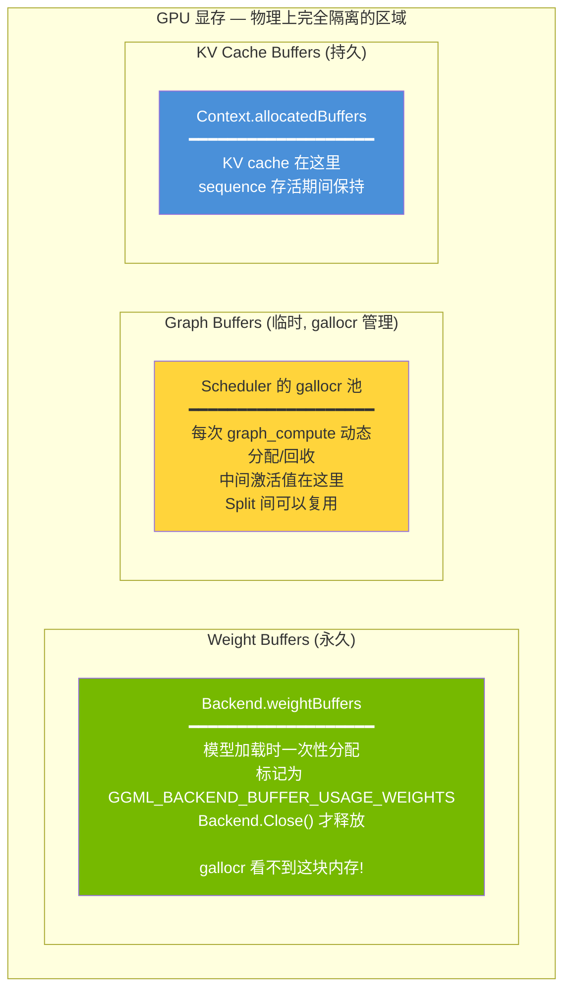

代码证据 (`ggml.go`):
- 权重: `ggml_backend_alloc_ctx_tensors_from_buft()` 分配，存入 `Backend.weightBuffers` map (Line 404-417)
- 激活: `ggml_backend_sched_reserve()` 通过 gallocr 分配 (Line 859)
- 两者用 **不同的分配函数、不同的 buffer 对象、不同的生命周期管理**

权重 buffer 被标记为 `GGML_BACKEND_BUFFER_USAGE_WEIGHTS`，gallocr 的分配器根本不知道这块内存的存在，不可能复用或覆盖。

#### 实际 VRAM 估算: Qwen2.5 32B (Q4_K_M)

> 注: 没有 "Qwen3.5 27B" 这个型号，最接近的 dense 模型是 Qwen2.5-32B。
> 参数: hidden=5120, layers=64, heads=40, kv_heads=8, head_dim=128, FFN_intermediate=27648, vocab=152064

**1) 权重 (Weight Buffers)**

| 量化 | 计算 | 大小 |
|------|------|------|
| FP16 | 32B × 2 bytes | **~64 GB** |
| Q8_0 | 32B × 1 byte | **~32 GB** |
| **Q4_K_M** | 32B × ~0.56 bytes | **~18 GB** |

每层权重分解 (Q4_K_M):
```
每层 ≈ 487M 参数:
  QKV proj: 5120 × (40+8+8) × 128    = 36.7M → ~20 MB
  O proj:   5120 × 5120               = 26.2M → ~15 MB
  FFN gate+up+down: 3 × 5120 × 27648  = 424.7M → ~238 MB
  Norms: 忽略不计
  ──────────────────────────────────────────
  每层 ≈ 273 MB (Q4_K_M)
  64 层 ≈ 17.1 GB
  + Embedding + LM Head ≈ 0.9 GB
  ──────────────────────────────────────────
  总权重 ≈ 18 GB
```

**2) KV Cache (32K context)**

```
每层 = 2(K+V) × kv_heads × head_dim × seq_len × dtype
     = 2 × 8 × 128 × 32768 × 2 bytes (FP16)
     = 128 MB/层

64 层 = 128 × 64 = 8192 MB ≈ 8 GB (FP16)
                              ≈ 4 GB (Q8_0 KV cache)
                              ≈ 2 GB (Q4_0 KV cache)
```

**3) 峰值激活值 (Graph Buffers)**

取决于阶段:

| 阶段 | batch | seq_len | 峰值激活 | 说明 |
|------|-------|---------|---------|------|
| **Generation** | 1 | 1 | **< 1 MB** | 每层: hidden_state(20KB) + FFN_intermediate(108KB) |
| **Prefill 32K** | 1 | 32768 | **~3.5 GB** | 峰值在 FFN: gate_up = 27648 × 32768 × FP32 |
| Prefill 512 | 1 | 512 | **~56 MB** | 常规 batch size |

> 注: Flash Attention 避免了 `[heads × seq × seq]` 的 attention score 矩阵展开，否则 32K 上下文需要 160+ GB。

生命周期管理使得 **同一时刻只需要一层的峰值激活值** — 上一层的中间结果在下一层开始前已回收。

**3.5 GB 的激活值需要预留吗？**

Graph buffer 是通过 `Reserve()` 预分配的 (`runner.go:1177`)。模型加载时，runner 用 **batchSize** (配置值，如 512 或 2048) 构建一个 dummy graph，调用 `ctx.Forward(t).Reserve()` 让 scheduler 预分配足够大的 buffer。

```
实际预分配大小 = 按 batchSize (如 2048) 计算的峰值激活
               ≠ 按 32K 计算

32K prefill 不是一次性 32K tokens：
  batchSize=512 时，32K prompt 分 64 次 prefill
  每次只处理 512 tokens → 峰值激活 ≈ 56 MB
  远小于 3.5 GB
```

所以实际预留的 Graph buffer 大小取决于 `batchSize`，不是 context length。3.5 GB 只是理论上一次性处理 32K tokens 的情况（实际不会发生，因为 batchSize 通常远小于 context length）。

| batchSize | 峰值 FFN 激活 | 说明 |
|-----------|-------------|------|
| 1 (generation) | ~108 KB | 可忽略 |
| 512 (默认) | ~56 MB | 这是实际预留大小 |
| 2048 | ~216 MB | 较大的 batch |
| 32768 (理论) | ~3.5 GB | 不会实际发生 |

**4) 汇总: Qwen2.5-32B Q4_K_M, 32K context, batchSize=512**

```
┌───────────────────────────────────────────────────┐
│ GPU 显存占用 (全部层放 GPU)                         │
│                                                   │
│ 权重 (Q4_K_M):         ~18.0 GB  █████████████   │
│ KV Cache (FP16, 32K):   ~8.0 GB  ██████          │
│ Graph Buffer (bs=512):   ~0.1 GB                  │
│ Scheduler 开销:          ~0.1 GB                  │
│ ─────────────────────────────────                 │
│ 总计:                   ~26 GB                    │
│                                                   │
│ → 需要 ≥ 32 GB 显卡 (留余量)                       │
│ → 24 GB 卡: offload ~10层到CPU                     │
│   (减少 ~2.7 GB 权重 + 对应 KV cache)              │
└───────────────────────────────────────────────────┘
```

### 2.5 分片执行 (compute_splits)

**函数**: `ggml_backend_sched_compute_splits()` (`ggml-backend.cpp:1480-1664`, ⬜ 上游代码)

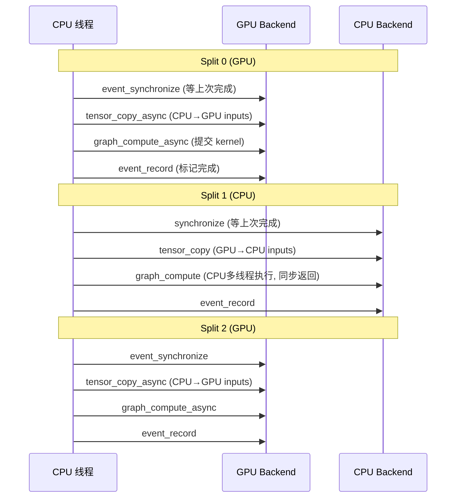

**注意**: Split 是 **顺序执行** 的（一个 split 完成后才开始下一个），因为它们之间有数据依赖。

### 2.6 Event 同步机制

**Event vs Synchronize 对比**:

| | `ggml_backend_synchronize` | `event_record` + `event_synchronize` |
|---|---|---|
| 做什么 | CPU 阻塞等 backend 所有工作完成 | 在 backend 命令流中插入标记，后续可查询/等待 |
| 阻塞谁 | CPU 线程 | CPU 线程 (synchronize) 或其他 backend (wait) |
| 精度 | 等全部完成 | 只等到特定点 |
| 用在哪 | tracing 的 per-node sync | split 间的 pipeline 协调 |
| parallel 模式 | 不使用 | `events[backend_id][copy_id]` 管理多 copy 协调 |

---

