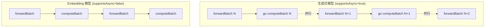
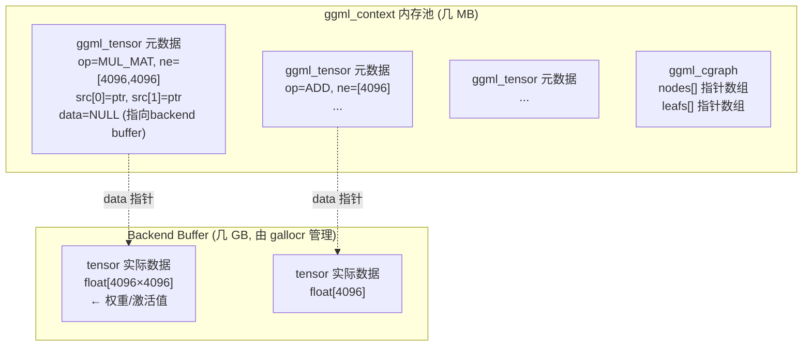
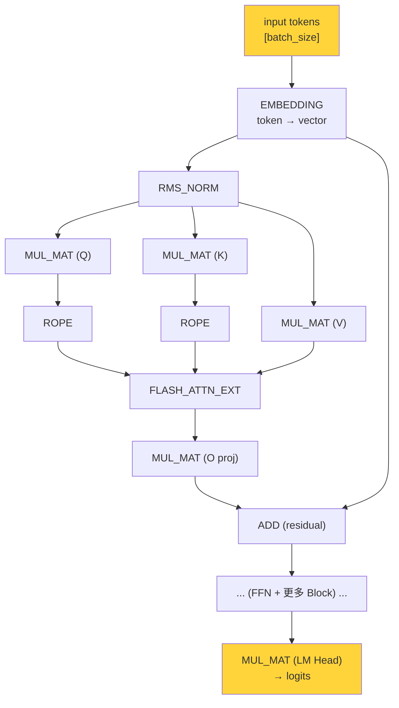
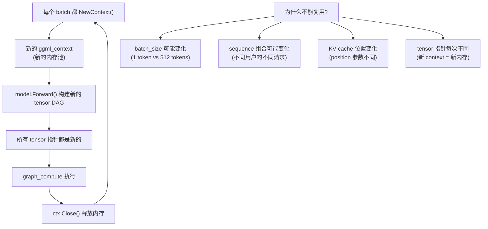
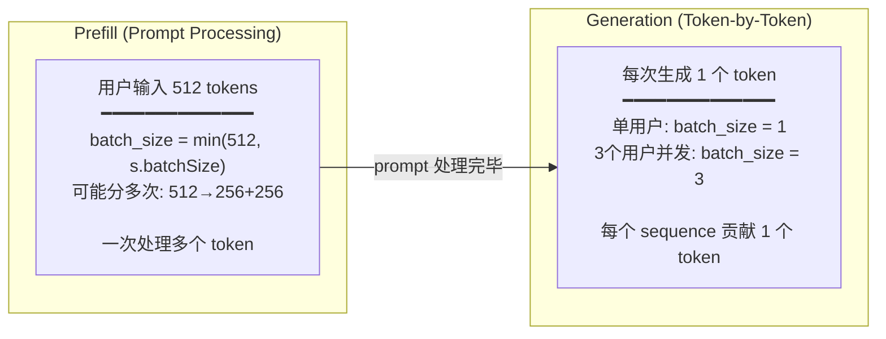
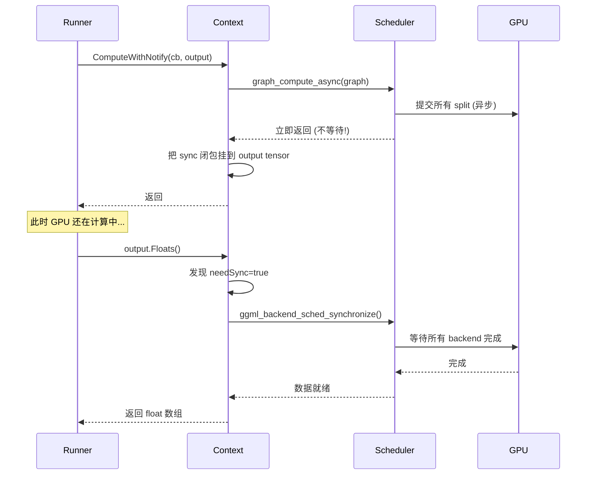

# OllamaRunner 完整调用链

### 3.1 主循环与 Pooling 模型

**函数**: `Server.run()` (`runner/ollamarunner/runner.go:447-473`)

```go
func (s *Server) run(ctx context.Context) {
    // pooling_type 判断
    supportsAsync := pooling.Type(...) == pooling.TypeNone  // (Line 450)

    for {
        nextBatch := s.forwardBatch(previousBatch)

        if supportsAsync {
            go s.computeBatch(nextBatch)   // 异步: 生成式模型
        } else {
            s.computeBatch(nextBatch)       // 同步: embedding 模型
        }
        previousBatch = nextBatch
    }
}
```

#### `pooling_type` 是什么？

`pooling_type` 是模型配置中的一个属性，标识模型是否是 **embedding/pooling 模型**:

| pooling_type | 模型类型 | 例子 | supportsAsync |
|---|---|---|---|
| `TypeNone` (0) | **生成式模型** | Llama, Qwen, Gemma | `true` → `go computeBatch()` |
| `TypeMean/CLS/Last` | **Embedding 模型** | nomic-embed, bge | `false` → 同步 `computeBatch()` |

**为什么 embedding 模型不能异步?**

生成式模型是流式的（一次生成一个 token，可以边计算边准备下一个 batch）。而 embedding 模型是一次性的（输入整段文本，输出一个向量），不需要 pipeline，同步更简单也够用。



### 3.2 ggml_context 是什么

`ggml_context` 是 ggml 的核心数据结构，但它的名字容易让人误解。它 **不是** "计算上下文"或"GPU 上下文"，而是一个 **tensor 元数据的内存池**。

#### 结构定义 (`ggml.c:930-940`)

```c
struct ggml_context {
    size_t mem_size;           // 内存池大小
    void * mem_buffer;         // 内存池起始地址
    bool   mem_buffer_owned;   // 是否自己分配的
    bool   no_alloc;           // 是否跳过 tensor 数据分配

    int    n_objects;          // 对象计数

    struct ggml_object * objects_begin;  // 链表头
    struct ggml_object * objects_end;    // 链表尾
};
```

#### 它存什么？不存什么？



| 存在 ggml_context 里 | 存在 Backend Buffer 里 |
|---|---|
| tensor 的形状 (ne, nb) | tensor 的实际浮点数据 |
| tensor 的 op 类型 | 权重参数 |
| tensor 的 src 指针 (依赖关系) | 中间激活值 |
| 计算图 (ggml_cgraph) | KV cache |
| 几 MB | 几 GB |

#### 生命周期

```
每个 batch:
  NewContext()    → ggml_init() → 分配 ~几MB 的元数据内存池
  model.Forward() → 在池中创建 tensor 元数据 + 构建 graph
  ComputeWithNotify() → scheduler 读取 graph，执行计算
  ctx.Close()    → ggml_free() → 释放元数据内存池
                    (Backend Buffer 中的激活值也随之无效)
```

**类比**: ggml_context 就像是一张 **施工图纸** (tensor 元数据 + 计算图)，而 Backend Buffer 是 **实际的建筑材料** (浮点数据)。每次施工 (batch) 都画一张新图纸，但建筑材料的仓库 (buffer pool) 是复用的。

### 3.3 为什么叫"构图"？每次都要构图吗？

#### "图"是什么？

`model.Forward()` 不直接计算，而是构建一个 **计算图 (Computation Graph / DAG)**:



每个方框是一个 **ggml_tensor 节点**，代表一个运算。Forward 过程就是把这些节点和边连接起来，形成一个 DAG。**这就是"构图"**。

然后 `ComputeWithNotify()` 把这个图交给 scheduler，scheduler 切分、分配、执行。

#### 为什么每次都要重新构图？



**根本原因**:
1. **输入形状变化**: prompt 阶段可能有 512 tokens，生成阶段只有 1 token。图的形状不同。
2. **动态参数**: position、sequence ID 等都影响 RoPE 和 attention mask。
3. **内存管理**: 每个 `ggml_context` 是一个临时内存池，用完即释放。复用需要完全不同的内存管理策略。

#### 有优化吗？

虽然上层每次重新构图，但底层有两个优化:

1. **Scheduler buffer 重用** (`ggml-backend.cpp:1428-1445`): 如果新图的 backend 分配与上一次相同，跳过 buffer 重新分配:
   ```c
   // 比较当前和上次的 node_backend_ids
   if (!backend_ids_changed) {
       // 尝试复用现有 buffer 分配
       if (ggml_gallocr_alloc_graph(sched->galloc, &sched->graph)) {
           // 成功! 跳过重新分配
       }
   }
   ```

2. **CUDA Graph Capture** (`ggml-cuda.cu:3059-3163`): CUDA backend 会检查图结构是否与上次相同（同样的 op、shape、stride）。如果相同，可以用 `cudaGraphExecUpdate` 就地更新而不重新 capture。但因为每次 context 的 tensor 指针不同，实际上很难命中。

### 3.3 computeBatch - 计算

**函数**: `Server.computeBatch()` (`runner/ollamarunner/runner.go:642-863`)

```
1. <-activeBatch.inputsReadyCh       // 等待 forward 完成
2. batch.Inputs.FromInts(batchInputs) // 填入 token 值
3. ctx.ComputeWithNotify(cb, output)  // 提交到 scheduler
   → split_graph → alloc_splits → compute_splits
4. outputs = modelOutput.Floats()     // 触发懒同步
5. for each seq: sample + send response
```

### 3.4 Batch Size: 什么时候是 1，什么时候不是

#### 两个阶段，完全不同的 batch size



#### Prefill 阶段

用户发送一段 prompt（比如 512 tokens），runner 会尽量塞满一个 batch:

```go
// runner.go:529-544 (简化)
batchSize := s.batchSize  // 配置值，通常 512 或 2048

for each sequence {
    for each token in seq.inputs {
        if len(batchInputs) + 1 > batchSize {
            break  // batch 满了
        }
        batchInputs = append(batchInputs, token)
    }
}
```

如果 prompt 有 2000 tokens，`batchSize=512`，会分 4 次 prefill: 512+512+512+464。

#### Generation 阶段

Prefill 完成后，每个 sequence 每次只生成 **1 个 token** (`runner.go:712-714`):

```go
// 每个 sequence 添加一个 placeholder token
nextToken := &input.Input{Token: 0}
seq.inputs = []*input.Input{nextToken}
```

但**多个用户可以合并到同一个 batch**:

```
单用户:                    batch = [token_A]                → batch_size = 1
3个用户同时生成:           batch = [token_A, token_B, token_C]  → batch_size = 3
1个用户在 prefill + 1个在生成: batch = [prompt_A×256, token_B]    → batch_size = 257
```

#### 实际典型情况

| 场景 | batch_size | 说明 |
|------|-----------|------|
| 单用户 generation | **1** | 最常见，每次 1 token |
| 单用户 prefill | **s.batchSize** (512) | 按配置值分批处理 prompt |
| N 用户并发 generation | **N** | 每用户 1 token，合并成一个 batch |
| 混合 (prefill + generation) | **variable** | Round-robin 收集，受 batchSize 上限 |

**对 tracing 的影响**: generation 阶段 `batch_size=1` 时，每个 pass 只有 1 个 token 通过所有层。图的形状与 `batch_size=512` 的 prefill 阶段完全不同（矩阵维度不同），所以每次都要重新构图。

### 3.5 懒同步机制

**关键实现** (`ml/backend/ggml/ggml.go:823-852`):



**效果**: `graph_compute_async` 提交后立即返回。只有当 `modelOutput.Floats()` 访问数据时才真正等待 GPU 完成。这让 Go 层可以在 GPU 计算期间做其他准备工作。

---

