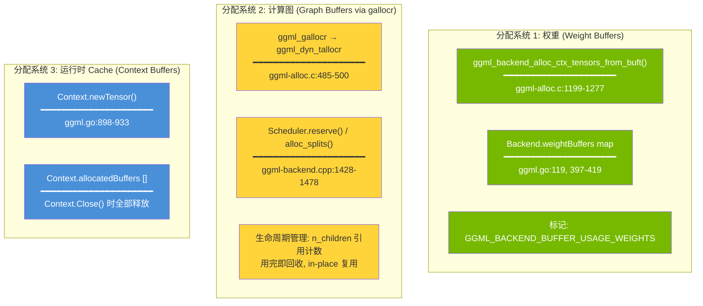
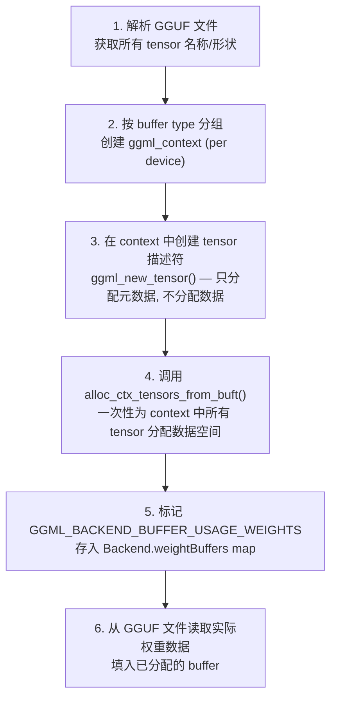
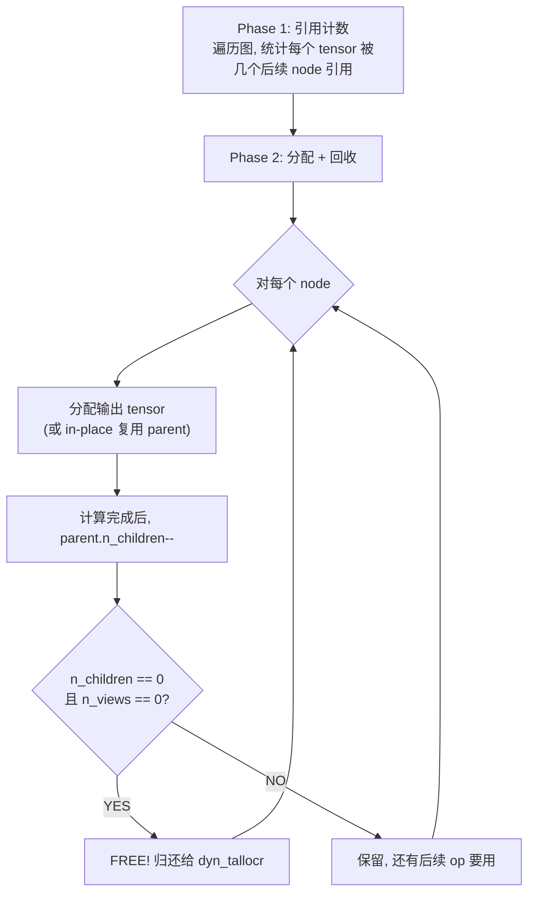

# 内存分配机制详解

GGML backend 有 **三套完全独立的内存分配系统**，各自管理不同类型的数据：



### 4.1 分配系统 1: 权重 (`ggml_backend_alloc_ctx_tensors_from_buft`)

**时机**: 模型加载时，一次性。
**文件**: `ggml-alloc.c:1199-1277`, Go 端 `ggml.go:248-419`

**流程**:



**`alloc_ctx_tensors_from_buft` 内部算法** (`ggml-alloc.c:1211-1237`):

```c
// 遍历 context 中的所有 tensor
for each tensor t in ctx:
    size = GGML_PAD(alloc_size(t), alignment)

    if (accumulated_size + size > max_size) {
        // 当前 chunk 装不下了 → 分配当前 chunk, 开始新 chunk
        alloc_tensor_range(start, current, buft)
        start = t
        accumulated_size = 0
    }
    accumulated_size += size

// 如果有多个 chunk → 创建 multi_buffer
// 对于大模型, 单个 backend 可能需要多个 buffer chunk
```

**关键特性**:
- 顺序分配，不做生命周期分析（权重永久存活）
- 如果超过 backend 单次分配上限，自动分成多个 chunk
- 分配后标记 `USAGE_WEIGHTS`，gallocr 永远不会碰这块内存

### 4.2 分配系统 2: 计算图 (`ggml_gallocr`)

**时机**: 每次 `graph_compute` 时。
**文件**: `ggml-alloc.c:485-831`

这是最复杂的分配器，负责管理推理过程中的中间激活值。

#### gallocr 结构

```c
// ggml-alloc.c:485-500
struct ggml_gallocr {
    ggml_backend_buffer_type_t * bufts;     // 每个 backend 的 buffer 类型
    struct vbuffer ** buffers;               // 每个 backend 的实际 buffer
    struct ggml_dyn_tallocr ** buf_tallocs;  // 每个 backend 的动态分配器
    int n_buffers;                           // backend 数量

    struct ggml_hash_set hash_set;
    struct hash_node * hash_values;          // tensor → 生命周期信息

    struct node_alloc * node_allocs;         // 预计算的分配方案
    struct leaf_alloc * leaf_allocs;
};
```

#### 动态分配器 (`ggml_dyn_tallocr`)

```c
// ggml-alloc.c:124-136
struct ggml_dyn_tallocr {
    size_t alignment;
    size_t max_chunk_size;
    struct tallocr_chunk * chunks[16];  // 最多 16 个 chunk
    int n_chunks;
};

// 每个 chunk 维护一个 free block 列表
struct tallocr_chunk {
    struct free_block free_blocks[256]; // {offset, size} 排序数组
    int n_free_blocks;
    size_t max_size;
};
```

类似于一个简化版的 **内存堆管理器**: 分配时找最佳 fit 的 free block，释放时归还并合并相邻 free block。

#### 生命周期分析 (`hash_node`)

```c
// ggml-alloc.c:462-468
struct hash_node {
    int n_children;      // 有几个 op 使用此 tensor 作为输入
    int n_views;         // 有几个 view 引用此 tensor
    int buffer_id;       // 分配在哪个 backend buffer
    struct buffer_address addr;  // 在 buffer 中的地址
    bool allocated;      // 是否已分配
};
```



**In-place 复用** (`ggml-alloc.c:640-689`): 如果一个 op 支持 in-place (如 ADD)，且 parent 只有这一个 child，直接复用 parent 的内存，零额外分配。

#### Reserve vs Alloc

| | `ggml_gallocr_reserve_n()` | `ggml_gallocr_alloc_graph()` |
|---|---|---|
| 时机 | 模型加载时 (预分配) | 每次 graph_compute |
| 做什么 | 模拟分配，确定所需 buffer 大小 | 实际分配，设置 tensor.data 指针 |
| 分配 buffer | 是，创建实际的 backend buffer | 否，复用 reserve 创建的 buffer |
| 调用方 | `Context.Reserve()` → `ggml_backend_sched_reserve()` | `ggml_backend_sched_alloc_splits()` |

### 4.3 分配系统 3: 运行时 Cache (`Context.newTensor`)

**时机**: 构图过程中，按需创建。
**文件**: `ggml.go:898-933`

用于 KV cache 等需要跨 batch 存活的 tensor:

```go
func (c *Context) newTensor(dtype ml.DType, shape []int) *Tensor {
    // 1. 创建 tensor 描述符 (只有元数据)
    t := C.ggml_new_tensor(c.ctx, cdtype, len(shape), shapeToGGML(shape))

    // 2. 按实际大小分配独立 buffer
    size := pad(C.ggml_backend_buft_get_alloc_size(c.buft, t),
                C.ggml_backend_buft_get_alignment(c.buft))
    b := C.ggml_backend_buft_alloc_buffer(c.buft, size)

    // 3. 绑定 buffer 到 tensor
    C.ggml_backend_tensor_alloc(b, t, C.ggml_backend_buffer_get_base(b))

    // 4. 加入清理列表
    *c.allocatedBuffers = append(*c.allocatedBuffers, b)
}
```

**与 gallocr 的区别**: 每个 tensor 独立一个 buffer (不共享、不做生命周期分析)。因为 KV cache 的生命周期跟随 sequence，不由计算图决定。

### 4.4 三套系统的完整生命周期

```
模型加载                                推理 (每个 batch)
━━━━━━━━━━━━━━━━━━━━━              ━━━━━━━━━━━━━━━━━━━━━

[系统1] 权重分配
  alloc_ctx_tensors_from_buft()
  → 永久占用, 标记 USAGE_WEIGHTS
  → 存入 weightBuffers map
                                    [系统3] KV cache 分配
[系统2] Graph buffer 预分配            Context.newTensor()
  Reserve() → gallocr 模拟分配        → 独立 buffer per tensor
  → 确定所需大小, 创建 buffer         → 跨 batch 存活

                                    [系统2] 激活值分配
                                      gallocr_alloc_graph()
                                      → 复用预分配的 buffer
                                      → n_children 引用计数
                                      → 用完即回收

                                    [系统3] Context.Close()
                                      → 释放 allocatedBuffers

Backend.Close()                     [系统2] buffer 不释放
  → 释放 weightBuffers                → 留给下一个 batch 复用
  → 释放 gallocr
```

### 4.5 `GGML_BACKEND_BUFFER_USAGE_WEIGHTS` 的作用

这个标记在以下位置被检查:

| 位置 | 用途 |
|------|------|
| `ggml.go:417` | 设置标记: `set_usage(b, WEIGHTS)` |
| `ggml-backend.cpp:1518` | **MoE 优化**: 检测 input 是 weight + host memory → 只拷贝选中 expert |
| `ggml-backend.cpp:862` | 判断 tensor 是否需要拷贝到其他 backend |
| `ggml-backend.cpp:1226` | 图分割时，检测权重所在位置影响 split 决策 |

**核心作用**: 告诉 scheduler "这个 buffer 里是权重，不是中间结果"。对 MoE 来说这个信息至关重要 — 只有标记了 `USAGE_WEIGHTS` 且在 host 内存上的 tensor，才会走 "只拷贝选中 expert" 的优化路径。

---

## 5. 完整调用链图

```
HTTP Request (/api/generate)
│
├─ Server.completion()                    [runner.go:865]
│  └─ NewSequence() + tokenize
│
└─ Server.run()                           [runner.go:447]  (后台 goroutine)
   │
   │  pooling_type == TypeNone ?
   │  ├─ YES (生成式): go computeBatch()  ← 异步, pipeline
   │  └─ NO  (embedding): computeBatch()  ← 同步
   │
   ├─ forwardBatch()                      [runner.go:476]  ← "构图"
   │  ├─ Backend.NewContext()             [ggml.go:676]
   │  │  └─ ggml_init() → 新的内存池
   │  │
   │  ├─ 收集 inputs (round-robin 多 sequence)
   │  │
   │  └─ model.Forward(ctx, model, batch) [各模型实现]
   │     └─ 构建 tensor DAG (不计算!)
   │        ├─ Embedding → MatMul → RoPE → Attention → ...
   │        └─ ctx.Forward(output) → ggml_build_forward_expand()
   │
   ├─ computeBatch()                      [runner.go:642]
   │  │
   │  ├─ ctx.ComputeWithNotify()         [ggml.go:823]
   │  │  │
   │  │  └─ ggml_backend_sched_graph_compute_async()   [ggml-backend.cpp]
   │  │     │
   │  │     ├─ split_graph()              [5-pass 分割]
   │  │     │  每个 split: {backend_id, node范围, 需要跨backend拷贝的inputs}
   │  │     │
   │  │     ├─ alloc_splits()             [buffer 分配, 尽量复用]
   │  │     │
   │  │     └─ compute_splits()           [顺序执行每个 split]
   │  │        │
   │  │        ├── 无 eval callback → 整个 split 一次 compute_async
   │  │        └── 有 eval callback → 逐 node: ask→compute→sync→observe
   │  │
   │  ├─ modelOutput.Floats()            → 触发 ggml_backend_sched_synchronize()
   │  │
   │  └─ 采样 token + 发送 response
   │
   └─ loop: previousBatch = nextBatch
```

---

