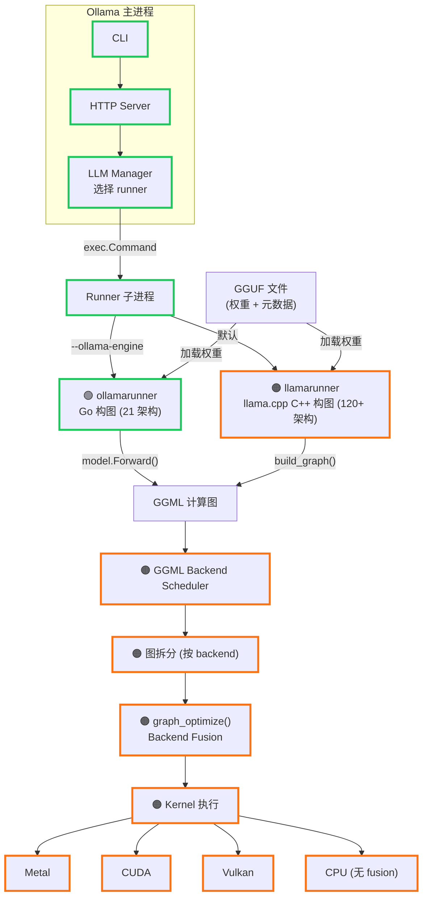

# Internals 调查文档索引

Ollama / llama.cpp / GGML 内部机制的调查研究文档。

## 文档列表

### GGUF 格式与模型转换

- [GGUF 转换机制](gguf-conversion.md) — GGUF 文件结构（纯权重+元数据，无计算图）、PyTorch→GGUF 的 1:1 张量翻译流程、权重级拼接（MoE gate/up、QKV fusion）

### 计算图构建

- [模型计算图构建](model-graph-construction.md) — 每架构独立构图机制、Ollama Go (`model/models/`) 和 llama.cpp C++ (`llama.cpp/src/models/`) 两套并行实现、注册/分发方式对比、架构特异性示例（Llama / Qwen3 / Gemma3）
- [计算图与权重加载的分离](graph-without-weights.md) — 构图不需要权重数据、graph_optimize 也不需要、完整的数据加载时序、无权重获取计算图的方法（`ggml_graph_dump_dot`、Reserve API 等）

### 算子与执行

- [算子融合](operator-fusion.md) — 原语级 fused op（FlashAttention、GLU、RMSNorm）+ backend 级 graph_optimize pattern matching fusion（Metal / CUDA / Vulkan 各自实现）、融合触发时机、与 PyTorch 的对比
- [Runner 架构](runner-architecture.md) — Runner 选择逻辑与分叉点（`llm/server.go`）、子进程通信机制、ollamarunner vs llamarunner 对比、从构图→backend fusion→kernel 执行的完整调用链

## 架构全景

> 图例：🟢 绿色粗边框 = Ollama Go 代码 ｜ 🟠 橙色粗边框 = llama.cpp C/C++ 代码

