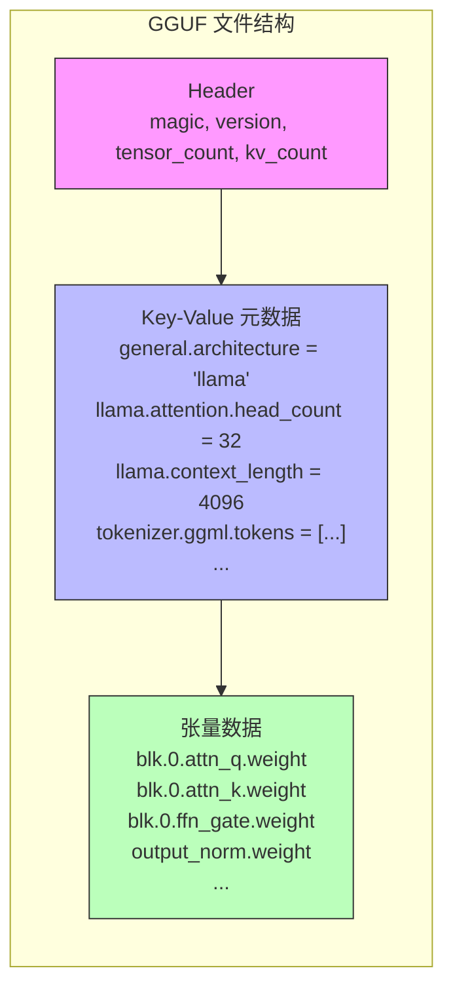
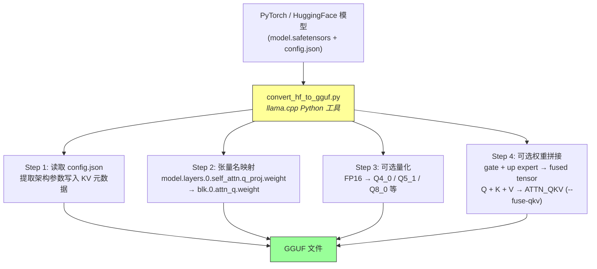
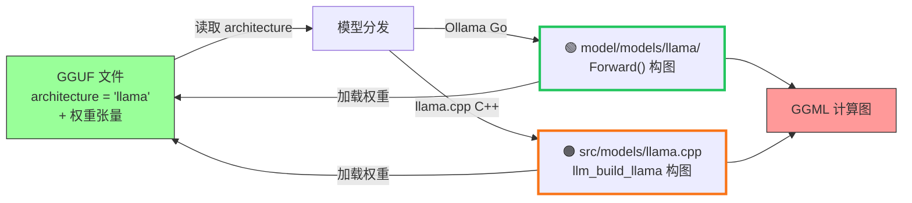

# GGUF 转换机制

## 核心结论

GGUF 文件是一个**纯数据容器**，只包含权重张量和元数据，**不包含计算图**。
从 PyTorch/HuggingFace 到 GGUF 的转换本质上是 **1:1 的张量重命名 + 可选量化**。

## GGUF 文件内容



**不包含的内容：**
- ❌ 计算图 / 算子定义
- ❌ Forward pass 逻辑
- ❌ 算子融合信息
- ❌ 执行计划

## 转换流程



### 转换脚本的实际代码 (llama.cpp Python)

```python
# convert_hf_to_gguf.py — 核心写入逻辑
def write(self):
    self.prepare_tensors()                              # 张量重命名 + 量化
    self.prepare_metadata(vocab_only=False)              # KV 元数据
    self.gguf_writer.write_header_to_file(path=self.fname_out)
    self.gguf_writer.write_kv_data_to_file()
    self.gguf_writer.write_tensors_to_file(progress=True)
```

没有任何图分析、算子识别或 fusion 步骤。

## 张量名映射规则

| HuggingFace 原始名 | GGUF 标准名 |
|---|---|
| `model.embed_tokens.weight` | `token_embd.weight` |
| `model.layers.{i}.self_attn.q_proj.weight` | `blk.{i}.attn_q.weight` |
| `model.layers.{i}.self_attn.k_proj.weight` | `blk.{i}.attn_k.weight` |
| `model.layers.{i}.self_attn.v_proj.weight` | `blk.{i}.attn_v.weight` |
| `model.layers.{i}.self_attn.o_proj.weight` | `blk.{i}.attn_output.weight` |
| `model.layers.{i}.mlp.gate_proj.weight` | `blk.{i}.ffn_gate.weight` |
| `model.layers.{i}.mlp.up_proj.weight` | `blk.{i}.ffn_up.weight` |
| `model.layers.{i}.mlp.down_proj.weight` | `blk.{i}.ffn_down.weight` |
| `model.layers.{i}.input_layernorm.weight` | `blk.{i}.attn_norm.weight` |
| `model.norm.weight` | `output_norm.weight` |
| `lm_head.weight` | `output.weight` |

映射由 `gguf.TensorNameMap` 定义（llama.cpp Python 库）。

## 权重级别的"融合"

转换时唯一做的"融合"是**张量拼接**（不是算子融合）：

### 1. MoE Gate/Up Expert 拼接（已在主线）

```
gate_proj: (n_expert, n_ff, n_embd)  ─┐
                                       ├──→ ffn_gate_up_exps: (n_expert, n_ff*2, n_embd)
up_proj:   (n_expert, n_ff, n_embd)  ─┘
```

推理时用一次 `MUL_MAT` 代替两次。

### 2. QKV 权重拼接（PR #20628，opt-in `--fuse-qkv`）

```
Q: (n_embd, n_head * head_dim)     ─┐
K: (n_embd, n_head_kv * head_dim)   ├──→ ATTN_QKV: (n_embd, total_dim)
V: (n_embd, n_head_kv * head_dim)  ─┘
```

推理时一次大矩阵乘代替三次小矩阵乘，提速 1.3%~13.6%。

## 关键认知

> **Flash attention、RMS norm 等 fused op 不在 GGUF 文件里。**
> 它们由推理引擎在构图时根据架构代码硬编码决定，且部分（如 flash attention）是运行时根据 GPU 能力动态选择的。

GGUF 的 `general.architecture` 字段告诉推理引擎实例化哪个**预写好的模型图定义**，引擎再把 GGUF 中的命名张量加载到图的对应位置。

> 图例：🟢 绿色粗边框 = Ollama Go ｜ 🟠 橙色粗边框 = llama.cpp C/C++


