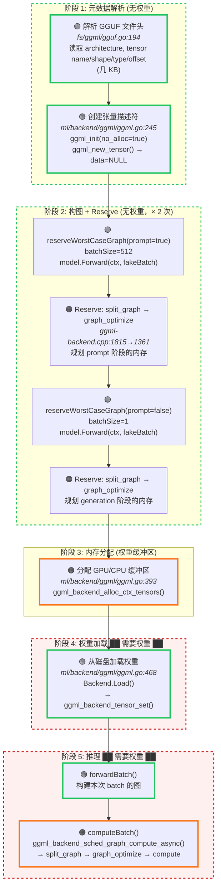
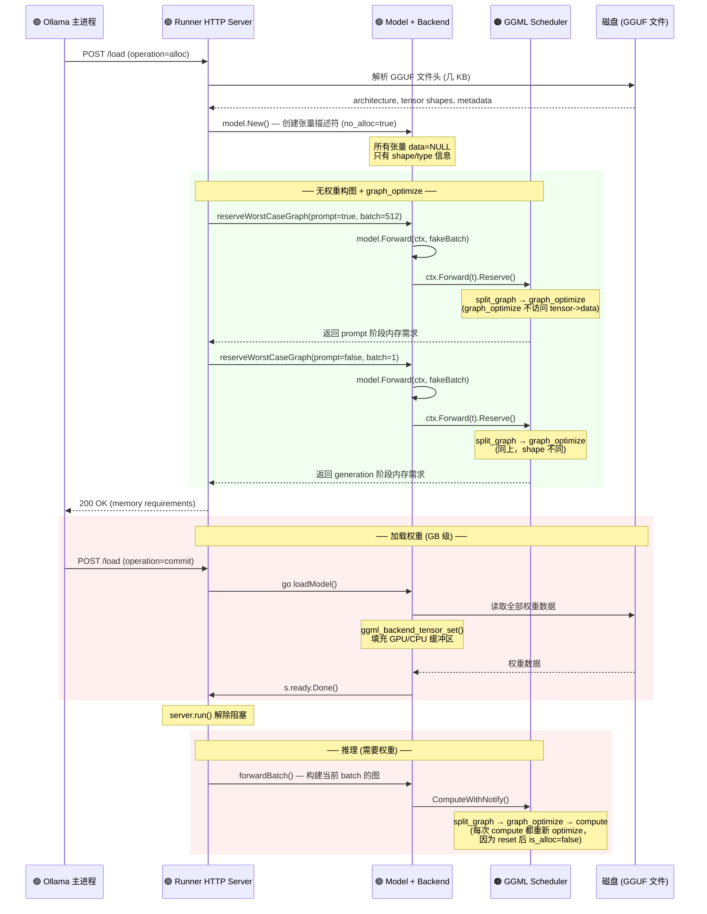
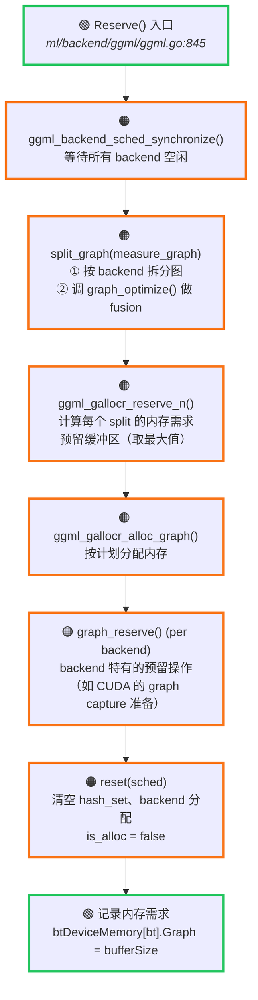
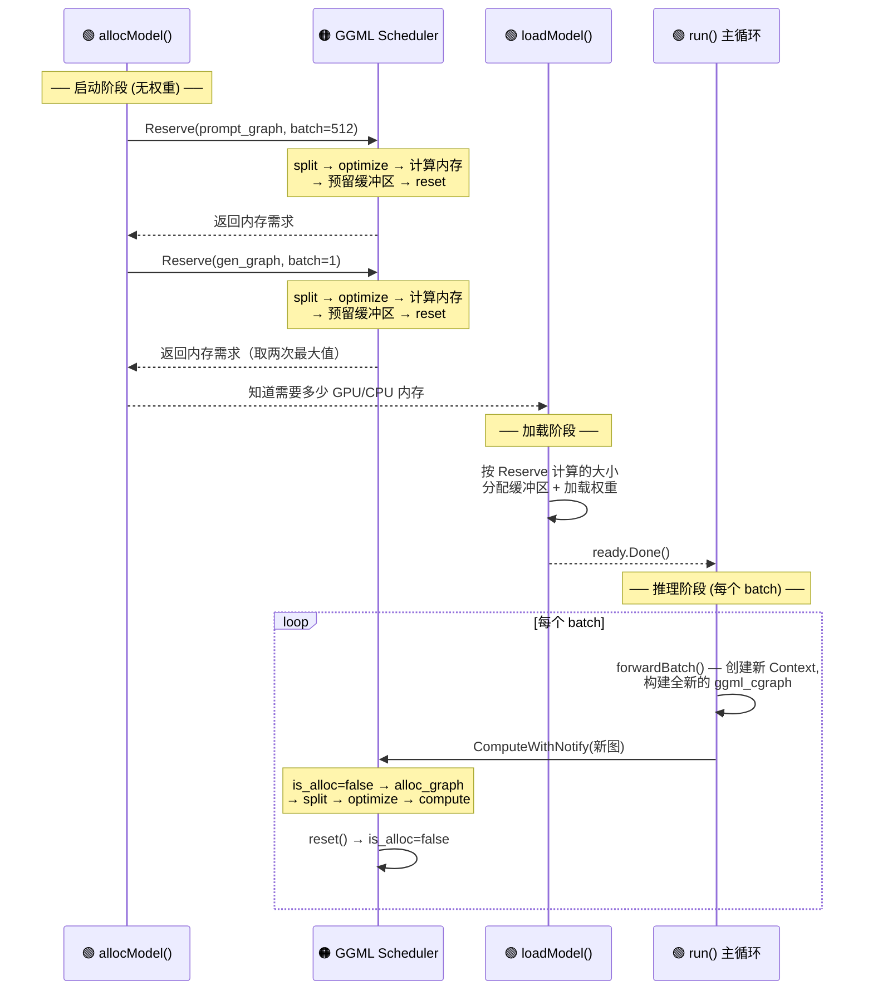
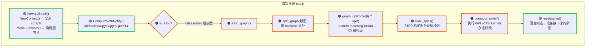

# 计算图构建与权重加载的分离

## 核心结论

GGML 的计算图构建 **完全不需要权重数据**。构图只使用张量元数据（shape、type），
所有算子的输出 shape 由输入 shape 静态推导。这意味着：

- **可以在不下载权重的情况下构建完整计算图**
- **可以获取图的拓扑、每个节点的 shape、op 类型等全部信息**
- **graph_optimize（backend fusion）也不需要权重数据**

**重要区分**: "不需要权重数据"≠"不需要 GGUF 文件"。当前代码路径仍需要 **GGUF 文件头**（几十 KB），因为：
1. **Hyperparameters** (`block_count`, `embedding_length` 等) 从 GGUF KV 元数据读取
2. **张量描述符** (name/shape/dtype) 从 GGUF 张量索引创建，模型通过 `backend.Get("blk.0.attn_q.weight")` 按名字查找
3. 虽然对已知架构这些信息可从 hyperparams 确定性推导，但当前无合成 tensor metadata 的代码路径

## 完整执行时序

> 图例：🟢 绿色粗边框 = Ollama Go ｜ 🟠 橙色粗边框 = llama.cpp C/C++ ｜ 红色虚线框 = 需要权重数据



**阶段 1-2 不需要任何权重数据，就能得到完整的计算图和 backend 执行计划。**

## Ollama Runner 启动的实际时序



### 关键代码路径

```go
// runner/ollamarunner/runner.go (Ollama Go)

// 阶段 1+2: allocModel — 不加载权重
func (s *Server) allocModel(...) error {
    s.model, err = model.New(mpath, params)      // line 1205: 创建张量描述符
    s.cache = kvcache.NewInputCache(...)          // line 1224: 创建 KV cache
    err = s.reserveWorstCaseGraph(true)           // line 1232: ★ prompt (batch=512)
    return s.reserveWorstCaseGraph(false)         // line 1237: ★ generation (batch=1)
}

// reserveWorstCaseGraph — 用假数据构建最坏情况的图
func (s *Server) reserveWorstCaseGraph(prompt bool) error {
    ctx := s.model.Backend().NewContext()
    batchSize := 1
    if prompt { batchSize = s.batchSize }         // prompt 阶段用大 batch
    // ... 构造假 batch (全零 token, 假位置) ...
    t, err := s.model.Forward(ctx, batch)         // line 1163: ★ 构图 (无权重)
    ctx.SetBatchSize(batchSize)
    ctx.Forward(t).Reserve()                      // line 1169: ★ Reserve (无权重)
    return nil
}

// 阶段 4: loadModel — 加载权重
func (s *Server) loadModel() {
    err := s.model.Backend().Load(...)            // line 1253: 从磁盘读取权重
    s.ready.Done()                                // line 1262: 解除 run() 阻塞
}
```

### 为什么 Reserve 调两次？

**不是"加载前后各一次"，而是为两种不同 batch shape 各一次。**

LLM 推理有两个阶段，图的 shape 完全不同：

| 阶段 | batch size | 典型 shape | 用途 |
|------|-----------|-----------|------|
| Prompt（prefill） | 512（或更大） | `[512, 4096]` | 一次吃入整个 prompt |
| Generation（decode） | 1 | `[1, 4096]` | 逐 token 生成 |

两种 batch shape 的计算图节点维度不同，所需的中间缓冲区大小也不同。
`Reserve()` 需要分别为两者规划，取最大值作为预分配量。

代码中的注释印证了这一点：

```go
// ml/backend/ggml/ggml.go:854 (Ollama Go)
// Reserve may get called multiple times for different graphs -
// we just want the last run, which will contain the max allocations
```

### graph_optimize 在推理时也会重新调用

`Reserve()` 结束时调 `ggml_backend_sched_reset()`（line 1839），把 `is_alloc` 重置为 false。
因此每次 `graph_compute_async` 都会走 `!is_alloc` 分支，重新执行 `split_graph` → `graph_optimize`：

```c
// ggml/src/ggml-backend.cpp (llama.cpp C) — line 1869
enum ggml_status ggml_backend_sched_graph_compute_async(...) {
    if (!sched->is_alloc) {                          // reset 后一定为 true
        ggml_backend_sched_alloc_graph(sched, graph); // → split_graph → graph_optimize
    }
    return ggml_backend_sched_compute_splits(sched);
}
```

**graph_optimize 的完整调用次数：**

| 时机 | 权重? | 目的 |
|------|-------|------|
| `reserveWorstCaseGraph(prompt=true)` 中的 `Reserve()` | ❌ | 预估 prompt 阶段内存 |
| `reserveWorstCaseGraph(prompt=false)` 中的 `Reserve()` | ❌ | 预估 generation 阶段内存 |
| **每次** `computeBatch()` 中的 `ComputeWithNotify()` | ✅ | 实际执行前优化 |

## Reserve 的完整职责

Reserve 是 GGML scheduler 的**预演机制**：用一张"假图"走完拆分、融合、内存估算的全流程，
但**不执行任何 kernel 计算**，也**不需要权重数据**。

### Reserve 做了什么（逐步）



```c
// ggml/src/ggml-backend.cpp (llama.cpp C) — line 1809
bool ggml_backend_sched_reserve(ggml_backend_sched_t sched, struct ggml_cgraph * measure_graph) {
    ggml_backend_sched_synchronize(sched);           // ① 等待 backend 空闲
    ggml_backend_sched_split_graph(sched, measure_graph); // ② 拆分 + graph_optimize
    ggml_gallocr_reserve_n(sched->galloc, ...);      // ③ 计算内存需求并预留
    ggml_gallocr_alloc_graph(sched->galloc, ...);    // ④ 分配缓冲区

    for (int i = 0; i < sched->n_splits; i++) {      // ⑤ backend 特有预留
        if (split_backend->iface.graph_reserve != NULL)
            split_backend->iface.graph_reserve(...);
    }

    ggml_backend_sched_reset(sched);                 // ⑥ 重置状态
    return true;
}
```

### Reserve 在推理生命周期中的位置



**Reserve 的核心价值：**
1. **内存预估** — 在不加载权重的情况下，精确计算每个 backend 需要多少显存/内存
2. **避免 OOM** — 主进程根据 Reserve 返回的内存需求决定是否能加载模型，以及如何在多 GPU 间分配
3. **去峰化** — 用最坏情况（prompt batch=512）预留内存，避免推理时临时分配

## 为什么每次 Compute 都要重新 split + optimize？

这是一个设计上的必然选择，而非性能缺陷。原因有三：

### 原因 1：每次 forwardBatch 都创建全新的 cgraph

```go
// runner/ollamarunner/runner.go (Ollama Go) — line 492
func (s *Server) forwardBatch(pendingBatch batchState) (nextBatch batchState, err error) {
    nextBatch.ctx = s.model.Backend().NewContext()   // ★ 全新的 Context
    // ...
    nextBatch.modelOutput, err = model.Forward(nextBatch.ctx, s.model, batch) // ★ 构建全新的 cgraph
}
```

**每次 `forwardBatch` 都 `NewContext()` → 新的 `ggml_cgraph`。**
旧的 split/optimize 结果绑定在旧图的节点指针上，对新图毫无意义。
即使不 reset，scheduler 也必须重新处理这张新图。

### 原因 2：Scheduler 的状态绑定在具体的张量指针上

```c
// ggml/src/ggml-backend.cpp (llama.cpp C) — line 712
struct ggml_backend_sched {
    struct ggml_hash_set  hash_set;               // 张量指针 → hash 位置
    int * hv_tensor_backend_ids;                  // 每个张量分配给哪个 backend
    struct ggml_tensor ** hv_tensor_copies;        // 每个张量在各 backend 的副本
    int * node_backend_ids;                        // 每个节点的 backend 分配
};
```

这些数据结构都用**张量指针作为 key**。新 Context 的新 cgraph 里的张量是全新分配的对象，
指针不同，旧的 hash_set 查不到它们。reset 清空 hash_set 是让 scheduler 回到干净状态接受新图。

### 原因 3：graph_optimize 开销极小

```
graph_optimize 只做 pattern matching：
  - 遍历节点数组（几百~几千个节点）
  - 检查 op 类型、src 链接、shape
  - 标记可融合的节点
  - 不访问 tensor->data，不做内存拷贝

vs. 实际 kernel 执行：
  - 矩阵乘法（数十亿 FLOPs）
  - 内存带宽瓶颈操作
```

对于 7B 模型，graph_optimize 可能耗时 **微秒级**，而一次 matmul kernel 执行耗时 **毫秒级**。
重新 optimize 的开销在整个 compute 中完全可以忽略。

### reset 清空了什么？

```c
// ggml/src/ggml-backend.cpp (llama.cpp C) — line 1783
void ggml_backend_sched_reset(ggml_backend_sched_t sched) {
    if (!sched->is_reset) {
        ggml_hash_set_reset(&sched->hash_set);        // 清空张量→位置映射
        memset(sched->hv_tensor_backend_ids, -1, ...); // 清空张量→backend 分配
        memset(sched->hv_tensor_copies, 0, ...);       // 清空跨 backend 副本记录
        sched->is_reset = true;
    }
    sched->is_alloc = false;  // 标记"未分配"，下次 compute 必须重新 alloc
}
```

### 完整的每次 Compute 调用链



### llamarunner 也是同样的模式

```cpp
// llama/llama.cpp/src/llama-context.cpp (llama.cpp C++) — line 1464
// llama.cpp 在 decode 之后也调 reset：
ggml_backend_sched_reset(lctx.sched.get());
```

**两个 runner 都遵循相同的模式：每次构新图 → compute → reset。**
这不是 Ollama 的特殊行为，而是 GGML scheduler 的标准使用方式。

graph_optimize 不访问 `tensor->data`，所以无论有没有权重都能正常工作。

## graph_optimize 不需要权重数据

graph_optimize **只检查图结构**（op 类型、节点连接、shape），从不访问 `tensor->data`。

```c
// ggml/src/ggml-metal/ggml-metal-common.cpp (llama.cpp C) — line 364
// Metal backend 的 graph_optimize — 只读 op/src/ne，不读 data
void ggml_graph_optimize(ggml_cgraph * gf) {
    for (int i = 0; i < n; i++) {
        gf->nodes[i]->op      // ✅ 读取算子类型
        gf->nodes[i]->src[]   // ✅ 读取输入张量指针
        gf->nodes[i]->ne[]    // ✅ 读取 shape
        // gf->nodes[i]->data — ❌ 从不访问
    }
}

// ggml/src/ggml-impl.h (llama.cpp C) — ggml_can_fuse()
// 融合验证也只检查结构: op 类型匹配、use_count==1、src 链接、shape 相同
```

## 无权重获取完整计算图的方法

### 方法 1: 调用 `reserveWorstCaseGraph` 的思路

Ollama 已经在做这件事了——`reserveWorstCaseGraph` 就是用假数据构图然后调 `Reserve()`。
你可以模仿这个模式，在 `Forward()` 之后、`Reserve()` 之前插入图检查代码。

### 方法 2: GGML 内置的图检查 API

```c
// ggml/include/ggml.h (llama.cpp C)

// 打印图结构到日志
void ggml_graph_print(const struct ggml_cgraph * cgraph);

// 导出为 Graphviz DOT 格式
void ggml_graph_dump_dot(const struct ggml_cgraph * gb,
                          const struct ggml_cgraph * gf,
                          const char * filename);
```

### 方法 3: 遍历图节点

```c
// 不需要权重，只需要图结构
int n = ggml_graph_n_nodes(cgraph);
for (int i = 0; i < n; i++) {
    struct ggml_tensor * node = ggml_graph_node(cgraph, i);

    // 以下全部可在 data=NULL 时读取:
    const char * op   = ggml_op_name(node->op);       // "MUL_MAT", "RMS_NORM", ...
    const char * name = ggml_get_name(node);           // "blk.0.attn_q"
    const char * type = ggml_type_name(node->type);    // "f32", "q4_0", ...
    int64_t ne0 = node->ne[0];                         // shape[0]
    int64_t ne1 = node->ne[1];                         // shape[1]
    int64_t ne2 = node->ne[2];                         // shape[2]
    int64_t ne3 = node->ne[3];                         // shape[3]

    // 遍历输入
    for (int j = 0; j < GGML_MAX_SRC; j++) {
        if (node->src[j]) {
            // 递归检查输入张量的 op, name, shape...
        }
    }
}
```

### 方法 4: Go 侧的访问路径

```go
// 在 ctx.Forward(t) 之后, Reserve() 或 Compute() 之前:
// ctx.graph 就是构建好的 ggml_cgraph

// 调用 C 函数检查
nNodes := C.ggml_graph_n_nodes(ctx.graph)
for i := 0; i < int(nNodes); i++ {
    node := C.ggml_graph_node(ctx.graph, C.int(i))
    // 读取 node.op, node.ne[], C.ggml_get_name(node) 等
}

// 或者导出为 DOT 文件
C.ggml_graph_dump_dot(nil, ctx.graph, C.CString("model_graph.dot"))
```

### 方法 5: Reserve 获取执行计划

```go
// Reserve() 不执行计算，但会:
//   1. split_graph — 按 backend 拆分
//   2. graph_optimize — 做 fusion
//   3. 计算每个 backend 需要的内存量
ctx.Forward(t).Reserve()

// Reserve 后可查询:
nSplits := C.ggml_backend_sched_get_n_splits(backend.sched)       // backend 分片数
bufSize := C.ggml_backend_sched_get_attempted_buffer_size(...)     // 每个 backend 需要多少内存
```

## 你可以获取什么 (无需权重)

| 信息 | 来源 | 需要权重? |
|------|------|----------|
| 图拓扑（所有节点和边） | `cgraph->nodes[]`, `node->src[]` | ❌ |
| 每个节点的算子类型 | `node->op` | ❌ |
| 每个张量的 shape | `node->ne[0..3]` | ❌ |
| 每个张量的数据类型 | `node->type` (F32, F16, Q4_0...) | ❌ |
| 张量名 | `node->name` | ❌ |
| 节点总数 / 叶子总数 | `cgraph->n_nodes`, `cgraph->n_leafs` | ❌ |
| Backend 分配方案 | `Reserve()` 后查 splits | ❌ |
| 每个 backend 的内存需求 | `ggml_backend_sched_get_attempted_buffer_size()` | ❌ |
| Fused op 信息 | `graph_optimize()` 后的图结构 | ❌ |
| Graphviz 可视化 | `ggml_graph_dump_dot()` | ❌ |
| 实际张量数值 | `tensor->data` | ✅ |
| 运行时性能指标 | 需执行 | ✅ |
| 推理输出 | 需执行 | ✅ |

## 为什么可以这样做？

### 所有 op 的 shape 推导都是纯静态的

```c
// ggml/src/ggml.c (llama.cpp C) — ggml_mul_mat
struct ggml_tensor * ggml_mul_mat(ctx, a, b) {
    // 输出 shape 完全由输入 shape 决定
    const int64_t ne[4] = { a->ne[1], b->ne[1], b->ne[2], b->ne[3] };
    result = ggml_new_tensor(ctx, GGML_TYPE_F32, 4, ne);
    result->op = GGML_OP_MUL_MAT;
    result->src[0] = a;   // 只存指针
    result->src[1] = b;   // 不读 data
    return result;
}
```

所有 GGML op（`ggml_add`, `ggml_rms_norm`, `ggml_rope_ext`, `ggml_flash_attn_ext` 等）都遵循同样的模式：**读 `ne[]` 算输出 shape，存 `src[]` 指针，从不碰 `data`**。

### GGUF 元数据只需几 KB

```go
// fs/ggml/gguf.go (Ollama Go) — 解析张量描述符
tensor := Tensor{
    Name:   name,       // 字符串
    Kind:   kind,       // uint32 (类型 ID)
    Offset: offset,     // uint64 (文件内偏移)
    Shape:  shape[:],   // []uint64
}
// 只读索引信息，不读实际权重数据
```

一个 70B 模型的 GGUF 文件可能 40GB，但文件头+元数据+张量描述符只有几十 KB。

## 注意事项

1. **标准 LLM 架构的图结构完全静态** — 所有 shape 在构图时确定，不依赖权重值
2. **batch size 和 seq len 是构图参数** — 不同的 batch size 需要重新构图（shape 不同），但仍不需要权重
3. **某些极少见的动态操作**（data-dependent shape）理论上可能需要数据，但标准 Llama/Qwen/Gemma 等架构不存在这种情况
4. **`reserveWorstCaseGraph` 就是现成的无权重构图入口** — Ollama 自己在启动时就用它规划内存，完全不需要权重
