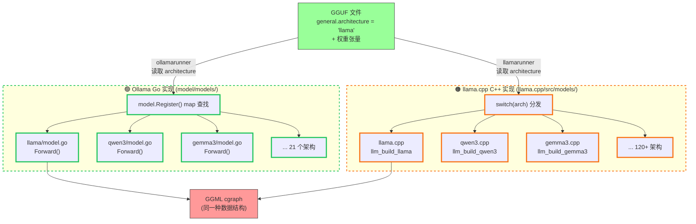
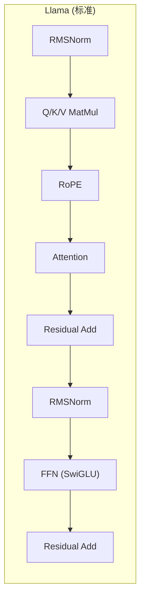
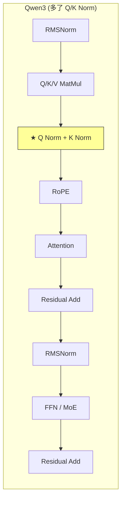
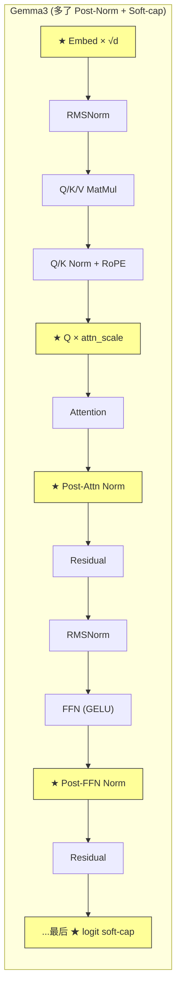

# 模型计算图构建

## 核心结论

每个模型架构都需要**专门的代码**来构建 GGML 计算图。
Ollama 和 llama.cpp **各自独立实现了一套**，使用不同语言但构建功能等价的图。

> 图例：🟢 绿色粗边框 = Ollama Go ｜ 🟠 橙色粗边框 = llama.cpp C/C++



## Ollama Go 实现

### 注册机制

```go
// model/model.go (Ollama Go) — line 101
var models = make(map[string]func(fs.Config) (Model, error))

func Register(name string, f func(fs.Config) (Model, error)) {
    models[name] = f
}

// 查找 — line 161
func modelForArch(c fs.Config) (Model, error) {
    arch := c.Architecture()  // 从 GGUF 读 "general.architecture"
    f, ok := models[arch]
    if !ok {
        return nil, ErrUnsupportedModel
    }
    return f(c)
}
```

### 各模型包的 init() 注册

```go
// model/models/llama/model.go (Ollama Go) — line 203
func init() { model.Register("llama", New) }

// model/models/qwen3/model.go (Ollama Go) — line 259
func init() {
    model.Register("qwen3", New)
    model.Register("qwen3moe", New)
    model.Register("qwen3_embed", newEmbed)
}

// model/models/gemma3/model.go (Ollama Go) — line 168
func init() {
    model.Register("gemma3", New)
    model.Register("gemma3_embed", newEmbedModel)
}
```

### 模型结构体 + 权重自动加载

权重通过 struct tag + 反射自动从 GGUF 加载：

```go
// model/models/llama/model.go (Ollama Go)
type Model struct {
    TokenEmbedding *nn.Embedding `gguf:"token_embd"`
    Layers         []Layer       `gguf:"blk"`
    OutputNorm     *nn.RMSNorm   `gguf:"output_norm"`
    Output         *nn.Linear    `gguf:"output,alt:token_embd"`
    *Options
}

type Layer struct {
    AttentionNorm *nn.RMSNorm  `gguf:"attn_norm"`
    SelfAttention *Attention
    MLPNorm       *nn.RMSNorm  `gguf:"ffn_norm"`
    MLP           *MLP
}
```

### Forward() 构图示例：Llama

```go
// model/models/llama/model.go (Ollama Go) — line 183
func (m *Model) Forward(ctx ml.Context, batch input.Batch) (ml.Tensor, error) {
    positions := ctx.Input().FromInts(batch.Positions, len(batch.Positions))
    hiddenState := m.TokenEmbedding.Forward(ctx, batch.Inputs)

    for i, layer := range m.Layers {
        m.Cache.SetLayer(i)
        var outputs ml.Tensor
        if i == len(m.Layers)-1 {
            outputs = batch.Outputs  // 最后一层才输出（优化）
        }
        hiddenState = layer.Forward(ctx, hiddenState, positions, outputs, m.Cache, &m.Options)
    }

    hiddenState = m.OutputNorm.Forward(ctx, hiddenState, m.eps)
    return m.Output.Forward(ctx, hiddenState), nil
}
```

每个 `.Forward()` 调用在底层创建 GGML 张量节点，构建计算图的 DAG 结构。

### 架构特异性示例

不同架构的差异体现在 Forward() 的细节：







## llama.cpp C++ 实现

### 架构枚举

```cpp
// llama/llama.cpp/src/llama-arch.h (llama.cpp C++) — line 12
enum llm_arch {
    LLM_ARCH_LLAMA,
    LLM_ARCH_LLAMA4,
    LLM_ARCH_QWEN2,
    LLM_ARCH_QWEN3,
    LLM_ARCH_QWEN3MOE,
    LLM_ARCH_GEMMA3,
    // ... 120+ 架构
    LLM_ARCH_UNKNOWN,
};
```

### 构图分发：巨型 switch

```cpp
// llama/llama.cpp/src/llama-model.cpp (llama.cpp C++) — line 7244
ggml_cgraph * llama_model::build_graph(const llm_graph_params & params) const {
    std::unique_ptr<llm_graph_context> llm;
    switch (arch) {
        case LLM_ARCH_LLAMA:
            llm = std::make_unique<llm_build_llama>(*this, params);
            break;
        case LLM_ARCH_QWEN3:
            llm = std::make_unique<llm_build_qwen3>(*this, params);
            break;
        case LLM_ARCH_GEMMA3:
            llm = std::make_unique<llm_build_gemma3>(*this, params);
            break;
        // ... 100+ more cases
    }
    return llm->gf;
}
```

### Builder 基类

```cpp
// llama/llama.cpp/src/llama-graph.h (llama.cpp C++) — line 550
struct llm_graph_context {
    ggml_context * ctx0 = nullptr;  // GGML 上下文
    ggml_cgraph  * gf   = nullptr;  // 计算图

    // 公共构图辅助方法
    ggml_tensor * build_inp_embd(ggml_tensor * tok_embd) const;
    ggml_tensor * build_norm(...);
    ggml_tensor * build_ffn(...);
    ggml_tensor * build_moe_ffn(...);
    ggml_tensor * build_attn(...);
};
```

### 构图示例：Llama

```cpp
// llama/llama.cpp/src/models/llama.cpp (llama.cpp C++)
llm_build_llama::llm_build_llama(const llama_model & model,
                                  const llm_graph_params & params)
    : llm_graph_context(params) {

    ggml_tensor * inpL = build_inp_embd(model.tok_embd);
    ggml_tensor * inp_pos = build_inp_pos();
    auto * inp_attn = build_attn_inp_kv();

    for (int il = 0; il < n_layer; ++il) {
        ggml_tensor * inpSA = inpL;

        // RMSNorm
        cur = build_norm(inpL, model.layers[il].attn_norm, NULL, LLM_NORM_RMS, il);

        // Q/K/V + RoPE
        ggml_tensor * Qcur = build_lora_mm(model.layers[il].wq, cur);
        ggml_tensor * Kcur = build_lora_mm(model.layers[il].wk, cur);
        ggml_tensor * Vcur = build_lora_mm(model.layers[il].wv, cur);
        // reshape...
        Qcur = ggml_rope_ext(ctx0, Qcur, inp_pos, ...);
        Kcur = ggml_rope_ext(ctx0, Kcur, inp_pos, ...);

        // Attention (可能用 flash attention)
        cur = build_attn(inp_attn, model.layers[il].wo, ...,
                         Qcur, Kcur, Vcur, ..., kq_scale, il);

        // Residual + FFN
        ggml_tensor * ffn_inp = ggml_add(ctx0, cur, inpSA);
        cur = build_norm(ffn_inp, model.layers[il].ffn_norm, NULL, LLM_NORM_RMS, il);
        cur = build_ffn(cur, ..., LLM_FFN_SILU, LLM_FFN_PAR, il);
        cur = ggml_add(ctx0, cur, ffn_inp);
        inpL = cur;
    }

    cur = build_norm(cur, model.output_norm, NULL, LLM_NORM_RMS, -1);
    cur = build_lora_mm(model.output, cur);
    ggml_build_forward_expand(gf, cur);
}
```

## 两套实现的对比

| 方面 | Ollama Go | llama.cpp C++ |
|------|-----------|---------------|
| **位置** | `model/models/<arch>/model.go` | `llama.cpp/src/models/<arch>.cpp` |
| **注册方式** | `init()` + map（动态） | enum + switch（静态编译期） |
| **架构数** | ~21 | ~120+ |
| **权重加载** | struct tag 反射 (`gguf:"attn_q"`) | 显式 tensor name 查找 |
| **构图入口** | `Forward(ctx, batch) (Tensor, error)` | constructor 直接构建 `gf` |
| **代码复用** | `nn.Attention()`, `nn.RMSNorm` 等 | `build_attn()`, `build_norm()` 等 |
| **MoE** | interface（`dense` vs `sparse`） | 分支判断 |
| **多模态** | `MultimodalProcessor` 接口 | 单独的 CLIP/Vision 模型 |
| **扩展** | 新建包 + `init()` 注册 | 新增 enum + switch case + 重新编译 |

### 为什么 Ollama 有自己的一套？

Ollama 的 Go 实现（ollamarunner）是**新引擎**，目标是逐步替代 llamarunner：
- 更好的 Go 原生集成
- 流水线化批处理（forward 和 compute 可重叠）
- 统一的 tokenizer 接口
- 目前支持 21 个架构，不支持的自动降级到 llamarunner

## Flash Attention 的选择：运行时决定

Flash attention 不是在构图时静态确定的，而是**运行时根据 GPU 能力动态选择**：

```go
// ml/nn/attention.go (Ollama Go) — line 60
if sdpa, ok := query.(ml.ScaledDotProductAttention); ok {
    // GPU 支持 → 使用 GGML_OP_FLASH_ATTN_EXT
    return sdpa.ScaledDotProductAttention(ctx, key, value, mask, ...)
}
// 降级 → 手动 Q·K^T → softmax → ·V
```

```go
// llm/server.go (Ollama Go)
fa := envconfig.FlashAttention(f.FlashAttention())
if fa && !ml.FlashAttentionSupported(gpus) {
    slog.Warn("flash attention enabled but not supported by gpu")
    fa = false
}
```
