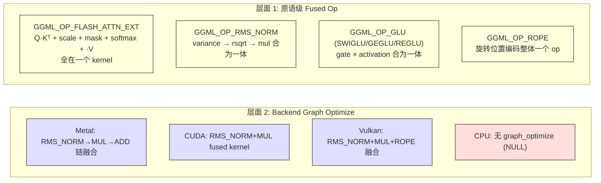

# GGML 算子融合 (Operator Fusion)

## 核心结论

GGML **没有**类似 `torch.compile` 或 TensorRT 的通用自动 fusion 编译器，也没有 JIT。
但它在**两个层面**实现了算子融合：

1. **原语级**：手写的粗粒度 fused op（如 FlashAttention、GLU）
2. **Backend 级**：GPU backend 在图执行前做 pattern matching fusion



## 层面 1：原语级 Fused Op

这些 op 在 GGML 中被定义为**单个原子操作**，而非从更小算子运行时组合。
它们由模型构图代码显式选用。

### 完整列表

| GGML Op | 融合了什么 | 定义位置 |
|---------|-----------|---------|
| `GGML_OP_FLASH_ATTN_EXT` | Q·Kᵀ, scale, softcap, mask, softmax, ·V | `ggml/include/ggml.h` **(llama.cpp C)** |
| `GGML_OP_RMS_NORM` | variance, rsqrt, multiply | 同上 |
| `GGML_OP_GLU` | gate × activation (SWIGLU/GEGLU/REGLU 等 6 种变体) | 同上 |
| `GGML_OP_ROPE` | sin/cos 计算 + 旋转 | 同上 |
| `GGML_OP_SOFT_MAX` | exp, sum, normalize | 同上 |
| `GGML_OP_RWKV_WKV6/7` | RWKV 架构特定的 fused recurrence | 同上 |
| `GGML_OP_GATED_LINEAR_ATTN` | Gated linear attention 整体 | 同上 |
| `GGML_OP_OPT_STEP_ADAMW` | 完整 AdamW 更新步 | 同上 |

### Flash Attention 实现细节

Flash Attention 是最复杂的 fused op。在 CUDA backend 有多个特化实现：

```
ggml/src/ggml-cuda/  (llama.cpp C/CUDA)
├── fattn-tile.cuh      — 分块实现
├── fattn-vec.cuh       — 向量化变体
├── fattn-mma-f16.cuh   — Tensor Core (MMA) 变体
└── fattn-wmma-f16.cu   — Warp MMA 变体
```

支持量化 K/V（Q4_0, Q5_1, Q8_0 等），使用 online softmax 和 Stream-K 并行。

### GLU 变体

```c
// ggml/include/ggml.h (llama.cpp C)
enum ggml_glu_op {
    GGML_GLU_OP_SWIGLU,       // SiLU gate
    GGML_GLU_OP_GEGLU,        // GELU gate
    GGML_GLU_OP_REGLU,        // ReLU gate
    GGML_GLU_OP_SWIGLU_OAI,   // OpenAI variant
    GGML_GLU_OP_GEGLU_ERF,    // GELU-ERF variant
    GGML_GLU_OP_GEGLU_QUICK,  // GELU-Quick variant
};
```

同时提供 `_split` 版本（`ggml_swiglu_split()` 等）允许根据硬件选择分解还是融合。

## 层面 2：Backend Graph Optimize

### 融合触发时机

融合发生在 **图拆分之后、内存分配之前、kernel 执行之前**：

> 图例：🟢 绿色 = Ollama Go 代码 ｜ 🟠 橙色 = llama.cpp C/C++ 代码

```mermaid
sequenceDiagram
    participant App as 🟢 应用代码 (Go)
    participant Sched as 🟠 GGML Scheduler<br/>(ggml-backend.cpp)
    participant Opt as 🟠 Backend graph_optimize
    participant GPU as 🟠 GPU Kernels

    App->>Sched: ggml_backend_sched_graph_compute_async(graph)
    Sched->>Sched: split_graph()<br/>按 backend 拆分图
    
    loop 对每个 split
        Sched->>Opt: ggml_backend_graph_optimize(backend, &split.graph)
        Note over Opt: Pattern match + 标记 fused 节点
        Opt-->>Sched: 返回优化后的 split 图
    end
    
    Sched->>Sched: alloc_splits()<br/>为优化后的图分配内存
    
    loop 对每个 split
        Sched->>GPU: graph_compute_async(split.graph)
        Note over GPU: 执行 fused kernels
    end
```

### 调用入口

```c
// ggml/src/ggml-backend.cpp (llama.cpp C) — line 491
static void ggml_backend_graph_optimize(
    ggml_backend_t backend, 
    struct ggml_cgraph * cgraph) {
    if (backend->iface.graph_optimize != NULL) {
        backend->iface.graph_optimize(backend, cgraph);
    }
}
```

### 融合验证基础设施

```c
// ggml/src/ggml-impl.h (llama.cpp C) — line 608
// 检查连续节点是否可融合：
//   - 所有节点的 op 匹配预期模式
//   - 中间节点只有 1 个消费者
//   - 每个节点是下一个节点的 src
//   - 所有节点形状相同
bool ggml_can_fuse(ggml_cgraph * cgraph, int node_idx, ...);
bool ggml_can_fuse_ext(ggml_cgraph * cgraph, int node_idx, ...);
```

### 各 Backend 的融合实现

#### Metal Backend（最成熟）

```
ggml/src/ggml-metal/ggml-metal-common.cpp (llama.cpp C) — line 364
  └→ ggml_graph_optimize()
       ├→ 融合检测: ADD/NORM/RMS_NORM 开头的链
       │   RMS_NORM → MUL → ADD  →  单个 fused kernel
       │   ADD → ADD → ADD       →  kernel_add_fuse_N
       └→ 节点重排: ggml_metal_graph_optimize_reorder()
            最大化无依赖操作的并发执行
```

| 融合模式 | Fused Kernel 名 |
|----------|----------------|
| ADD × N | `kernel_add_fuse_2`, `kernel_add_fuse_3`, ... |
| RMS_NORM + MUL | `kernel_rms_norm_fuse_2` |
| RMS_NORM + MUL + ADD | `kernel_rms_norm_fuse_3` |
| NORM + MUL + ADD | `kernel_norm_fuse_N` |

环境变量：`GGML_METAL_FUSION_DISABLE`（关闭），`GGML_METAL_DEBUG_FUSION`（调试日志）

#### CUDA Backend

```
ggml/src/ggml-cuda/ggml-cuda.cu (llama.cpp C/CUDA)
  └→ ggml_backend_cuda_graph_optimize()  [需 GGML_CUDA_GRAPH_OPT=1]
```

| 融合模式 | 实现 |
|----------|-----|
| RMS_NORM + MUL | `ggml_cuda_op_rms_norm_fused()` |
| RMS_NORM + MUL + ADD | `ggml_cuda_op_rms_norm_fused_add()` |
| MUL_MAT + MUL_MAT + GLU | FFN gate+up fused dispatch |
| ROPE + VIEW + SET_ROWS | 单个 kernel |
| 多个 ADD | `ggml_cuda_op_fused_add()` |
| TopK MoE | SOFT_MAX + RESHAPE + ARGSORT + VIEW + GET_ROWS |

#### Vulkan Backend

```
ggml/src/ggml-vulkan/ggml-vulkan.cpp (llama.cpp C/Vulkan)
  └→ ggml_vk_graph_optimize()  [可通过 GGML_VK_DISABLE_GRAPH_OPTIMIZE 关闭]
```

| 融合模式 | Pipeline 名 |
|----------|------------|
| RMS_NORM + MUL + ROPE + VIEW + SET_ROWS | 5-op fusion |
| ROPE + VIEW + SET_ROWS | 3-op fusion |
| RMS_NORM + MUL + ROPE | `pipeline_rms_norm_mul_rope_f32_f32` |
| 多个 ADD | 最多 9 个连续 ADD |
| TopK MoE | 多种变体 |

#### CPU Backend

```c
// CPU backend 的 graph_optimize = NULL
// 不做任何图级别融合
```

## 为什么不做激进的自动 Fusion？

来自 llama.cpp 贡献者 **ikawrakow**（issue #3124）的分析：

> 对于 7B 模型在 M2 Max 上，即使消除**所有**非 matmul 操作，  
> 理论加速也只有 ~1.27x。  
> LLM 推理被矩阵乘法主导（memory bandwidth bound），  
> fusion 的实际收益可能只有几个百分点。

GGML 的策略是**务实的**：
1. 把已知重要的 pattern 做成 fused primitive（FlashAttention、GLU、RMSNorm）
2. 各 GPU backend 针对自己的特性做有限的 pattern matching
3. 不搞通用编译器，因为 ROI 不够

## 与 PyTorch 的对比

| 方面 | GGML | PyTorch torch.compile / TensorRT |
|------|------|----------------------------------|
| 自动融合 | 无通用 auto-fusion | 编译器驱动 |
| 融合方式 | 手写 fused op + backend pattern matching | 图分析 + 代码生成 |
| JIT | 无 | 有（Triton/TorchInductor） |
| Kernel | 全部预编译（CUDA .cu / Metal .metal / Vulkan SPIR-V） | 可动态生成 |
| Flash Attention | 单个 fused GGML_OP | 也是 fused（FlashAttention 库） |
