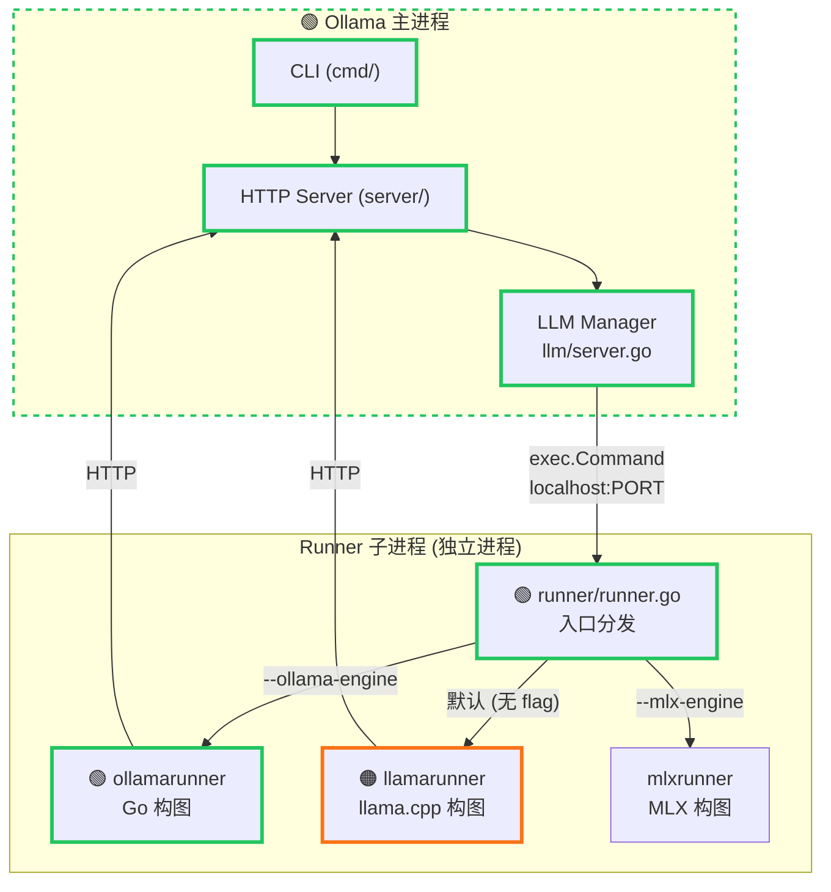
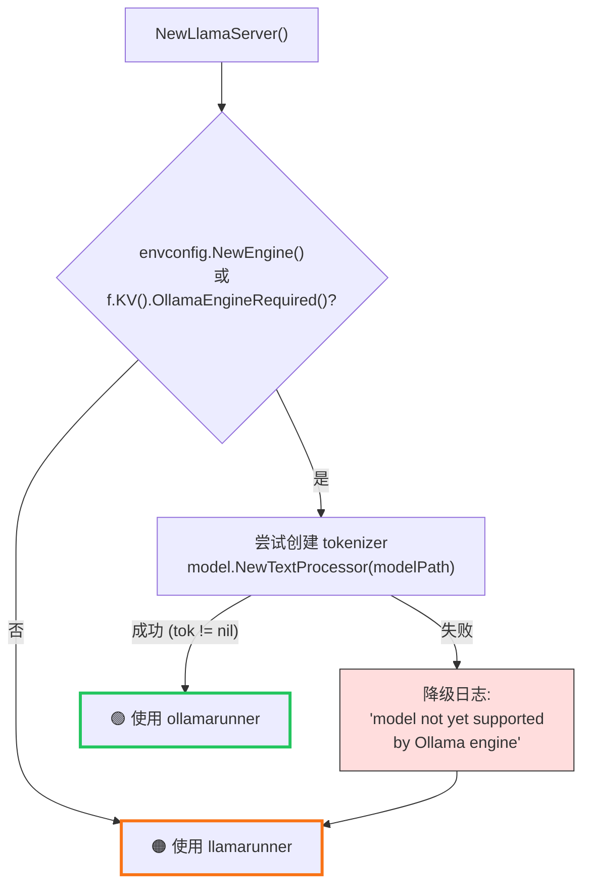
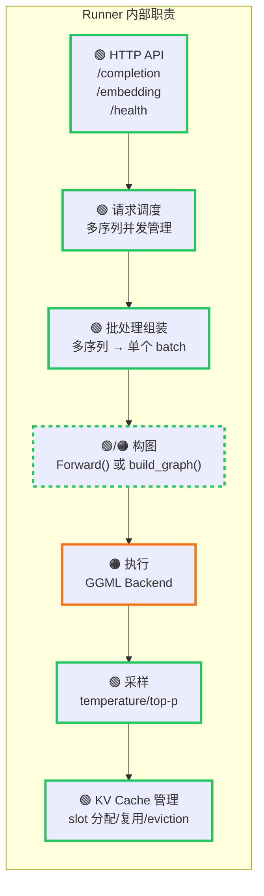
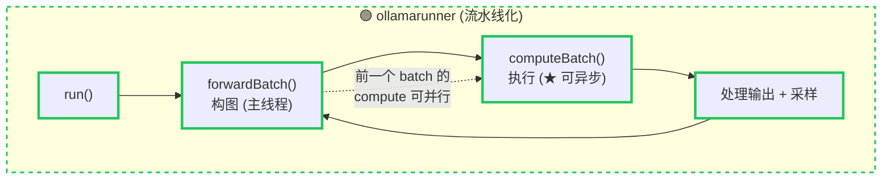
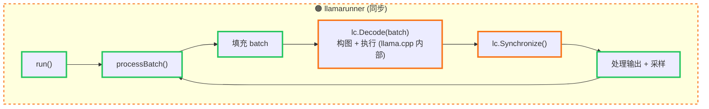
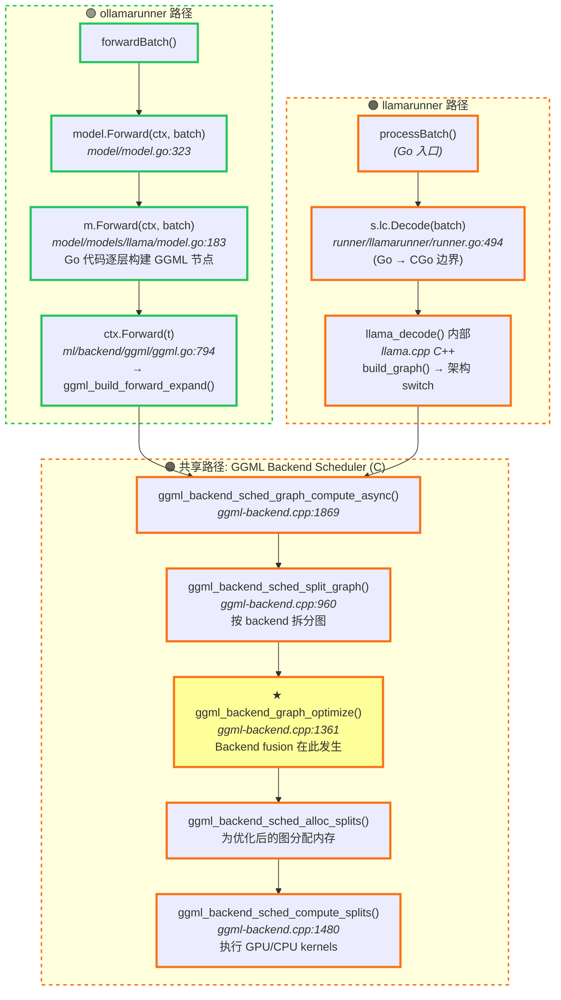

# Runner 架构

## 概览

Runner 是独立的**子进程**，由 Ollama 主服务器通过 `exec.Command` 启动，通过 localhost HTTP 通信。
有三种 runner：`ollamarunner`（新引擎）、`llamarunner`（llama.cpp）、`mlxrunner`（MLX）。

> 图例：🟢 绿色粗边框 = Ollama Go ｜ 🟠 橙色粗边框 = llama.cpp C/C++



## Runner 选择逻辑

### 决策点：`llm/server.go` (Ollama Go)



### 关键代码

```go
// llm/server.go (Ollama Go) — line 143
if envconfig.NewEngine() || f.KV().OllamaEngineRequired() {
    if len(projectors) == 0 {
        tok, err = model.NewTextProcessor(modelPath)
    } else {
        err = errors.New("split vision models aren't supported")
    }
    if err != nil {
        slog.Debug("model not yet supported by Ollama engine, switching to compatibility mode")
    }
}

// ... 启动子进程 ...

// 分叉点 — line 315
if tok != nil {
    return &ollamaServer{llmServer: s, tokenizer: tok}, nil   // → ollamarunner
} else {
    return &llamaServer{llmServer: s, ggml: f}, nil           // → llamarunner
}
```

### 子进程启动

```go
// llm/server.go (Ollama Go) — line 346
params := []string{"runner"}
if ollamaEngine {
    params = append(params, "--ollama-engine")  // 关键 flag
}
// ... 添加模型路径、GPU 参数 ...
cmd := exec.Command(exe, params...)
```

### 子进程入口分发

```go
// runner/runner.go (Ollama Go) — line 10
func Execute(args []string) error {
    switch args[0] {
    case "--ollama-engine":   return ollamarunner.Execute(args[1:])
    case "--imagegen-engine": return imagegen.Execute(args[1:])
    case "--mlx-engine":      return mlxrunner.Execute(args[1:])
    }
    return llamarunner.Execute(args)  // 默认
}
```

## Runner 职责

每个 runner 是一个**完整的推理服务器**：



## ollamarunner vs llamarunner 详细对比

### 主循环





### 核心差异

| 方面 | ollamarunner | llamarunner |
|------|-------------|-------------|
| **构图语言** | Go（调 GGML C API via CGo） | C++（llama.cpp 内部） |
| **模型抽象** | `model.Model` 接口 | `*llama.Model`（CGo 绑定） |
| **构图入口** | `model.Forward(ctx, batch)` | `lc.Decode(batch)` |
| **批处理** | **流水线化**（forward 和 compute 可重叠） | 同步顺序执行 |
| **Tokenizer** | Go 实现的通用 tokenizer | llama.cpp 内置 |
| **采样** | `sample.Sampler`（Go） | llama.cpp `SamplingContext` |
| **多模态** | `MultimodalProcessor` 接口 | `ImageContext`（llava 风格） |
| **支持架构数** | ~21（不支持的降级到 llamarunner） | ~120+（全量） |

## 从构图到执行的完整调用链

**两个 runner 最终都走到同一个 GGML backend scheduler**：



### 时序细节

| 阶段 | ollamarunner | llamarunner | graph_optimize? |
|------|-------------|-------------|----------------|
| 1. 组装 batch | Go 代码 | Go 代码 | - |
| 2. 构图 | Go `Forward()` 逐层构建 | C++ `build_graph()` | - |
| 3. 触发执行 | `ComputeWithNotify()` (可异步) | `Decode()` → `Synchronize()` | - |
| 4. 图拆分 | `split_graph()` | `split_graph()` | - |
| 5. **Backend 融合** | `graph_optimize()` | `graph_optimize()` | **★ 在这里** |
| 6. 内存分配 | `alloc_splits()` | `alloc_splits()` | - |
| 7. Kernel 执行 | `compute_splits()` | `compute_splits()` | - |

> **关键结论**：步骤 4-7 是**完全相同的 C 代码路径**（`ggml-backend.cpp`）。
> 两个 runner 的区别仅在步骤 1-3（构图方式不同），backend fusion 对两者一视同仁。

## 通信协议

Runner 通过 HTTP JSON API 暴露服务：

| 端点 | 用途 |
|------|------|
| `POST /load` | 加载模型 |
| `POST /completion` | 文本生成（流式 SSE） |
| `POST /embedding` | 向量嵌入 |
| `GET /health` | 健康检查 + 进度 |

主进程通过 `llmServer` 封装 HTTP 客户端与 runner 通信。
