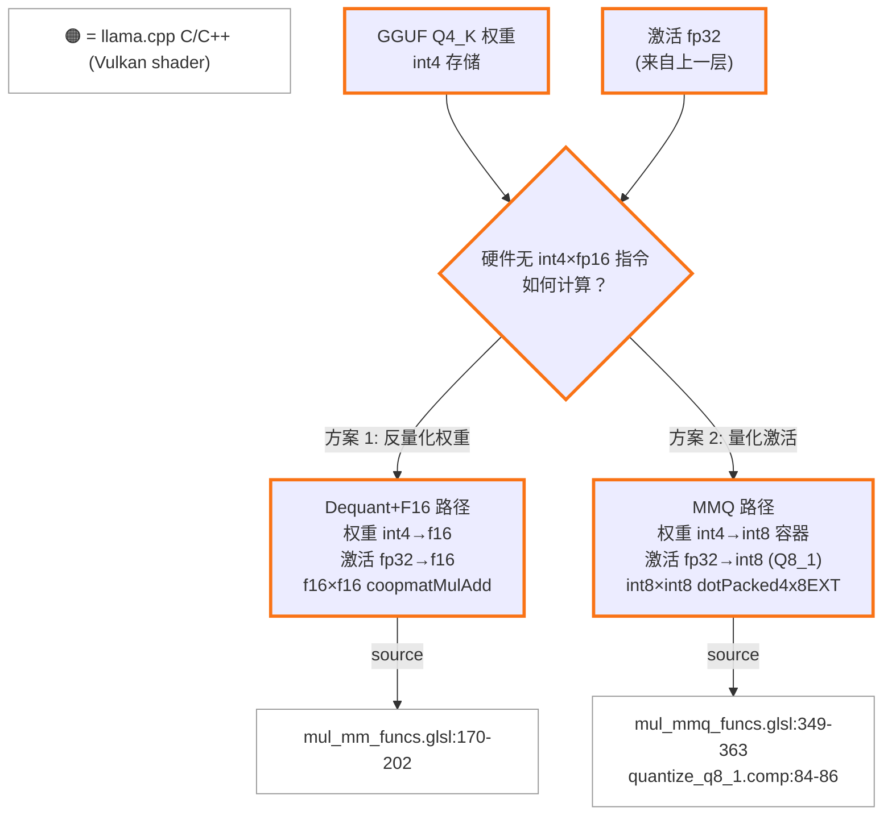
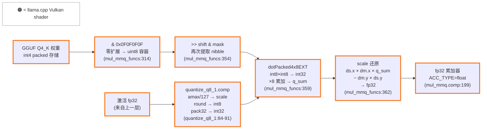
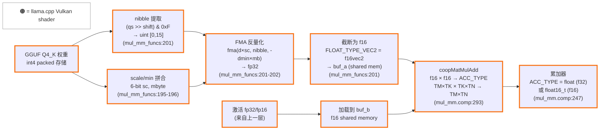
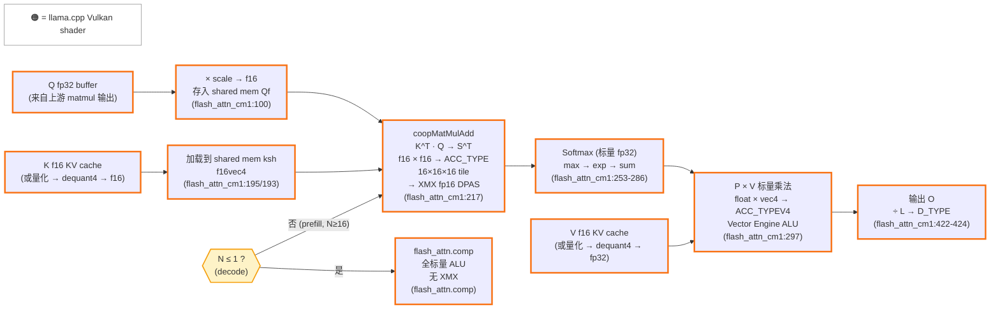
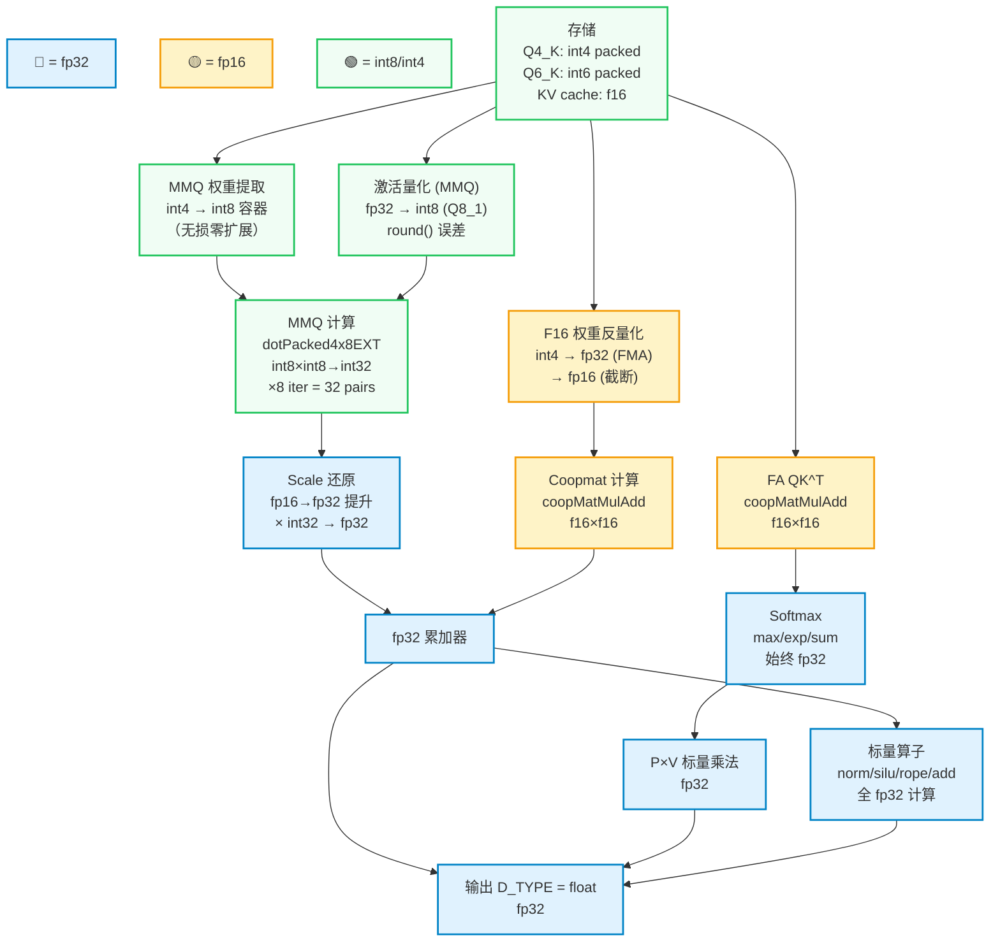

# Intel Xe2 量化计算审计：Q4_K_M 模型在 ggml Vulkan 后端的计算路径

| 项目 | 内容 |
|------|------|
| **日期** | 2026-04-08 |
| **目标读者** | 熟悉 XMX/DPAS 的 Intel 内部工程师 |
| **范围** | Q4_K_M 量化模型在 ggml Vulkan 后端的 matmul 计算路径（含 Flash Attention） |
| **代码基线** | Ollama `daop-investigate` 分支，llama.cpp vendored at `ml/backend/ggml/ggml/` |
| **前提假设** | `OLLAMA_FLASH_ATTENTION=1` |

---

## 目录

- [Section 0: 前置概念 — W4A16 与量化计算范式](#section-0-前置概念--w4a16-与量化计算范式)
- Section 1: 总结表 (TODO)
- Section 2: 计算路径详解 (TODO)
  - 2.1 MMQ 路径
  - 2.2 Dequant+F16 Coopmat 路径
  - 2.3 Flash Attention Coopmat 路径
  - 2.4 运行时路径确认
- Section 3: 推理 Walkthrough (TODO)
- Section 4: 精度细节 (TODO)

---

## Section 0: 前置概念 — W4A16 与量化计算范式

GGUF 格式的量化模型（如 Q4_K_M）属于 **weight-only post-training quantization (PTQ)**：仅权重被离线量化为低精度（4-bit），而激活值（activation）在推理时始终以 fp32/fp16 全精度流动。这种范式在业界通常记作 **W4A16**（4-bit weights, 16-bit activations）。与 W8A8 等 weight-and-activation 量化方案不同，W4A16 保留了激活的全精度，因此不需要校准数据集（calibration dataset），可直接对预训练权重进行量化。

W4A16 带来一个根本性矛盾：**硬件没有 int4 × fp16 的原生指令**。GPU 的整数单元（如 Xe2 的 `OpSDotKHR` / DPAS int8 模式）要求两边都是整数；浮点矩阵单元（如 XMX fp16 模式 / `coopmatMulAdd`）要求两边都是浮点。因此，4-bit 整数权重与 fp16 浮点激活之间的 matmul 必须先做一次类型对齐。

ggml Vulkan 后端为此提供了两条路径：

1. **Dequant+F16 路径**（`mul_mm_funcs.glsl`）：将 int4 权重完全反量化为 f16，与 f16 激活一起送入 `coopmatMulAdd`（cooperative matrix，映射到 XMX fp16 管线）。权重在 shared memory 中被逐元素解包并乘以 scale/min，转为 `FLOAT_TYPE_VEC2`（即 f16vec2）存储 (source: `mul_mm_funcs.glsl:170-202`，Q4_K 分支)。

2. **MMQ 路径**（`mul_mmq_funcs.glsl`）：将权重保持在整数域（int4 → int8 容器），同时将 fp32 激活在运行时量化为 Q8_1（int8 + scale + weighted sum）。这一量化由专用 compute shader `quantize_q8_1.comp` 完成：对每 32 个 fp32 值找 absmax，除以 127 得到 scale，再 round 到 int8 (source: `quantize_q8_1.comp:84-86`)。之后，int8 权重与 int8 激活通过 `dotPacked4x8EXT`（映射到 `OpSDotKHR`，即 Xe2 的 DP4A 指令）执行 4 路 packed int8 dot product (source: `mul_mmq_funcs.glsl:359`)。这条路径本质上将 W4A16 转化为 **W4A8**（或更准确地说，int8 容器内的 int4×int8）。



这两条路径在性能特征上有本质差异：Dequant+F16 利用 XMX fp16 吞吐但需要反量化开销和更多 shared memory；MMQ 利用整数 dot product 单元，避免反量化但引入了激活量化开销和额外的精度损失（fp32→int8 round）。后续章节将详细分析每条路径在 Xe2 上的具体 shader 实现与硬件映射。

---

## Section 2: 计算路径详解

### 2.1 MMQ 路径（Integer Dot Product）

MMQ（Matrix Multiply Quantized）是 Q4_K_M 在 Xe2 上的**首选 matmul 路径**。其核心思路：将 W4A16 问题转化为 int8×int8 dot product，利用 `VK_KHR_shader_integer_dot_product` 扩展暴露的 `dotPacked4x8EXT`（SPIR-V `OpSDotKHR`）指令，在硬件整数管线上执行。

#### 2.1.1 触发条件

MMQ 路径的启用需要三层条件同时满足：

**① 编译期：GLSL 编译器支持**

CMake 构建时通过 `test_shader_extension_support` 测试当前 GLSL 编译器（glslangValidator 或 glslc）是否支持 `GL_EXT_integer_dot_product` 扩展。通过则定义 `GGML_VULKAN_INTEGER_DOT_GLSLC_SUPPORT` 宏 (source: `ggml-vulkan/CMakeLists.txt:77-81`)。

所有 MMQ pipeline 的创建代码均包裹在此宏的 `#if` 块内：

```cpp
#if defined(GGML_VULKAN_INTEGER_DOT_GLSLC_SUPPORT)
    if (device->integer_dot_product) {
        CREATE_MMQ(GGML_TYPE_Q4_K, pipeline_dequant_mul_mat_mat_q8_1[GGML_TYPE_Q4_K], ...);
        CREATE_MMQ(GGML_TYPE_Q6_K, pipeline_dequant_mul_mat_mat_q8_1[GGML_TYPE_Q6_K], ...);
        // ... 其他量化类型
    }
#endif
```
(source: `ggml-vulkan.cpp:3283-3297`)

shader 生成侧同理——MMQ shader 仅在 `!f16acc && !coopmat && !coopmat2` 且编译器支持时生成，注释明确写道 "Integer dot mmq performs better with f32 accumulators" (source: `vulkan-shaders-gen.cpp:588-592`)。

**② 运行期：硬件能力查询**

设备初始化时，检查 Vulkan 扩展列表是否包含 `VK_KHR_shader_integer_dot_product`，同时检查环境变量 `GGML_VK_DISABLE_INTEGER_DOT_PRODUCT` 是否被设置（用于调试禁用）：

```cpp
} else if (strcmp("VK_KHR_shader_integer_dot_product", properties.extensionName) == 0 &&
           !getenv("GGML_VK_DISABLE_INTEGER_DOT_PRODUCT")) {
    device->integer_dot_product = true;
```
(source: `ggml-vulkan.cpp:4326-4329`)

随后进一步验证硬件确实对 4×8-bit packed signed dot product 有加速支持：

```cpp
device->integer_dot_product = device->integer_dot_product
    && shader_integer_dot_product_props.integerDotProduct4x8BitPackedSignedAccelerated;
```
(source: `ggml-vulkan.cpp:4478`)

`integerDotProduct4x8BitPackedSignedAccelerated == VK_TRUE` 表示驱动声明此操作有硬件加速（而非软件模拟）。Xe2 驱动对此返回 `VK_TRUE`。

**③ 运行期：MUL_MAT 路径选择优先级**

在 `ggml_vk_mul_mat_mat` 中，MMQ 被**优先**于 Dequant+F16 尝试：

```cpp
bool quantize_y = ctx->device->integer_dot_product && src1->type == GGML_TYPE_F32
    && ggml_is_contiguous(src1) && !y_non_contig && (ne11 * ne10) % 4 == 0;

// Check for mmq first
vk_matmul_pipeline mmp = quantize_y
    ? ggml_vk_get_mul_mat_mat_pipeline(ctx, src0->type, GGML_TYPE_Q8_1, ...)
    : nullptr;

if (mmp == nullptr) {
    // Fall back to f16 dequant mul mat
    mmp = ggml_vk_get_mul_mat_mat_pipeline(ctx, src0->type, ...);
    quantize_y = false;
}
```
(source: `ggml-vulkan.cpp:6722-6730`)

`ggml_vk_get_mul_mat_mat_pipeline` 对 `src1_type == GGML_TYPE_Q8_1` 的情况，查找 `pipeline_dequant_mul_mat_mat_q8_1[src0_type].f32acc` 并返回 (source: `ggml-vulkan.cpp:5457-5466`)。若该 pipeline 存在（编译期+运行期条件均满足），则使用 MMQ 路径；否则 fallback 到 Dequant+F16。

#### 2.1.2 数据流详解

##### Step 1: 激活量化 — fp32 → Q8_1 (quantize_q8_1.comp)

激活值（activation）从上一层以 fp32 到达。MMQ 路径需要将其量化为 Q8_1 格式（int8 + fp16 scale + fp16 weighted sum），由专用 compute shader `quantize_q8_1.comp` 完成。

每个 block 包含 32 个 fp32 值（由 8 个线程处理，每线程 1 个 vec4）：

1. **求 absmax**：每线程取 4 个绝对值的最大值，然后跨 8 线程归约（shared memory 或 subgroup clustered max）(source: `quantize_q8_1.comp:65-82`)

2. **计算 scale**：`d = amax / 127.0` (source: `quantize_q8_1.comp:84`)

3. **量化为 int8**：`vals = round(vals * d_inv)`，其中 `d_inv = 1.0 / d`（若 d == 0 则 d_inv = 0）(source: `quantize_q8_1.comp:85-86`)

4. **Pack 为 int32**：`pack32(i8vec4(round(vals)))` — 4 个 int8 打包为 1 个 int32 (source: `quantize_q8_1.comp:89-91`)

5. **存储 scale 和 weighted sum**：`ds = f16vec2(d, sum * d)`，其中 `sum` 是量化后所有 int8 值之和。`ds.y = sum * d` 即 weighted sum，用于后续 bias 校正 (source: `quantize_q8_1.comp:118-120`)

> **精度影响**：fp32 → int8 的 round 操作引入量化误差。对于 absmax = A 的 block，量化分辨率为 A/127，最大单元素误差为 A/254。

##### Step 2: 权重提取 — Q4_K int4 → int8 容器 (mul_mmq_funcs.glsl)

Q4_K 权重在 GGUF 文件中以 4-bit 存储，每个 super-block (256 个权重) 包含：打包的 4-bit quants、6-bit scales/mins、fp16 全局 d/dmin。

**Shared memory 加载** (`block_a_to_shmem`, source: `mul_mmq_funcs.glsl:305-339`)：

从 GPU 全局内存中读取 Q4_K 数据，提取 4-bit 值并重新打包：
```glsl
const uint32_t vals0 = (data_a_packed32[ib_k].qs[qs_idx    ] >> qs_shift) & 0x0F0F0F0F;
const uint32_t vals1 = (data_a_packed32[ib_k].qs[qs_idx + 1] >> qs_shift) & 0x0F0F0F0F;
buf_a[buf_ib].qs[iqs] = vals0 | (vals1 << 4);
```
(source: `mul_mmq_funcs.glsl:314-317`)

每个 int32 中的 4 字节各自通过 `& 0x0F0F0F0F` 掩码提取低 4-bit nibble，结果为 uint8 范围 [0, 15]（零扩展到 int8 容器中）。

同时计算 per-sub-block scale：将全局 `dm`（fp16 d 和 dmin）与 6-bit scale/min 相乘，存为 `FLOAT_TYPE_VEC2` (source: `mul_mmq_funcs.glsl:326-338`)。

**关键要点**：权重始终保持在整数域，**没有反量化为浮点**。

##### Step 3: 寄存器缓存加载

从 shared memory 到寄存器的传输（`block_a_to_registers` / `block_b_to_registers`）是简单的拷贝操作 (source: `mul_mmq_funcs.glsl:341-347`, `449-454`)。

##### Step 4: Dot Product — dotPacked4x8EXT (int8 × int8 → int32)

Q4_K 的 `mmq_dot_product` 函数 (source: `mul_mmq_funcs.glsl:349-363`)：

```glsl
ACC_TYPE mmq_dot_product(const uint ib_a) {
    int32_t q_sum = 0;

    [[unroll]] for (uint iqs = 0; iqs < 8; iqs++) {
        const int32_t qs_a = int32_t((cache_a[ib_a].qs[iqs / 2] >> ((iqs % 2) * 4))
                                     & 0x0F0F0F0F);
        q_sum += dotPacked4x8EXT(qs_a, cache_b.qs[iqs]);
    }

    return ACC_TYPE(float(cache_b.ds.x) * float(cache_a[ib_a].dm.x) * float(q_sum)
                  - float(cache_a[ib_a].dm.y) * float(cache_b.ds.y));
}
```

逐步拆解：

1. **权重 nibble 提取**：`(cache_a[ib_a].qs[iqs / 2] >> ((iqs % 2) * 4)) & 0x0F0F0F0F` — 从 shared memory 中已打包的 8-bit 对中再次提取 4-bit nibble，得到 4 个 uint8 值（范围 [0, 15]）packed 在一个 int32 中

2. **Packed dot product**：`dotPacked4x8EXT(qs_a, cache_b.qs[iqs])` — 将 qs_a 中 4 个 int8 与 cache_b（Q8_1 激活）中对应 4 个 int8 做点积，结果为单个 int32。循环 8 次累加到 `q_sum`

3. **Scale 还原**：`cache_b.ds.x`（Q8_1 的 d，fp16）× `cache_a[ib_a].dm.x`（Q4_K 的 d × scale，fp16）× `q_sum`（int32 → float 转换）

4. **Bias 校正**：减去 `cache_a[ib_a].dm.y`（Q4_K 的 dmin × min）× `cache_b.ds.y`（Q8_1 的 weighted sum）。这一项补偿 Q4_K 的 zero-point（min）偏移

5. **累加**：`ACC_TYPE = float`（fp32 累加器），在 `mul_mmq.comp` 主循环中累加到 `sums[]` 数组 (source: `mul_mmq.comp:199-259`)

##### 完整精度流水线图



#### 2.1.3 Q6_K 的 MMQ 路径

Q6_K（6-bit 量化）同样被注册到 MMQ pipeline (source: `ggml-vulkan.cpp:3297`)，使用相同的 `mul_mmq.comp` 框架但有不同的 `mmq_dot_product` 实现。

**Q6_K 与 Q4_K 的差异：**

| 方面 | Q4_K | Q6_K |
|------|------|------|
| **weight 提取** | `& 0x0F0F0F0F` 掩码取 4-bit | 6-bit = 4-bit ql + 2-bit qh，需组合并减 32 偏移 (source: `mul_mmq_funcs.glsl:378-382`) |
| **scale 结构** | 2-element `dm` (d×scale, dmin×min) | 2-element `d_scales` (d×scale[0], d×scale[1]) (source: `mul_mmq_funcs.glsl:386-388`) |
| **dot product** | 单循环 8 次，统一 q_sum | 分两段（iqs 0-3, 4-7），各自累加后乘不同 scale (source: `mul_mmq_funcs.glsl:400-420`) |
| **bias 项** | `dm.y × ds.y`（min 偏移校正） | 无独立 bias 项（Q6_K 权重已减 32 居中） |

Q6_K 的 `mmq_dot_product` (source: `mul_mmq_funcs.glsl:400-420`)：
```glsl
ACC_TYPE mmq_dot_product(const uint ib_a) {
    float result = 0.0;
    int32_t q_sum = 0;

    [[unroll]] for (uint iqs = 0; iqs < 4; iqs++) {
        q_sum += dotPacked4x8EXT(cache_a[ib_a].qs[iqs], cache_b.qs[iqs]);
    }
    result += float(cache_a[ib_a].d_scales[0]) * float(q_sum);
    q_sum = 0;

    [[unroll]] for (uint iqs = 4; iqs < 8; iqs++) {
        q_sum += dotPacked4x8EXT(cache_a[ib_a].qs[iqs], cache_b.qs[iqs]);
    }
    result += float(cache_a[ib_a].d_scales[1]) * float(q_sum);

    return ACC_TYPE(float(cache_b.ds.x) * result);
}
```

两种量化类型都通过 `dotPacked4x8EXT` 执行核心计算，区别仅在 scale 结构和 bias 处理。

#### 2.1.4 XMX 硬件映射

`dotPacked4x8EXT` 对应 SPIR-V 指令 `OpSDotKHR`（signed dot product of 4×8-bit packed integers）。Xe2 驱动对 `integerDotProduct4x8BitPackedSignedAccelerated` 返回 `VK_TRUE`，表明此操作有硬件加速。

在 Intel Xe2 架构中，每个 Xe-core 包含 Vector Engine（ALU）和 Matrix Engine（XMX）。`OpSDotKHR` 的 4×8-bit packed dot product 属于整数 SIMD 操作，其硬件映射存在两种可能：

- **Vector Engine DP4A 路径**：EU 的 ALU 管线支持 DP4A（Dot Product of 4 × int8 Accumulate）指令，在标量管线上执行
- **XMX DPAS int8 路径**：XMX 系统阵列的 DPAS（Data-Parallel Accumulate & Sum）指令支持 int8 模式

> ⚠️ **待确认**：`OpSDotKHR` 在 Xe2 上具体映射到 DP4A（Vector Engine）还是 DPAS int8（XMX Matrix Engine），取决于 Intel Vulkan 驱动的 JIT 编译策略。公开文档未明确说明此映射关系。无论哪种路径，`integerDotProduct4x8BitPackedSignedAccelerated == VK_TRUE` 确认了硬件加速的存在。但如果映射到 Vector Engine 而非 XMX，则 MMQ 路径实际上**未利用系统阵列**，性能天花板会低于 coopmat 路径。

#### 2.1.5 Q8_1 block_b 数据布局

激活侧量化完成后，Q8_1 数据在 MMQ shader 中的加载逻辑 (source: `mul_mmq_funcs.glsl:423-454`)：

```glsl
void block_b_to_shmem(const uint buf_ib, const uint ib, const uint iqs, const bool is_in_bounds) {
    if (is_in_bounds) {
        const uint ib_outer = ib / 4;
        const uint ib_inner = ib % 4;
        if (iqs == 0) {
            buf_b[buf_ib].ds = FLOAT_TYPE_VEC2(data_b[ib_outer].ds[ib_inner]);
        }
        const ivec4 values = data_b[ib_outer].qs[ib_inner * 2 + iqs];
        buf_b[buf_ib].qs[iqs * 4    ] = values.x;
        // ... (4 个 int32 展开存储)
    }
}
```

Q8_1 数据以 `block_q8_1_x4_packed128` 格式存储（4 个 Q8_1 block 打包），每个 block 包含 8 个 int32（32 个 int8 packed）和 1 个 f16vec2（d, sum×d）。加载到 shared memory 后展开为独立的 `block_b_cache` 结构。

#### 2.1.6 小结

MMQ 路径的核心特征：

| 属性 | 值 |
|------|-----|
| **路径选择优先级** | 最高（先于 coopmat/dequant） |
| **权重精度** | int4 → int8 容器（零扩展，不反量化） |
| **激活精度** | fp32 → int8（运行时 Q8_1 量化） |
| **计算指令** | `dotPacked4x8EXT` = `OpSDotKHR` |
| **累加精度** | fp32（`ACC_TYPE=float`） |
| **Scale 还原** | fp16 → fp32（Q4_K: d×scale + dmin×min bias；Q6_K: d×scale 分段） |
| **硬件单元** | 整数加速（DP4A 或 DPAS int8） ⚠️ 待确认具体单元 |
| **支持的量化类型** | Q4_0, Q4_1, Q5_0, Q5_1, Q8_0, Q2_K, Q3_K, Q4_K, Q5_K, Q6_K, MXFP4 |
| **禁用方式** | `export GGML_VK_DISABLE_INTEGER_DOT_PRODUCT=1` |

### 2.2 Dequant+F16 KHR Coopmat 路径（Cooperative Matrix）

> **优先级说明**：Q4_K 在 Xe2 上正常走 MMQ 路径（Section 2.1）。本节描述的 Dequant+F16 路径是 **fallback / 对比路径**，仅在 MMQ 不可用时（如设置 `GGML_VK_DISABLE_INTEGER_DOT_PRODUCT=1`）生效。

#### 2.2.1 触发条件与 Fallback 链

**Xe2 使用 KHR coopmat（coopmat1），而非 NV coopmat2。**

`coopmat2` 标志要求设备支持 `VK_NV_cooperative_matrix2` 扩展 (source: `ggml-vulkan.cpp:4322-4324`)，这是 NVIDIA 专有扩展，Intel Xe2 不具备。因此 `device->coopmat2 == false`。

Xe2 的 coopmat 启用路径：

1. **扩展检测**：设备枚举到 `VK_KHR_cooperative_matrix` 且未设置 `GGML_VK_DISABLE_COOPMAT` 环境变量 → `device->coopmat_support = true` (source: `ggml-vulkan.cpp:4314-4316`)

2. **架构白名单**：`ggml_vk_khr_cooperative_matrix_support()` 对 Intel 设备仅允许 `INTEL_XE2` 架构 (source: `ggml-vulkan.cpp:14686-14691`)。不满足则覆盖为 `device->coopmat_support = false` (source: `ggml-vulkan.cpp:4474-4476`)

3. **Coopmat 维度查询**：通过 `vkGetPhysicalDeviceCooperativeMatrixPropertiesKHR` 运行时查询支持的矩阵尺寸（M, N, K），要求 A/B 类型为 `Float16`，scope 为 `Subgroup` (source: `ggml-vulkan.cpp:4759-4804`)。代码分别检查 f32 累加和 f16 累加两种变体，记录第一个匹配的 (M, N, K) 尺寸到 `device->coopmat_m/n/k`。若无匹配或不支持 f32 累加，则禁用 coopmat (source: `ggml-vulkan.cpp:4838-4841`)

> ⚠️ **待确认**：Xe2 驱动实际报告的 coopmat (M, N, K) 尺寸。根据 XMX fp16 规格，预期为 (M=16, N=16, K=16) 或类似值，但需实机验证。

**Pipeline 选择 fallback 链** (`ggml_vk_get_mul_mat_mat_pipeline`, source: `ggml-vulkan.cpp:5498-5505`)：

```
if (device->coopmat2)           → pipeline_dequant_mul_mat_mat_f16[type]  (NV coopmat2, 不适用于 Xe2)
else if (device->coopmat_support) → pipeline_dequant_mul_mat_mat[type]     (KHR coopmat1, ✅ Xe2 走这里)
else                              → pipeline_dequant_mul_mat_mat[type]     (标量/SIMD fallback)
```

对于 Xe2（`coopmat_support == true, coopmat2 == false`），走第二分支。精度选择：若 `device->fp16 && device->coopmat_acc_f16_support && prec == GGML_PREC_DEFAULT`，用 f16 累加器；否则用 f32 累加器 (source: `ggml-vulkan.cpp:5502-5503`)。

**但注意**：在 `ggml_vk_mul_mat_mat` 中，MMQ 被**优先**尝试 (source: `ggml-vulkan.cpp:6722-6730`)。只有当 MMQ pipeline 返回 `nullptr`（如 `integer_dot_product == false`）时，才 fall back 到此 Dequant+F16 coopmat 路径。

#### 2.2.2 Shader 生成

Coopmat1 变体在 `vulkan-shaders-gen.cpp` 的 `process_shaders()` 中生成 (source: `vulkan-shaders-gen.cpp:611-614`)：

```cpp
// Coopmat, fp32acc and fp16acc
matmul_shaders(true, matmul_id_type, true, false, false);  // coopmat=true, coopmat2=false, f16acc=false
matmul_shaders(true, matmul_id_type, true, false, true);   // coopmat=true, coopmat2=false, f16acc=true
```

`matmul_shaders` 内部设置关键 define：
- `FLOAT16 = 1`（fp16 模式）
- `COOPMAT = 1`（启用 cooperative matrix 代码路径）(source: `vulkan-shaders-gen.cpp:454-456`)
- `ACC_TYPE = float`（f32acc 变体）或 `float16_t`（f16acc 变体）(source: `vulkan-shaders-gen.cpp:448`)
- `FLOAT_TYPE = float16_t`, `FLOAT_TYPE_VEC2 = f16vec2`（fp16 模式下的浮点类型）(source: `vulkan-shaders-gen.cpp:470-484`)

源文件为 `mul_mm.comp`（而非 coopmat2 的 `mul_mm_cm2.comp`）(source: `vulkan-shaders-gen.cpp:458`)。

编译后 shader 名称以 `_cm1` 后缀标识（如 `matmul_q4_k_f32_cm1.spv`）(source: `vulkan-shaders-gen.cpp:408`)。

Pipeline 创建在 `#if defined(VK_KHR_cooperative_matrix)` 块内，使用 `CREATE_MM2` 宏同时创建 f16acc 和 f32acc 两个变体 (source: `ggml-vulkan.cpp:3105-3152`)。

#### 2.2.3 数据流详解

##### Step 1: Q4_K 反量化 — int4 → f16 (mul_mm_funcs.glsl)

`load_a_to_shmem` 中的 `DATA_A_Q4_K` 分支 (source: `mul_mm_funcs.glsl:170-202`) 将 Q4_K 权重**完全反量化为 f16** 存入 shared memory：

```glsl
const uint ib = idx / 128;                 // super-block index (256 weights / 2 per idx)
const uint iqs = idx % 128;                // 0..127
const uint n = iqs / 32;                   // sub-block 0,1,2,3
const uint b = (iqs % 32) / 16;            // nibble half 0,1
const uint is = 2 * n + b;                 // scale index 0..7

const vec2 loadd = vec2(data_a[ib].dm);    // fp16 → fp32: (d, dmin)

// 提取 6-bit scale 和 min (组合高低位)
const uint8_t sc = uint8_t((...) | (...));  // 6-bit scale
const uint8_t mbyte = uint8_t((...) | (...));  // 6-bit min

const float d = loadd.x * sc;              // d × scale
const float m = -loadd.y * mbyte;          // -(dmin × min)

buf_a[buf_idx] = FLOAT_TYPE_VEC2(          // f16vec2
    fma(d, float((data_a[ib].qs[qsi    ] >> (b * 4)) & 0xF), m),
    fma(d, float((data_a[ib].qs[qsi + 1] >> (b * 4)) & 0xF), m)
);
```
(source: `mul_mm_funcs.glsl:174-202`)

逐步拆解：

1. **Nibble 提取**：`(data_a[ib].qs[qsi] >> (b * 4)) & 0xF` — 从 packed byte 中取高或低 4-bit nibble，得到 uint 值 [0, 15]

2. **Scale/min 提取**：6-bit scale (`sc`) 和 6-bit min (`mbyte`) 从 `data_a[ib].scales[]` 数组中拼合高低位得到（Q4_K 的 scale 编码分散存储在多个字节中）(source: `mul_mm_funcs.glsl:184-196`)

3. **FMA 反量化**：`fma(d, float(nibble), m)` = `d × nibble + m` = `(global_d × sc) × nibble − (global_dmin × mbyte)`。这将 int4 值完全还原为浮点数

4. **转型为 f16**：结果通过 `FLOAT_TYPE_VEC2`（即 `f16vec2`）构造函数从 fp32 截断为 fp16 存入 shared memory `buf_a`

**与 MMQ 路径的本质区别**：MMQ 将权重保持在整数域（int4 → int8 容器），而此路径将权重完全反量化为 f16 浮点数。反量化引入 fp32→fp16 截断误差，但后续乘法在浮点域进行，避免了激活侧的量化误差。

##### Step 2: 激活加载 — fp32 → f16 (buf_b)

激活（B 矩阵）以 fp32 或 fp16 从全局内存加载到 shared memory `buf_b`。在 fp16 coopmat 模式下，`B_TYPE = float16_t`（对齐变体使用 `f16mat2x4`），数据类型已在 shader 生成时确定 (source: `vulkan-shaders-gen.cpp:430, 584-585`)。

##### Step 3: Cooperative Matrix 乘加 — coopMatMulAdd (mul_mm.comp)

从 shared memory 加载到寄存器级 cooperative matrix，执行矩阵乘加：

```glsl
// Coopmat 类型声明
coopmat<FLOAT_TYPE, gl_ScopeSubgroup, TM, TK, gl_MatrixUseA> cache_a;     // f16, MxK
coopmat<FLOAT_TYPE, gl_ScopeSubgroup, TK, TN, gl_MatrixUseB> cache_b;     // f16, KxN
coopmat<ACC_TYPE, gl_ScopeSubgroup, TM, TN, gl_MatrixUseAccumulator> sums; // f32 or f16, MxN
```
(source: `mul_mm.comp:245-247`)

主计算循环：
```glsl
coopMatLoad(cache_a, buf_a, ..., SHMEM_STRIDE, gl_CooperativeMatrixLayoutRowMajor);
coopMatLoad(cache_b, buf_b, ..., SHMEM_STRIDE, gl_CooperativeMatrixLayoutColumnMajor);
sums[...] = coopMatMulAdd(cache_a, cache_b, sums[...]);
```
(source: `mul_mm.comp:285-293`)

`coopMatMulAdd` 执行 `C += A × B`，其中：
- **A, B 输入**：`FLOAT_TYPE = float16_t`（f16×f16 乘法）
- **累加器 C**：`ACC_TYPE = float`（f32 累加，默认）或 `float16_t`（f16 累加，`GGML_PREC_DEFAULT` 时）
- **Tile 尺寸 (TM, TK, TN)**：由运行时查询的 `device->coopmat_m/n/k` 决定

在 Xe2 上，`coopMatMulAdd` 映射到 **XMX fp16 DPAS 指令**。与 MMQ 路径（整数 dot product）不同，此路径直接利用 XMX 的浮点矩阵乘法管线。

#### 2.2.4 完整精度流水线图



#### 2.2.5 与 MMQ 路径的精度对比

| 方面 | MMQ (Section 2.1) | Dequant+F16 Coopmat (本节) |
|------|-------------------|---------------------------|
| **权重处理** | int4 → int8 容器（零扩展，无反量化） | int4 → fp32 (FMA) → **fp16 截断** |
| **激活处理** | fp32 → int8 (Q8_1 量化，`round` 误差) | fp32 → f16（截断或直接 f16 输入） |
| **乘法** | int8 × int8 → int32 (`dotPacked4x8EXT`) | f16 × f16 → f32/f16 (`coopMatMulAdd`) |
| **累加** | fp32（scale 还原后） | f32 或 f16（编译期选择） |
| **额外误差源** | 激活量化 round 误差 (±A/254) | 权重反量化 fp32→f16 截断 |
| **硬件单元** | 整数 DP4A / DPAS int8 | **XMX fp16 DPAS** |
| **Xe2 实际使用** | ✅ 默认路径 | ❌ 仅 MMQ 禁用时 fallback |

#### 2.2.6 小结

| 属性 | 值 |
|------|-----|
| **路径选择优先级** | 低于 MMQ，高于标量（Xe2 上为 fallback） |
| **Xe2 coopmat 版本** | KHR coopmat1（`VK_KHR_cooperative_matrix`），非 NV coopmat2 |
| **权重精度** | int4 → fp32 (FMA 反量化) → f16（截断） |
| **激活精度** | fp32 → f16 |
| **计算指令** | `coopMatMulAdd`（SPIR-V `OpCooperativeMatrixMulAddKHR`） |
| **Tile 尺寸** | 运行时从驱动查询 `(coopmat_m, coopmat_n, coopmat_k)` ⚠️ 待确认实际值 |
| **累加精度** | f32（默认）或 f16（`GGML_PREC_DEFAULT`） |
| **硬件单元** | XMX fp16 管线 |
| **Shader 源文件** | `mul_mm.comp` + `mul_mm_funcs.glsl`（编译为 `*_cm1.spv`） |
| **禁用方式** | `export GGML_VK_DISABLE_COOPMAT=1` |

### 2.3 Flash Attention Coopmat 路径

> **根本差异**：Flash Attention (FA) 与上述 matmul 路径（Section 2.1, 2.2）**完全独立**。FA 操作的输入是 **f16 Q/K/V**（Q 实际从 fp32 buffer 读取，K/V 来自 f16 KV cache），而非量化权重。换言之，FA 不涉及 GGUF 量化权重的计算——它处理的是注意力层内部的 Q·K^T 和 P·V 乘法。

#### 2.3.1 路径选择：coopmat2 > coopmat1 > scalar

FA 路径选择发生在 `ggml_vk_flash_attn` 中：

```cpp
FaCodePath path = ctx->device->coopmat2 ? FA_COOPMAT2 :
                  ctx->device->coopmat1_fa_support ? FA_COOPMAT1 : FA_SCALAR;
```
(source: `ggml-vulkan.cpp:8072-8073`)

**Xe2 路径分析**：

- `coopmat2` 要求 `VK_NV_cooperative_matrix2`（NVIDIA 专有），Xe2 不支持 → `false`
- `coopmat1_fa_support` 要求 KHR coopmat 可用 + subgroup size control + 32-invocation subgroup 支持 (source: `ggml-vulkan.cpp:4648-4651`)

```cpp
device->coopmat1_fa_support = device->coopmat_support && device->subgroup_require_full_support &&
                              device->subgroup_size_control && device->subgroup_min_size <= 32 &&
                              device->subgroup_max_size >= 32;
```
(source: `ggml-vulkan.cpp:4649-4651`)

Xe2 满足这些条件（KHR coopmat 已在 Section 2.2 确认启用）→ **Xe2 FA 使用 `flash_attn_cm1.comp`（coopmat1 路径）**。

但还有额外的运行时检查——coopmat1 FA 要求 16×16×16 coopmat 尺寸：

```cpp
if (path == FA_COOPMAT1) {
    const bool coopmat_shape_supported = (dst->op_params[3] == GGML_PREC_F32 && ctx->device->coopmat_support_16x16x16_f32acc) ||
                                         (dst->op_params[3] != GGML_PREC_F32 && ctx->device->coopmat_support_16x16x16_f16acc);
    const bool coopmat_shmem_supported = ggml_vk_flash_attn_coopmat_shmem_support(...);
    if (!coopmat_shape_supported || !coopmat_shmem_supported) {
        path = FA_SCALAR;
    }
}
```
(source: `ggml-vulkan.cpp:8075-8083`)

> ⚠️ **待确认**：Xe2 驱动是否报告 16×16×16 f16→f32/f16 coopmat 尺寸。若是，则 FA 走 coopmat1；若否，则 fallback 到 scalar。

#### 2.3.2 Decode 时的 Scalar Fallback

Coopmat1 FA 的最小 tile 行数为 **Br = 16**（`coopmat1_flash_attention_num_large_rows = 16`，source: `ggml-vulkan.cpp:2557`），因为 coopmat 矩阵的 MatBr/MatBc 均为 16 (source: `flash_attn_cm1.comp:44-45`)。

Decode 阶段 N=1（单 token），小于 16 行。路径选择逻辑：

```cpp
bool small_rows = N <= get_fa_num_small_rows(path);
// get_fa_num_small_rows 对 non-coopmat2 返回 scalar_flash_attention_num_small_rows = 1
// 即 N <= 1 → small_rows = true

if (small_rows && path == FA_COOPMAT1) {
    path = FA_SCALAR;  // coopmat1 不支持 small rows，降级到 scalar
}
```
(source: `ggml-vulkan.cpp:8118-8123`; 常量: `ggml-vulkan.cpp:2542, 2557`)

**结论**：Decode (N=1) 时 FA 使用 `flash_attn.comp`（scalar shader），**不使用 XMX**。仅在 prefill (N≥16) 或 GQA batching (gqa_ratio ≥ 16) 时，FA 才走 coopmat1 路径。

#### 2.3.3 输入绑定与数据类型

`flash_attn_cm1.comp` 的输入绑定 (source: `flash_attn_cm1.comp:26-32`)：

| Binding | 数据 | 类型 | 来源 |
|---------|------|------|------|
| 0 | Q | `float` (`vec4`) | fp32 buffer，乘以 `p.scale` 后转为 f16 存入 shared memory `Qf` |
| 1 | K | `float16_t` (`f16vec4`) | KV cache（默认 f16） |
| 2 | V | `float16_t` (`f16vec4`) | KV cache（默认 f16） |
| 3 | M | `float16_t` | 注意力 mask |

Q 在加载到 shared memory 时从 fp32 转为 f16（乘以 scale 后通过 `f16vec4()` 转换）：
```glsl
Qf[r * qstride + d] = f16vec4(data_qv4[...] * p.scale);
```
(source: `flash_attn_cm1.comp:100`)

K 在默认 f16 KV cache 场景下直接从全局内存读取 f16：
```glsl
K_Tf = f16vec4(data_kv4[k_offset / 4 + (j * Bc + c) * k_stride / 4 + d]);
```
(source: `flash_attn_cm1.comp:195`)

#### 2.3.4 QK^T 计算 — Coopmat f16×f16 → ACC_TYPE

QK^T 使用 cooperative matrix 乘法 (source: `flash_attn_cm1.comp:207-218`)：

```glsl
coopmat<ACC_TYPE, gl_ScopeSubgroup, MatBc, MatBr, gl_MatrixUseAccumulator> SfMat = ...(0);
coopmat<float16_t, gl_ScopeSubgroup, MatBc, 16, gl_MatrixUseA> KMat;
coopmat<float16_t, gl_ScopeSubgroup, 16, MatBr, gl_MatrixUseB> QMat;

for (uint32_t d = 0; d < HSK_pad / 16; ++d) {
    coopMatLoad(QMat, Qf, ...);   // f16 from shared memory
    coopMatLoad(KMat, ksh, ...);   // f16 from shared memory
    SfMat = coopMatMulAdd(KMat, QMat, SfMat);  // K^T · Q → S^T
}
```

- **A/B 输入**：`float16_t`（f16×f16 乘法）
- **累加器**：`ACC_TYPE` — `float`（f32acc 变体）或 `float16_t`（f16acc 变体）
- **Tile 尺寸**：MatBc × 16 × MatBr = **16 × 16 × 16**（hardcoded）(source: `flash_attn_cm1.comp:44-45`)
- **硬件映射**：在 Xe2 上映射到 **XMX fp16 DPAS** 指令

ACC_TYPE 选择由 shader 生成时决定 (source: `vulkan-shaders-gen.cpp:626-631`)：
```cpp
for (const auto& f16acc : {false, true}) {
    fa_base_dict["ACC_TYPE"] = f16acc ? "float16_t" : "float";
    fa_base_dict["ACC_TYPEV4"] = f16acc ? "f16vec4" : "vec4";
```
两个变体（f32acc 和 f16acc）都会生成。运行时选择取决于 `GGML_PREC_F32` 参数 (source: `ggml-vulkan.cpp:8076-8077`)。

#### 2.3.5 Softmax — 始终 fp32

QK^T 结果从 coopmat 存回 shared memory `sfsh`（`ACC_TYPE` 精度）后，softmax 在标量寄存器上执行。所有关键操作使用 `float`：

```glsl
float rowmaxf = NEG_FLT_MAX_OVER_2;
rowmaxf = max(rowmaxf, float(sfsh[...]));          // max: float
Mf[r] = max(rowmaxf, Moldf);                        // running max: float
eMf[r] = exp(Moldf - Mf[r]);                        // exp: float
Pf[r] = exp(sfsh[...] - Mf[r]);                     // exp: float
Lf[r] += Pf[r];                                     // sum: float
```
(source: `flash_attn_cm1.comp:253-286`)

注意 `sfsh` 的读取通过 `float(sfsh[...])` 转为 fp32（即使 sfsh 类型为 ACC_TYPE 可能是 f16），softmax 的 max/exp/sum **始终在 fp32 精度**下进行。

#### 2.3.6 PV 计算 — 标量逐元素乘法

PV 乘法（probability × value）**不使用 coopmat**，而是标量逐元素计算 (source: `flash_attn_cm1.comp:287-299`)：

```glsl
[[unroll]] for (uint32_t c = 0; c < cols_per_thread; ++c) {
    // V 从全局内存/反量化加载
    vec4 Vf = vec4(data_vv4[v_offset / 4 + ... ]);  // f16 → fp32
    [[unroll]] for (uint32_t r = 0; r < rows_per_thread; ++r) {
        Of[r][d] += ACC_TYPE(Pf[r]) * ACC_TYPEV4(Vf);  // P × V 累加
    }
}
```

- **Pf[r]**：`float`（来自 softmax exp 结果）
- **Vf**：`vec4`（fp32，从 f16 KV cache 提升或从量化 cache 反量化而来）
- **Of[r][d]**：`ACC_TYPEV4`（f32 或 f16，取决于 ACC_TYPE）
- **执行单元**：标量 ALU / Vector Engine，**不经过 XMX**

这与 `flash_attn.comp`（scalar shader）的 PV 计算结构相同，区别仅在 QK^T 使用了 coopmat。

#### 2.3.7 量化 KV Cache 场景

当 KV cache 使用量化格式（如 Q4_0、Q8_0）时，K/V 数据通过 shader 内的 `dequantize4()` 函数反量化到 fp32 `vec4`，然后参与计算。以 Q4_0 为例 (source: `flash_attn_base.glsl:95-113`)：

```glsl
vec4 dequantize4(uint ib, uint iqs, uint a_offset, uint binding_idx) {
    uint vui_lo = uint(k_packed.k_data_packed16[a_offset + ib].qs[...]);
    // ... nibble 提取、shift、mask ...
    return float(k_packed.k_data_packed16[a_offset + ib].d) * (vec4(...) - 8.0f);
}
```

这意味着即使 KV cache 被量化，FA shader 内部仍然先将 K/V 反量化为 fp32/f16，再进入上述 QK^T 和 PV 计算流程。反量化发生在**每个 FA shader 的循环迭代中**。

coopmat1 shader 中 K 的量化路径 (source: `flash_attn_cm1.comp:189-193`)：
```glsl
#if BLOCK_SIZE > 1
    uint coord = (j * Bc + c) * k_stride * BLOCK_SIZE + 4 * d;
    uint ib = coord / BLOCK_SIZE;
    uint iqs = (coord % BLOCK_SIZE);
    K_Tf = f16vec4(dequantize4(ib, iqs, k_offset, BINDING_IDX_K));
#else
    K_Tf = f16vec4(data_kv4[...]);  // 默认 f16 直读
#endif
```

shader 生成时，coopmat1 FA 支持 f16、q4_0、q8_0、f32 四种 KV cache 类型 (source: `vulkan-shaders-gen.cpp:648-655`)。

#### 2.3.8 Scalar Fallback Shader (flash_attn.comp)

Decode (N=1) 或 coopmat 条件不满足时使用 `flash_attn.comp`。其结构与 coopmat1 类似但全部使用标量运算：

- **QK^T**：逐元素 `dot(Qf[r][d], K_Tf)` 累加 → `Sf[r][c]`（`float`）(source: `flash_attn.comp:165-166`)
- **Softmax**：同样全 `float` 精度 (source: `flash_attn.comp:199-228`)
- **PV**：逐元素 `Pf[r][c] * Vf` → `Of[r][d]`（`vec4`，fp32）(source: `flash_attn.comp:250-251`)

Scalar shader 不使用任何 cooperative matrix 或 dot product 扩展指令，所有计算在标量/向量 ALU 上执行，**完全不经过 XMX**。

#### 2.3.9 完整精度流水线图



#### 2.3.10 小结

| 属性 | Prefill (N≥16) | Decode (N=1) |
|------|----------------|--------------|
| **Shader** | `flash_attn_cm1.comp` | `flash_attn.comp` |
| **QK^T 计算** | `coopMatMulAdd` f16×f16 → ACC_TYPE (XMX) | 标量 `dot` (ALU) |
| **PV 计算** | 标量 `float × vec4` (ALU) | 标量 `float × vec4` (ALU) |
| **Softmax 精度** | fp32（始终） | fp32（始终） |
| **累加精度** | f32（`GGML_PREC_F32`）或 f16 | fp32（`vec4`） |
| **Tile 尺寸** | 16×16×16（hardcoded MatBr/MatBc） | N/A |
| **XMX 使用** | ✅ 仅 QK^T | ❌ 全标量 |
| **输入数据** | Q: fp32→f16, K/V: f16 KV cache | 同左 |
| **量化 KV cache** | `dequantize4()` → f16/fp32 后参与计算 | 同左 |
| **与 matmul 的关系** | 完全独立，不涉及 GGUF 量化权重 | 同左 |
| **Xe2 coopmat 版本** | KHR coopmat1（非 NV coopmat2） | N/A |
| **Coopmat 尺寸要求** | `coopmat_support_16x16x16_f32acc` 或 `_f16acc` ⚠️ 待确认 | N/A |

### 2.4 运行时路径确认

本节提供三种方法，帮助验证 Q4_K_M 模型在 Xe2 上实际走了哪条计算路径。

#### 2.4.1 方法一：启动日志字段检查

Ollama/llama.cpp 的 Vulkan 后端在设备初始化时输出一行诊断日志，包含两个关键字段：

```
ggml_vulkan: 0 = Intel(R) Arc(TM) ... | uma: 1 | fp16: 1 | bf16: 0 | warp size: 32 | shared memory: 65536 | int dot: 1 | matrix cores: KHR_coopmat
```
(source: `ggml-vulkan.cpp:5112-5114`)

**关键字段解读**：

| 字段 | 变量来源 | 含义 | Xe2 预期值 |
|------|----------|------|-----------|
| `int dot: N` | `integer_dot_product`（检查 `VK_KHR_shader_integer_dot_product` 扩展 + `integerDotProduct4x8BitPackedSignedAccelerated`）| 1 = MMQ 路径可用 | `1` |
| `matrix cores: X` | `coopmat2_support ? "NV_coopmat2" : coopmat_support ? "KHR_coopmat" : "none"` (source: `ggml-vulkan.cpp:5109`) | Xe2 应报告 `KHR_coopmat`（非 NV_coopmat2） | `KHR_coopmat` |

**路径推断逻辑**：

- `int dot: 1` + `matrix cores: KHR_coopmat` → Q4_K matmul 走 **MMQ 路径**（优先级最高），Flash Attention prefill 走 **coopmat1 路径**
- `int dot: 0` + `matrix cores: KHR_coopmat` → Q4_K matmul 走 **Dequant+F16 coopmat1 路径**
- `int dot: 0` + `matrix cores: none` → Q4_K matmul 走**标量/SIMD fallback**

> **注意**：此日志级别为 `GGML_LOG_DEBUG`，需确保日志级别允许 debug 输出。Ollama 默认会转发 llama.cpp 的 debug 日志到 stderr。

#### 2.4.2 方法二：环境变量强制路径切换

通过 `GGML_VK_DISABLE_*` 环境变量可以禁用特定功能，强制 fallback 到下一优先级路径。这对 A/B 性能对比和路径确认非常有用。

**与计算路径直接相关的环境变量**：

| 环境变量 | 检查位置 | 效果 |
|----------|----------|------|
| `GGML_VK_DISABLE_INTEGER_DOT_PRODUCT` | 扩展枚举循环 (source: `ggml-vulkan.cpp:4328`) | 禁用 MMQ 路径 → Q4_K matmul fallback 到 Dequant+F16 coopmat1 |
| `GGML_VK_DISABLE_COOPMAT` | 扩展枚举循环 (source: `ggml-vulkan.cpp:4315`) | 禁用 KHR coopmat → matmul fallback 到标量，FA prefill fallback 到 scalar shader |
| `GGML_VK_DISABLE_COOPMAT2` | 扩展枚举循环 (source: `ggml-vulkan.cpp:4323`) | 禁用 NV coopmat2（对 Xe2 无实际影响，Xe2 本就不支持） |
| `GGML_VK_DISABLE_BFLOAT16` | 扩展枚举循环 (source: `ggml-vulkan.cpp:4333`) | 禁用 bf16 支持（与 Q4_K 无关） |
| `GGML_VK_DISABLE_F16` | 设备选择逻辑 (source: `ggml-vulkan.cpp:4470, 5016`) | 强制禁用 fp16 计算支持 |

**其他调试用环境变量**：

| 环境变量 | 效果 |
|----------|------|
| `GGML_VK_DISABLE_MMVQ` | 禁用 matmul-vec quantized 路径 (source: `ggml-vulkan.cpp:4951`) |
| `GGML_VK_DISABLE_FUSION` | 禁用算子融合 (source: `ggml-vulkan.cpp:4942`) |
| `GGML_VK_DISABLE_ASYNC` | 禁用异步传输 (source: `ggml-vulkan.cpp:4403`) |
| `GGML_VK_DISABLE_MULTI_ADD` | 禁用多缓冲区批量添加 (source: `ggml-vulkan.cpp:4627`) |
| `GGML_VK_DISABLE_HOST_VISIBLE_VIDMEM` | 禁用 host-visible 显存 (source: `ggml-vulkan.cpp:4277`) |
| `GGML_VK_DISABLE_GRAPH_OPTIMIZE` | 禁用计算图优化 (source: `ggml-vulkan.cpp:4283`) |

**推荐对比实验**：

```bash
# 基线：MMQ 路径（默认）
OLLAMA_FLASH_ATTENTION=1 ollama run <model>

# 实验 A：禁用 MMQ → Dequant+F16 coopmat1 路径
GGML_VK_DISABLE_INTEGER_DOT_PRODUCT=1 OLLAMA_FLASH_ATTENTION=1 ollama run <model>

# 实验 B：禁用 MMQ + coopmat → 全标量 fallback
GGML_VK_DISABLE_INTEGER_DOT_PRODUCT=1 GGML_VK_DISABLE_COOPMAT=1 OLLAMA_FLASH_ATTENTION=1 ollama run <model>
```

每次切换后检查启动日志中的 `int dot` 和 `matrix cores` 字段，确认路径变更生效。

#### 2.4.3 方法三：Debug 构建 Pipeline 名称追踪

编译时定义 `GGML_VULKAN_DEBUG` 宏，可启用每次 pipeline dispatch 的详细日志。

**启用方式**：在编译 `ggml-vulkan.cpp` 时添加 `-DGGML_VULKAN_DEBUG`。此宏控制 `VK_LOG_DEBUG` 宏的行为：

```cpp
#ifdef GGML_VULKAN_DEBUG
#define VK_LOG_DEBUG(msg) std::cerr << msg << std::endl
#else
#define VK_LOG_DEBUG(msg) ((void) 0)
#endif
```
(source: `ggml-vulkan.cpp:111-115`)

启用后，`ggml_vk_dispatch_pipeline` 函数会在每次 dispatch 时输出 pipeline 名称：

```cpp
VK_LOG_DEBUG("ggml_vk_dispatch_pipeline(" << pipeline->name << ", {" ...);
```
(source: `ggml-vulkan.cpp:5875`)

**Pipeline 名称模式**（用于识别计算路径）：

| 路径 | Pipeline 名称模式 | 示例 |
|------|-------------------|------|
| **MMQ (Q4_K)** | `matmul_q4_k_q8_1_{l,m,s}` | `matmul_q4_k_q8_1_l` |
| **Dequant+F16 coopmat1** | `matmul_q4_k_f32_*_cm1_{l,m,s}` | `matmul_q4_k_f32_cm1_l` |
| **Dequant+F16 标量** | `matmul_q4_k_f32_{l,m,s}` | `matmul_q4_k_f32_l` |
| **FA coopmat1 (f32acc)** | `flash_attn_f32_f16_[aligned_]f32acc_f16_cm1` | `flash_attn_f32_f16_aligned_f32acc_f16_cm1` |
| **FA coopmat1 (f16acc)** | `flash_attn_f32_f16_[aligned_]f16acc_f16_cm1` | `flash_attn_f32_f16_aligned_f16acc_f16_cm1` |
| **FA scalar** | `flash_attn_f32_f16_[aligned_]f{32,16}acc_f16` | `flash_attn_f32_f16_f32acc_f16` |
| **激活量化** | `quantize_q8_1[_subgroup][_x4]` | `quantize_q8_1_x4_subgroup` |

**命名规则解析**（以 matmul 为例）：

Shader 名称由 `vulkan-shaders-gen.cpp:408` 的 `string_to_spv` 函数拼接：
```
name = base + (f16acc ? "_f16acc" : "") + (coopmat ? "_cm1" : "") + (coopmat2 ? "_cm2" : (fp16 ? "" : "_fp32"))
```
(source: `vulkan-shaders-gen.cpp:408`)

- `_cm1` 后缀 → KHR coopmat1 路径（Xe2 的 Dequant+F16 和 FA 使用此后缀）
- `_cm2` 后缀 → NV coopmat2 路径（NVIDIA 专有，Xe2 不使用）
- 无 `_cm` 后缀 → 标量/SIMD 路径或 MMQ 路径
- `_q8_1` 后缀 → MMQ 路径（激活被量化为 Q8_1）
- `_f16acc` 后缀 → f16 累加器变体
- `_{l,m,s}` 后缀 → 矩阵尺寸变体（large/medium/small），由 `CREATE_MMQ` / `CREATE_MM` 宏追加 (source: `ggml-vulkan.cpp:3240-3247`)

**验证示例**：在 debug 构建中运行 Q4_K_M 模型的 prefill，stderr 中应出现：
1. `matmul_q4_k_q8_1_*` — 确认 matmul 走 MMQ 路径
2. `quantize_q8_1_*` — 确认激活量化 shader 被调度（MMQ 前置步骤）
3. `flash_attn_f32_f16_*_cm1` — 确认 FA prefill 走 coopmat1 路径

若 decode 阶段（单 token），FA pipeline 名称应**不含** `_cm1` 后缀（fallback 到 scalar shader）。

#### 2.4.4 确认清单

| # | 检查项 | 预期结果 | 确认方法 |
|---|--------|----------|----------|
| 1 | 启动日志 `int dot` | `1` | 查看 stderr |
| 2 | 启动日志 `matrix cores` | `KHR_coopmat` | 查看 stderr |
| 3 | Matmul pipeline 名称 | 含 `_q8_1`（MMQ） | debug 构建 |
| 4 | FA prefill pipeline 名称 | 含 `_cm1`（coopmat1） | debug 构建 |
| 5 | FA decode pipeline 名称 | 不含 `_cm1`（scalar） | debug 构建 |
| 6 | 禁用 MMQ 后 matmul pipeline | 含 `_cm1`（coopmat1） | `GGML_VK_DISABLE_INTEGER_DOT_PRODUCT=1` + debug 构建 |
| 7 | 禁用 MMQ+coopmat 后 matmul pipeline | 不含 `_cm1` 也不含 `_q8_1` | 两个 DISABLE 同时设置 + debug 构建 |

---

## Section 4: 精度细节

本节为需要 shader 级精度分析的读者提供深度参考。按数据生命周期分为五个子节：存储 → 反量化/量化 → 计算 → 累加 → 输出。

### 4.1 存储精度

#### 4.1.1 Q4_K_M 混合量化策略

Q4_K_M 并非"所有层都用 Q4_K"——它是一种**混合量化策略**（mixed quantization），根据层位置和张量类型选择不同的量化精度。

**核心启发式：`use_more_bits()`** (source: `llama-quant.cpp:185-186`)：

```cpp
auto use_more_bits = [](int i_layer, int n_layers) -> bool {
    return i_layer < n_layers/8 || i_layer >= 7*n_layers/8 || (i_layer - n_layers/8)%3 == 2;
};
```

此函数对以下层返回 `true`：
- 前 1/8 层（`i_layer < n_layers/8`）
- 后 1/8 层（`i_layer >= 7*n_layers/8`）
- 中间层中每 3 层取 1 层（`(i_layer - n_layers/8) % 3 == 2`）

**各张量的实际量化类型**（非 Falcon 架构，标准模型）：

| 张量 | 条件 | 量化类型 | Source |
|------|------|----------|--------|
| **output.weight** | 默认（`new_type` 初始为 Q4_K，但 else 分支提升） | Q6_K | `llama-quant.cpp:225-226` |
| **attn_v.weight** | `use_more_bits()` 返回 `true` 的层 | Q6_K | `llama-quant.cpp:302-303` |
| **attn_v.weight** | 其他层 | Q4_K（default_type 不变） | `llama-quant.cpp:557` |
| **ffn_down.weight** | `use_more_bits()` 返回 `true` 的层 | Q6_K | `llama-quant.cpp:358-364` |
| **ffn_down.weight** | 其他层 | Q4_K（default_type 不变） | `llama-quant.cpp:557` |
| **attn_qkv.weight** | 所有层 | Q5_K | `llama-quant.cpp:405` |
| **其他权重** | 所有层 | Q4_K（default_type） | `llama-quant.cpp:557` |

> **修正说明**：早期文档中描述的"FFN down + Output Head 用 q6_K"不够准确。实际上，`ffn_down` 的量化类型取决于层位置（`use_more_bits()` 启发式），并非所有层的 `ffn_down` 都是 Q6_K。`output.weight` 确实升级为 Q6_K。此外，`attn_qkv` 合并张量始终使用 Q5_K（而非 Q4_K 或 Q6_K）。

#### 4.1.2 Q4_K Block 结构

Q4_K 的 super-block 包含 **QK_K = 256 个量化值** (source: `ggml-common.h:89`)，结构如下：

```c
typedef struct {
    ggml_half d;           // super-block scale for quantized scales (fp16)
    ggml_half dmin;        // super-block scale for quantized mins (fp16)
    uint8_t scales[K_SCALE_SIZE];  // 6-bit sub-block scales and mins (K_SCALE_SIZE=12 bytes)
    uint8_t qs[QK_K/2];           // 4-bit quants, packed 2 per byte (128 bytes)
} block_q4_K;
```
(source: `ggml-common.h:295-305`)

总大小 = 2×2 + 12 + 128 = **144 bytes / 256 values = 4.5 bits/weight**。

在 Vulkan shader 侧，对应的 GLSL 结构 (source: `types.glsl:289-294`)：
```glsl
struct block_q4_K {
    f16vec2 dm;                        // (d, dmin) as fp16
    uint8_t scales[3*QUANT_K_Q4_K/64]; // = 12 bytes, 6-bit scale/min 编码
    uint8_t qs[QUANT_K_Q4_K/2];        // = 128 bytes, 4-bit packed quants
};
```

#### 4.1.3 Q6_K / Q5_K Block 结构简述

- **Q6_K**：256 values / block，6-bit quants（ql + qh 分离存储）+ int8 scales + fp16 d。实际 bpw ≈ 6.5625
- **Q5_K**：256 values / block，5-bit quants（qs + qh）+ 6-bit scales/mins + fp16 (d, dmin)。实际 bpw ≈ 5.5

#### 4.1.4 KV Cache 精度

KV cache 默认精度为 **f16**（fp16）。

环境变量 `OLLAMA_KV_CACHE_TYPE` 可覆盖此默认值，描述为 "Quantization type for the K/V cache (default: f16)" (source: `envconfig/config.go:219-220, 310`)。

在 Flash Attention shader 中，K/V 绑定类型为 `float16_t`（`f16vec4`）(source: `flash_attn_cm1.comp:27-28`)，与此默认值一致。当启用量化 KV cache 时，shader 内通过 `dequantize4()` 反量化为 fp32/f16 后参与计算 (source: `flash_attn_cm1.comp:189-193`)。

### 4.2 反量化与量化精度

#### 4.2.1 权重反量化（Dequant+F16 路径）

在 Dequant+F16 路径中，Q4_K 权重被完全反量化为浮点 (source: `mul_mm_funcs.glsl:174-202`)：

1. **Nibble 提取**：`(qs[i] >> shift) & 0xF` → uint [0, 15]
2. **6-bit scale/min 拼合**：从 `scales[]` 数组组合高低位，得到 6-bit `sc` 和 `mbyte`
3. **FMA 还原**：`fma(d × sc, float(nibble), -(dmin × mbyte))` — 所有中间运算在 **fp32** 精度下
4. **截断为 f16**：`FLOAT_TYPE_VEC2(result)` = `f16vec2(result)` — fp32 → fp16 截断存入 shared memory

**精度损失点**：步骤 4 的 fp32→fp16 截断。fp16 的尾数仅 10-bit，对于 [-1, 1] 范围外的较大值，截断误差更显著。

#### 4.2.2 权重提取（MMQ 路径）

MMQ 路径中，Q4_K 权重**不反量化为浮点**，而是保持在整数域 (source: `mul_mmq_funcs.glsl:314-317`)：

1. **Nibble 提取**：`(qs >> shift) & 0x0F0F0F0F` → 4 个 uint8 packed 在 int32
2. **零扩展**：4-bit [0, 15] 被零扩展到 8-bit 容器

**精度损失**：无额外损失——int4 值被无损放入 int8 容器。原始量化误差在 GGUF 文件生成时已固定。

#### 4.2.3 激活量化（MMQ 路径：fp32 → Q8_1）

`quantize_q8_1.comp` 将 fp32 激活量化为 Q8_1 (source: `quantize_q8_1.comp:84-91`)：

1. **absmax 归约**：每 32 个 fp32 值找最大绝对值 `amax`（跨 8 线程的 clustered max 或 shared memory 归约）
2. **Scale 计算**：`d = amax / 127.0`（fp32 运算）(source: `quantize_q8_1.comp:84`)
3. **量化**：`round(vals * (1.0 / d))` → int8 范围 [-127, 127] (source: `quantize_q8_1.comp:85-86`)
4. **Pack**：`pack32(i8vec4(round(vals)))` — 4 个 int8 打包为 1 个 int32 (source: `quantize_q8_1.comp:89-91`)

**精度损失**：fp32 → int8 的 `round()` 操作。对于 absmax = A 的 block，量化分辨率为 A/127，最大单元素误差为 ±A/254。这是 MMQ 路径独有的额外误差源。

#### 4.2.4 KV Cache 反量化（Flash Attention）

默认 f16 KV cache 时无反量化开销——K/V 数据直接以 `f16vec4` 读取。

量化 KV cache 场景（如 Q4_0、Q8_0），shader 内 `dequantize4()` 将量化值还原为 `vec4`（fp32）(source: `flash_attn_base.glsl:95-113`)，然后通过 `f16vec4()` 转为 f16 送入 coopmat 或标量计算。

### 4.3 计算精度

#### 4.3.1 MMQ 路径：dotPacked4x8EXT

MMQ 路径的核心计算指令是 `dotPacked4x8EXT`，在 Q4_K 的 `mmq_dot_product` 中循环调用 **8 次** (source: `mul_mmq_funcs.glsl:349-363`)：

```glsl
[[unroll]] for (uint iqs = 0; iqs < 8; iqs++) {
    const int32_t qs_a = int32_t((cache_a[ib_a].qs[iqs / 2] >> ((iqs % 2) * 4)) & 0x0F0F0F0F);
    q_sum += dotPacked4x8EXT(qs_a, cache_b.qs[iqs]);
}
```

每次 `dotPacked4x8EXT` 执行 4 路 int8×int8 乘法并累加到 int32 结果。8 次迭代共处理 8×4 = **32 个 int8×int8 乘对**（对应 1 个 Q8_1 block 的 32 个元素）。

**精度特征**：
- 乘法：int8 × int8 → int16（无精度损失，最大乘积 127×15 = 1905，int16 容纳无误）
- 累加：4 路乘积求和 → int32（无溢出风险，最大单次 dot = 4×1905 = 7620）
- 跨迭代累加：8 次 int32 加法到 `q_sum`（int32），最大值 8×7620 = 60960，int32 容纳无误

**Scale 还原**（从 int32 回到 fp32）(source: `mul_mmq_funcs.glsl:362`)：

```glsl
return ACC_TYPE(float(cache_b.ds.x) * float(cache_a[ib_a].dm.x) * float(q_sum)
              - float(cache_a[ib_a].dm.y) * float(cache_b.ds.y));
```

- `cache_b.ds.x`（Q8_1 的 d）和 `cache_a[ib_a].dm.x/y`（Q4_K 的 d×scale / dmin×min）均为 fp16，通过 `float()` 提升为 fp32 后相乘
- `q_sum` 从 int32 通过 `float()` 转为 fp32
- 所有乘法和减法在 **fp32 精度**下执行
- 结果 `ACC_TYPE = float`（fp32）

#### 4.3.2 Dequant+F16 路径：coopMatMulAdd

反量化后的 f16 权重与 f16 激活通过 `coopMatMulAdd` 执行矩阵乘加 (source: `mul_mm.comp:285-293`)：

- **输入精度**：`float16_t`（A 矩阵和 B 矩阵均为 f16）
- **乘法精度**：f16×f16 — 在 XMX fp16 管线中执行，乘法结果精度取决于硬件实现（Xe2 的 XMX fp16 乘法器产出至少 fp16 精度的中间结果）
- **累加精度**：`ACC_TYPE = float`（f32，默认）或 `float16_t`（f16，`GGML_PREC_DEFAULT` 时）

#### 4.3.3 Flash Attention：QK^T

QK^T 在 coopmat1 shader 中通过 `coopMatMulAdd` 执行 (source: `flash_attn_cm1.comp:207-218`)：

- **输入**：Q 和 K 均为 `float16_t`
- **乘法**：f16 × f16（XMX fp16 DPAS）
- **累加**：`ACC_TYPE`（f32 或 f16）

Softmax 始终在 **fp32** 精度下执行：`max()`、`exp()`、求和、归一化均使用 `float` 类型变量 (source: `flash_attn_cm1.comp:253-286`)。

PV 乘法为标量逐元素运算：`float(Pf[r]) * ACC_TYPEV4(Vf)` (source: `flash_attn_cm1.comp:287-299`)，在 Vector Engine ALU 上以 fp32 精度执行。

#### 4.3.4 标量算子精度

推理过程中 matmul 之间穿插的逐元素算子（element-wise ops），全部在 **fp32** 精度下计算：

| 算子 | Shader | 计算精度 | 输入转换 | 输出转换 | Source |
|------|--------|----------|----------|----------|--------|
| **RMS_NORM** | `norm.comp` | fp32 | `float(data_a[...])` | `D_TYPE(result)` | `norm.comp:23,42` |
| **SiLU** | `silu.comp` | fp32 | `float(data_a[i])` | `D_TYPE(xi / (1 + exp(-xi)))` | `silu.comp:20-21` |
| **SwiGLU** | `swiglu.comp` + `glu_main.glsl` | fp32 | `float(data_a[idx])` | `D_TYPE(op(...))` | `glu_main.glsl:16` |
| **ADD** | `add.comp` | fp32（FLOAT_TYPE 中间变量） | `FLOAT_TYPE(data_a[...]) + FLOAT_TYPE(data_b[...])` | `D_TYPE(sum)` | `add.comp:39,42` |
| **GET_ROWS** | `get_rows.comp` | fp32 | `TEMP_TYPE(data_a[...])` | `D_TYPE(v)` | `get_rows.comp:31-34` |
| **GET_ROWS (quant)** | `get_rows_quant.comp` | fp32 | `dequantize()` → `vec2` (fp32) | `D_TYPE(v.x/v.y)` | `get_rows_quant.comp:40-45` |
| **RoPE** | `rope_funcs.glsl` | fp32 | `float` theta/cos/sin 全程 | `ROPE_D_TYPE(x0*cos - x1*sin)` | `rope_funcs.glsl:66-77` |

所有标量算子的模式一致：**输入提升为 fp32 → fp32 中计算 → 结果通过 `D_TYPE()` 或 `ROPE_D_TYPE()` 写出**。`D_TYPE` 在大多数场景下为 `float`（fp32）。

### 4.4 累加精度

| 计算路径 | 累加器类型 | 累加精度 | Source |
|----------|-----------|----------|--------|
| **MMQ** | `ACC_TYPE = float` | fp32 | `vulkan-shaders-gen.cpp:588-592` 注释 "Integer dot mmq performs better with f32 accumulators" |
| **Dequant+F16 coopmat (default)** | `ACC_TYPE = float` | fp32 | `mul_mm.comp:247` |
| **Dequant+F16 coopmat (PREC_DEFAULT)** | `ACC_TYPE = float16_t` | f16 | `vulkan-shaders-gen.cpp:448` |
| **FA coopmat1 QK^T (PREC_F32)** | `ACC_TYPE = float` | fp32 | `flash_attn_cm1.comp:207` |
| **FA coopmat1 QK^T (non-PREC_F32)** | `ACC_TYPE = float16_t` | f16 | `vulkan-shaders-gen.cpp:626-631` |
| **FA softmax** | `float` | fp32（始终） | `flash_attn_cm1.comp:253-286` |
| **FA PV 乘法** | `ACC_TYPEV4` | f32 或 f16 | `flash_attn_cm1.comp:297` |
| **FA scalar (decode)** | `float` / `vec4` | fp32（始终） | `flash_attn.comp:165-251` |
| **标量算子** | `float` / `vec2` / `vec4` | fp32（始终） | 各 shader 源 |

**关键观察**：
- MMQ 路径的 fp32 累加器是**编译时硬编码**的——MMQ shader 仅在 `!f16acc && !coopmat && !coopmat2` 条件下生成 (source: `vulkan-shaders-gen.cpp:588-592`)，不存在 f16 累加变体
- Flash Attention 的 softmax 始终 fp32，即使 QK^T 和 PV 使用 f16 累加器
- Decode (N=1) 时 FA 使用标量 shader，全程 fp32

### 4.5 输出精度

#### 4.5.1 Matmul 输出

**所有 matmul shader 的 `D_TYPE` 均为 `float`（fp32）** (source: `vulkan-shaders-gen.cpp:523-591`)。

在 shader 生成代码中，无论是 f16/f32 输入、coopmat/MMQ/标量路径、任何量化类型，`D_TYPE` 参数始终被设为 `"float"`：

```cpp
// 以 Q4_K f16 为例 (source: vulkan-shaders-gen.cpp:584)
{"D_TYPE", "float"}
// MMQ 路径 (source: vulkan-shaders-gen.cpp:591)
{"D_TYPE", "float"}
```

MMQ 写出示例 (source: `mul_mmq.comp:296`)：
```glsl
data_d[offsets + (dc_warp + cc) * p.stride_d + dr_warp + cr] = D_TYPE(sums[sums_idx].x);
```

Dequant+F16 coopmat 写出 (source: `mul_mm.comp:379,385`)：
```glsl
data_d[...] = D_TYPE(coopmat_stage[...]);
// 注释: "Assumption: D_TYPE == float"
```

`mul_mm.comp:385` 甚至有内联注释明确假设 `D_TYPE == float`。

#### 4.5.2 Flash Attention 输出

FA 输出同样为 fp32（`D_TYPE = float`）(source: `vulkan-shaders-gen.cpp:640,650,659`)。

写出前先除以归一化因子 `Lf[r]`，然后转为 `D_TYPE` (source: `flash_attn_cm1.comp:422-424,448`)：

```glsl
Of[r][d] *= ACC_TYPE(Lfrcp[r]);   // 归一化（ACC_TYPE 精度）
// ...
data_o[...] = D_TYPE(Of[r][d][comp]);  // 输出为 D_TYPE = float
```

#### 4.5.3 标量算子输出

标量算子的输出 `D_TYPE` 通常也是 `float`，但这取决于 pipeline 创建时的具体配置。以 `norm.comp` 为例 (source: `norm.comp:42`)：

```glsl
data_d[row*p.KX + col] = D_TYPE((float(data_a[row*p.KX + col]) - mean) * inv_std);
```

#### 4.5.4 端到端精度总结



**总结**：在 Q4_K_M 模型于 Xe2 ggml Vulkan 后端的默认计算路径（MMQ + FA coopmat1）中，整个推理管线的精度可概括为：

- **权重**：int4 存储 → int8 容器（无损） → int8×int8 dot product（int32 精确累加） → fp32 scale 还原
- **激活**：fp32 → int8 量化（`round()` 误差，±A/254） → 参与 int8 dot product
- **Flash Attention**：f16 Q/K/V → f16×f16 coopmat → fp32 softmax → fp32 PV → fp32 输出
- **标量算子**：全程 fp32
- **输出**：所有路径最终写出 fp32（`D_TYPE = float`）
