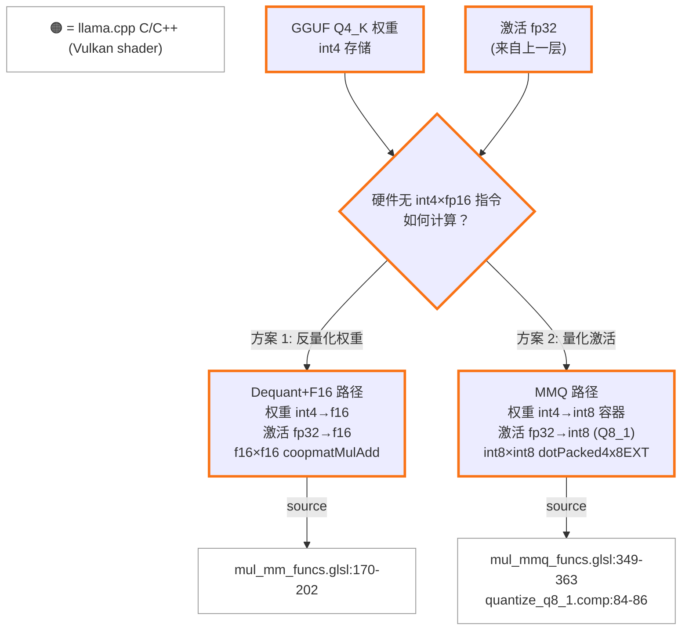

# Intel Xe2 量化计算审计：Q4_K_M 模型在 ggml Vulkan 后端的计算路径

| 项目 | 内容 |
|------|------|
| **日期** | 2026-04-08 |
| **目标读者** | 熟悉 XMX/DPAS 的 Intel 内部工程师 |
| **范围** | Q4_K_M 量化模型在 ggml Vulkan 后端的 matmul 计算路径（含 Flash Attention） |
| **代码基线** | Ollama `daop-investigate` 分支，llama.cpp vendored at `ml/backend/ggml/ggml/` |
| **前提假设** | `OLLAMA_FLASH_ATTENTION=1` |

---

## 目录

- [Section 0: 前置概念 — W4A16 与量化计算范式](#section-0-前置概念--w4a16-与量化计算范式)
- Section 1: 总结表 (TODO)
- Section 2: 计算路径详解 (TODO)
  - 2.1 MMQ 路径
  - 2.2 Dequant+F16 Coopmat 路径
  - 2.3 Flash Attention Coopmat 路径
  - 2.4 运行时路径确认
- Section 3: 推理 Walkthrough (TODO)
- Section 4: 精度细节 (TODO)

---

## Section 0: 前置概念 — W4A16 与量化计算范式

GGUF 格式的量化模型（如 Q4_K_M）属于 **weight-only post-training quantization (PTQ)**：仅权重被离线量化为低精度（4-bit），而激活值（activation）在推理时始终以 fp32/fp16 全精度流动。这种范式在业界通常记作 **W4A16**（4-bit weights, 16-bit activations）。与 W8A8 等 weight-and-activation 量化方案不同，W4A16 保留了激活的全精度，因此不需要校准数据集（calibration dataset），可直接对预训练权重进行量化。

W4A16 带来一个根本性矛盾：**硬件没有 int4 × fp16 的原生指令**。GPU 的整数单元（如 Xe2 的 `OpSDotKHR` / DPAS int8 模式）要求两边都是整数；浮点矩阵单元（如 XMX fp16 模式 / `coopmatMulAdd`）要求两边都是浮点。因此，4-bit 整数权重与 fp16 浮点激活之间的 matmul 必须先做一次类型对齐。

ggml Vulkan 后端为此提供了两条路径：

1. **Dequant+F16 路径**（`mul_mm_funcs.glsl`）：将 int4 权重完全反量化为 f16，与 f16 激活一起送入 `coopmatMulAdd`（cooperative matrix，映射到 XMX fp16 管线）。权重在 shared memory 中被逐元素解包并乘以 scale/min，转为 `FLOAT_TYPE_VEC2`（即 f16vec2）存储 (source: `mul_mm_funcs.glsl:170-202`，Q4_K 分支)。

2. **MMQ 路径**（`mul_mmq_funcs.glsl`）：将权重保持在整数域（int4 → int8 容器），同时将 fp32 激活在运行时量化为 Q8_1（int8 + scale + weighted sum）。这一量化由专用 compute shader `quantize_q8_1.comp` 完成：对每 32 个 fp32 值找 absmax，除以 127 得到 scale，再 round 到 int8 (source: `quantize_q8_1.comp:84-86`)。之后，int8 权重与 int8 激活通过 `dotPacked4x8EXT`（映射到 `OpSDotKHR`，即 Xe2 的 DP4A 指令）执行 4 路 packed int8 dot product (source: `mul_mmq_funcs.glsl:359`)。这条路径本质上将 W4A16 转化为 **W4A8**（或更准确地说，int8 容器内的 int4×int8）。

这两条路径在性能特征上有本质差异：Dequant+F16 利用 XMX fp16 吞吐但需要反量化开销和更多 shared memory；MMQ 利用整数 dot product 单元，避免反量化但引入了激活量化开销和额外的精度损失（fp32→int8 round）。后续章节将详细分析每条路径在 Xe2 上的具体 shader 实现与硬件映射。
