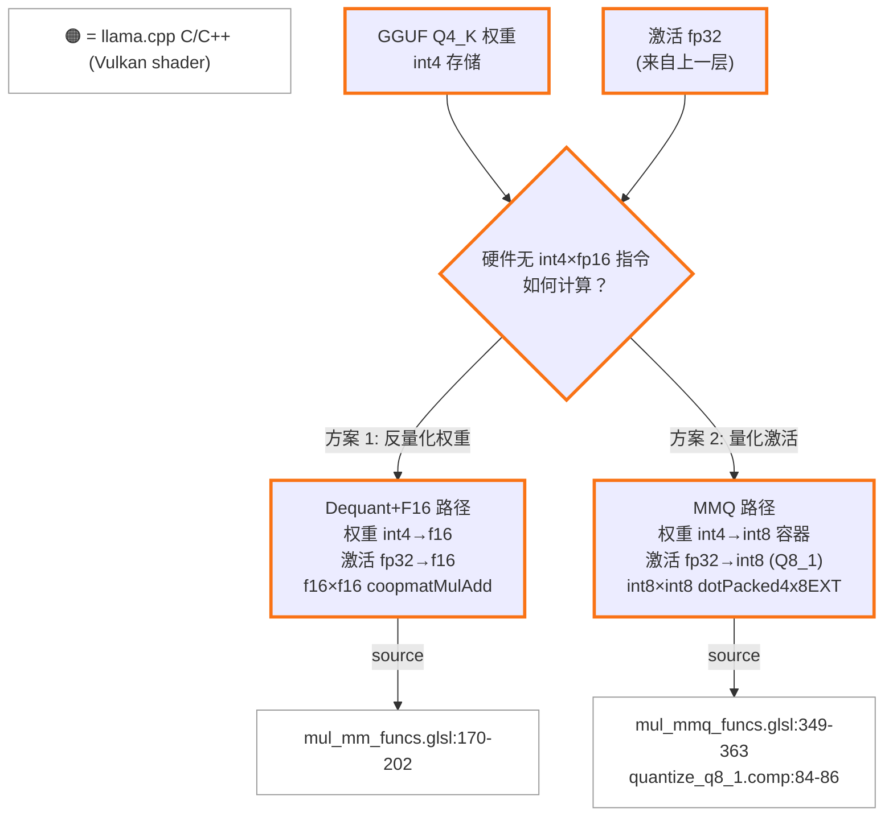
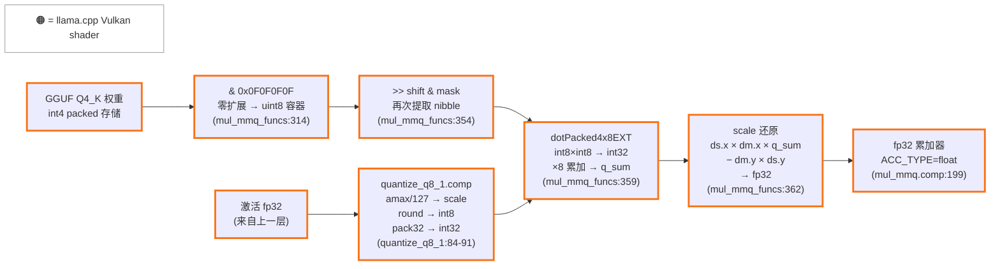
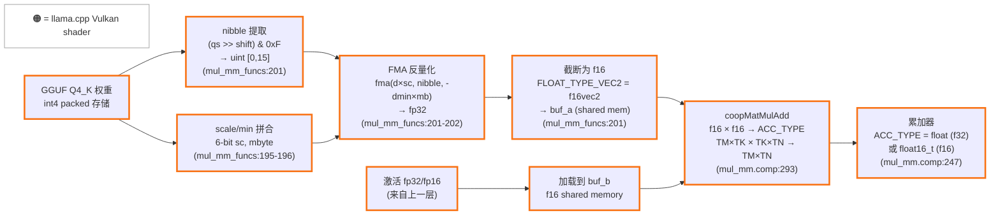

# Intel Xe2 量化计算审计：Q4_K_M 模型在 ggml Vulkan 后端的计算路径

| 项目 | 内容 |
|------|------|
| **日期** | 2026-04-08 |
| **目标读者** | 熟悉 XMX/DPAS 的 Intel 内部工程师 |
| **范围** | Q4_K_M 量化模型在 ggml Vulkan 后端的 matmul 计算路径（含 Flash Attention） |
| **代码基线** | Ollama `daop-investigate` 分支，llama.cpp vendored at `ml/backend/ggml/ggml/` |
| **前提假设** | `OLLAMA_FLASH_ATTENTION=1` |

---

## 目录

- [Section 0: 前置概念 — W4A16 与量化计算范式](#section-0-前置概念--w4a16-与量化计算范式)
- Section 1: 总结表 (TODO)
- Section 2: 计算路径详解 (TODO)
  - 2.1 MMQ 路径
  - 2.2 Dequant+F16 Coopmat 路径
  - 2.3 Flash Attention Coopmat 路径
  - 2.4 运行时路径确认
- Section 3: 推理 Walkthrough (TODO)
- Section 4: 精度细节 (TODO)

---

## Section 0: 前置概念 — W4A16 与量化计算范式

GGUF 格式的量化模型（如 Q4_K_M）属于 **weight-only post-training quantization (PTQ)**：仅权重被离线量化为低精度（4-bit），而激活值（activation）在推理时始终以 fp32/fp16 全精度流动。这种范式在业界通常记作 **W4A16**（4-bit weights, 16-bit activations）。与 W8A8 等 weight-and-activation 量化方案不同，W4A16 保留了激活的全精度，因此不需要校准数据集（calibration dataset），可直接对预训练权重进行量化。

W4A16 带来一个根本性矛盾：**硬件没有 int4 × fp16 的原生指令**。GPU 的整数单元（如 Xe2 的 `OpSDotKHR` / DPAS int8 模式）要求两边都是整数；浮点矩阵单元（如 XMX fp16 模式 / `coopmatMulAdd`）要求两边都是浮点。因此，4-bit 整数权重与 fp16 浮点激活之间的 matmul 必须先做一次类型对齐。

ggml Vulkan 后端为此提供了两条路径：

1. **Dequant+F16 路径**（`mul_mm_funcs.glsl`）：将 int4 权重完全反量化为 f16，与 f16 激活一起送入 `coopmatMulAdd`（cooperative matrix，映射到 XMX fp16 管线）。权重在 shared memory 中被逐元素解包并乘以 scale/min，转为 `FLOAT_TYPE_VEC2`（即 f16vec2）存储 (source: `mul_mm_funcs.glsl:170-202`，Q4_K 分支)。

2. **MMQ 路径**（`mul_mmq_funcs.glsl`）：将权重保持在整数域（int4 → int8 容器），同时将 fp32 激活在运行时量化为 Q8_1（int8 + scale + weighted sum）。这一量化由专用 compute shader `quantize_q8_1.comp` 完成：对每 32 个 fp32 值找 absmax，除以 127 得到 scale，再 round 到 int8 (source: `quantize_q8_1.comp:84-86`)。之后，int8 权重与 int8 激活通过 `dotPacked4x8EXT`（映射到 `OpSDotKHR`，即 Xe2 的 DP4A 指令）执行 4 路 packed int8 dot product (source: `mul_mmq_funcs.glsl:359`)。这条路径本质上将 W4A16 转化为 **W4A8**（或更准确地说，int8 容器内的 int4×int8）。



这两条路径在性能特征上有本质差异：Dequant+F16 利用 XMX fp16 吞吐但需要反量化开销和更多 shared memory；MMQ 利用整数 dot product 单元，避免反量化但引入了激活量化开销和额外的精度损失（fp32→int8 round）。后续章节将详细分析每条路径在 Xe2 上的具体 shader 实现与硬件映射。

---

## Section 2: 计算路径详解

### 2.1 MMQ 路径（Integer Dot Product）

MMQ（Matrix Multiply Quantized）是 Q4_K_M 在 Xe2 上的**首选 matmul 路径**。其核心思路：将 W4A16 问题转化为 int8×int8 dot product，利用 `VK_KHR_shader_integer_dot_product` 扩展暴露的 `dotPacked4x8EXT`（SPIR-V `OpSDotKHR`）指令，在硬件整数管线上执行。

#### 2.1.1 触发条件

MMQ 路径的启用需要三层条件同时满足：

**① 编译期：GLSL 编译器支持**

CMake 构建时通过 `test_shader_extension_support` 测试当前 GLSL 编译器（glslangValidator 或 glslc）是否支持 `GL_EXT_integer_dot_product` 扩展。通过则定义 `GGML_VULKAN_INTEGER_DOT_GLSLC_SUPPORT` 宏 (source: `ggml-vulkan/CMakeLists.txt:77-81`)。

所有 MMQ pipeline 的创建代码均包裹在此宏的 `#if` 块内：

```cpp
#if defined(GGML_VULKAN_INTEGER_DOT_GLSLC_SUPPORT)
    if (device->integer_dot_product) {
        CREATE_MMQ(GGML_TYPE_Q4_K, pipeline_dequant_mul_mat_mat_q8_1[GGML_TYPE_Q4_K], ...);
        CREATE_MMQ(GGML_TYPE_Q6_K, pipeline_dequant_mul_mat_mat_q8_1[GGML_TYPE_Q6_K], ...);
        // ... 其他量化类型
    }
#endif
```
(source: `ggml-vulkan.cpp:3283-3297`)

shader 生成侧同理——MMQ shader 仅在 `!f16acc && !coopmat && !coopmat2` 且编译器支持时生成，注释明确写道 "Integer dot mmq performs better with f32 accumulators" (source: `vulkan-shaders-gen.cpp:588-592`)。

**② 运行期：硬件能力查询**

设备初始化时，检查 Vulkan 扩展列表是否包含 `VK_KHR_shader_integer_dot_product`，同时检查环境变量 `GGML_VK_DISABLE_INTEGER_DOT_PRODUCT` 是否被设置（用于调试禁用）：

```cpp
} else if (strcmp("VK_KHR_shader_integer_dot_product", properties.extensionName) == 0 &&
           !getenv("GGML_VK_DISABLE_INTEGER_DOT_PRODUCT")) {
    device->integer_dot_product = true;
```
(source: `ggml-vulkan.cpp:4326-4329`)

随后进一步验证硬件确实对 4×8-bit packed signed dot product 有加速支持：

```cpp
device->integer_dot_product = device->integer_dot_product
    && shader_integer_dot_product_props.integerDotProduct4x8BitPackedSignedAccelerated;
```
(source: `ggml-vulkan.cpp:4478`)

`integerDotProduct4x8BitPackedSignedAccelerated == VK_TRUE` 表示驱动声明此操作有硬件加速（而非软件模拟）。Xe2 驱动对此返回 `VK_TRUE`。

**③ 运行期：MUL_MAT 路径选择优先级**

在 `ggml_vk_mul_mat_mat` 中，MMQ 被**优先**于 Dequant+F16 尝试：

```cpp
bool quantize_y = ctx->device->integer_dot_product && src1->type == GGML_TYPE_F32
    && ggml_is_contiguous(src1) && !y_non_contig && (ne11 * ne10) % 4 == 0;

// Check for mmq first
vk_matmul_pipeline mmp = quantize_y
    ? ggml_vk_get_mul_mat_mat_pipeline(ctx, src0->type, GGML_TYPE_Q8_1, ...)
    : nullptr;

if (mmp == nullptr) {
    // Fall back to f16 dequant mul mat
    mmp = ggml_vk_get_mul_mat_mat_pipeline(ctx, src0->type, ...);
    quantize_y = false;
}
```
(source: `ggml-vulkan.cpp:6722-6730`)

`ggml_vk_get_mul_mat_mat_pipeline` 对 `src1_type == GGML_TYPE_Q8_1` 的情况，查找 `pipeline_dequant_mul_mat_mat_q8_1[src0_type].f32acc` 并返回 (source: `ggml-vulkan.cpp:5457-5466`)。若该 pipeline 存在（编译期+运行期条件均满足），则使用 MMQ 路径；否则 fallback 到 Dequant+F16。

#### 2.1.2 数据流详解

##### Step 1: 激活量化 — fp32 → Q8_1 (quantize_q8_1.comp)

激活值（activation）从上一层以 fp32 到达。MMQ 路径需要将其量化为 Q8_1 格式（int8 + fp16 scale + fp16 weighted sum），由专用 compute shader `quantize_q8_1.comp` 完成。

每个 block 包含 32 个 fp32 值（由 8 个线程处理，每线程 1 个 vec4）：

1. **求 absmax**：每线程取 4 个绝对值的最大值，然后跨 8 线程归约（shared memory 或 subgroup clustered max）(source: `quantize_q8_1.comp:65-82`)

2. **计算 scale**：`d = amax / 127.0` (source: `quantize_q8_1.comp:84`)

3. **量化为 int8**：`vals = round(vals * d_inv)`，其中 `d_inv = 1.0 / d`（若 d == 0 则 d_inv = 0）(source: `quantize_q8_1.comp:85-86`)

4. **Pack 为 int32**：`pack32(i8vec4(round(vals)))` — 4 个 int8 打包为 1 个 int32 (source: `quantize_q8_1.comp:89-91`)

5. **存储 scale 和 weighted sum**：`ds = f16vec2(d, sum * d)`，其中 `sum` 是量化后所有 int8 值之和。`ds.y = sum * d` 即 weighted sum，用于后续 bias 校正 (source: `quantize_q8_1.comp:118-120`)

> **精度影响**：fp32 → int8 的 round 操作引入量化误差。对于 absmax = A 的 block，量化分辨率为 A/127，最大单元素误差为 A/254。

##### Step 2: 权重提取 — Q4_K int4 → int8 容器 (mul_mmq_funcs.glsl)

Q4_K 权重在 GGUF 文件中以 4-bit 存储，每个 super-block (256 个权重) 包含：打包的 4-bit quants、6-bit scales/mins、fp16 全局 d/dmin。

**Shared memory 加载** (`block_a_to_shmem`, source: `mul_mmq_funcs.glsl:305-339`)：

从 GPU 全局内存中读取 Q4_K 数据，提取 4-bit 值并重新打包：
```glsl
const uint32_t vals0 = (data_a_packed32[ib_k].qs[qs_idx    ] >> qs_shift) & 0x0F0F0F0F;
const uint32_t vals1 = (data_a_packed32[ib_k].qs[qs_idx + 1] >> qs_shift) & 0x0F0F0F0F;
buf_a[buf_ib].qs[iqs] = vals0 | (vals1 << 4);
```
(source: `mul_mmq_funcs.glsl:314-317`)

每个 int32 中的 4 字节各自通过 `& 0x0F0F0F0F` 掩码提取低 4-bit nibble，结果为 uint8 范围 [0, 15]（零扩展到 int8 容器中）。

同时计算 per-sub-block scale：将全局 `dm`（fp16 d 和 dmin）与 6-bit scale/min 相乘，存为 `FLOAT_TYPE_VEC2` (source: `mul_mmq_funcs.glsl:326-338`)。

**关键要点**：权重始终保持在整数域，**没有反量化为浮点**。

##### Step 3: 寄存器缓存加载

从 shared memory 到寄存器的传输（`block_a_to_registers` / `block_b_to_registers`）是简单的拷贝操作 (source: `mul_mmq_funcs.glsl:341-347`, `449-454`)。

##### Step 4: Dot Product — dotPacked4x8EXT (int8 × int8 → int32)

Q4_K 的 `mmq_dot_product` 函数 (source: `mul_mmq_funcs.glsl:349-363`)：

```glsl
ACC_TYPE mmq_dot_product(const uint ib_a) {
    int32_t q_sum = 0;

    [[unroll]] for (uint iqs = 0; iqs < 8; iqs++) {
        const int32_t qs_a = int32_t((cache_a[ib_a].qs[iqs / 2] >> ((iqs % 2) * 4))
                                     & 0x0F0F0F0F);
        q_sum += dotPacked4x8EXT(qs_a, cache_b.qs[iqs]);
    }

    return ACC_TYPE(float(cache_b.ds.x) * float(cache_a[ib_a].dm.x) * float(q_sum)
                  - float(cache_a[ib_a].dm.y) * float(cache_b.ds.y));
}
```

逐步拆解：

1. **权重 nibble 提取**：`(cache_a[ib_a].qs[iqs / 2] >> ((iqs % 2) * 4)) & 0x0F0F0F0F` — 从 shared memory 中已打包的 8-bit 对中再次提取 4-bit nibble，得到 4 个 uint8 值（范围 [0, 15]）packed 在一个 int32 中

2. **Packed dot product**：`dotPacked4x8EXT(qs_a, cache_b.qs[iqs])` — 将 qs_a 中 4 个 int8 与 cache_b（Q8_1 激活）中对应 4 个 int8 做点积，结果为单个 int32。循环 8 次累加到 `q_sum`

3. **Scale 还原**：`cache_b.ds.x`（Q8_1 的 d，fp16）× `cache_a[ib_a].dm.x`（Q4_K 的 d × scale，fp16）× `q_sum`（int32 → float 转换）

4. **Bias 校正**：减去 `cache_a[ib_a].dm.y`（Q4_K 的 dmin × min）× `cache_b.ds.y`（Q8_1 的 weighted sum）。这一项补偿 Q4_K 的 zero-point（min）偏移

5. **累加**：`ACC_TYPE = float`（fp32 累加器），在 `mul_mmq.comp` 主循环中累加到 `sums[]` 数组 (source: `mul_mmq.comp:199-259`)

##### 完整精度流水线图



#### 2.1.3 Q6_K 的 MMQ 路径

Q6_K（6-bit 量化）同样被注册到 MMQ pipeline (source: `ggml-vulkan.cpp:3297`)，使用相同的 `mul_mmq.comp` 框架但有不同的 `mmq_dot_product` 实现。

**Q6_K 与 Q4_K 的差异：**

| 方面 | Q4_K | Q6_K |
|------|------|------|
| **weight 提取** | `& 0x0F0F0F0F` 掩码取 4-bit | 6-bit = 4-bit ql + 2-bit qh，需组合并减 32 偏移 (source: `mul_mmq_funcs.glsl:378-382`) |
| **scale 结构** | 2-element `dm` (d×scale, dmin×min) | 2-element `d_scales` (d×scale[0], d×scale[1]) (source: `mul_mmq_funcs.glsl:386-388`) |
| **dot product** | 单循环 8 次，统一 q_sum | 分两段（iqs 0-3, 4-7），各自累加后乘不同 scale (source: `mul_mmq_funcs.glsl:400-420`) |
| **bias 项** | `dm.y × ds.y`（min 偏移校正） | 无独立 bias 项（Q6_K 权重已减 32 居中） |

Q6_K 的 `mmq_dot_product` (source: `mul_mmq_funcs.glsl:400-420`)：
```glsl
ACC_TYPE mmq_dot_product(const uint ib_a) {
    float result = 0.0;
    int32_t q_sum = 0;

    [[unroll]] for (uint iqs = 0; iqs < 4; iqs++) {
        q_sum += dotPacked4x8EXT(cache_a[ib_a].qs[iqs], cache_b.qs[iqs]);
    }
    result += float(cache_a[ib_a].d_scales[0]) * float(q_sum);
    q_sum = 0;

    [[unroll]] for (uint iqs = 4; iqs < 8; iqs++) {
        q_sum += dotPacked4x8EXT(cache_a[ib_a].qs[iqs], cache_b.qs[iqs]);
    }
    result += float(cache_a[ib_a].d_scales[1]) * float(q_sum);

    return ACC_TYPE(float(cache_b.ds.x) * result);
}
```

两种量化类型都通过 `dotPacked4x8EXT` 执行核心计算，区别仅在 scale 结构和 bias 处理。

#### 2.1.4 XMX 硬件映射

`dotPacked4x8EXT` 对应 SPIR-V 指令 `OpSDotKHR`（signed dot product of 4×8-bit packed integers）。Xe2 驱动对 `integerDotProduct4x8BitPackedSignedAccelerated` 返回 `VK_TRUE`，表明此操作有硬件加速。

在 Intel Xe2 架构中，每个 Xe-core 包含 Vector Engine（ALU）和 Matrix Engine（XMX）。`OpSDotKHR` 的 4×8-bit packed dot product 属于整数 SIMD 操作，其硬件映射存在两种可能：

- **Vector Engine DP4A 路径**：EU 的 ALU 管线支持 DP4A（Dot Product of 4 × int8 Accumulate）指令，在标量管线上执行
- **XMX DPAS int8 路径**：XMX 系统阵列的 DPAS（Data-Parallel Accumulate & Sum）指令支持 int8 模式

> ⚠️ **待确认**：`OpSDotKHR` 在 Xe2 上具体映射到 DP4A（Vector Engine）还是 DPAS int8（XMX Matrix Engine），取决于 Intel Vulkan 驱动的 JIT 编译策略。公开文档未明确说明此映射关系。无论哪种路径，`integerDotProduct4x8BitPackedSignedAccelerated == VK_TRUE` 确认了硬件加速的存在。但如果映射到 Vector Engine 而非 XMX，则 MMQ 路径实际上**未利用系统阵列**，性能天花板会低于 coopmat 路径。

#### 2.1.5 Q8_1 block_b 数据布局

激活侧量化完成后，Q8_1 数据在 MMQ shader 中的加载逻辑 (source: `mul_mmq_funcs.glsl:423-454`)：

```glsl
void block_b_to_shmem(const uint buf_ib, const uint ib, const uint iqs, const bool is_in_bounds) {
    if (is_in_bounds) {
        const uint ib_outer = ib / 4;
        const uint ib_inner = ib % 4;
        if (iqs == 0) {
            buf_b[buf_ib].ds = FLOAT_TYPE_VEC2(data_b[ib_outer].ds[ib_inner]);
        }
        const ivec4 values = data_b[ib_outer].qs[ib_inner * 2 + iqs];
        buf_b[buf_ib].qs[iqs * 4    ] = values.x;
        // ... (4 个 int32 展开存储)
    }
}
```

Q8_1 数据以 `block_q8_1_x4_packed128` 格式存储（4 个 Q8_1 block 打包），每个 block 包含 8 个 int32（32 个 int8 packed）和 1 个 f16vec2（d, sum×d）。加载到 shared memory 后展开为独立的 `block_b_cache` 结构。

#### 2.1.6 小结

MMQ 路径的核心特征：

| 属性 | 值 |
|------|-----|
| **路径选择优先级** | 最高（先于 coopmat/dequant） |
| **权重精度** | int4 → int8 容器（零扩展，不反量化） |
| **激活精度** | fp32 → int8（运行时 Q8_1 量化） |
| **计算指令** | `dotPacked4x8EXT` = `OpSDotKHR` |
| **累加精度** | fp32（`ACC_TYPE=float`） |
| **Scale 还原** | fp16 → fp32（Q4_K: d×scale + dmin×min bias；Q6_K: d×scale 分段） |
| **硬件单元** | 整数加速（DP4A 或 DPAS int8） ⚠️ 待确认具体单元 |
| **支持的量化类型** | Q4_0, Q4_1, Q5_0, Q5_1, Q8_0, Q2_K, Q3_K, Q4_K, Q5_K, Q6_K, MXFP4 |
| **禁用方式** | `export GGML_VK_DISABLE_INTEGER_DOT_PRODUCT=1` |

### 2.2 Dequant+F16 KHR Coopmat 路径（Cooperative Matrix）

> **优先级说明**：Q4_K 在 Xe2 上正常走 MMQ 路径（Section 2.1）。本节描述的 Dequant+F16 路径是 **fallback / 对比路径**，仅在 MMQ 不可用时（如设置 `GGML_VK_DISABLE_INTEGER_DOT_PRODUCT=1`）生效。

#### 2.2.1 触发条件与 Fallback 链

**Xe2 使用 KHR coopmat（coopmat1），而非 NV coopmat2。**

`coopmat2` 标志要求设备支持 `VK_NV_cooperative_matrix2` 扩展 (source: `ggml-vulkan.cpp:4322-4324`)，这是 NVIDIA 专有扩展，Intel Xe2 不具备。因此 `device->coopmat2 == false`。

Xe2 的 coopmat 启用路径：

1. **扩展检测**：设备枚举到 `VK_KHR_cooperative_matrix` 且未设置 `GGML_VK_DISABLE_COOPMAT` 环境变量 → `device->coopmat_support = true` (source: `ggml-vulkan.cpp:4314-4316`)

2. **架构白名单**：`ggml_vk_khr_cooperative_matrix_support()` 对 Intel 设备仅允许 `INTEL_XE2` 架构 (source: `ggml-vulkan.cpp:14686-14691`)。不满足则覆盖为 `device->coopmat_support = false` (source: `ggml-vulkan.cpp:4474-4476`)

3. **Coopmat 维度查询**：通过 `vkGetPhysicalDeviceCooperativeMatrixPropertiesKHR` 运行时查询支持的矩阵尺寸（M, N, K），要求 A/B 类型为 `Float16`，scope 为 `Subgroup` (source: `ggml-vulkan.cpp:4759-4804`)。代码分别检查 f32 累加和 f16 累加两种变体，记录第一个匹配的 (M, N, K) 尺寸到 `device->coopmat_m/n/k`。若无匹配或不支持 f32 累加，则禁用 coopmat (source: `ggml-vulkan.cpp:4838-4841`)

> ⚠️ **待确认**：Xe2 驱动实际报告的 coopmat (M, N, K) 尺寸。根据 XMX fp16 规格，预期为 (M=16, N=16, K=16) 或类似值，但需实机验证。

**Pipeline 选择 fallback 链** (`ggml_vk_get_mul_mat_mat_pipeline`, source: `ggml-vulkan.cpp:5498-5505`)：

```
if (device->coopmat2)           → pipeline_dequant_mul_mat_mat_f16[type]  (NV coopmat2, 不适用于 Xe2)
else if (device->coopmat_support) → pipeline_dequant_mul_mat_mat[type]     (KHR coopmat1, ✅ Xe2 走这里)
else                              → pipeline_dequant_mul_mat_mat[type]     (标量/SIMD fallback)
```

对于 Xe2（`coopmat_support == true, coopmat2 == false`），走第二分支。精度选择：若 `device->fp16 && device->coopmat_acc_f16_support && prec == GGML_PREC_DEFAULT`，用 f16 累加器；否则用 f32 累加器 (source: `ggml-vulkan.cpp:5502-5503`)。

**但注意**：在 `ggml_vk_mul_mat_mat` 中，MMQ 被**优先**尝试 (source: `ggml-vulkan.cpp:6722-6730`)。只有当 MMQ pipeline 返回 `nullptr`（如 `integer_dot_product == false`）时，才 fall back 到此 Dequant+F16 coopmat 路径。

#### 2.2.2 Shader 生成

Coopmat1 变体在 `vulkan-shaders-gen.cpp` 的 `process_shaders()` 中生成 (source: `vulkan-shaders-gen.cpp:611-614`)：

```cpp
// Coopmat, fp32acc and fp16acc
matmul_shaders(true, matmul_id_type, true, false, false);  // coopmat=true, coopmat2=false, f16acc=false
matmul_shaders(true, matmul_id_type, true, false, true);   // coopmat=true, coopmat2=false, f16acc=true
```

`matmul_shaders` 内部设置关键 define：
- `FLOAT16 = 1`（fp16 模式）
- `COOPMAT = 1`（启用 cooperative matrix 代码路径）(source: `vulkan-shaders-gen.cpp:454-456`)
- `ACC_TYPE = float`（f32acc 变体）或 `float16_t`（f16acc 变体）(source: `vulkan-shaders-gen.cpp:448`)
- `FLOAT_TYPE = float16_t`, `FLOAT_TYPE_VEC2 = f16vec2`（fp16 模式下的浮点类型）(source: `vulkan-shaders-gen.cpp:470-484`)

源文件为 `mul_mm.comp`（而非 coopmat2 的 `mul_mm_cm2.comp`）(source: `vulkan-shaders-gen.cpp:458`)。

编译后 shader 名称以 `_cm1` 后缀标识（如 `matmul_q4_k_f32_cm1.spv`）(source: `vulkan-shaders-gen.cpp:408`)。

Pipeline 创建在 `#if defined(VK_KHR_cooperative_matrix)` 块内，使用 `CREATE_MM2` 宏同时创建 f16acc 和 f32acc 两个变体 (source: `ggml-vulkan.cpp:3105-3152`)。

#### 2.2.3 数据流详解

##### Step 1: Q4_K 反量化 — int4 → f16 (mul_mm_funcs.glsl)

`load_a_to_shmem` 中的 `DATA_A_Q4_K` 分支 (source: `mul_mm_funcs.glsl:170-202`) 将 Q4_K 权重**完全反量化为 f16** 存入 shared memory：

```glsl
const uint ib = idx / 128;                 // super-block index (256 weights / 2 per idx)
const uint iqs = idx % 128;                // 0..127
const uint n = iqs / 32;                   // sub-block 0,1,2,3
const uint b = (iqs % 32) / 16;            // nibble half 0,1
const uint is = 2 * n + b;                 // scale index 0..7

const vec2 loadd = vec2(data_a[ib].dm);    // fp16 → fp32: (d, dmin)

// 提取 6-bit scale 和 min (组合高低位)
const uint8_t sc = uint8_t((...) | (...));  // 6-bit scale
const uint8_t mbyte = uint8_t((...) | (...));  // 6-bit min

const float d = loadd.x * sc;              // d × scale
const float m = -loadd.y * mbyte;          // -(dmin × min)

buf_a[buf_idx] = FLOAT_TYPE_VEC2(          // f16vec2
    fma(d, float((data_a[ib].qs[qsi    ] >> (b * 4)) & 0xF), m),
    fma(d, float((data_a[ib].qs[qsi + 1] >> (b * 4)) & 0xF), m)
);
```
(source: `mul_mm_funcs.glsl:174-202`)

逐步拆解：

1. **Nibble 提取**：`(data_a[ib].qs[qsi] >> (b * 4)) & 0xF` — 从 packed byte 中取高或低 4-bit nibble，得到 uint 值 [0, 15]

2. **Scale/min 提取**：6-bit scale (`sc`) 和 6-bit min (`mbyte`) 从 `data_a[ib].scales[]` 数组中拼合高低位得到（Q4_K 的 scale 编码分散存储在多个字节中）(source: `mul_mm_funcs.glsl:184-196`)

3. **FMA 反量化**：`fma(d, float(nibble), m)` = `d × nibble + m` = `(global_d × sc) × nibble − (global_dmin × mbyte)`。这将 int4 值完全还原为浮点数

4. **转型为 f16**：结果通过 `FLOAT_TYPE_VEC2`（即 `f16vec2`）构造函数从 fp32 截断为 fp16 存入 shared memory `buf_a`

**与 MMQ 路径的本质区别**：MMQ 将权重保持在整数域（int4 → int8 容器），而此路径将权重完全反量化为 f16 浮点数。反量化引入 fp32→fp16 截断误差，但后续乘法在浮点域进行，避免了激活侧的量化误差。

##### Step 2: 激活加载 — fp32 → f16 (buf_b)

激活（B 矩阵）以 fp32 或 fp16 从全局内存加载到 shared memory `buf_b`。在 fp16 coopmat 模式下，`B_TYPE = float16_t`（对齐变体使用 `f16mat2x4`），数据类型已在 shader 生成时确定 (source: `vulkan-shaders-gen.cpp:430, 584-585`)。

##### Step 3: Cooperative Matrix 乘加 — coopMatMulAdd (mul_mm.comp)

从 shared memory 加载到寄存器级 cooperative matrix，执行矩阵乘加：

```glsl
// Coopmat 类型声明
coopmat<FLOAT_TYPE, gl_ScopeSubgroup, TM, TK, gl_MatrixUseA> cache_a;     // f16, MxK
coopmat<FLOAT_TYPE, gl_ScopeSubgroup, TK, TN, gl_MatrixUseB> cache_b;     // f16, KxN
coopmat<ACC_TYPE, gl_ScopeSubgroup, TM, TN, gl_MatrixUseAccumulator> sums; // f32 or f16, MxN
```
(source: `mul_mm.comp:245-247`)

主计算循环：
```glsl
coopMatLoad(cache_a, buf_a, ..., SHMEM_STRIDE, gl_CooperativeMatrixLayoutRowMajor);
coopMatLoad(cache_b, buf_b, ..., SHMEM_STRIDE, gl_CooperativeMatrixLayoutColumnMajor);
sums[...] = coopMatMulAdd(cache_a, cache_b, sums[...]);
```
(source: `mul_mm.comp:285-293`)

`coopMatMulAdd` 执行 `C += A × B`，其中：
- **A, B 输入**：`FLOAT_TYPE = float16_t`（f16×f16 乘法）
- **累加器 C**：`ACC_TYPE = float`（f32 累加，默认）或 `float16_t`（f16 累加，`GGML_PREC_DEFAULT` 时）
- **Tile 尺寸 (TM, TK, TN)**：由运行时查询的 `device->coopmat_m/n/k` 决定

在 Xe2 上，`coopMatMulAdd` 映射到 **XMX fp16 DPAS 指令**。与 MMQ 路径（整数 dot product）不同，此路径直接利用 XMX 的浮点矩阵乘法管线。

#### 2.2.4 完整精度流水线图



#### 2.2.5 与 MMQ 路径的精度对比

| 方面 | MMQ (Section 2.1) | Dequant+F16 Coopmat (本节) |
|------|-------------------|---------------------------|
| **权重处理** | int4 → int8 容器（零扩展，无反量化） | int4 → fp32 (FMA) → **fp16 截断** |
| **激活处理** | fp32 → int8 (Q8_1 量化，`round` 误差) | fp32 → f16（截断或直接 f16 输入） |
| **乘法** | int8 × int8 → int32 (`dotPacked4x8EXT`) | f16 × f16 → f32/f16 (`coopMatMulAdd`) |
| **累加** | fp32（scale 还原后） | f32 或 f16（编译期选择） |
| **额外误差源** | 激活量化 round 误差 (±A/254) | 权重反量化 fp32→f16 截断 |
| **硬件单元** | 整数 DP4A / DPAS int8 | **XMX fp16 DPAS** |
| **Xe2 实际使用** | ✅ 默认路径 | ❌ 仅 MMQ 禁用时 fallback |

#### 2.2.6 小结

| 属性 | 值 |
|------|-----|
| **路径选择优先级** | 低于 MMQ，高于标量（Xe2 上为 fallback） |
| **Xe2 coopmat 版本** | KHR coopmat1（`VK_KHR_cooperative_matrix`），非 NV coopmat2 |
| **权重精度** | int4 → fp32 (FMA 反量化) → f16（截断） |
| **激活精度** | fp32 → f16 |
| **计算指令** | `coopMatMulAdd`（SPIR-V `OpCooperativeMatrixMulAddKHR`） |
| **Tile 尺寸** | 运行时从驱动查询 `(coopmat_m, coopmat_n, coopmat_k)` ⚠️ 待确认实际值 |
| **累加精度** | f32（默认）或 f16（`GGML_PREC_DEFAULT`） |
| **硬件单元** | XMX fp16 管线 |
| **Shader 源文件** | `mul_mm.comp` + `mul_mm_funcs.glsl`（编译为 `*_cm1.spv`） |
| **禁用方式** | `export GGML_VK_DISABLE_COOPMAT=1` |
