# MoE 感知 Split + Expert Pipeline: Prefill 优化方案

**Goal:** 将 Qwen3-Coder-Next 80B Q4_K_M 在 Arrow Lake + RTX 3090 上的 prefill 1k tokens 延迟从 ~2.0s 降至 ~1.2s

**Architecture:** 三阶段叠加优化——(0) KV cache 量化（本模型收益有限） (1) MoE/attention 层内拆分让所有 dense 计算上 GPU (2) 异步 expert pipeline 隐藏 PCIe 传输延迟

**Tech Stack:** Go (Ollama runner layer), C (GGML backend), CUDA (async copy stream)

> **重要：本文档中所有耗时均为理论推算值。** 实际实施前必须通过 benchmark 验证每个关键参数（PCIe 带宽、per-layer 计算时间、op_offload 行为等），并根据实测数据调整 schedule 策略。

---

## 1. 问题背景

### 1.1 硬件配置

| 组件 | 规格 |
|------|------|
| CPU | Intel Arrow Lake (P-core + E-core), DDR5 ≥128GB |
| GPU | NVIDIA RTX 3090 (24GB VRAM, HBM 936 GB/s) |
| PCIe | Arrow Lake 支持 5.0 x16，但 **RTX 3090 仅 PCIe 4.0** → 实际带宽 ~25 GB/s |

### 1.2 模型特征（GGUF 实测 Metadata）

Qwen3-Coder-Next 80B Q4_K_M（基于 Qwen3-Next-80B-A3B-Base）是 **hybrid MoE** 架构：

| 特征 | 值 | 备注 |
|------|-----|------|
| 总层数 | **48** | `block_count=48` |
| 层类型 | **36 recurrent (GatedDeltaNet) + 12 full attention** | `full_attention_interval=4` |
| embedding_length | **2048** | 远小于典型 LLM |
| MoE 结构 | **512 experts, top-10 selection** | 1.95% 稀疏 + shared experts |
| expert_feed_forward_length | **512** | 每个 expert 很小，但数量极多 |
| 量化 | Q4_K_M（mixed Q4_K/Q6_K/F32） | ffn_down_exps 用 Q6_K |
| 总参数 | **79.7B** | 活跃参数 ~3B/token |
| 总模型大小 | **~52 GB** (GGUF 文件) | |
| attention.head_count | 16 | Q heads |
| attention.key/value_length | 256 | head dim |
| KV heads (full attention 层) | 2 | GQA，从 attn_k shape 推断 |
| ssm.inner_size | 4096 | GatedDeltaNet d_inner |
| ssm.group_count (K heads) | 16 | |
| ssm.time_step_rank (V heads) | 32 | 非对称：V heads > K heads |

### 1.3 权重分布极度不对称

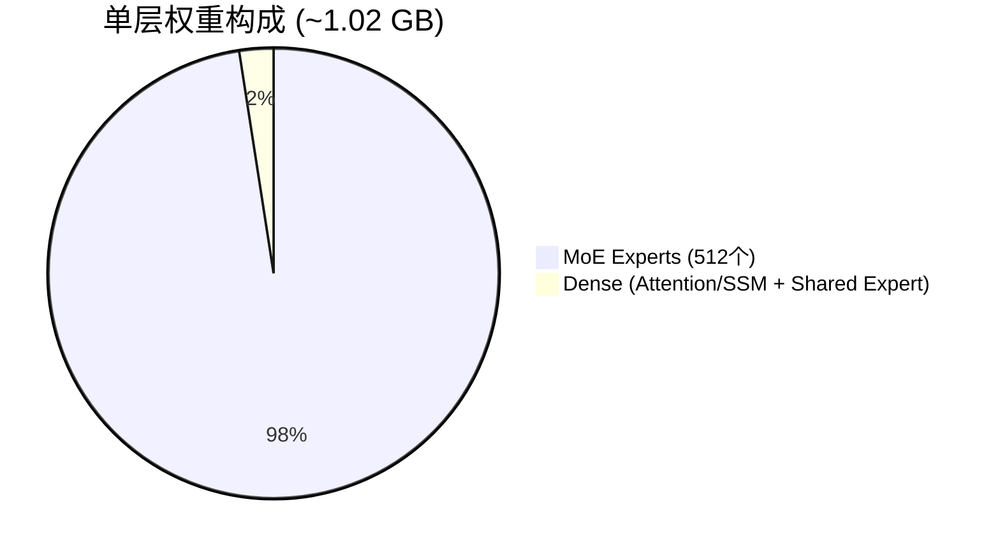

**Per-layer 权重大小（从 GGUF tensor shapes 精算）：**

| 组件 | 量化 | 大小 | 占比 |
|------|------|------|------|
| ffn_gate_exps [2048,512,512] | Q4_K | 288 MB | 28% |
| ffn_up_exps [2048,512,512] | Q4_K | 288 MB | 28% |
| ffn_down_exps [512,2048,512] | Q6_K | 420 MB | 41% |
| **MoE experts 合计** | | **996 MB** | **97%** |
| Attention/SSM + shared expert + norms | mixed | ~25 MB | 3% |
| **整层合计** | | **~1.02 GB** | 100% |

**全模型权重分布：**

| 组件 | 大小 | 占比 |
|------|------|------|
| 48 层 MoE experts | ~47.8 GB | 96% |
| 48 层 dense (attention/SSM/shared) | ~1.2 GB | 2.4% |
| Embedding + output | ~0.4 GB | 0.8% |

> **关键洞察**：dense 权重仅 1.2 GB，可以轻松全部放入 GPU。这使 MoE split 方案极具吸引力。

### 1.4 当前性能基线（实测）

```
当前 split: ~20 层 GPU (整层) + ~28 层 CPU (整层)
Ollama 报告: 49 层 (48 blocks + 1 output)
Prefill 1k tokens: ~2.0s (实测)
```

---

## 2. 时间模型（理论推算）

> **⚠️ 以下所有 per-layer 耗时均为基于用户实测总时间的理论推算，非直接测量。** Schedule 策略的正确性依赖这些参数的准确性。Phase 1 实施前应通过 trace 逐层验证。

### 2.1 基线校准

从实测 2.0s 反推 per-layer 耗时：

```
20 × T_gpu + 28 × T_cpu ≈ 2000ms
假设 GPU:CPU 速度比 ≈ 1:6
→ T_gpu ≈ 10.6ms, T_cpu ≈ 64ms
→ 20 × 10.6 + 28 × 64 = 212 + 1792 = 2004ms ≈ 2000ms ✓
```

### 2.2 Per-layer 时间拆分（理论估算）

```mermaid
gantt
    title 单层耗时拆分（理论推算）
    dateFormat X
    axisFormat %s ms

    section GPU 常驻层 (10.6ms)
    Attention/SSM   :a1, 0, 2.5
    Gate+MoE FFN    :a2, 2.5, 10.6

    section CPU 层 (64ms)
    Attention/SSM (CPU)  :b1, 0, 16
    MoE FFN (CPU)        :b2, 16, 64
```

| 组件 | GPU 上 | CPU 上 | 推算依据 |
|------|--------|--------|----------|
| Attention/SSM + Gate | ~2.5ms | ~16ms | GPU:CPU ≈ 1:6 |
| MoE FFN | ~8.1ms | ~48ms | MoE 占计算量主体 |
| **整层合计** | **~10.6ms** | **~64ms** | 校准至实测 2.0s |

### 2.3 PCIe 传输时间（理论）

| 传输内容 | 数据量 | PCIe 4.0 (25 GB/s) | 备注 |
|---|---|---|---|
| 单层全部 MoE experts (512个) | **~1 GB** | **~40ms** | Prefill 近似全量 |
| 单层选中 experts (10个) | ~20 MB | **~0.8ms** | Decode 场景 |
| Prefill 实际 (~99% experts) | ~990 MB | **~40ms** | 1024 tokens × 10 experts 覆盖几乎全部 |

### 2.4 硬件并行性：PCIe 与 GPU 计算不冲突

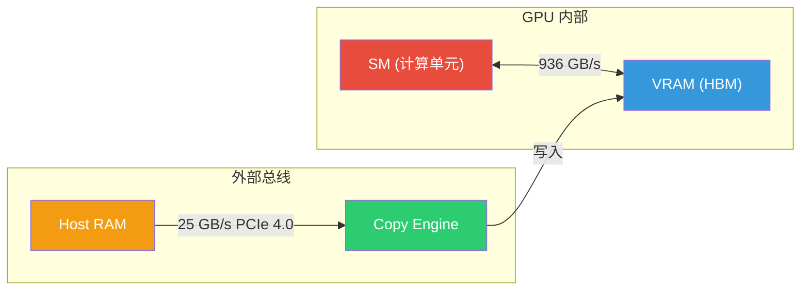

- **SM (计算)** 和 **Copy Engine (DMA)** 是独立硬件单元，可真正并行
- PCIe 写入 VRAM 仅占 HBM 带宽的 25/936 = **2.7%**，对计算无影响
- 这是 CUDA async memcpy + 多 stream 并行的硬件基础

### 2.5 需要实测验证的关键参数

| 参数 | 理论值 | 验证方法 |
|------|--------|----------|
| PCIe 实际带宽 | 25 GB/s | `cudaMemcpyAsync` benchmark |
| GPU per-layer (attention/SSM) | ~2.5ms | `OLLAMA_TRACE_DIR` per-op trace |
| GPU per-layer (MoE FFN) | ~8.1ms | 同上 |
| CPU per-layer | ~64ms | 同上 |
| op_offload 是否在 Go runner 中启用 | 未知 | 检查代码 + trace 验证 |
| Prefill 1k 实际 expert 激活比例 | ~99% | gating output 统计 |

---

## 3. Phase 0: KV Cache 量化（本模型收益有限）

```bash
OLLAMA_FLASH_ATTENTION=1 OLLAMA_KV_CACHE_TYPE=q8_0 ollama serve
```

**本模型特殊性：** 只有 **12 层 full attention** 有 KV cache（36 层 recurrent 使用固定 f32 state，不受影响），且 KV heads 仅 2 个。

| 上下文长度 | f16 KV Cache | q8_0 KV Cache | 节省 | 能否多放 1 层 MoE? |
|---|---|---|---|---|
| 1K (prefill bench) | 12 × 1 MB = 12 MB | 6 MB | 6 MB | ❌ 远不够 |
| 8K | 12 × 8 MB = 96 MB | 48 MB | 48 MB | ❌ |
| 32K | 12 × 64 MB = 768 MB | 384 MB | 384 MB | ❌ (需 ~1 GB) |
| 128K | 12 × 256 MB = 3 GB | 1.5 GB | 1.5 GB | ✅ 勉强 |

> **结论**：由于 KV heads 极少（2个）且仅 12 层有 KV cache，Phase 0 **在 32K 以下 context 几乎无收益**。仅在 128K+ 长 context 场景下才值得。Recurrent 层 state 始终 f32 不受影响。
>
> 仍建议开启（零代码零风险），但 **不应期待对 prefill benchmark 有可测量的改善**。

---

## 4. Phase 1: MoE 感知层内拆分

### 4.1 核心思想

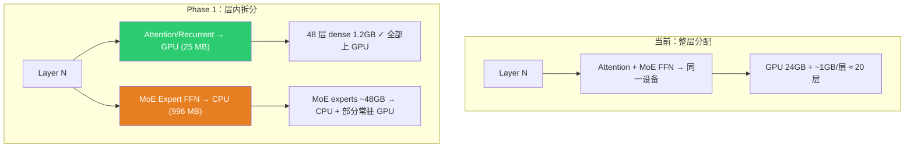

**核心优势**：dense 权重仅占 3%，全部放入 GPU 后仍有 ~22 GB 用于常驻 MoE experts。

### 4.2 VRAM 布局

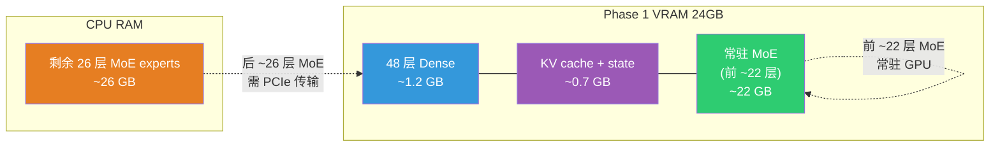

### 4.3 关键陷阱：MoE split 不加 op_offload 反而更慢

MoE split 把 attention 从 CPU 搬到 GPU（好），但也把**原来在 GPU 上的层的 MoE** 挤到 CPU（坏）：

| 层 | 之前 | 之后 (无 op_offload) | 变化 |
|---|---|---|---|
| 原 20 GPU 层 | 10.6ms (全 GPU) | 2.5ms(attn GPU) + 48ms(MoE CPU) = **50.5ms** | **慢 40ms** |
| 原 28 CPU 层 | 64ms (全 CPU) | 2.5ms(attn GPU) + 48ms(MoE CPU) = **50.5ms** | 快 13.5ms |
| 净效果 | | | **-20×40 + 28×13.5 = -422ms（大幅更慢）** |

**MoE split 的收益必须靠 op_offload（将 MoE 计算 offload 到 GPU + expert 按需拷贝）才能兑现。**

### 4.4 Gating 依赖：expert 选择在关键路径上

每层的执行顺序存在严格依赖：

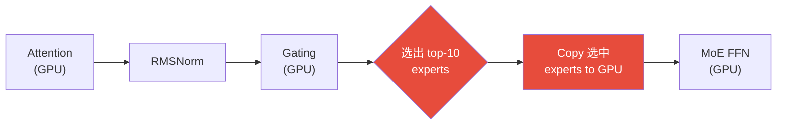

**在 attention 计算期间不知道选哪些 expert → 无法提前传输选中 expert。** 这 40ms 的 copy 在关键路径上。

但 prefill (batch=1024) 有特殊性：1024 tokens × 10 experts → **几乎覆盖全部 512 experts (~99%)**。所以 selective copy ≈ 全量 copy。这个特性在 Phase 2 中被利用。

### 4.5 Phase 1 执行流程与预期性能

```mermaid
gantt
    title Phase 1: 单层执行流程（非常驻层, 理论推算）
    dateFormat X
    axisFormat %s

    section GPU Compute
    Attention+Gate  :a1, 0, 2.5
    等待 expert 拷贝 :crit, done, w1, 2.5, 42.5
    MoE FFN         :a2, 42.5, 50.6

    section PCIe
    空闲            :done, p0, 0, 2.5
    Copy experts    :active, p1, 2.5, 42.5
```

| 分组 | 层数 | 每层耗时 | 小计 |
|---|---|---|---|
| 完全常驻 GPU | ~22 | 10.6ms | 233ms |
| Attn GPU + **sync** expert copy | ~26 | 2.5 + 40 + 8.1 = **50.6ms** | 1316ms |
| **总计** | | | **~1.55s** |

**vs 基线 2.0s → 改善 ~22%**

### 4.6 先例：llama.cpp 已有 partial_moe

llama.cpp runner 在 `llama.cpp/src/llama.cpp:418-653` 已实现完整 MoE 感知分配（基于 tensor 名正则 `blk\.\d+\.ffn_(up|down|gate)_(ch_)?exps` 匹配 MoE 权重并强制分配到 CPU）。但 **Ollama Go-native runner（`model/models/qwen3next/`）不走此路径**，需移植到 Go 层。

### 4.7 实现方案（~50 行 Go）

**改动 1:** `ml/backend/ggml/ggml.go` — tensor 级分配

```go
// MoE tensor 命名模式 (与 llama.cpp partial_moe 一致):
//   "blk.N.ffn_(up|down|gate)_exps"     — expert projections
var moeExpertPattern = regexp.MustCompile(`blk\.\d+\.ffn_(up|down|gate)_(ch_)?exps`)

// ggml.go:340 区域 — 按 tensor 名分配设备
if layerIndex >= 0 {
    if isMoEExpertTensor(t.Name) && !layerHasMoEOnGPU(layerIndex) {
        createTensor(tensor{source: t}, cpuDeviceBufferType, layerIndex)
    } else {
        createTensor(tensor{source: t}, layers[layerIndex].bts, layerIndex)
    }
}
```

**改动 2:** `llm/server.go` — `buildLayout()` 两轮分配

```
第一轮: 从后往前，按 denseSize (attention/SSM + cache) 填充 GPU
        → 48 层 dense 仅 1.2 GB，全部放入
第二轮: 从前往后，用剩余 VRAM 按 moeSize 填充 MoE expert
        → ~22 层 MoE 常驻 GPU
```

**改动 3:** `ml/device.go` — per-tensor-type 内存追踪

```go
type LayerMemory struct {
    DenseWeights uint64  // attention/recurrent/shared expert
    MoEWeights   uint64  // MoE expert (ffn_*_exps)
    Cache        uint64  // KV cache / recurrent state
}
```

---

## 5. Phase 2: 异步 Expert Pipeline

### 5.1 动机

Phase 1 后 26 层的 sync expert copy (~40ms/层) 占总时间 ~85%。Phase 2 利用**跨层异步传输**隐藏 PCIe 延迟。

### 5.2 核心洞察

1. **Prefill 几乎激活所有 expert (~99%)** → 不需要等 gating → 可提前上传整层 expert
2. **利用前一层的 GPU 计算时间上传下一层 expert** → 跨层 pipeline
3. **GPU compute 和 PCIe copy 是独立硬件** → 可真正并行（见 §2.4）

### 5.3 双缓冲机制

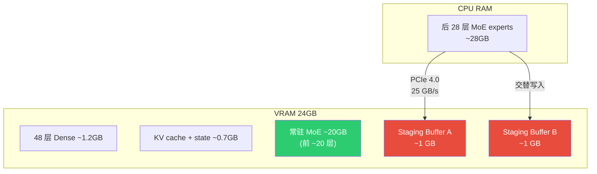

每个 staging buffer = 单层 MoE expert 权重 (~1 GB)。GPU 从 buffer A 读计算，PCIe 同时往 buffer B 写下一层。交替使用。

> **注意**：双缓冲需要 2 GB VRAM，会减少常驻 MoE 层数（从 ~22 降到 ~20），增加 pipeline 层数到 ~28。这是合理的 trade-off。

### 5.4 Pipeline 时间线（理论推算）

#### 阶段 1：常驻层计算（GPU 忙、PCIe 预取）

```mermaid
gantt
    title 阶段 1: 常驻层 + PCIe 预取（理论推算）
    dateFormat X
    axisFormat %s

    section GPU
    Layer 0-19 常驻 (20×10.6ms)  :gpu1, 0, 212

    section PCIe
    Upload L20→bufA              :active, p1, 0, 40
    Upload L21→bufB              :active, p2, 40, 80
    Upload L22→bufA              :active, p3, 80, 120
    Upload L23→bufB              :active, p4, 120, 160
    Upload L24→bufA              :active, p5, 160, 200
    空闲 (buffer 满)              :done, idle, 200, 212
```

20 层 × 10.6ms = 212ms，PCIe 预取 5 层（200ms），仅 12ms PCIe 空闲。

#### 阶段 2：Pipeline 稳态（PCIe 瓶颈）

```mermaid
gantt
    title 阶段 2: Pipeline 稳态（理论推算, 每格=5ms）
    dateFormat X
    axisFormat %s

    section GPU Compute
    L20 Attn+MoE (10.6ms)      :gpu1, 212, 222.6
    L21 Attn+MoE               :gpu2, 222.6, 233.2
    L22 Attn+MoE               :gpu3, 233.2, 243.8
    L23 Attn+MoE               :gpu4, 243.8, 254.4
    L24 Attn+MoE               :gpu5, 254.4, 265
    等待 PCIe...                :crit, done, w1, 265, 292
    L25 Attn+MoE               :gpu6, 292, 302.6

    section PCIe Copy
    Upload L25→bufB              :active, c1, 212, 252
    Upload L26→bufA              :active, c2, 252, 292
    Upload L27→bufB              :active, c3, 292, 332
```

前 5 个 buffer 层连续消费后（~53ms），GPU 追上 PCIe，进入稳态：

```
稳态 throughput = 40ms/层 (PCIe 瓶颈)
GPU 利用率 = 10.6ms / 40ms = 26.5%
PCIe 利用率 ≈ 100%
```

#### 完整时间线

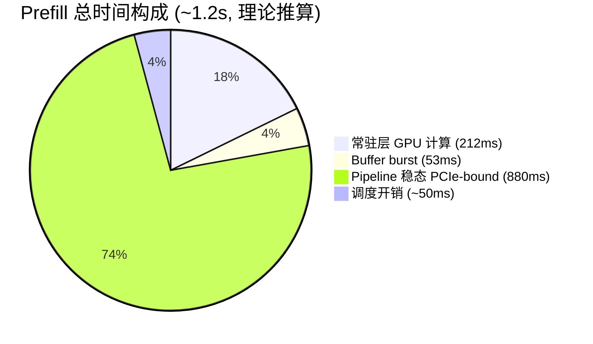

**计算明细：**
```
常驻层:        20 × 10.6ms = 212ms
Buffer burst:  5 × 10.6ms = 53ms（消费预取的 5 层）
Pipeline 稳态: 23 × 40ms = 920ms（剩余层受 PCIe 限制）
扣除重叠:      常驻期间 PCIe 已预取 212ms → 稳态减少 212ms 的 PCIe 工作
               → 但稳态中 GPU 也在计算，实际是 max(GPU, PCIe)
总计:          212 + 53 + (23 × 40 - 部分重叠) ≈ 1.15-1.2s
```

### 5.5 为什么 GPU 算力无法突破 PCIe 瓶颈

```
总搬运量 = 28 层 × 1 GB = 28 GB
PCIe 4.0 最少需要 = 28 / 25 = 1120ms ← 物理硬限制

GPU 计算总量 = 48 × 10.6ms = 509ms ← 远小于传输时间

→ PCIe 带宽是不可突破的下限
→ 增加 GPU 算力（或加 CPU 算力）不改变这个下限
```

### 5.6 能否用 CPU 算 MoE 来帮忙？

| 方案 | 每层耗时 | 原因 |
|---|---|---|
| **GPU pipeline** | 40ms (PCIe 瓶颈) | GPU compute 被隐藏 |
| **CPU MoE (不 copy)** | 2.5ms(attn GPU) + 48ms(MoE CPU) = 50.5ms | CPU 算得慢 |
| **GPU+CPU 赛跑** | min(42.5, 50.5) = 42.5ms | GPU 总是赢，CPU 白算 |

即使 GPU 只有 26.5% 利用率，40ms/层还是好于 CPU 的 50.5ms/层。**瓶颈是带宽不是算力。**

### 5.7 Prefill 专属优化，Decode 不改动

| 场景 | Expert copy 策略 | 原因 |
|---|---|---|
| **Prefill** (batch ≥ 32) | 全量预上传 + async pipeline | ~99% expert 激活，不需等 gating |
| **Decode** (batch = 1) | Sync selective copy | 只需 10/512 expert (~20MB, <1ms) |

```
if batch_size >= PIPELINE_THRESHOLD:
    async pipeline (全量预上传, Phase 2)
else:
    sync selective copy (Phase 1 行为)
```

---

## 6. 收益汇总

| 阶段 | Prefill 1k | vs 基线 | 改动量 | 瓶颈 |
|------|-----------|---------|--------|------|
| **基线** | **~2.0s** | — | — | CPU 计算慢 |
| Phase 0: KV q8_0 | ~2.0s | ~0% | 零代码 | 本模型 KV 极小 |
| Phase 1: MoE split | ~1.55s | **-22%** | ~50 行 Go | PCIe sync copy |
| **Phase 2: async pipeline** | **~1.2s** | **-40%** | GGML C 层 | **PCIe 带宽** |

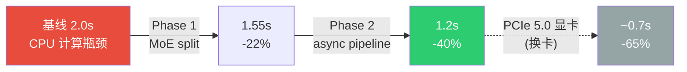

> 进一步优化只能靠硬件：PCIe 5.0 GPU (50 GB/s) → 传输时间减半 → 总 prefill ~0.7s

---

## 7. 实施计划

### 7.1 Phase 0（立即，但预期收益极小）

- [ ] `OLLAMA_FLASH_ATTENTION=1 OLLAMA_KV_CACHE_TYPE=q8_0 ollama serve`
- [ ] 确认对 prefill benchmark 影响（预期不可测量）

### 7.2 Phase 1 调研（Week 1）

- [ ] 用 `OLLAMA_TRACE_DIR` 抓 trace，**实测** per-layer 耗时（验证 §2 时间模型）
- [ ] 确认 Go runner 中 `op_offload` 是否启用（**关键前置**）
- [ ] 确认 MoE expert tensor 命名模式（验证 `_exps` 后缀匹配 512 个 expert 的 tensor）
- [ ] 阅读 `ggml.go:207-346` 分配逻辑 + `llama.cpp:418-653` partial_moe 参考

### 7.3 Phase 1 实现（Week 2）

- [ ] 修改 `ml/device.go`: LayerMemory 拆分 dense/moe
- [ ] 修改 `llm/server.go`: `buildLayout()` 两轮分配
- [ ] 修改 `ggml.go`: `assignTensor()` 按 tensor 名分配设备
- [ ] 测试：确认 48 层 attention/SSM 全在 GPU
- [ ] **Benchmark**: prefill 1k 延迟对比 → 根据实测调整 Phase 2 策略

### 7.4 Phase 2 实现（Week 3-4，Phase 1 收益确认后）

- [ ] **实测** PCIe 带宽（`cudaMemcpyAsync` benchmark）
- [ ] 实现 CUDA copy stream + 双缓冲 staging buffer（每个 ~1 GB）
- [ ] 实现 prefill async pipeline 调度
- [ ] 实现 batch_size 分支（prefill → pipeline, decode → sync）
- [ ] Nsight Systems profiling 验证 compute/copy 重叠度
- [ ] **Benchmark**: 完整 prefill 延迟对比

### 7.5 成功标准

| 阶段 | 标准 |
|------|------|
| Phase 1 | 48 层 dense 全 GPU，prefill ≤ 1.6s |
| Phase 2 | Nsight 确认 copy/compute 重叠 ≥ 70%，prefill ≤ 1.25s |

---

## 8. 风险

| 风险 | 影响 | 缓解 |
|------|------|------|
| **op_offload 在 Go runner 中未启用** | Phase 1 无法将 CPU MoE offload 到 GPU → MoE split 反而更慢（§4.3） | Week 1 首先验证 |
| 实际 per-layer 耗时与理论偏差大 | Schedule 策略需调整 | Phase 1 前 trace 验证 |
| PCIe 实际带宽 < 25 GB/s | Pipeline 收益缩水 | Phase 2 前 benchmark |
| Go runner tensor 分配路径与 llama.cpp 差异大 | Phase 1 比预期复杂 | 对比 `ggml.go` 和 `llama.cpp` |
| 双缓冲 2 GB VRAM 占用过大 | 减少常驻层，增加 pipeline 层 | 可接受的 trade-off |
| Shared expert 需特殊处理 | 分配逻辑需额外判断 | shared expert 不匹配 `_exps`，走 dense 路径 |

---

## 9. 关键代码路径

| 文件 | 行号 | 用途 |
|------|------|------|
| `ml/backend/ggml/ggml.go` | 207-223 | `assignLayer()` — Phase 1 主改动点 |
| `ml/backend/ggml/ggml.go` | 332-346 | tensor 创建 — 按层号分配 buffer type |
| `ml/device.go` | 146-161 | `DeviceMemory` — per-layer 内存追踪 |
| `llm/server.go` | 924, 939-1145 | `createLayout` / `buildLayout` / `greedyFit` |
| `llama.cpp/src/llama.cpp` | 418-653 | **参考**: partial_moe 实现 |
| `ggml-backend.cpp` | 860-875 | `op_offload` 触发 (batch ≥ 32) |
| `ggml-backend.cpp` | 1515-1599 | selective expert copy |
| `model/models/qwen3next/model.go` | | Qwen3-Next Go 模型实现 |
| `envconfig/config.go` | 195 | `OLLAMA_KV_CACHE_TYPE` |

---

## 10. 相关文档

- [GGML Backend Scheduler 详解](../../internals/02-ggml-backend-scheduler.md) — MoE weight copy 机制
- [内存分配机制](../../internals/04-memory-allocation.md) — weight buffer 生命周期
- [优化方向总览](../../internals/06-optimization-directions.md) — MoE 感知拆分 (§7.3)
- [CPU Offload Latency 优化 Memo](2026-03-24-cpu-offload-latency-optimization.md) — Weight swap 原始讨论
