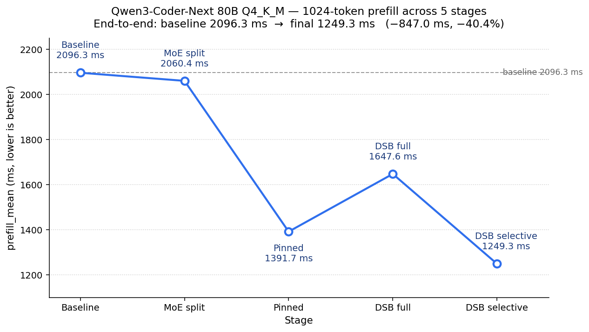

# Qwen3-Coder-Next MoE Split Prefill 优化 — 完整实验报告

**日期：** 2026-04-22
**分支：** `feat/moe-split-prefetch`
**硬件：** Intel Arrow Lake 265K · Windows 11 · 128 GB DDR5 6400 MT/s · RTX 3090 (24 GB Video Random Access Memory (VRAM), PCIe 4.0 x16)
**模型：** Qwen3-Coder-Next 80B Q4_K_M (`~52 GB GGUF`)
**目标指标：** batch_size = 1024 时 1024-token prefill 延迟。所有 `prefill_ms` 均为 bench-sweep 正式 6 epoch 的 mean。

---

## 1. 实验概览

Qwen3-Coder-Next 80B 全量推理需要 ≈52 GB 权重，而 RTX 3090 只有 24 GB VRAM。Ollama 默认会把超出显存的层整体 offload 到 CPU：这些层的 attention 和 Mixture-of-Experts (MoE) 权重全部放 CPU，推理时只在 CPU 上跑。这条路径对 Prefill 阶段不友好 —— 整层 CPU 执行不仅失去 GPU 并行度，还挡住了 GPU compute pipeline 的继续推进。

我们的优化思路：把 **dense 权重**（attention、router、gate、shared expert 等，每层仅 ≈76–85 MiB）全部压进 GPU，只把真正占大头的 **expert 权重**（每层 ≈996 MiB，48 层合计 ≈30 GiB）留在 CPU Host Memory，推理时按需 Host-to-Device (H2D) 拷入 VRAM 的 `input_cpy` 暂存区进行 GPU Matrix-Matrix Quantized (MMQ) 计算。这样 GPU 持续跑所有非 MoE 算子、所有 MoE 算子也在 GPU 上算，只在 H2D 上花时间。

围绕这条路径，实验分五个阶段：

| # | Stage | 关键机制 | prefill_mean (ms) | vs baseline | vs 上一阶段 |
|---|---|---|---|---|---|
| 1 | [**Baseline (Ollama default)**](#2-stage-1--ollama-default-baseline) | 整层 offload 给 CPU backend 执行 | 2096.3 | — | — |
| 2 | [**MoE weights split to CPU**](#3-stage-2--moe-weights-split-to-cpu) | Dense 权重上 GPU，expert 权重留 CPU，GPU 按需 H2D 拉取 | 2060.4 | −35.9 (−1.7%) | −35.9 (−1.7%) |
| 3 | [**Pinned memory**](#4-stage-3--pinned-memory) | 把 CPU-MoE buffer 页锁定（pinned），让 GPU 直接 Direct Memory Access (DMA) 搬运，跳过 CUDA driver 的中转 host buffer | 1391.7 | −704.6 (−33.6%) | −668.7 (−32.5%) |
| 4 | [**Dual Staging Buffer (DSB) — full tensor**](#5-stage-4--dual-staging-buffer-full-tensor-prefetch) | 独立 prefetch stream 预拷权重到 staging，主流 Device-to-Device (D2D) 消费；消除跨流 data race | 1647.6 | −448.7 (−21.4%) | **+255.9 (+18.4%)** ⚠ |
| 5 | [**DSB — selective prefetch**](#6-stage-5--selective-dsb-prefetch) | 只搬运激活 expert 字节窗口，跨层 A-split 仍 full、同层 B/C 复用 ids 走 selective | **1249.3** | **−847.0 (−40.4%)** | −398.3 (−24.2%) |

### 1.1 折线趋势



### 1.2 稳定性与辅助指标

| Stage | prefill_cv_pct | prefill_tps | ttft_ms | gen_tps | vram_used_bytes |
|---|---|---|---|---|---|
| 1 Baseline | 3.29 | 467.3 | 2172 | 18.13 | 23.46 GB |
| 2 MoE split | 3.21 | 475.6 | 2131 | 19.13 | 21.76 GB |
| 3 Pinned | 2.25 | 703.9 | 1461 | 18.50 | 22.80 GB |
| 4 DSB full | 0.69 | 594.5 | 1717 | 19.25 | 22.80 GB |
| 5 DSB selective | 1.90 | 784.1 | 1321 | 19.50 | 22.80 GB |

**观察点：**

- Stage 4 绝对值相比 Stage 3 是 regression（+256 ms），详见 [§5.4 根因分析](#54-性能数据分析)。此阶段的价值不在单独指标，而在于为 Stage 5 扫清 data race。
- 最终 Stage 5 相对 baseline 提升 **40.4%**，相对最初的"dense 上 GPU"思路（Stage 2）提升 **39.4%**。
- 所有 MoE-split 路径（Stage 2/3/4/5）输出完全一致（[单元测试](#71-测试脚本) 生成的 Fibonacci 代码在四个版本间字节级相同），表明优化链条**未引入任何数值漂移**。
- Stage 4/5 的 cv 相比 Stage 1/2 下降约 1/4，说明独立 prefetch stream 的调度比 on-demand copy 更稳定。

---

## 2. Stage 1 — Ollama Default Baseline

### 2.1 实验目标

建立未做任何 MoE-split 改动下的 Prefill 基线；同时验证"Ollama 默认把超出 VRAM 的层整体下沉 CPU"这个 offload 行为带来的实际开销。

### 2.2 实验方法

- 禁用所有 MoE split 环境变量（未设置 `OLLAMA_MOE_GPU_LAYERS` / `OLLAMA_MOE_PINNED` / `OLLAMA_MOE_PREFETCH`）
- 跑 `bench-sweep.exe --sizes 1024 --epochs 6 --warmup 4 --max-tokens 16`
- 记录 commit 位于 baseline 分支（未含任何 MoE-split 代码）

### 2.3 实验结果

**权重分布（48 block）：**

```
GPU (24 GB VRAM):  block 0–16 整层驻留（dense + MoE）
CPU (Host memory): block 17–47 整层驻留（dense + MoE）
```

算子执行：
- Block 0–16 所有算子（attention / router / MoE）→ CUDA backend
- Block 17–47 所有算子（attention / router / MoE）→ CPU backend

**时序（单 token pass）：**

```
 GPU │━━━blk0━━━━blk1━━━…━━━blk16━━━│
 CPU │                              │━━━━━blk17━━━━━━━━blk18━━━━━…━━━blk47━━━━━━│
     └─▶ time
```

**性能：** prefill_mean = **2096.3 ms**，prefill_tps = 467.3，cv = 3.29%。

### 2.4 性能数据分析

- Block 17–47（31 层）的 attention / SSM / router / MoE 全部在 CPU 上算，单层延迟数十毫秒级
- CPU backend 没有并行度优势 —— 每层 attention 都占用整个 CPU socket 的带宽窗口
- GPU 在跑完 block 0–16 之后进入空闲等待，后续所有 CPU 层都在 critical path 上串行执行，2096 ms 中的大头由 31 个 CPU 层贡献

### 2.5 代码改动

Baseline 不含任何本系列优化代码。

---

## 3. Stage 2 — MoE Weights Split to CPU

### 3.1 实验目标

把 48 个 block 的 **dense 部分**（attention / SSM / router / gate / shared expert，每层仅 ≈76–85 MiB）全部压到 GPU；仅让 **expert 权重**（`ffn_gate_exps` / `ffn_up_exps` / `ffn_down_exps`，单层 ≈996 MiB）留在 CPU。推理时由 ggml 的 op-offload 机制在遇到 MoE 算子那一刻把 CPU 端 expert tensor H2D 拷入 VRAM 的 `input_cpy` 暂存区，再由 CUDA backend 执行 `GGML_OP_MUL_MAT_ID` 完成矩阵乘法。

这一步的关键判断：**Q4_K_M 下 dense 权重远比 expert 小**，把它们压 GPU 释放出的显存能装下 **≈17 层的 MoE**（剩 31 层留 CPU）；而且让整条 attention/router 链保持在 GPU 上，Prefill pipeline 不再被 CPU 层打断。

### 3.2 实验方法

- 设置 `OLLAMA_MOE_GPU_LAYERS=-1`（自动分配）
- 实现路径：
  1. `ml/backend/ggml/ggml.go` 新增 MoE tensor pattern 匹配（`isMoEExpertTensor` / `moeExpertRE`），并在 `assignMoELayer` 中把 expert 权重路由到 CPU buffer type
  2. `llm/server.go::buildLayout` 改造为两轮分配：第一轮把所有 dense 权重压 GPU，第二轮按剩余 VRAM 逐层分配 expert 权重
  3. `DeviceMemory` 新增 `MoEWeights []uint64` 用于追踪每层 MoE 权重 bytes
- 跑同一套 bench-sweep

### 3.3 实验结果

**权重分布：**

```
GPU (24 GB):
  block 0–47  ─ dense/attention/router/gate/shared_expert (~76–85 MiB × 48 ≈ 3.9 GiB)
  block 0–16  ─ ffn_{gate,up,down}_exps (~996 MiB × 17 ≈ 16.9 GiB)
CPU (Host):
  block 17–47 ─ ffn_{gate,up,down}_exps (~996 MiB × 31 ≈ 30.9 GiB)
```

**时序（31 个 CPU-MoE layer，每层 3 个 expert matmul split A/B/C，串行结构）：**

```
main stream │━━H2D_A━━━━━│━━compute A━━│━━H2D_B━━━━━│━━compute B━━│━━H2D_C━━━━━━━━━━━━│━━compute C━━│
                         ↑ compute A 必须等 H2D_A 完成才能开始
            └─▶ time （同一 stream FIFO，copy 与 compute 完全串行）
```

H2D 与 compute 同在 main stream 上 FIFO 顺序执行 —— copy 阻塞 compute，compute 期间无 copy 发生。


**性能：** prefill_mean = **2060.4 ms**（-35.9 ms vs baseline），prefill_tps = 475.6。

### 3.4 性能数据分析

- **收益来源**：dense 部分全 GPU 化消除了 31 个 layer 的 CPU-on-critical-path 行为，整条 attention/router 链保持在 GPU pipeline 内
- **为何只有 -36 ms**：expert matmul 虽然 offload 到 GPU，但**每个 CPU-MoE split 的 H2D 阻塞了随后的 compute**。单 split H2D ≈996 MiB × 1/3 = ≈332 MiB @ ≈20 GB/s = ≈16 ms；31 层 × 3 split × 16 ms ≈ ≈1500 ms 占据 critical path，基本抵消了 GPU-attention 的加速
- **数值：** 这 36 ms 只能算"证明方案可行"的信号，真正的收益要靠后续优化让 H2D 与 compute 并行

### 3.5 代码改动

（git diff --numstat `<pre-split>..63a72499`，只看代码文件）

| 文件 | +行 | −行 |
|---|---|---|
| `llm/server.go` | 243 | 12 |
| `llm/server_test.go` | 2 | 0 |
| `ml/backend/ggml/ggml.go` | 79 | 16 |
| `runner/ollamarunner/runner.go` | 1 | 0 |
| **合计** | **325** | **28** |

---

## 4. Stage 3 — Pinned Memory

### 4.1 实验目标

消除 Stage 2 中 H2D 被 pageable memory 拖慢的问题。Ollama 默认的 CPU tensor buffer 是 pageable memory，CUDA 的 `cudaMemcpyAsync(H2D)` 必须先做一次 memcpy 到 driver 内部的中转 host buffer，再 Direct Memory Access (DMA) 到 VRAM，有效带宽 ≈14 GB/s。把 CPU-MoE buffer 直接注册为 pinned（page-locked）后，H2D 走 zero-copy DMA path，PCIe 4.0 x16 实测带宽 ≈25 GB/s（≈1.8× 提升，数据来自本机单元测试）。

### 4.2 实验方法

- 设置 `OLLAMA_MOE_PINNED=1`（同时保持 `OLLAMA_MOE_GPU_LAYERS=-1`）
- 实现路径：
  - `envconfig/config.go` 新增 `OLLAMA_MOE_PINNED` 开关
  - `ml/backend/ggml/ggml.go` 在 CPU backend buffer 创建后调用 `cudaHostRegister(ptr, bytes, cudaHostRegisterDefault)` 把 buffer 页锁
- 仅改 CPU-MoE buffer（≈30.9 GiB），不影响其他 CPU tensor

### 4.3 实验结果

**权重分布：** 与 Stage 2 完全一致。

**时序：** 同 Stage 2 的串行结构，但每个 H2D 块显著变窄 —— 整体 pipeline 被按比例压缩：

```
main stream │━H2D_A━│━━compute A━━│━H2D_B━│━━compute B━━│━H2D_C━│━━compute C━━│
                   ↑ compute A 仍必须等 H2D_A 完成
            └─▶ time （依然 FIFO 串行；只是 H2D 段变短，pipeline 被压缩）
```

H2D 与 compute 依然同流串行，pinned 只缩短了 H2D 本身的耗时。


**性能：** prefill_mean = **1391.7 ms**（-668.7 ms vs Stage 2，-704.6 vs baseline），prefill_tps = 703.9。这是整个实验链中**单阶段最大的一次跳变**。

### 4.4 性能数据分析

- **H2D 带宽对照**：早前单元测试在同一机器上实测 H2D 带宽 pageable ≈ 14 GB/s、pinned ≈ 25 GB/s（≈1.8× 加速）。pageable 路径里每个 H2D 都先被 driver memcpy 到它维护的中转 host buffer 再 DMA，pinned 路径直接 DMA，省掉这一次中转拷贝
- **理论节省量**：Stage 2/3 的 on-demand 路径是 **selective** 的（由 Plan A 的 `copy_experts` 循环驱动，只拷贝路由激活的 expert 字节窗口；非激活 expert 从不进入 PCIe）。根据 Stage 5 日志的统计，单次 prefill 的实际 H2D 字节量 ≈ 30.9 GiB × **63%** ≈ 19.5 GiB（见 [§6.4 byte-ratio 表](#64-性能数据分析)）。pageable 14 GB/s → ≈1.39 s；pinned 25 GB/s → ≈0.78 s；差值 **≈610 ms**。实测 -669 ms 与理论值几乎吻合（小幅度的额外收益来自 pageable 路径里 driver 中转 memcpy 本身占用的 CPU 开销被一并消除）
- **副作用：** `vram_used_bytes` 从 21.76 GB 升到 22.80 GB，是因为 pinned 注册后 CUDA driver 会为每一页建立映射，这部分映射字节被计入同一报告字段 —— 不是 GPU 实际分配的算子内存

### 4.5 代码改动

| 文件 | +行 | −行 |
|---|---|---|
| `envconfig/config.go` | 6 | 0 |
| `ml/backend/ggml/ggml.go` | 94 | 0 |
| **合计** | **100** | **0** |

---

## 5. Stage 4 — Dual Staging Buffer (Full Tensor Prefetch)

### 5.1 实验目标

此阶段的**首要目标不是继续降低 prefill**，而是**在保证数值正确性的前提下，把 expert 权重 H2D 与 GPU compute 真正并行化**。

**背景与中间对照实验 — 同流串行全量拷贝：**

在 Stage 3 之前我们实现过一版"独立 prefetch stream 直接把权重 H2D 到 `input_cpy`"的方案：它跑出了看似好看的 prefill 数字，但**模型输出损坏**（[§7 模型输出结果验证](#7-模型输出结果验证)中测试生成 `!!!!!!!!!` 而非 Fibonacci 代码）。根因：`input_cpy` 是 ggml-alloc arena 中的一块可复用 VRAM，同一层连续 split 的 `input_cpy` 在 graph view 下 lifetime 不重叠 → allocator 将它们分配到**同一段 VRAM 偏移**。prefetch stream 写入"split N+1 的 input_cpy"与主流读"split N 的 input_cpy"落在同地址 → 跨流 Data Race → 权重被污染 → 输出损坏。

为了把 race 从 DSB 中隔离出来验证，我们做了一个中间对照实验 —— **同流串行全量拷贝**（commit `965da8e0`）：把 prefetch 直接改回主 compute stream，让 H2D 与 compute 重新走 FIFO 串行。效果：Fibonacci 输出恢复正常（证明 race 是唯一根因），但 prefill 从损坏版本的 ≈1720 ms 退回到 **2003.6 ms**（比 Stage 3 pinned 的 1391.7 ms 还差 +612 ms）—— 因为这条路径既没有 overlap、又不像 Stage 3 那样走 on-demand 的简洁 FIFO，独立流 prefetch 的 stream/event 管理开销被无谓保留。这条同流串行版本不作为正式阶段汇报，它只是 DSB 对比的基线：**任何跨流并行方案若能跑通正确性，相对 2003.6 ms 省下的时间就是 overlap 机制生效的实锤证据。**

使用 DSB 的出发点正是 **消除 data race 带来的污染权重影响**：让 prefetch 不再碰 `input_cpy`，改写到独立的 staging VRAM，主流再通过 D2D 搬进 `input_cpy`。这样 copy/compute 并行得以恢复，同时彻底隔离 allocator aliasing 问题。

### 5.2 实验方法

- 设置 `OLLAMA_MOE_PREFETCH=1` + `OLLAMA_MOE_PINNED=1`
- 实现路径：
  1. CUDA backend context 新增 `moe_staging { void* buffers[2]; cudaEvent_t h2d_done[2]; size_t capacity; }`
  2. 实现 4 个 proc-address 暴露的 CUDA helper：`moe_staging_init/destroy/h2d/d2d`
  3. `ggml-backend.cpp::compute_splits` 在初始化段遍历所有 split 求 `max(ggml_nbytes(input))`，一次性 `staging_init`
  4. Fire block（compute N 提交后）：发 `staging_h2d(prefetch_stream, slot=counter&1, input)` + `cudaEventRecord(h2d_done[slot])`
  5. Hit consumption（到达被 prefetch 的 split）：`cudaStreamWaitEvent(main, h2d_done[slot])` → `cudaMemcpyAsync(D2D, main, staging[slot] → input_cpy)`
- `cudaEventDisableTiming` 模式降低 event 开销
- Double buffer `slot = counter & 1`，避免"下一次 H2D 写入"与"本次 D2D 读取"落在同一 buffer

### 5.3 实验结果

**权重分布：** 与 Stage 2/3 相同。额外占用 2 × 420 MiB（单 slot 以最大的 `ffn_down_exps` 为准，共 840 MiB 固定 staging VRAM）。

**时序（按 split A/B/C 三段示意；全量拷贝下 H2D 通常比单个 compute 长）：**

```
time ─▶  t0                     t1        t2    t3                     t4        t5    t6
         │                      │         │     │                      │         │     │
main  ───┼━━━━━compute A━━━━━━━━│░░wait░░░│D2D_B│━━━━━compute B━━━━━━━━│░░wait░░░│D2D_C│━compute C━▶
         │                                │                                      │
pref  ───┼━━━━━H2D_B + E[1]━━━━━━━━━━━━━━━│     ┼━━━━━H2D_C + E[0]━━━━━━━━━━━━━━━│
                                          ▲                                      ▲
                                          t2                                     t5
                        H2D_B+E[1] 结束 = wait 结束           H2D_C+E[0] 结束 = wait 结束
                                       = D2D_B 开始                         = D2D_C 开始
                                       （三者对齐）                          （三者对齐）
```

**依赖链：**

- **t0** — 两条流几乎同时起跳（main 的 compute A 与 pref 的 H2D_B+E[1]，fire 之间 submit 间隔 < 1 μs）
- **t1** — compute A 结束；此时 H2D_B 尚未完成，main 进入 `cudaStreamWaitEvent(E[1])` 阻塞
- **t2** — H2D_B 完成 + record E[1]（紧贴 H2D 末尾）→ main wait 解除 → D2D_B 启动。此时刻 pref 的 H2D_B+E[1] 右边界 = main 的 wait 右边界 = D2D_B 起点（三者同一竖线）
- **t3** — D2D_B 结束 → compute B 启动；同时 pref 启动 H2D_C+E[0]。main 的 compute B 起点 = pref 的 H2D_C 起点（两者同一竖线）
- **t4..t5** — 同 pattern：main 等 E[0] 解除后启动 D2D_C
- `░wait░` 气泡长度 = H2D 段 − compute 段；全量拷贝下 H2D 总比 compute 长，这是 overlap 无法完全隐藏 H2D 的根本原因

**概念说明：**

- `E[slot]` = `cudaEvent_t`，跨流同步的"里程碑信号"。prefetch stream 在 H2D 完成后调用 `cudaEventRecord(E[slot], prefetch)` 插入该信号；main stream 通过 `cudaStreamWaitEvent(main, E[slot])` 在 device 侧等待该信号。图中把 `E[1]` / `E[0]` 紧贴在 H2D 段末尾：H2D 的结束 + event record 瞬间共同构成"staging 可被 main 读取"的时间点
- `slot = counter & 1` → 双缓冲槽编号：H2D_B 写 `staging[1]` 配 `E[1]`，H2D_C 写 `staging[0]` 配 `E[0]`，交替使用避免"下一次 H2D 写入"与"本次 D2D 读取"落在同一 staging buffer

**性能：** prefill_mean = **1647.6 ms**（相比 Stage 3 的 1391.7 ms **回升 +256 ms**，但相比同款方案的同流串行版本 2003.6 ms 省出 356 ms）。

### 5.4 性能数据分析

这里有两个相对参考点：

1. **相比同流串行版本 2003.6 ms → DSB 1647.6 ms（-356 ms）**：证明 overlap 机制生效。跨流并行成功遮掩了部分 H2D，量化符合"每 split ≈3.5 ms compute × 能藏的 H2D 片段"的估算
2. **相比 Stage 3 pinned 1391.7 ms → DSB 1647.6 ms（+256 ms）**：**反映全量 tensor 拷贝本身的性能 regression**

**为什么 full copy 打不过 pinned on-demand selective？**

- Stage 3 的 on-demand 路径是 **selective** 的（ `copy_experts` 循环只拷贝路由激活的 expert 字节窗口，非激活 expert 从不进入 PCIe）。根据 §6.4 的 byte-ratio 统计，单次 prefill 的实际 H2D ≈ 30.9 GiB × 63% ≈ **19.5 GiB**
- Stage 4 的 full-copy 搬 **30.9 GiB**（全量所有 expert），比 Stage 3 多搬 ≈11 GiB；独立流只能让 H2D 与 compute 并行，不能减少 PCIe 总字节数
- Overlap 能遮掩的 compute 时间有上限：每 split compute ≈3.5 ms，30 层 × 每层 2 个 "下一 split 被遮掩" 窗口 ≈ ≈210 ms 隐藏上限
- 帐单：Stage 4 多搬的 ≈11 GiB / 25 GB/s ≈ **+440 ms**；能被 overlap 遮掩回来的 ≈210 ms；D2D 中转、event wait、stream 管理等新开销再吃掉几十 ms → 净 +256 ms regression，与实测一致
- 换言之 **Stage 3 selective 已经把"减量 + pinned DMA"两重收益拿满**，Stage 4 用 full-copy 把"减量"这一半退回去，即便加上 overlap 也补不回来

**结论：** 单看指标 Stage 4 是 regression，但它的价值是：
- **消除 data race，锁定权重正确性**（Stage 5 可以安全地在 DSB 通路上加 selective）
- **证明跨流 overlap 机制可用**（相对同流版本 -356 ms 是硬证据）

### 5.5 代码改动

| 文件 | +行 | −行 |
|---|---|---|
| `ml/backend/ggml/ggml/src/ggml-backend.cpp` | 246 | 1 |
| `ml/backend/ggml/ggml/src/ggml-cuda/ggml-cuda.cu` | 158 | 0 |
| `ml/backend/ggml/ggml/src/ggml-cuda/common.cuh` | 11 | 0 |
| **合计** | **415** | **1** |

---

## 6. Stage 5 — Selective DSB Prefetch

### 6.1 实验目标

Stage 4 证明了 overlap 机制正确，但全量拷贝的 ≈30 GiB 总量摆在那里，overlap 能隐藏的时间有上限。Q4_K_M 下每层 MoE 实际激活的 expert 只占 40–75%（随 prompt 变化），如果 prefetch 只搬激活的 expert 字节窗口，总 H2D 量能压到 13–16 GiB，节省量直接反映到 prefill。

### 6.2 实验方法

**关键洞察**：每层 3 个 CPU-MoE split（A = `ffn_gate_exps` / B = `ffn_up_exps` / C = `ffn_down_exps`）**共享同一个 router ids tensor**。当 A 正在 compute 时 router 已跑完、ids 已从 VRAM D2H 下来、`used_ids` bitset 已构造完成 → A→B、B→C 的 prefetch 可以直接复用。**跨层**（layer N 的 C → layer N+1 的 A）时 layer N+1 的 router 还没跑，ids 未知 → 退回 full copy。

这给出了干净的分支条件：**当 `next_split.ids_tensor == prev_ids_tensor && !used_ids.empty()` 时走 selective，否则走 full。**

实现路径：
1. CUDA backend 新增两个 ranges-aware helper：
   - `moe_staging_h2d_ranges(stream, slot, input, ranges[], n)`：prefetch stream 上对每个激活 expert 的连续字节窗口发一次 `cudaMemcpyAsync(H2D)`，全部提交后一次 `cudaEventRecord(h2d_done[slot])`
   - `moe_staging_d2d_ranges(slot, input_cpy, ranges[], n)`：主流 `cudaStreamWaitEvent` 后镜像下发 N 个 D2D，**使用完全相同的 ranges**（保证字节窗口严格对齐）
2. 两个函数都保留 MMQ kernel 要求的 `padding_end` 行为
3. `ggml-backend.cpp` 每个 slot 缓存 `prefetch_ranges[2][1024]` 和 `prefetch_n_ranges[2]`；fire 时 memcpy 进缓存，consume 时读出并镜像下发；`n_ranges == 0` 表示该 slot 走 full 路径
4. Fire block：`next_ids == prev_ids_tensor && !used_ids.empty()` 时用 Plan A 的 merge 算法把 bitset 折叠成连续 range 数组，调 `fn_staging_h2d_ranges`；否则回退 `fn_staging_h2d`
5. **关键 fix**：ids 解析（`ids_tensor` 取出 + `used_ids` 重建 + `prev_ids_tensor` 赋值）必须在 prefetch-hit 的 D2D 消费之前执行，否则 prefetch-hit `continue` 会跳过 ids 更新，下一次 fire block 看到过期的 `prev_ids_tensor`，误判为跨层场景，全部走 full（提交 `e7dd9347` 包含此修复）

### 6.3 实验结果

**权重分布与 VRAM 占用：** 与 Stage 4 相同（staging 仍 2 × 420 MiB）。

**时序（完整 A → B → C 三段；A 为跨层 full 拷贝，B/C 为同层 selective 拷贝）：**

```
time ─▶  t0                    t1         t2         t3                     t4         t5         t6
         │                     │          │          │                      │          │          │
main  ───┼━━compute A━━━━━━━━━━│░░░wait░░░│D2D_B(sel)│━━compute B━━━━━━━━━━━│░░░wait░░░│D2D_C(sel)│━━compute C━━▶
         │                                │                                            │
pref  ───┼━━H2D_B (selective) + E[1]━━━━━━│          ┼━━H2D_C (selective) + E[0]━━━━━━━│
         │                                │          │                                 │
         t0                               t2         t3                                t5

（Split B/C 的 H2D 与 D2D 均为 selective 拷贝，只拷贝激活权重）
```

**对齐规则：**

- **t0** — fire block submit compute A 后立刻 submit H2D_B，两流同时起跳
- **t2** — H2D_B + E[1] 结束 = main 的 wait 结束 = D2D_B 起点（三者同一竖线；selective 段很短，wait 气泡通常极小甚至消失）
- **t3** — D2D_B 结束 = compute B 起点；同时 pref 启动 H2D_C + E[0]
- **t5** — H2D_C + E[0] 结束 = compute B 结束附近的 wait 结束 = D2D_C 起点（三者同一竖线）

**两种模式的关键差异：**

|  | 跨层 A split | 同层 B split | 同层 C split |
|---|---|---|---|
| 拷贝模式 | **full**（≈288 MiB / layer，ids 未知） | **selective**（≈60–75 MiB，复用 A 的 ids） | **selective**（≈80–100 MiB，复用 A 的 ids） |
| H2D 时长 | 长，通常 > compte，需 `░wait░` 气泡 | 短，被 compute A 覆盖的部分更多 | 短，被 compute B 覆盖的部分更多 |
| PCIe 利用方式 | 一次 `cudaMemcpyAsync` 整块 ≈288 MiB | ≈96 次 `cudaMemcpyAsync`，每次只搬一个激活 expert 的连续字节窗口，最后一次性 `cudaEventRecord(E[slot])` | 同 B |

**概念语义：** `E[slot]` / `slot = counter & 1` / `cudaStreamWaitEvent` 行为与 Stage 4 完全一致，详见 [§5.3](#53-实验结果)。selective 模式仅改变 prefetch stream 上"单拷贝段"的内部结构，跨流同步链路不变。

**性能：** prefill_mean = **1249.3 ms**（相对 Stage 4 的 1647.6 ms **省 398.3 ms**，相对 Stage 3 pinned 的 1391.7 ms **省 142.4 ms**，相对 baseline 的 2096.3 ms **省 847.0 ms，提升 40.4%**）。

**日志验证（`moe-split-selective-dual-staging-buffer-log.txt`，11 次请求）：**
- 总 prefetch fire：1116 次
- `mode=selective`：744 次（B/C 同层，≈66.7%）
- `mode=full`：372 次（A 跨，≈33.3%）
- **2:1 比例**精确匹配"每层 3 个 split 中 2 个同层、1 个跨层"的设计

示例片段（layer 2，随机 prompt，激活率 ≈75%）：
```
split=5 mode=full       bytes=301989888 ranges=1   (288 MiB 全量，A 跨层)
split=6 mode=selective  bytes=72548352  ranges=96  (69 MiB，B 同层复用)
split=7 mode=selective  bytes=105799680 ranges=96  (100 MiB，C 同层复用)
split=8 mode=full       ...                        (下一层 A)
```

### 6.4 性能数据分析

Stage 5 相对两个上游阶段各自体现不同维度的增益：

**(1) 相对 Stage 3 pinned（1391.7 → 1249.3 ms，省 142.4 ms / -10.2%）—— 并行化带来的 overlap 收益：**

Stage 3 的拷贝与 compute 严格串行（on-demand、同 compute stream）；Stage 5 通过独立 prefetch stream 让 "下一个 split 的 H2D" 与 "当前 split 的 compute" 并行。在 B/C 同层 selective 路径上，H2D ≈ 32 ms 几乎完全被 ≈ 30 ms 的前序 compute 覆盖，`wait` 气泡 ≈2 ms。即便 A 跨层仍需 full（≈45 ms H2D vs ≈30 ms compute，余 ≈15 ms 等待），均摊下来仍显著优于 Stage 3 的完全串行。

**(2) 相对 Stage 4 DSB full-tensor（1647.6 → 1249.3 ms，省 398.3 ms / -24.2%）—— selective 拷贝带来的减量收益：**

overlap 机制在 Stage 4 已经建立，Stage 5 的增量收益纯粹来自 **PCIe 总字节数减少**。从 selective 日志统计 1116 次 fire（11 次 1024-token prompt）：

| 指标 | 实际 selective（Stage 5） | 假设 all-full（Stage 4） | 差值 |
|---|---|---|---|
| B split（同层，复用 ids） | ≈80 MiB/次 × 372 次 | 288 MiB/次 × 372 次 | — |
| C split（同层，复用 ids） | ≈100 MiB/次 × 372 次 | 420 MiB/次 × 372 次 | — |
| A split（跨层，必须 full） | 288 MiB/次 × 372 次 | 288 MiB/次 × 372 次 | 0 |
| **总 H2D** | **227.77 GiB** | **361.83 GiB** | **−134.05 GiB（-37.0%）** |

换言之 Stage 5 只搬运了 Stage 4 **63.0%** 的字节量，在 PCIe 带宽固定（≈25 GB/s pinned）的前提下，节省的时间正好是 134 GiB / 25 GB/s ≈ 5.4 s 累计（除以 11 次请求 ≈ 488 ms/次），与观测到的 398 ms 净节省基本吻合（差值来自 H2D 与 compute 的部分 overlap 在 Stage 4 本就存在）。

**残差来源：** A split 必须 full（跨层 router 未知）→ 每层 ≈288 MiB 全量拷贝，30 层共 ≈8.4 GiB 无法 selective。但需注意：A 的 prefetch 在 layer N 的 C compute 触发瞬间即 fire，A full-copy 11.25 ms 已基本塞进 10–15 ms 的跨层 overlap 窗口，**再把 A 改 selective 并不会加速**（详见 §9 bullet 1 的分析）；真正的残余优化空间在 D2D stage-out 并行化和 layer-level prefetch。

### 6.5 代码改动

（git diff --numstat `2fa2a2da..e7dd9347`，只看代码文件）

| 文件 | +行 | −行 |
|---|---|---|
| `ml/backend/ggml/ggml/src/ggml-backend.cpp` | 195 | 36 |
| `ml/backend/ggml/ggml/src/ggml-cuda/ggml-cuda.cu` | 102 | 0 |
| **合计** | **297** | **36** |

---

## 7. 模型输出结果验证

性能数据只说明 prefill 变快了多少，但优化链必须同时保证**输出正确性**。本节用一个固定输入的回归测试，交叉对比 5 个阶段的生成内容。

### 7.1 测试脚本

脚本核心构造：

```python
# 1000 个 "word" 单词拼成 ~1k token 填充内容，
# 伪装成一段函数定义中的巨型注释，让模型看到后"自然"产生一段修复/续写代码
padding_text = " word" * 1000
prompt_text = f"def fibonacci(n: int) -> int:\n    #{padding_text}\n"

payload = {
    "model": "qwen3-coder-next",
    "prompt": prompt_text,
    "options": {
        "temperature": 0,   # 关闭采样随机性
        "seed": 42,         # 锁死 RNG
        "num_predict": 200,
    },
    "stream": False,
}

# POST http://localhost:11434/api/generate
```

关键设定：`temperature=0` + `seed=42` + `stream=false` → 任意两次调用若经过完全相同的数值路径，输出必须**字节级一致**。因此任何输出差异都能反映底层数值路径的变化，而不是采样抖动。

### 7.2 观测结果

**（A）Ollama default（整层 CPU offload）：**

````
It looks like your function definition got mixed up with a lot of repeated "word" placeholders—probably by accident! 😊

Here's a clean, correct implementation of a Fibonacci function in Python:

```python
def fibonacci(n: int) -> int:
    """Return the nth Fibonacci number (0-indexed)."""
    if n < 0:
        raise ValueError("n must be non-negative")
    if n == 0:
        return 0
    if n == 1:
        return 1

    a, b = 0, 1
    for _ in range(2, n + 1):
        a, b = b, a + b
    return b
```

### Example usage:
```python
print(fibonacci(0))  # 0
print(fibonacci(1))  # 1
print(fibonacci(10)) # 55
```

✅ This uses an efficient **iter
````

完整 usage block + 续写 "✅ This uses an efficient **iter"，被 num_predict=200 截断。

**（B）Stage 2/3/4/5 四种 MoE split 变体**（生成内容四个阶段完全一致）：

````
It looks like your comment got accidentally filled with repeated words—probably a typo or copy-paste error! 😊

Here's a clean, efficient implementation of the Fibonacci function in Python, with a proper docstring:

```python
def fibonacci(n: int) -> int:
    """
    Compute the nth Fibonacci number (0-indexed).

    Args:
        n (int): Non-negative integer index (n >= 0)

    Returns:
        int: The nth Fibonacci number

    Examples:
        >>> fibonacci(0)
        0
        >>> fibonacci(1)
        1
        >>> fibonacci(10)
        55
    """
    if n < 0:
        raise ValueError("n must be non-negative")
    if n < 2:
        return n

    a, b = 0, 1
    for _ in range(2, n + 1):
        a, b = b, a + b
````

被 num_predict=200 截断。

### 7.3 差异解读

两组输出**功能等价**（都是正确的 Fibonacci 实现 + 开场调侃注释）但**措辞不一致**。这在 greedy decoding（temperature=0）场景下意味着 logits 在某一步出现了**微小但跨越 argmax 边界的数值漂移**。

**问题：为什么？** 关键观察：MoE split 下 MatMul（MUL_MAT_ID）**仍然跑在 GPU 上**（MMQ kernel），不是 CPU 路径。两组输出差异的根因不在"算力位置"而在"图拓扑"：

| 维度 | Ollama default | MoE split 四种变体 |
|---|---|---|
| 整层执行位置 | 若超 VRAM，整层 offload 到 CPU backend（含 attention + 所有 MoE 算子） | 只有 MoE expert 权重存在 CPU，计算仍由 GPU 执行；H2D 把权重拉到 VRAM 后用 MMQ kernel |
| Scheduler split 结构 | 单 backend 整层执行，几乎没有 split 边界 | 每层 3 个 CPU-MoE split（A/B/C），每个 split 都有 `input_cpy` 边界 |
| 中间张量 dtype | CPU kernel 内部保留原始精度链路 | MUL_MAT_ID 的 ids 张量在 split 边界上可能经历 VRAM↔Host 往返；MMQ kernel 的内部累加顺序与 CPU 实现不同 |
| 归约顺序 | CPU 顺序归约 experts | GPU MMQ 按 tile 并行归约，浮点加法顺序不同 → 末位 bit 级差异 |

在 128 个 experts 的 MoE 层里，即使单个 expert 输出只差 ULP 量级，**累加 128 个 token→expert 贡献**仍会放大成可观测的 logits 偏移。这种末位差异沿 transformer 层逐层传播，在 greedy decoding 的某些步骤恰好跨越 top-1 边界，导致后续 token 分叉 → 最终文本表面上看起来"完全不一样"。

**为什么 Stage 2/3/4/5 四种 MoE split 变体输出相同？** 因为它们的 graph split 拓扑完全一致：都是"dense 权重 GPU、expert 权重 CPU、GPU MMQ"，差异只在"CPU 权重怎么搬到 VRAM"：

| Stage | H2D 来源 buffer | H2D 提交流 | D2D |
|---|---|---|---|
| 2 | pageable | main stream | — |
| 3 | pinned | main stream | — |
| 4 | pinned | prefetch stream → staging | main stream staging → input_cpy（全量） |
| 5 | pinned | prefetch stream → staging | main stream staging → input_cpy（selective） |

不同 stage 只改变"权重 bytes 何时、沿哪条链路到达 `input_cpy`"，**最终 `input_cpy` 的字节内容与 MMQ kernel 的执行顺序完全一样**。因此 logits 应当字节级一致，实测中也确实观测到 Stage 2–5 输出完全相同。

### 7.4 结论

1. **差异是正常的且预期内的**：Ollama default 与 MoE split 生成内容不同来自**graph 拓扑差异下的浮点末位漂移**，不是 bug，也不代表任何一方"更正确"。两个输出都是合法的 Fibonacci 实现。
2. **MoE split 优化链内部数值等价**：Stage 2 → 3 → 4 → 5 四个变体输出完全一致，证明 pinned memory、DSB、selective prefetch 三项优化**都没有引入任何数值漂移** —— 它们只改搬运链路、不改计算本身。
3. **回归测试的正确用法**：
   - 对比"default vs MoE split"时，不要求字节一致，只要求生成内容功能合理
   - 对比"MoE split 变体内部"时，可以也应该要求字节一致；任何变体间的输出差异都应当被视为 bug 信号（Plan B 早期 data race 版本就是用这个方法首先暴露出来的）

---

## 8. 结论

- **整体收益：** prefill_mean 从 baseline 2096.3 ms → 最终 1249.3 ms，**-40.4%**；prefill_tps 从 467.3 → 784.1，**+67.8%**
- **阶段价值排序**（按单阶段净收益）：
  1. **Stage 3 Pinned memory（-669 ms）** —— 工程复杂度最低、收益最大的一步，100 行代码即拿下 32% 加速
  2. **Stage 5 Selective DSB（-142 ms vs pinned）** —— 最终击穿 pinned on-demand 的天花板
  3. **Stage 2 MoE split（-36 ms）** —— 价值是"解锁后续所有优化"，单独看收益有限
  4. **Stage 4 DSB full（regression +256 ms vs pinned）** —— 作为 Stage 5 的基础设施层，其价值是消除 data race、提供 overlap 骨架
- **数值等价性：** Stage 2/3/4/5 四种 MoE split 变体输出字节级一致（见 [§7](#7-模型输出结果验证)），证明整条优化链未引入任何数值漂移。与 Ollama default 相比输出内容不同但功能等价，差异来自 graph 拓扑层面的浮点末位漂移、与本次优化链无关
- **工程启示：**
  - "全量 copy + overlap" 的收益有限，因为 PCIe 总字节数才是主约束；真正的加速必须来自**减少搬运量**
  - ggml-alloc arena aliasing 使得 prefetch 不能直接写 `input_cpy`，**独立 staging buffer + D2D** 是当前架构下的正确解法
  - Router ids 在同层 split 间的复用提供了几乎免费的 selectivity 信息源，**跨层场景**是进一步优化的入口

---

## 9. 未来方向

1. **跨层 A-split 走 selective —— 已分析否决**：原本设想在 layer N+1 的 router compute 结束后 lazy 触发 ids D2H 再对 A-split 发起 selective H2D。重新校对 fire 时序后确认此路径**反而更慢**，不是可行方向。
   - **当前 Stage 5 的真实时序**：A[N+1] 的 prefetch 在 **layer N 的 C compute 触发瞬间**即 fire。overlap 窗口 = `layer N 的 C compute + layer N+1 的 attention + router + 其他非 MoE 算子` ≈ 10–15 ms。A full-copy ≈288 MiB / 25 GB/s ≈ 11.25 ms 刚好塞进这个窗口，A 其实已经接近最优，§6.3 gantt 里 15 ms `wait E[1]` 的主要来源是 D2D stage-out 与 event 同步，而非 copy 带宽
   - **改 selective 的致命代价**：ids 必须等 layer N+1 router 结束才能拿到，fire 点被迫**从 layer N 的 C compute 触发瞬间推到 layer N+1 router 之后**，前面 10+ ms 的跨层 overlap 窗口全部消失；剩下只有 router 到首个 MoE 算子之间的极短尾巴，A selective 7.2 ms 几乎完全串行，净效果比现在全量 prefetch 更差
   - **可行的替代方向**：
     - **A 的 D2D stage-out 并行化**：让 D2D 与同层后续 compute 重叠，直接削减 15 ms bubble 中非带宽部分
     - **Layer-level prefetch**：把 N+2 甚至 N+3 的 A full-copy 提前到 layer N 发起，彻底让 A 退出 critical path（和 bullet 4 合并考虑）
2. **Parallel mode 适配**：当前所有测试在非 parallel 模式（`n_copies = 1`）下。`n_copies > 1` 时 arena aliasing 规则不同，需要单独验证 DSB 不与 parallel 双缓冲冲突
3. **激活率敏感性 sweep**：观测到激活率在 40–75% 浮动，低激活率下 selective 收益更大，建议做 `selective_ratio × prefill_ms` 的扫描
4. **Layer-level prefetch**：当前 prefetch 仅前瞻一个 split（≈3.5 ms compute 窗口）。若能跨多个 non-MoE 算子提前 prefetch 下一层 A-split 的 full copy，可能进一步缩短 A-split 的等待

---

## 10. 关键 Commit 索引

- `e45dc50f` / `5e937247` / `63a72499` — Stage 2 MoE split 核心实现
- `f0c6a77e` — Stage 3 pinned memory
- `87008f72` / `c8a939e0` / `4e7c8be9` / `965da8e0` — DSB 前置基础设施（stream 管理、独立流 prefetch 回落到主流以保证正确性）
- `2fa2a2da` — Stage 4 DSB full tensor
- `e7dd9347` — Stage 5 DSB selective（含 `prev_ids_tensor` 时序修复）
- `00a4c609` — 清理 DSB 路径不调用的 event helpers / `moe_prefetch_tensor` 及其 typedef / proc-address 注册行
- `cfa18a7b` / `200a6247` — DSB 实验报告
