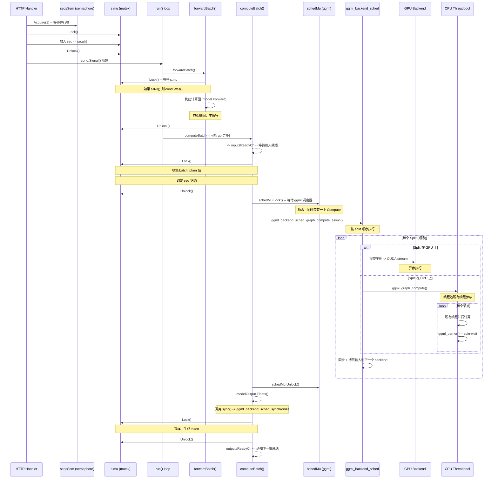
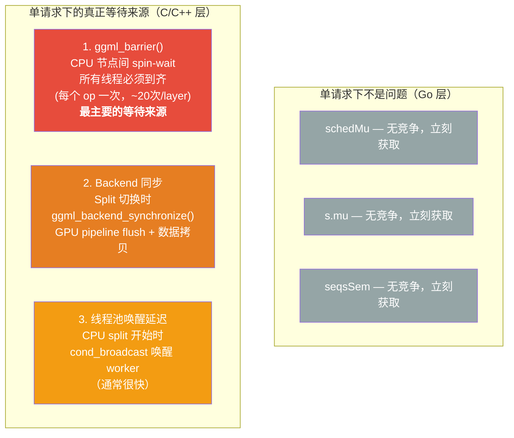

# Qwen3 + 部分 CPU Offload：单请求 Latency 高的原因分析

## 核心结论

**问题**：单个请求运行 Qwen3（GPU 内存不足，部分 layer offload 到 CPU）时，latency 明显偏高，且观测到线程在等待锁。

**根本原因**：不是 Go 层的锁竞争（单请求下那些锁没有竞争），而是 C/C++ 层内部的两类等待：

| 等待来源 | 发生频率 | 影响 |
|----------|----------|------|
| **ggml barrier（线程间 spin-wait）** | 每个 CPU op 后一次，~20次/layer | CPU 线程空转等待最慢的线程，CPU 利用率虚高但做功少 |
| **Backend 切换同步（GPU↔CPU）** | 每次 split 边界，通常 2-3 次 | cudaStreamSynchronize 阻塞 + cudaMemcpy 数据拷贝 |

加上 CPU 计算本身就比 GPU 慢很多，这三个因素叠加导致了高 latency。

---

## 1. 场景描述

当 GPU 内存不足以容纳整个 qwen3 模型时，部分 layer 被放到 CPU 上运行。ggml scheduler 会把计算图切割成多个 split，在 CPU 和 GPU 之间交替执行。

**关键背景**：我们观测到的问题发生在**单个请求**的情况下——不是多请求并发。这意味着 Go 层的 `schedMu`、`seqsSem` 等多请求竞争锁**不是问题所在**。真正的等待发生在 C/C++ 层内部。

## 2. Qwen3 的执行路径

Qwen3 走 **ollamarunner**（新引擎）路径。模型在 `model/models/qwen3/` 中用 Go 实现。

```
model.Register("qwen3", New)  // model/models/qwen3/model.go:260
```

Forward 函数构建计算图（注意：此时只是构建图，还没有执行）：

```go
// model/models/qwen3/model.go:184-203
func (m *Model) forward(ctx ml.Context, batch input.Batch) {
    hiddenStates = m.TokenEmbedding.Forward(ctx, batch.Inputs)  // 在 CPU (input)
    for i, layer := range m.Layers {
        // 每个 layer: AttentionNorm -> Q/K/V -> RoPE -> Attention -> MLP
        // 某些 layer 的权重在 GPU，某些在 CPU
        hiddenStates = layer.Forward(ctx, hiddenStates, ...)
    }
    return m.OutputNorm.Forward(ctx, hiddenStates, m.eps)
}
```

## 3. 完整的锁等待链路

下面用 Mermaid 序列图展示一次推理请求中所有锁/等待点：



## 4. 单请求场景下的等待来源

> **重要**：以下分析针对**单个请求**。Go 层的 `schedMu`、`s.mu`、`seqsSem` 在单请求下不会有竞争（没有其他 goroutine 在抢），所以它们**不是你看到的问题**。真正的等待发生在 C/C++ 层。



### 4.1 `ggml_barrier()` -- 最主要的等待来源

**文件**: `ml/backend/ggml/ggml/src/ggml-cpu/ggml-cpu.c:549-585`

当 split 在 CPU 上执行时，ggml 线程池的所有线程遍历每个节点，**每个节点后都有 barrier**。Barrier 是 **spin-wait**（busy loop）：

```c
// 简化逻辑
if (我是最后到达的线程) {
    重置 barrier; 通知大家继续;
} else {
    while (barrier 没通过) {
        _mm_pause();  // CPU 空转等待
    }
}
```

对于 qwen3 的一个典型 CPU layer（约 20+ 个 op：RMSNorm, Q/K/V matmul, RoPE, attention, FFN gate/up/down matmul...），这意味着 **~20 次 barrier 同步**。

**为什么这在单请求下也是问题**：
- 即使只有一个请求，CPU split 仍然用**所有线程**遍历所有 op
- 如果某个 op 的工作量在线程间不均衡（比如 matmul 的 chunk 大小不整除线程数），快线程会空转等慢线程
- 对于小 op（RMSNorm, reshape, view 等），barrier 的开销可能**超过计算本身**
- 线程越多，barrier overhead 越大——8 线程等 1 个慢线程，7 个都在空转

**如果你用 profiler 看到的是"多个线程在 spin-wait 同一个地址"**，那几乎可以确定就是 barrier。

### 4.2 Backend 切换同步

**文件**: `ml/backend/ggml/ggml/src/ggml-backend.cpp:1480-1614`

每次从 GPU split 切换到 CPU split（或反过来）时：

```
GPU split 完成 → ggml_backend_synchronize(GPU)   // flush GPU pipeline, 等 GPU 做完
               → cudaMemcpy(GPU→CPU)              // 拷贝中间张量到 CPU（阻塞）
CPU split 执行 → ggml_graph_compute()             // 全部 CPU 线程参与
CPU split 完成 → cudaMemcpy(CPU→GPU)              // 拷贝结果回 GPU（阻塞）
```

**单请求下这也是明显等待**：`ggml_backend_synchronize(GPU)` 本质是 `cudaStreamSynchronize`——它会阻塞调用线程直到 GPU 上所有排队操作完成。

### 4.3 Go 层的锁（单请求下不是问题）

在单请求场景下，以下锁都不会有竞争，可以忽略：
- **`schedMu`** (`ggml.go:91`)：只有一个 goroutine 在 Compute，立刻获取
- **`s.mu`** (`runner.go:368`)：只有一个请求在操作序列状态，立刻获取
- **`seqsSem`** (`runner.go:378`)：只有一个请求，立刻通过

这些锁只在**多请求并发**时才会产生竞争。

## 5. 部分 Offload 时的 Split 模式

假设 qwen3-30B 有 48 层，GPU 只能装 30 层：

```mermaid
graph LR
    subgraph "Split 1 - CPU"
        E[token_embd]
    end
    subgraph "Split 2 - GPU"
        L0[Layer 0] --> L1[Layer 1] --> L2["..."] --> L29[Layer 29]
    end
    subgraph "Split 3 - CPU"
        L30[Layer 30] --> L31["..."] --> L47[Layer 47]
    end
    subgraph "Split 4 - GPU or CPU"
        ON[output_norm] --> O[output]
    end

    E -->|"sync+copy"| L0
    L29 -->|"sync+copy"| L30
    L47 -->|"sync+copy"| ON

    style E fill:#4a9eff,color:white
    style L0 fill:#2ecc71,color:white
    style L1 fill:#2ecc71,color:white
    style L2 fill:#2ecc71,color:white
    style L29 fill:#2ecc71,color:white
    style L30 fill:#4a9eff,color:white
    style L31 fill:#4a9eff,color:white
    style L47 fill:#4a9eff,color:white
    style ON fill:#4a9eff,color:white
    style O fill:#4a9eff,color:white
```



每个 `sync+copy` 处都是阻塞等待点：
- GPU->CPU: 必须等 GPU 完成所有 pending 操作（pipeline flush）
- CPU->GPU: 必须等 CPU 完成计算，然后 cudaMemcpy 拷贝张量

## 6. 时间线分析

```mermaid
gantt
    title 单次推理 Token 生成 - 部分 CPU Offload
    dateFormat X
    axisFormat %s

    section Go 层
    seqsSem.Acquire         :a1, 0, 1
    s.mu (forwardBatch)     :a2, 1, 5
    构建计算图              :a3, 2, 5
    s.mu (computeBatch 收集):a4, 6, 8
    schedMu (整个 Compute)  :crit, a5, 9, 55
    s.mu (采样解码)         :a6, 56, 60

    section ggml 调度器
    Split1 CPU token_embd   :b1, 10, 12
    sync+copy CPU-GPU       :crit, b2, 12, 14
    Split2 GPU Layer 0-29   :b3, 14, 30
    sync+copy GPU-CPU       :crit, b4, 30, 33
    Split3 CPU Layer 30-47  :b5, 33, 50
    sync+copy CPU-GPU       :crit, b6, 50, 52
    Split4 output           :b7, 52, 54

    section CPU 线程池
    Layer 30 计算 20 ops    :c1, 33, 37
    Layer 31 计算            :c2, 37, 41
    Layer 32-47              :c3, 41, 50

    section 等待
    barrier spin-wait        :done, d1, 33, 50
```



**关键观察**：
- `schedMu` 从时间 9 到 55 一直被持有 -- 这段时间内**任何其他 batch 都无法计算**
- CPU split（Layer 30-47）是最慢的部分，它直接拉长了 `schedMu` 的持有时间
- 每次 sync+copy（红色区段）都是 pipeline stall

## 7. 单请求下观测到的"线程等待"的可能原因

| 观测现象 | 最可能的原因 | 详细 |
|----------|-------------|------|
| **多个线程在 spin-wait 同一个地址** | `ggml_barrier()` | CPU op 间的 barrier，快线程空转等慢线程。这是单请求下**最常见的等待** |
| **CPU 利用率高但吞吐低** | barrier + 小 op 开销 | 大量时间花在 barrier 同步而非实际计算，线程越多越明显 |
| **偶尔长时间暂停** | `ggml_backend_synchronize(GPU)` | GPU→CPU 切换时 flush 整个 GPU pipeline（`cudaStreamSynchronize`） |
| **latency 远超纯 GPU 推理** | CPU split 本身慢 + 切换开销 | CPU 计算速度远低于 GPU，加上每次切换的 sync+copy 时间 |
| **某些 op 耗时异常长** | 工作分配不均衡 | matmul chunk 不整除线程数时，最后一个线程的负载更重，其他线程等它 |

## 8. 补充：流水线机制（多请求场景参考）

> 以下内容与单请求场景无关，但有助于理解整体架构。

ollamarunner 试图做 **流水线并行**（`runner.go:464`）：当 Batch N 在计算时，可以同时构建 Batch N+1 的计算图。但计算本身受 `schedMu` 保护，严格串行。

对于单请求，每次只生成一个 token 的 batch，没有 overlap 的机会。latency 完全取决于单次 `ggml_backend_sched_graph_compute_async` 的执行时间——也就是所有 split 顺序执行的总时间。

## 9. 优化方向建议

1. **减少 CPU split 数量**：尽量把更多 layer 放到 GPU 上（哪怕用更激进的量化）
2. **减少 backend 切换**：连续的 CPU layer 优于交替的 CPU/GPU layer
3. **调整 n_threads**：CPU split 的线程数应匹配物理核心数，过多线程会增加 barrier 开销
4. **调整 poll 参数**：如果 CPU 利用率过高但吞吐低，可以降低 polling 级别
5. **考虑 KV cache 类型**：量化 KV cache（如 q8_0）可以减少每层的内存需求，可能多装几层到 GPU
