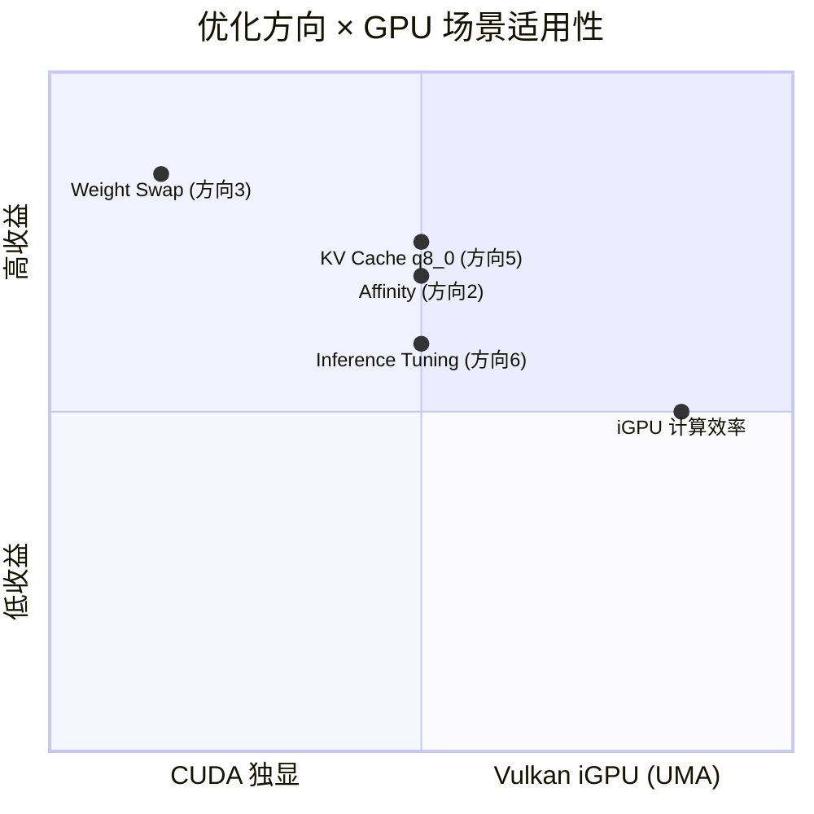
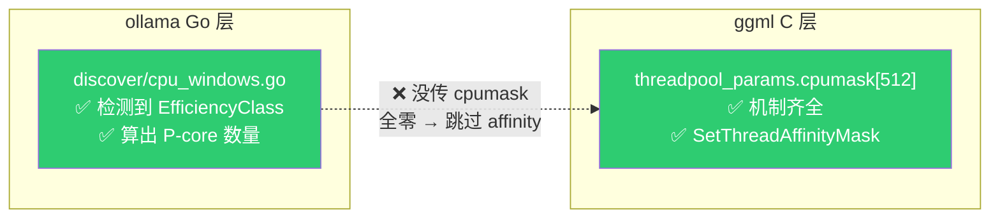
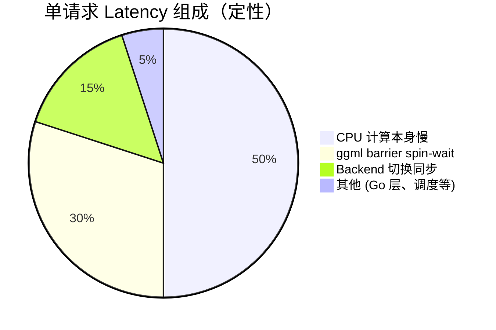
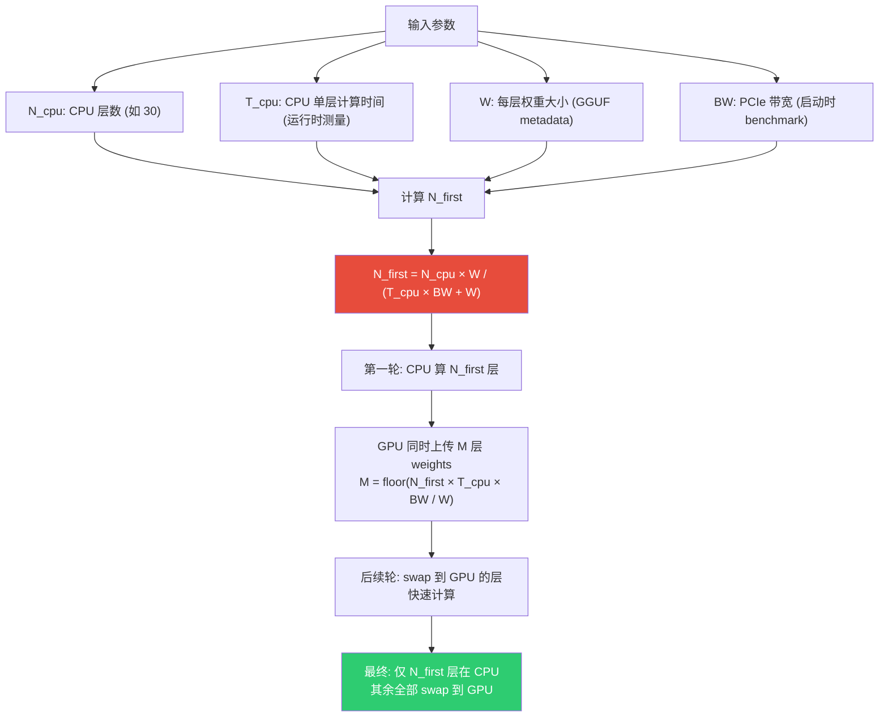
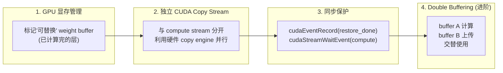
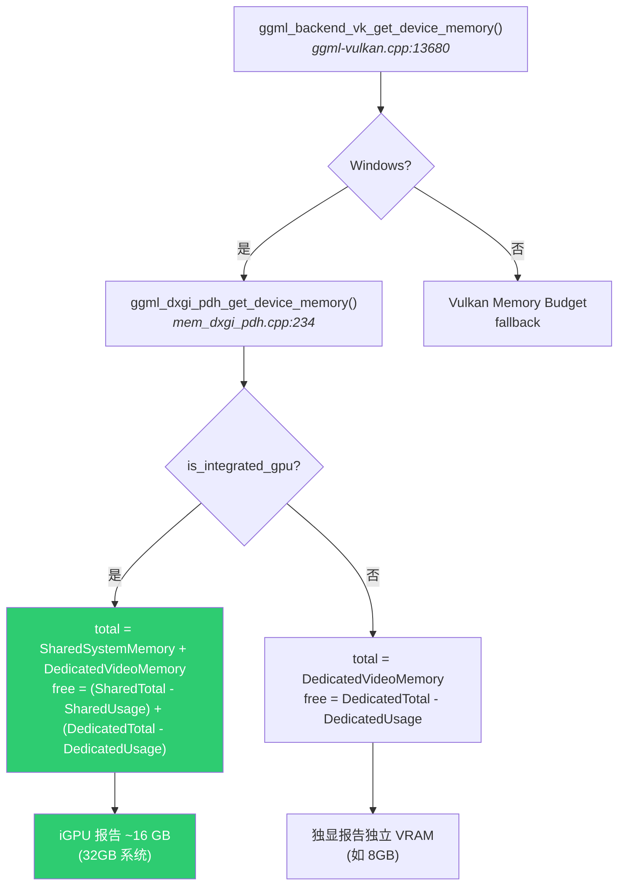
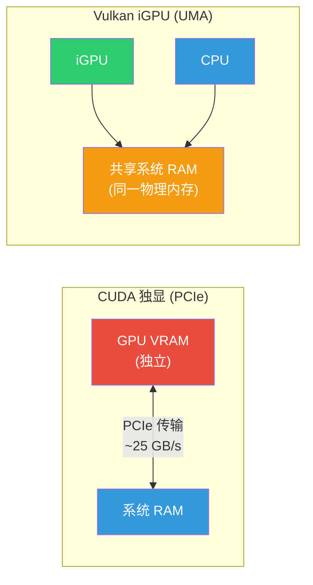

# CPU Offload Latency 优化讨论备忘录

> **创建日期**: 2026-03-24
> **背景**: 运行 Qwen3 模型，GPU 内存不够导致部分 layer offload 到 CPU，单请求 latency 高，观测到线程锁等待
> **机器**: Windows 11, Intel 大小核 (P-core + E-core)
> **GPU 场景**: 考虑两种——CUDA 独显 和 Vulkan Intel iGPU (UMA)

---

## 优化方向总览

| # | 方向 | 状态 | 复杂度 | 预期收益 | 适用场景 | 简述 |
|---|------|------|--------|----------|----------|------|
| 1 | [动态调整 n_threads](#方向-1-动态调整每个-op-的-n_threads--否决) | ❌ 否决 | 高 | 5-15% | 通用 | 小 op 跳过 barrier；改动涉及 ggml 核心同步，收益有限 |
| 2 | [CPU Affinity 绑 P-core](#方向-2-cpu-affinity-绑定-p-core--优先探索) | ✅ 优先 | 低 | 中~高 | 大小核机器 | 把线程固定到 P-core，避免 E-core 拖慢 barrier |
| 3 | [Weight Swapping](#方向-3-weight-swapping--gpu-空闲时预加载权重--高潜力) | ✅ 高潜力 | 高 | 单 token -200~1000ms | **CUDA 独显** | GPU 空闲时上传后续层权重，减少 CPU split 层数 |
| 4 | [小 op Work-Stealing](#已否决的方向) | ❌ 否决 | 中 | 极低 | 通用 | 小 op 本身不是瓶颈，MatMul 已经 work-stealing |
| 5 | [KV Cache 量化](#方向-5-kv-cache-量化--短平快推荐) | ✅ 短平快 | 极低 | 中~高（长 context） | 通用 | KV cache q8_0 省 VRAM → 多装 GPU layers → 减少 CPU split |
| 6 | [Profile-Guided Inference Tuning](#方向-6-profile-guided-inference-tuning--未来方向) | 🔮 未来 | 高 | 潜力大 | 通用 | 基于 profiling 数据系统性调优 50+ 推理运行时参数 |

### 按 GPU 场景的适用性



> **要点**：Weight Swap 主要适用于 CUDA 独显（GPU 快但显存不够）；iGPU (UMA) 小模型不 split，大模型拷贝免费，瓶颈在计算能力。

---

## 已确认的事实

### 现状

- Ollama 默认 `n_threads = P-core 数量`，已排除 E-core（`discover/gpu.go:34-35`）
- **没有用 CPU affinity 绑定线程到 P-core**——ggml 有完整的 affinity 机制，但 ollama Go 层没传 cpumask，全是默认零值
- ggml 线程池在模型加载时创建，持久复用，不会每次请求重建
- 单请求场景下，Go 层的锁（`schedMu`, `s.mu`, `seqsSem`）没有竞争，不是问题
- Layer 分配是**静态的**——模型加载时一次性决定，运行时不变（`llm/server.go:924 createLayout`）

### Affinity 管道现状



> 两端都有能力，中间差一个连接。

### 单请求 latency 的等待来源



1. **ggml barrier (spin-wait)** — 每个 CPU op 后所有线程同步，~20 次/layer，大小核速度差导致 P-core 空转等 E-core
2. **Backend 切换同步** — GPU↔CPU 的 `cudaStreamSynchronize` + `cudaMemcpy`，每次 split 边界一次
3. **CPU 计算本身慢** — 根本原因，offload 到 CPU 的 layer 计算速度远低于 GPU

### Qwen3 模型的层数

| 模型 | 层数 | 每层权重 (Q4 量化估计) |
|------|------|----------------------|
| Qwen3-8B | 32 | ~250 MB |
| Qwen3-14B | 40 | ~350 MB |
| Qwen3-30B | 48 | ~400 MB |
| Qwen3-32B | 64 | ~350 MB |
| Qwen3-235B (MoE) | 94 | 更大 |

具体 GPU 能装多少层由 `createLayout`（`server.go:924`）根据 GPU 剩余显存、每层权重+KV cache 大小动态计算。可在 ollama 启动日志中看到分配结果。

### n_threads 的使用方式

- 整个图计算期间固定，不能按 op 动态调整
- `ggml_get_n_tasks()` 知道每个 op 需要多少线程（有些只需要 1 个），但这只用于估算 work buffer 大小
- 运行时所有线程都进入每个 op，`n_tasks=1` 的 op 让 `ith>0` 的线程直接 return，然后在 barrier 空转

### 大小核的影响

- 大部分 op 用**等步长静态分片** `for (i = ith; i < total; i += nth)`，假设所有核心速度相同
- MatMul 是唯一用 work-stealing (`atomic_fetch_add` 抢 chunk) 的 op，天然适应大小核
- 其他 op（softmax, RoPE, RMSNorm, add, silu...）全是静态分片，E-core 拖慢所有线程

### CPU/GPU 数据拷贝开销

Split 之间拷贝的是 **hidden state**（不是权重），大小取决于 batch：

| 场景 | hidden state 大小 | 拷贝时间 (PCIe 4.0) |
|------|-------------------|---------------------|
| 单 token decode | hidden_size x 2 bytes ≈ 10 KB | < 1 微秒 |
| Prefill 512 tokens | hidden_size x 512 x 2 ≈ 5 MB | ~0.2 ms |

> **结论**：单 token decode 时 data copy 本身几乎不耗时，慢的是 copy 之前的 `cudaStreamSynchronize`（等 GPU 做完所有排队操作）。

---

## 优化方向详解

### 方向 1: 动态调整每个 op 的 n_threads ❌ 否决

- **思路**: 小 op（reshape, view, argmax）只用 1 线程时跳过 barrier
- **问题**:
  - 需要改 barrier 逻辑（当前 barrier 假设固定线程数参与），改动涉及 ggml 核心同步机制
  - 收益有限（5-15%），因为 matmul 是耗时大头且 barrier 必要
  - 连续 op 依赖关系和 work buffer 共享增加复杂度
- **改动位置**: ggml C 代码（`ggml-cpu.c`），ollama vendor 副本，理想应提 PR 到上游
- **结论**: 复杂度高、收益有限，暂不推荐

### 方向 2: CPU Affinity 绑定 P-core ✅ 优先探索

- **思路**: 把 ollama 已检测到的 P-core 信息（`EfficiencyClass`）传到 ggml 的 `threadpool_params.cpumask`，确保线程只跑在 P-core 上
- **为什么重要**:
  - 虽然 `n_threads` 已排除 E-core 数量，但 Windows 调度器**不保证**只把线程放到 P-core
  - 一旦有线程跑在 E-core 上，所有 barrier 都被拖慢（E-core 单线程性能约为 P-core 的 40-60%）
  - 管道两端机制已齐全，只差中间连接
- **实施路径**:
  1. 先用 `start /affinity` 或 Process Explorer 手动验证效果
  2. 如果有效，在 Go 层把 P-core mask 传到 ggml `threadpool_params.cpumask`
- **复杂度**: 低
- **状态**: 待验证

### 方向 3: Weight Swapping — GPU 空闲时预加载权重 ✅ 高潜力

#### 核心思路

当前部分 offload 的执行模式中，GPU 在 CPU split 期间**完全空闲**。利用这段空闲时间，把后续 CPU 层的权重上传到 GPU 上（替换掉已经计算完、暂时不需要的 GPU 层权重），让这些层也能在 GPU 上执行。

#### 执行流程图

假设模型有 100 层，GPU 原本装 0-69 层，CPU 要算 70-99 层：

```mermaid
gantt
    title 当前（无 swap）— 单 Token
    dateFormat X
    axisFormat %s

    section GPU
    Layer 0-69 计算              :gpu1, 0, 20
    空闲等待 CPU                  :done, idle1, 20, 70
    Output                       :gpu2, 70, 75

    section CPU
    空闲等待 GPU                  :done, cidle1, 0, 20
    Layer 70-99 慢慢算            :crit, cpu1, 20, 70

    section 数据拷贝
    state GPU→CPU                :milestone, m1, 20, 20
    state CPU→GPU                :milestone, m2, 70, 70
```

```mermaid
gantt
    title 优化后（weight swap）— 单 Token
    dateFormat X
    axisFormat %s

    section GPU
    Layer 0-59 计算              :gpu1, 0, 17
    上传 L80-89 weights          :active, upload1, 17, 30
    L80-89 计算                  :gpu2, 32, 35
    上传 L90-99 weights          :active, upload2, 35, 42
    L90-99 计算                  :gpu3, 42, 45
    Output                       :gpu4, 45, 48

    section CPU
    空闲                          :done, cidle1, 0, 17
    Layer 70-79 计算              :crit, cpu1, 17, 32
    空闲                          :done, cidle2, 32, 48

    section 恢复 (下一 token)
    L0-49 计算时后台恢复 L60-69   :active, restore, 48, 62
```





> **关键**：CPU 算 L70-79 的时间里，GPU 同时上传 L80-89 的 weights；CPU 算完后，后续层全在 GPU 上快速完成。

#### 关键路径分析

**新增的关键路径开销**（仅此而已）：
- 每轮多 2 次 hidden state copy（CPU→GPU, GPU→CPU）
- 单 token decode 时 hidden state ≈ 10 KB → 不到 1 微秒/次
- **可忽略不计**

**不在关键路径上的操作**（利用空闲时间完成）：
- Weight 上传：在 GPU 空闲时完成
- Weight 恢复：在下一 token 前几十层的 GPU 计算时间内完成

#### 数字估算

**Weight 上传时间 vs CPU 计算时间**（以 Qwen3-30B Q4 为例）：

| 参数 | 值 |
|------|-----|
| 每层权重大小 (Q4) | ~400 MB |
| 10 层权重 | ~4 GB |
| PCIe 4.0 x16 带宽 | ~25 GB/s |
| PCIe 3.0 x16 带宽 | ~12 GB/s |
| **上传 10 层耗时 (PCIe 4.0)** | **~160 ms** |
| **上传 10 层耗时 (PCIe 3.0)** | **~330 ms** |
| CPU 每层计算时间 (单 token) | ~20-50 ms |
| **CPU 算 10 层耗时** | **~200-500 ms** |

> **结论：CPU 计算 10 层的时间 >= 上传 10 层 weights 的时间。装得下！**

**收益估算**：

| 场景 | 单 token latency |
|------|-----------------|
| 当前：30 层全在 CPU 算 | ~600-1500 ms |
| Swap 10 层到 GPU | 20 层 CPU + 10 层 GPU ≈ 400-1050 ms + ~5-25 ms |
| Swap 全部到 GPU（多轮） | 10 层 CPU（第一轮必须）+ 20 层 GPU ≈ 200-500 ms + ~10-50 ms |

> **单 token 可节省 ~200-1000 ms**，取决于具体配置。

#### 动态计算最优 swap 层数

不需要固定 swap 多少层——可以根据运行时参数动态计算：



#### 实现要点



#### 潜在问题

| 问题 | 应对 |
|------|------|
| GPU 显存不够放 swap buffer | swap buffer 复用被替换层的空间，不需要额外显存 |
| 恢复权重来不及 | 有 event 同步保护；且 L0-49 的计算时间通常远大于恢复时间 |
| 实现复杂度高 | 需要改 ggml backend scheduler 的 buffer 管理和 split 执行逻辑 |
| 首 token 没有"已计算完的层"可替换 | 首 token (prefill) 通常 GPU 部分就很慢，swap 收益更大 |
| 模型层大小不均（如 MoE） | 需要按实际层大小计算，不能简单按层数等分 |

#### 已有先例（业界参考）

| 项目 | 做法 | 与我们方案的关系 |
|------|------|-----------------|
| **DeepSpeed ZeRO-Offload** | 训练时将 optimizer state offload 到 CPU，计算时 prefetch 回 GPU | 思路相同：利用计算时间 overlap 数据传输 |
| **FlexGen** (Stanford, 2023) | 推理时 weight/activation/KV cache 三级 offload，overlapping schedule | 最接近的先例，已验证在推理场景可行 |
| **HuggingFace Accelerate** | `disk_offload` + `prefetch`，layer-by-layer weight prefetch | 类似思路但粒度更粗 |
| **PowerInfer** (SJTU, 2024) | 热神经元放 GPU，冷神经元放 CPU，利用激活稀疏性 | 不同路线但同样利用 GPU/CPU 协作 |

> **注意**：ollama / llama.cpp / ggml 目前没有任何 weight swap 或 prefetch 的实现。Layer 分配在模型加载时静态确定（`llm/server.go:924 createLayout`），运行时不变。

#### 评估总结

| 维度 | 评估 |
|------|------|
| **可行性** | 可行，数字对得上（上传时间 <= CPU 空闲时间） |
| **收益** | 显著，单 token 可节省 200-1000 ms |
| **关键路径新增开销** | 仅 hidden state copy（~10KB/次，微秒级） |
| **实现复杂度** | 高——需改 ggml backend 的 buffer 管理、split 调度、CUDA stream 管理 |
| **改动位置** | 主要在 `ggml-backend.cpp`（split 执行逻辑）和 `ggml-cuda.cu`（stream 管理） |
| **业界验证** | FlexGen、DeepSpeed 等已验证类似思路 |
| **适用场景** | **CUDA 独显 + PCIe**（UMA 场景意义有限，见下方分析） |
| **状态** | 讨论中，需要 POC 验证 |

---

### 已否决的方向

**~~动态调整每个 op 的 n_threads~~** ❌
- 需要改 barrier 逻辑，复杂度高
- 收益有限（5-15%），matmul 是耗时大头且 barrier 必要

**~~把更多 op 改成 work-stealing~~** ❌
- 这些小 op 本身工作量不大，不适合太多线程，多线程收益有限
- MatMul 已经是 work-stealing 了，占 CPU split ~80-90% 计算时间
- 改了小 op 也省不了多少时间——瓶颈不在这里

### 方向 5: KV Cache 量化 ✅ 短平快推荐

#### 背景：模型权重量化 ≠ KV Cache 量化

一个常见误解：下载的模型文件可能是 Q4_K_M 或 Q8_0 量化，但这只是**模型权重**的量化。推理过程中动态生成的 **KV Cache 默认始终用 f16** 存储。

```
模型权重 (Q4_K_M)  ──→  存储在 GGUF 文件中，下载时确定
KV Cache (默认 f16) ──→  推理时动态生成，按 max context length 一次性预分配
```

KV Cache 量化是一个**独立的优化维度**，通过环境变量控制：

```bash
OLLAMA_FLASH_ATTENTION=1 OLLAMA_KV_CACHE_TYPE=q8_0 ollama serve
```

> **注意**：量化 KV Cache 要求 Flash Attention 开启（`llm/server.go:225-228`）。

#### KV Cache 的分配方式

KV Cache **不是**按需增长的——是在模型加载时**按完整 context length 一次性预分配**到显存中：

```
每层 KV Cache = context_length × (head_dim_k + head_dim_v) × num_kv_heads × bytes_per_element
```

这意味着 context 越长，KV Cache 占用的显存越大。对于 split 模型，这块显存直接挤占了本来可以放 weight 的空间。

#### 代码路径

| 位置 | 作用 |
|------|------|
| `fs/ggml/ggml.go:636` | Go 层估算每层 KV cache 大小，用于 `createLayout` 决定 GPU 层数 |
| `fs/ggml/ggml.go:908-919` | `kvCacheBytesPerElement()`: f16→2, q8_0→1, q4_0→0.5 |
| `llm/server.go:212-257` | 读取 `OLLAMA_KV_CACHE_TYPE`，校验 Flash Attention 依赖 |
| `llama-kv-cache.cpp:133-134` | C++ 层按 `kv_size`（= context length）分配 K/V tensor |
| `llama-model.cpp:7222-7229` | `new llama_kv_cache(..., cparams.n_ctx_seq, ...)` 传入完整 context |

#### 数字分析

**f16 vs q8_0 的 VRAM 节省和额外 GPU 层数**（假设 Q4_K_M 权重）：

| 模型 | Context | f16 KV Cache | q8_0 KV Cache | 省出 VRAM | 可多装 GPU 层数 |
|------|---------|-------------|---------------|-----------|---------------|
| 32B | 4K | 1.0 GB | 0.5 GB | 0.5 GB | ~1 层 |
| 32B | 8K | 2.0 GB | 1.0 GB | 1.0 GB | ~3 层 |
| 32B | 32K | 8.0 GB | 4.0 GB | 4.0 GB | ~10 层 |
| 72B | 4K | 1.3 GB | 0.6 GB | 0.6 GB | ~1 层 |
| 72B | 8K | 2.6 GB | 1.3 GB | 1.3 GB | ~2 层 |
| 72B | 32K | 10.2 GB | 5.1 GB | 5.1 GB | ~8 层 |

> 计算基于 Qwen 系列参数：head_dim=128, num_kv_heads=8 (GQA)。"可多装 GPU 层数"考虑了新层自身的 weight + KV cache 占用。

#### Agent 场景下的收益

Agent 使用场景（工具调用、多轮对话、长上下文）通常消耗 8K-32K+ context。在这个范围内：

- **每少一层 CPU split ≈ 省 20-50ms/token**（CPU 计算远慢于 GPU）
- **32K context + 32B 模型**：q8_0 可多装 ~10 层 → **省 ~200-500ms/token**
- **32K context + 72B 模型**：q8_0 可多装 ~8 层 → **省 ~160-400ms/token**

这些是**非常显著**的 latency 改善，而且**零代码改动**。

#### 准确率影响

| KV Cache 类型 | 准确率影响 | 说明 |
|--------------|-----------|------|
| f16 (默认) | 无 | baseline |
| **q8_0** | **几乎无损** | perplexity 差异 < 0.1%，实际使用感知不到 |
| q4_0 | 可衡量下降 | 长上下文累积误差更明显，不推荐用于 agent |

准确率影响与 context 长度相关——context 越长，KV cache 中累积的量化误差越多。但 q8_0 即使在 128K context 下仍然非常稳定。

#### 计算开销

- Attention 读取 KV cache 时需要 dequantize（q8_0: `scale × int8`，一次乘法）
- 但 decode 阶段 attention 是 **memory-bandwidth bound**（瓶颈是从显存读数据，不是算力）
- q8_0 数据量减半 → 读显存更少 → 净效果可能**更快**而非更慢

#### 评估总结

| 维度 | 评估 |
|------|------|
| **可行性** | 即刻可用，两个环境变量 |
| **收益** | 与 context 长度成正比。Agent 场景（8K-32K）下显著 |
| **准确率** | q8_0 几乎无损 |
| **计算开销** | 净效果接近零或微正（省带宽 > dequant 开销） |
| **复杂度** | 极低 — 零代码改动 |
| **适用场景** | 通用，尤其适合长 context + split 模型 |
| **前置条件** | 需要 Flash Attention 开启 |
| **状态** | 推荐立即启用测试 |

### 方向 6: Profile-Guided Inference Tuning 🔮 未来方向

思想类比编译器 PGO（Profile-Guided Optimization）：编译器 PGO 先跑 workload 收集热点路径，再据此优化指令选择和分支布局；同理，我们收集推理 workload 的算子/线程级 profiling 数据，据此**调优 ollama/ggml 的 50+ 推理运行时参数**。区别有二：(1) 作用层面不同——不是编译器指令级别，而是推理引擎的运行时参数；(2) 不局限于离线——除了像编译器 PGO 那样离线 profile 生成静态配置，未来也可以**在线动态收集数据、动态调整参数**。

#### 问题

ollama + ggml 有 **50+ 可调运行时参数**，分布在三个层次：

| 层次 | 示例参数 | 特点 |
|------|---------|------|
| **Go 层** | `num_gpu`, `num_batch`, `num_thread`, `KV cache type`, `flash_attention` | 运行时可调，无需重编译 |
| **ggml C 层** | `poll`, `cpumask`, `chunk_size`, `prio`, `SCHED_MAX_COPIES` | 线程池参数 + 编译时常量 |
| **GPU Kernel 层** | CUDA block sizes, Vulkan BM/BN/BK tiling | 编译时常量，暂缓 |

当前这些参数要么用默认值，要么凭经验手动设置。**不同模型 × 不同硬件 × 不同 context 长度的最优参数组合可能完全不同**。例如：
- `num_thread`：P-core 数不一定是最优值——线程过多增加 barrier 等待，过少计算不饱和
- `num_gpu`（split 点）：auto 基于 VRAM 估算，不考虑实际计算耗时分布
- `poll`（线程唤醒轮询强度）：默认 50，对 CPU 层较多的 split 模型可能需要调整
- `chunk_size`（MatMul work-stealing 粒度）：影响大小核负载均衡

#### 思路

借鉴编译器 PGO 的理念——**先 profile，再基于数据调参**：

1. 通过 instrumentation 收集算子/图级别的 profiling 数据（per-op 耗时、线程利用率、barrier 等待等）
2. 分析数据识别瓶颈和调优机会
3. 在参数空间中搜索最优配置（静态预设或动态自适应）
4. 存储为 **per-model × per-hardware 的推荐参数集**

#### 已有基础

| 组件 | 状态 | 说明 |
|------|------|------|
| Per-op tracing | ✅ 已实现 | `llm/profiler/`，JSONL 格式，`OLLAMA_TRACE_DIR` 控制 |
| Trace analyzer | ✅ 已实现 | `tools/trace-analyzer/`，Python CLI + React SPA（DAG/Timeline/Hotspot） |
| Vulkan per-op timing | ✅ 可用 | `GGML_VK_PERF_LOGGER=1` |
| Thread/barrier instrumentation | ❌ 缺失 | 无法拆分 per-op 时间中的 compute vs barrier wait |
| Split 边界同步耗时 | ❌ 缺失 | `cudaStreamSynchronize` 在 eval callback 之外不可见 |

#### 计划方向

1. **补齐 observability**：优先实现 thread/barrier instrumentation（`ggml-cpu.c` worker 线程循环中加打点），以及 split 边界同步耗时记录
2. **集成 perftune-agent**（`c:/workspace/perftune-agent`）：利用其 AI 驱动的 profile → analyze → optimize 闭环，由 myollama 提供 domain knowledge 和 instrumentation skills
3. **分阶段推进**：先用已有 trace 做 Go 层参数的 expert-driven 快攻（方向 2、5 属于此类），再基于 thread instrumentation 数据做第二层参数的 targeted sweep

> 详细的参数清单、方案设计和 brainstorming 记录见 [`docs/superpowers/plans/2026-03-24-pgo-brainstorm-state.md`](2026-03-24-pgo-brainstorm-state.md)。

---

## Intel iGPU (UMA) 场景分析 ✅ 已确认

### 核心发现：iGPU 报告的内存很大，小模型无需 split

**内存报告机制**（Windows + Vulkan）：



**实际数字**（以 32GB 系统 Intel iGPU 为例）：

| 内存类型 | 典型值 | 说明 |
|----------|--------|------|
| SharedSystemMemory | ~16 GB | DXGI 报告，约系统 RAM 的一半 |
| DedicatedVideoMemory | 128-512 MB | BIOS 分配给 iGPU 的固定 VRAM |
| **iGPU 报告总内存** | **~16 GB** | 足以装下大部分 Q4 量化模型 |

**是否需要 split？**

| 模型 | Q4 量化大小估计 | 32GB 系统 iGPU (~16GB) | 需要 split? |
|------|----------------|----------------------|------------|
| Qwen3-8B | ~5 GB | ✅ 全部放入 GPU | 否 |
| Qwen3-14B | ~9 GB | ✅ 全部放入 GPU | 否 |
| Qwen3-30B | ~19 GB | ❌ 超出 | 是，但比独显场景好 |
| Qwen3-32B | ~20 GB | ❌ 超出 | 是 |

### UMA 场景下 split 的特殊性

即使大模型在 UMA 上需要 split，情况也比独显好得多：



1. **数据"拷贝"几乎免费**：CPU 和 GPU 共享同一物理内存，无 PCIe 瓶颈
2. **Vulkan backend 已有零拷贝优化**：
   - `ggml-vulkan.cpp:2448-2451`：UMA buffer 用 HostVisible+HostCoherent（同一物理内存）
   - `ggml-vulkan.cpp:5807-5809`：UMA tensor 通过 `ggml_vk_host_get` 直接访问
   - `ggml-vulkan.cpp:6227-6230`：UMA 读取路径用 `memcpy` 替代 GPU copy command
   - `ggml-vulkan.cpp:6698-6702`：UMA MatMul 输入直接用 host pointer 作 GPU buffer
3. **Backend 切换同步开销大幅降低**：没有 PCIe 传输延迟，只有 Vulkan pipeline flush

### 各优化方向在 UMA 下的适用性

| 优化 | CUDA 独显 | Vulkan iGPU (UMA) | 说明 |
|------|-----------|-------------------|------|
| CPU Affinity (方向 2) | ✅ 有用 | ✅ 有用 | 大小核问题与 GPU 类型无关 |
| Weight Swap (方向 3) | ✅ 高潜力 | ⚠️ 意义有限 | UMA 下 weight "上传"在同一内存，瓶颈是 GPU 计算能力 |
| KV Cache q8_0 (方向 5) | ✅ 有用 | ✅ 有用 | 通用：省 VRAM 多装 GPU layers，长 context 效果更好 |
| **提升 iGPU 计算效率** | N/A | ✅ 新方向 | iGPU 计算能力有限，Vulkan shader 优化可能是关键 |
| Inference Tuning (方向 6) | ✅ 有用 | ✅ 有用 | 未来方向：per-model per-hardware 参数自动调优 |

### 关键结论

> **对于 Intel iGPU + UMA 场景，Weight Swap 的意义大幅降低**——因为 (1) 小模型根本不 split，(2) 即使 split，数据拷贝已经是零拷贝。真正的瓶颈变成 **iGPU 本身的计算能力**（远弱于独显）和 **CPU split 的计算速度**。
>
> Weight Swap 主要适用于 **CUDA 独显 + PCIe** 场景，其中 GPU 很快但显存不够，PCIe 传输是可以被 overlap 的开销。

---

## 待验证 / 待讨论

- [ ] 确认线程是否真的被调度到 E-core（Process Explorer 验证）
- [ ] 测试 affinity 绑定 P-core 后的 latency 变化
- [ ] 评估把 affinity 信息从 ollama Go 层传到 ggml 线程池的可行性
- [ ] Weight swap POC：在 ggml 中实现最简单的单轮 swap，验证收益（**仅 CUDA 独显场景**）
- [ ] 测量实际的 PCIe 带宽和 CPU 每层计算时间，代入公式计算最优 swap 层数
- [ ] 调研 FlexGen 的 overlapping schedule 实现细节
- [ ] 在实际 Intel iGPU 机器上确认 DXGI 报告的 SharedSystemMemory 值
- [ ] 测量 iGPU Vulkan 场景下的 split 实际开销（是否如预期接近零）

---

## 参考文档

### 内部文档

- [线程分析主报告](../threading-analysis-report.md)
- [Qwen3 单请求 Latency 分析](../qwen3-cpu-offload-lock-analysis.md)

### 外部参考

- FlexGen: High-Throughput Generative Inference of Large Language Models with a Single GPU (Stanford, 2023)
- DeepSpeed ZeRO-Offload: Democratizing Billion-Scale Model Training (Microsoft, 2021)
- PowerInfer: Fast Large Language Model Serving with a Consumer-grade GPU (SJTU, 2024)

### 关键代码路径

| 文件 | 行号 | 内容 |
|------|------|------|
| `discover/cpu_windows.go` | | E-core 检测（`EfficiencyClass`） |
| `discover/gpu.go` | 34-35 | `n_threads = CoreCount - EfficiencyCoreCount` |
| `llm/server.go` | 924 | `createLayout` 静态 layer 分配 |
| `llm/server.go` | 939 | `buildLayout` 按 GPU 显存分配层 |
| `ggml.c` | 7584-7591 | `threadpool_params` 默认值（cpumask 全零） |
| `ggml-cpu.c` | 3040-3044 | worker 线程 affinity 设置 |
| `ggml-cpu.c` | 2431-2462 | Windows `SetThreadAffinityMask` 实现 |
| `ggml-cpu.c` | 2921-2963 | 图计算线程循环 |
| `ggml-cpu.c` | 549-585 | barrier 实现 |
| `ggml-cpu.c` | 1228-1420 | MatMul work-stealing |
| `ggml-backend.cpp` | 1480-1664 | split 执行逻辑（weight swap 改动点） |
| `mem_dxgi_pdh.cpp` | 234-278 | iGPU 内存报告（DXGI+PDH） |
| `ggml-vulkan.cpp` | 13680-13757 | Vulkan 内存查询 |
| `ggml-vulkan.cpp` | 2448-2451 | UMA buffer 零拷贝分配 |
| `ggml-vulkan.cpp` | 5807-5809 | UMA tensor 直接访问 |
| `ggml-vulkan.cpp` | 6698-6702 | UMA MatMul 零拷贝 |
