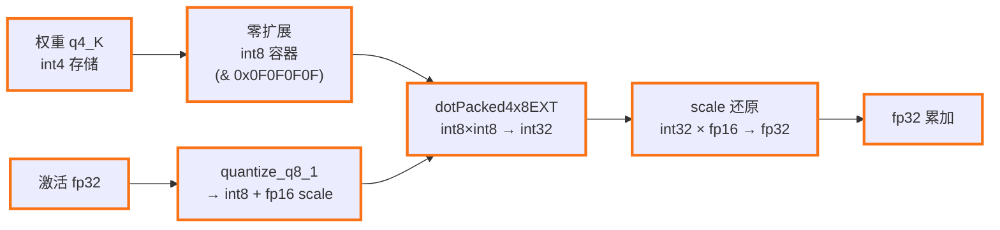
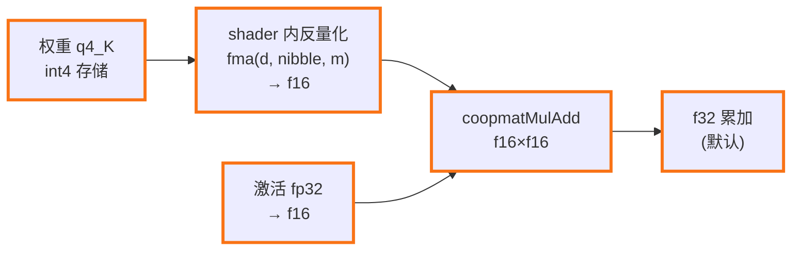
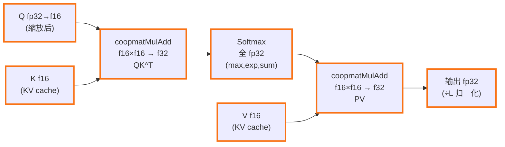
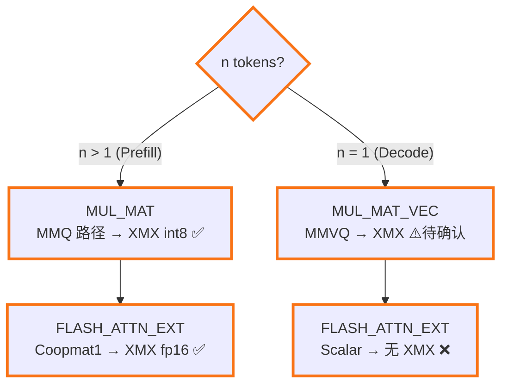

# Xe2 Quantized Compute Audit Report — Implementation Plan

> **For agentic workers:** REQUIRED SUB-SKILL: Use superpowers:subagent-driven-development (recommended) or superpowers:executing-plans to implement this plan task-by-task. Steps use checkbox (`- [ ]`) syntax for tracking.

**Goal:** Write a factual audit report documenting how Q4_K_M quantized models compute on Intel Xe2 via ggml Vulkan backend, with Mermaid diagrams and code-backed assertions.

**Architecture:** Single markdown report written section-by-section. Each task verifies claims from source code before writing prose. Report lives at `docs/internals/xe2-quantized-compute-audit.md`.

**Tech Stack:** Markdown, Mermaid diagrams, ggml Vulkan backend source code (C/C++/GLSL)

**Spec:** `docs/superpowers/specs/2026-04-08-xe2-quantized-compute-audit.md`

---

## Key Source Files Reference

All paths relative to repo root:

| Short Name | Full Path |
|---|---|
| `ggml-vulkan.cpp` | `ml/backend/ggml/ggml/src/ggml-vulkan/ggml-vulkan.cpp` |
| `mul_mmq.comp` | `ml/backend/ggml/ggml/src/ggml-vulkan/vulkan-shaders/mul_mmq.comp` |
| `mul_mmq_funcs.glsl` | `ml/backend/ggml/ggml/src/ggml-vulkan/vulkan-shaders/mul_mmq_funcs.glsl` |
| `mul_mm.comp` | `ml/backend/ggml/ggml/src/ggml-vulkan/vulkan-shaders/mul_mm.comp` |
| `mul_mm_funcs.glsl` | `ml/backend/ggml/ggml/src/ggml-vulkan/vulkan-shaders/mul_mm_funcs.glsl` |
| `flash_attn_cm1.comp` | `ml/backend/ggml/ggml/src/ggml-vulkan/vulkan-shaders/flash_attn_cm1.comp` |
| `flash_attn_base.glsl` | `ml/backend/ggml/ggml/src/ggml-vulkan/vulkan-shaders/flash_attn_base.glsl` |
| `quantize_q8_1.comp` | `ml/backend/ggml/ggml/src/ggml-vulkan/vulkan-shaders/quantize_q8_1.comp` |
| `mul_mat_vecq.comp` | `ml/backend/ggml/ggml/src/ggml-vulkan/vulkan-shaders/mul_mat_vecq.comp` |
| `mul_mat_vecq_funcs.glsl` | `ml/backend/ggml/ggml/src/ggml-vulkan/vulkan-shaders/mul_mat_vecq_funcs.glsl` |
| `vulkan-shaders-gen.cpp` | `ml/backend/ggml/ggml/src/ggml-vulkan/vulkan-shaders/vulkan-shaders-gen.cpp` |
| `llama-quant.cpp` | `llama/llama.cpp/src/llama-quant.cpp` |

## Writing Principles (from spec §1.1)

Every task MUST follow these rules:
1. **Verify before writing**: Read the relevant source files and confirm every technical claim before writing it into the report
2. **Code citations**: Every assertion must include `(source: file:line)` reference
3. **Uncertain = mark it**: If a claim cannot be confirmed from code or docs, mark it `⚠️ 待确认` with reason
4. **No fabrication**: If you don't know, say you don't know. Never guess and present as fact.
5. **Web search for hardware specs**: For Intel XMX/DPAS hardware capabilities, use web search to verify — don't rely on memory
6. **Line numbers are approximate**: All line numbers in this plan come from a specific code snapshot (2026-04-08). They may have shifted. Always search for the relevant pattern/function name rather than jumping blindly to a line number.

## Correction from Spec

The spec §4.1 states "大部分层 q4_K，FFN down + Output Head 用 q6_K". This is **inaccurate**. The actual Q4_K_M strategy (from `llama-quant.cpp:185-365`) uses a `use_more_bits()` heuristic:
- First 1/8 of layers → q6_K
- Last 1/8 of layers → q6_K
- Every 3rd layer in middle → q6_K
- All other layers → q4_K
- Additionally, `attn_qkv` combined tensors → q5_K

The report must describe the **actual** strategy, not the simplified version in the spec.

---

### Task 1: Scaffold Report and Write Section 0 (W4A16 Concepts)

**Files:**
- Create: `docs/internals/xe2-quantized-compute-audit.md`
- Read for verification: `mul_mmq_funcs.glsl`, `mul_mm_funcs.glsl` (confirm two-path existence)

**Context:** Section 0 is the conceptual foundation. It explains W4A16 (weight-only quantization with float activations) and why two computation paths must exist. This requires no deep code verification — the concepts are well-established — but do confirm from shader code that the two approaches (keep weights as int + quantize activations, vs dequantize weights to float) actually exist.

- [ ] **Step 1: Verify the two-path premise from code**

Read `mul_mmq_funcs.glsl` lines 349-363 to confirm MMQ path does int8×int8 (weights stay integer, activations quantized). Read `mul_mm_funcs.glsl` lines 170-202 to confirm Dequant path fully dequantizes weights to f16. These two files are the primary evidence for the W4A16 two-path explanation.

- [ ] **Step 2: Web search to verify W4A16 terminology**

Search for "W4A16 weight only quantization" to confirm the terminology is standard and the explanation is accurate. Also search "GGUF weight only quantization PTQ" to confirm GGUF models are indeed weight-only PTQ.

- [ ] **Step 3: Create report file with header and Section 0**

Create `docs/internals/xe2-quantized-compute-audit.md` with:
- Report title, metadata (date, audience, scope, code baseline)
- Section 0: "前置概念 — W4A16 与量化计算范式"
  - GGUF = weight-only PTQ, activations always fp16/fp32
  - W4A16 meaning: 4-bit weights + 16-bit activations
  - The fundamental mismatch: no hardware instruction for int4 × fp16
  - Two solutions: dequantize weights (→ Dequant+F16 path) or quantize activations at runtime (→ MMQ path, effectively W4A8)
- Mermaid diagram: W4A16 fork diagram showing the two solution paths
  - Use project color convention: all nodes are llama.cpp C++ (orange border) since these are shader-level decisions
  - Include legend at top

The Mermaid diagram for this section should be a W4A16 fork diagram (graph TD) with:
- classDef cpp stroke:#f97316,stroke-width:3px (orange = llama.cpp C++)
- classDef legend fill:#fff,stroke:#999
- Legend node: "🟠 = llama.cpp C/C++ (Vulkan shader)"
- Root nodes: "GGUF Q4_K 权重 int4 存储" and "激活 fp32 (来自上一层)"
- Decision node: "硬件无 int4×fp16 指令，如何计算？"
- Branch 1: "方案1: 反量化权重" → "Dequant+F16 路径: 权重 int4→f16, 激活 fp32→f16, f16×f16 coopmat"
- Branch 2: "方案2: 量化激活" → "MMQ 路径: 权重 int4→int8 容器, 激活 fp32→int8 (Q8_1), int8×int8 dotProduct"

- [ ] **Step 4: Commit**

```bash
git add docs/internals/xe2-quantized-compute-audit.md
git commit -m "docs/internals: scaffold xe2 quantized compute audit, section 0 (W4A16 concepts)"
```

---

### Task 2: Write Section 2.1 (MMQ Path)

**Files:**
- Modify: `docs/internals/xe2-quantized-compute-audit.md`
- Read for verification:
  - `ggml-vulkan.cpp` lines 4326-4329 (integer_dot_product detection)
  - `ggml-vulkan.cpp` lines 4478 (hardware validation)
  - `ggml-vulkan.cpp` lines 5458-5466 (MMQ pipeline selection)
  - `ggml-vulkan.cpp` lines 6722-6731 (MUL_MAT path selection priority)
  - `mul_mmq.comp` (main shader logic)
  - `mul_mmq_funcs.glsl` lines 349-363 (Q4_K dot product)
  - `mul_mmq_funcs.glsl` lines 423-454 (Q8_1 block_b loading)
  - `quantize_q8_1.comp` lines 84-91 (activation quantization)

**Context:** This is the primary path Q4_K takes on Xe2. Must document the complete data flow: weight extraction, activation quantization, dot product, scale restoration, accumulation. Every step needs a code citation.

- [ ] **Step 1: Verify MMQ path selection priority**

Read `ggml-vulkan.cpp` around lines 6722-6731. Confirm that `quantize_y` is checked first (integer_dot_product), and if true, MMQ pipeline is attempted before coopmat. Record exact line numbers.

- [ ] **Step 2: Verify trigger conditions**

Read `ggml-vulkan.cpp` lines 4326-4329 for the `GGML_VK_DISABLE_INTEGER_DOT_PRODUCT` env var check. Read line 4478 for `integerDotProduct4x8BitPackedSignedAccelerated` hardware check. Read `vulkan-shaders-gen.cpp` for `GGML_VULKAN_INTEGER_DOT_GLSLC_SUPPORT` compile flag. Record exact line numbers.

- [ ] **Step 3: Verify weight-side data flow in shader**

Read `mul_mmq_funcs.glsl` lines 349-363. Document the exact extraction: `& 0x0F0F0F0F` for low nibbles, `>> 4` for high nibbles, zero-extension to int8 container. Note there is NO dequantization to float — weights stay as integers.

- [ ] **Step 4: Verify activation-side data flow**

Read `quantize_q8_1.comp` lines 84-91. Document: `d = amax / 127.0`, `vals = round(vals * d_inv)`, pack to int32, store fp16 scale and bias. This is the runtime quantization from fp32 → Q8_1.

- [ ] **Step 5: Verify dot product and accumulation**

Read `mul_mmq_funcs.glsl` Q4_K `mmq_dot_product`. Confirm `dotPacked4x8EXT(qs_a, cache_b.qs[iqs])` → int32 result. Confirm scale restoration: `float(cache_b.ds.x) * float(cache_a.dm.x) * float(q_sum) - ...`. Confirm `ACC_TYPE=float` in `mul_mmq.comp`.

- [ ] **Step 6: Verify Q6_K also uses MMQ path**

Q6_K is used by FFN down and Output Head layers (in Q4_K_M models). Verify:
- Read `ggml-vulkan.cpp` ~line 3297 to confirm `CREATE_MMQ(GGML_TYPE_Q6_K, ...)` exists inside the `integer_dot_product` block
- Read `mul_mmq_funcs.glsl` ~lines 400-420 for Q6_K's `mmq_dot_product` — confirm it uses `dotPacked4x8EXT` with a different scale restoration pattern (single `d_scales` instead of `dm.x/dm.y`)
- Document the Q6_K vs Q4_K MMQ differences in Section 2.1 (both use MMQ, but scale handling differs)

- [ ] **Step 7: Web search XMX/DPAS int8 mapping**

Search for "VK_KHR_shader_integer_dot_product Intel Xe2 DPAS" to confirm that `dotPacked4x8EXT` maps to XMX DPAS int8 units on Xe2. If no definitive source found, mark as ⚠️ 待确认.

- [ ] **Step 8: Write Section 2.1 with Mermaid precision pipeline diagram**

Write the MMQ path section with:
- Trigger conditions (compile-time, runtime, env var — all with code citations)
- Complete data flow with code references for each step (for both Q4_K and Q6_K)
- XMX utilization explanation
- Mermaid diagram: precision pipeline from storage to output



- [ ] **Step 9: Commit**

```bash
git add docs/internals/xe2-quantized-compute-audit.md
git commit -m "docs/internals: xe2 audit section 2.1 (MMQ path with code citations)"
```

---

### Task 3: Write Section 2.2 (Dequant+F16 Coopmat Path)

**Files:**
- Modify: `docs/internals/xe2-quantized-compute-audit.md`
- Read for verification:
  - `mul_mm.comp` lines 245-247, 293 (coopmat declarations, multiply-accumulate)
  - `mul_mm_funcs.glsl` lines 170-202 (Q4_K dequantization to f16)
  - `ggml-vulkan.cpp` lines 14686-14701 (Xe2 coopmat gate)
  - `ggml-vulkan.cpp` lines 5498-5505 (fallback pipeline selection — coopmat2 vs coopmat1 vs scalar)
  - `vulkan-shaders-gen.cpp` lines 407-408, 427+ (coopmat/f16acc shader generation)

**Context:** This path is NOT used for Q4_K on Xe2 when MMQ is available (MMQ has higher priority). It serves as a comparison/fallback. Must document the dequantization process and coopmat compute, plus clarify the fallback chain.

- [ ] **Step 1: Verify dequantization data flow**

Read `mul_mm_funcs.glsl` lines 170-202. Document the Q4_K dequantization: extract nibbles, apply `fma(d, float(nibble), m)` → f16. This is full dequantization — weights become floating point.

- [ ] **Step 2: Verify coopmat compute**

Read `mul_mm.comp` lines 245-247 for coopmat type declarations (`FLOAT_TYPE` for A/B, `ACC_TYPE` for accumulator). Read line 293 for `coopMatMulAdd`. Confirm f16×f16 input, f32 or f16 accumulation.

- [ ] **Step 3: Verify Xe2 coopmat enablement and dimensions**

Read `ggml-vulkan.cpp` lines 14686-14701 for the `INTEL_XE2` gate. Read the coopmat dimension detection code to confirm 16×16×16 on Xe2 (or note if this is runtime-reported and cannot be confirmed from code alone).

- [ ] **Step 4: Verify fallback chain when MMQ disabled and coopmat version**

Read `ggml-vulkan.cpp` lines 5498-5505. Confirm the fallback order: coopmat2 → coopmat1 → scalar. Determine which path Xe2 actually takes:
- Search for `coopmat2` flag detection code — is it set for `INTEL_XE2`?
- If Xe2 has coopmat2: the fallback is coopmat2 dequant+f16 (not coopmat1)
- If Xe2 only has coopmat1: the fallback is coopmat1 dequant+f16

**Important**: The spec §2.2 title says "Dequant+F16 Coopmat" without distinguishing versions. Based on this finding, update the section title and description to reflect the actual coopmat version used on Xe2. Preliminary investigation suggests Xe2 may use coopmat2 for this path — verify from code.

- [ ] **Step 5: Write Section 2.2 with Mermaid precision pipeline diagram**

Write the Dequant+F16 Coopmat path section with:
- Trigger conditions and priority (lower than MMQ)
- Complete dequantization data flow with code references
- Coopmat compute details
- Fallback behavior on Xe2 (confirmed from code)
- Mermaid diagram: precision pipeline



- [ ] **Step 6: Commit**

```bash
git add docs/internals/xe2-quantized-compute-audit.md
git commit -m "docs/internals: xe2 audit section 2.2 (Dequant+F16 Coopmat path)"
```

---

### Task 4: Write Section 2.3 (Flash Attention Coopmat1 Path)

**Files:**
- Modify: `docs/internals/xe2-quantized-compute-audit.md`
- Read for verification:
  - `flash_attn_cm1.comp` lines 26-32, 100, 189-196, 207-217, 251-267
  - `flash_attn_base.glsl` (scalar fallback logic)
  - `ggml-vulkan.cpp` lines 4649-4651 (coopmat1 FA support check)
  - `ggml-vulkan.cpp` lines 8072-8073 (FA path selection: coopmat2 > coopmat1 > scalar)
  - `vulkan-shaders-gen.cpp` lines 626-654 (FA shader generation with ACC_TYPE)

**Context:** Flash Attention is completely independent from matmul paths. It operates on f16 Q/K/V (already dequantized by upstream matmul), not on quantized weights. Coopmat1 requires ≥16 rows, so decode (n=1) falls back to scalar.

- [ ] **Step 1: Verify FA is independent from matmul quantization**

Read `flash_attn_cm1.comp` lines 26-32. Confirm Q is float (from fp32 buffer), K/V are float16_t. These are NOT quantized weights — they come from KV cache (f16) and the upstream matmul output.

- [ ] **Step 2: Verify QK^T and PV compute precision**

Read `flash_attn_cm1.comp` lines 207-217 for QK^T coopmat multiply. Read the PV multiplication section. Confirm both use `coopmatMulAdd` f16×f16 → f32 (or f16 with f16acc). Record exact accumulation type.

- [ ] **Step 3: Verify Softmax is always fp32**

Read `flash_attn_cm1.comp` lines 251-267. Confirm max, exp, sum operations are all in float precision.

- [ ] **Step 4: Verify decode scalar fallback**

Read `ggml-vulkan.cpp` lines 8072-8073 for FA path selection. Read `flash_attn_base.glsl` to confirm the scalar shader path. Verify the minimum row count for coopmat1 (is it exactly 16? or depends on coopmat dimensions?).

- [ ] **Step 5: Verify FA ACC_TYPE selection**

Read `vulkan-shaders-gen.cpp` lines 626-654. Confirm how `ACC_TYPE` is selected for FA shaders (f32 default, f16 when `coopmat_acc_f16_support` is true and `f16acc` variant is used). Note whether Xe2 driver reports f16 acc support — if unknown, mark ⚠️ 待确认.

- [ ] **Step 6: Write Section 2.3 with Mermaid precision pipeline diagram**

Write the Flash Attention section with:
- Fundamental difference from matmul paths (operates on f16 Q/K/V, not quantized weights)
- QK^T compute, softmax, PV compute — all with code citations
- Decode fallback to scalar (no XMX)
- Mermaid diagram: FA precision pipeline



- [ ] **Step 7: Commit**

```bash
git add docs/internals/xe2-quantized-compute-audit.md
git commit -m "docs/internals: xe2 audit section 2.3 (Flash Attention Coopmat1 path)"
```

---

### Task 5: Write Section 2.4 (Runtime Path Confirmation)

**Files:**
- Modify: `docs/internals/xe2-quantized-compute-audit.md`
- Read for verification:
  - `ggml-vulkan.cpp` lines 4313-4334 (env var disable checks)
  - `ggml-vulkan.cpp` device initialization logging (search for "int dot" and "matrix cores" log output)
  - `ggml-vulkan.cpp` search for `GGML_VULKAN_DEBUG` usage and pipeline dispatch logging

**Context:** Three methods to confirm which path is taken at runtime, ordered by ease of use.

- [ ] **Step 1: Verify startup log fields**

Search `ggml-vulkan.cpp` for the startup log that prints `int dot:` and `matrix cores:`. Record exact line numbers and what values correspond to what.

- [ ] **Step 2: Verify environment variable names and effects**

Read `ggml-vulkan.cpp` lines 4313-4334. List all `GGML_VK_DISABLE_*` env vars. Confirm each one's effect on the pipeline selection.

- [ ] **Step 3: Verify debug build pipeline logging**

Search `ggml-vulkan.cpp` for `GGML_VULKAN_DEBUG` usage. Confirm that debug mode logs pipeline names during dispatch. Find example pipeline name patterns (e.g., `matmul_q4_k_q8_1_m` for MMQ).

- [ ] **Step 4: Write Section 2.4**

Write the three confirmation methods with exact env var names, log field names, and pipeline name patterns. All with code citations.

- [ ] **Step 5: Commit**

```bash
git add docs/internals/xe2-quantized-compute-audit.md
git commit -m "docs/internals: xe2 audit section 2.4 (runtime path confirmation methods)"
```

---

### Task 6: Write Section 4 (Precision Details)

**Files:**
- Modify: `docs/internals/xe2-quantized-compute-audit.md`
- Read for verification:
  - `llama-quant.cpp` lines 185-186, 302-303, 358-365, 405 (Q4_K_M mixed quant strategy)
  - `mul_mmq_funcs.glsl` lines 349-363 (dotPacked4x8EXT details — loop count, int32 semantics)
  - `quantize_q8_1.comp` lines 84-91 (Q8_1 quantization details)
  - `flash_attn_cm1.comp` (accumulation precision selection)
  - Relevant shader output type declarations (search for `D_TYPE`)

**Context:** Section 4 is the deep-dive for readers who want shader-level precision details. Four sub-sections: storage, dequant/quant, compute, accumulation, output.

- [ ] **Step 1: Verify Q4_K_M mixed quantization strategy**

Read `llama-quant.cpp` lines 185-186 for `use_more_bits()` function. Read lines 302-303 (attn_v.weight), 358-365 (ffn_down), 405 (attn_qkv). Document the ACTUAL strategy — not the simplified "FFN down = q6_K" assumption. This is a correction from the spec.

- [ ] **Step 2: Verify q4_K block structure**

Search for q4_K block definition (likely in `ggml-common.h` or similar). Confirm: 256 values, fp16 (d, dmin), 6-bit sub-scales, 4-bit values. Record exact struct definition and file location.

- [ ] **Step 3: Verify KV cache default precision**

Search `ggml-vulkan.cpp` or Ollama Go code for `OLLAMA_KV_CACHE_TYPE` default. Confirm default is f16.

- [ ] **Step 4: Verify dotPacked4x8EXT semantics**

Read `mul_mmq_funcs.glsl` Q4_K dot product. Count: how many `dotPacked4x8EXT` calls per block? (Should be 8 for 256 values / 32 per packed call... verify). Confirm int8×int8 → int32 semantics.

- [ ] **Step 5: Verify scalar operator precision**

The summary table includes GET_ROWS, RMS_NORM, RoPE, ADD, GLU — all scalar ops not covered by MMQ/coopmat paths. Verify each from shader code:
- Search `ml/backend/ggml/ggml/src/ggml-vulkan/vulkan-shaders/` for `norm*.comp` (RMS_NORM), `glu.comp` or `silu.comp` (SwiGLU), `add.comp` (ADD), `get_rows*.comp` (GET_ROWS), `rope*.comp` (RoPE)
- For each shader, confirm the computation precision (expected: fp32 for all, but verify)
- For GET_ROWS: confirm it dequantizes weights to fp32 output (embedding lookup)

- [ ] **Step 6: Verify output precision**

Search shaders for `D_TYPE` definition. Confirm MUL_MAT output is fp32. Confirm FA output is fp32. Check if intermediate activations between layers are fp32.

- [ ] **Step 7: Write Section 4.1-4.2 (Storage + Dequant/Quant)**

Write with code citations:
- 4.1 Storage: Q4_K_M mixed strategy (corrected — use `use_more_bits()` heuristic, not simplified version), q4_K block structure, KV cache default
- 4.2 Dequant/Quant: MMQ weight handling, activation Q8_1 quantization details

- [ ] **Step 8: Commit 4.1-4.2**

```bash
git add docs/internals/xe2-quantized-compute-audit.md
git commit -m "docs/internals: xe2 audit section 4.1-4.2 (storage and dequant/quant precision)"
```

- [ ] **Step 9: Write Section 4.3-4.5 (Compute + Accumulation + Output)**

Write with code citations:
- 4.3 Compute: dotPacked4x8EXT semantics, coopmatMulAdd semantics, scalar ops (verified in Step 5)
- 4.4 Accumulation: MMQ fp32, FA f32/f16, softmax fp32
- 4.5 Output: D_TYPE=float, layer-to-layer transfer precision

- [ ] **Step 10: Commit 4.3-4.5**

```bash
git add docs/internals/xe2-quantized-compute-audit.md
git commit -m "docs/internals: xe2 audit section 4.3-4.5 (compute, accumulation, output precision)"
```

---

### Task 7: Write Section 3 (Inference Walkthrough)

**Files:**
- Modify: `docs/internals/xe2-quantized-compute-audit.md`
- Read for verification:
  - `ggml-vulkan.cpp` MUL_MAT vs MUL_MAT_VEC dispatch logic (lines 6722-6740, 6972-6984)
  - `ggml-vulkan.cpp` FA path selection (lines 8072-8073)
  - Qwen3 1.7B model structure (search for layer count in model config or perf logs)
  - `perf_log_run1.txt` or `perf_log_150_300.txt` for actual operator sequence

**Context:** Walk through one complete inference pass on Xe2 for both prefill and decode. Reference sections 2.1-2.3 for each operator. This task depends on Tasks 2-5 being complete.

- [ ] **Step 1: Determine Qwen3 1.7B layer count and structure**

Read `perf_log_run1.txt` or `perf_log_150_300.txt` to count the actual number of transformer layers and identify the operator sequence (GET_ROWS → RMS_NORM → MUL_MAT → ... per layer). Record exact layer count.

- [ ] **Step 2: Verify MMVQ shader uses dotPacked4x8EXT**

Read `mul_mat_vecq_funcs.glsl` (full path: `ml/backend/ggml/ggml/src/ggml-vulkan/vulkan-shaders/mul_mat_vecq_funcs.glsl`). Confirm:
- Q4_K's `mmvq_dot_product` uses `dotPacked4x8EXT` (expected around lines 280-320)
- Q6_K's `mmvq_dot_product` also uses `dotPacked4x8EXT` (expected around lines 340-379)
- This means decode MUL_MAT_VEC also uses integer dot products, potentially mapping to XMX

- [ ] **Step 3: Verify MUL_MAT_VEC dispatch and MMVQ pipeline selection**

Read `ggml-vulkan.cpp` lines 6972-6984. Confirm:
- The Intel heuristic for MUL_MAT_VEC: Q4_K uses MMVQ when k≥2048
- Whether MMVQ pipeline selection also requires `integer_dot_product=true` (search for MMVQ pipeline creation)
- If `integer_dot_product` is required for MMVQ, then decode matmul on Xe2 also uses `dotPacked4x8EXT` → XMX int8
- If NOT required, MMVQ may use a different scalar path — verify which

- [ ] **Step 4: Verify FA decode scalar fallback threshold**

Read `ggml-vulkan.cpp` lines 8072-8073 and `flash_attn_cm1.comp` for the minimum row count. Confirm n=1 falls back to scalar.

- [ ] **Step 5: Write Section 3.1 (Prefill) with path/XMX annotations**

Write the prefill walkthrough listing each operator in sequence:
- Operator name, quant type, path (§2.x reference), XMX participation
- Use the Mermaid Prefill vs Decode comparison flow diagram

- [ ] **Step 6: Write Section 3.2 (Decode) highlighting key differences**

Write 3-4 key differences from prefill:
- MUL_MAT → MUL_MAT_VEC (with MMVQ XMX status from Steps 2-3)
- FA coopmat1 → scalar (no XMX)
- Compute-bound → memory-bound

- [ ] **Step 7: Add Mermaid Prefill vs Decode flow diagram**



- [ ] **Step 8: Commit**

```bash
git add docs/internals/xe2-quantized-compute-audit.md
git commit -m "docs/internals: xe2 audit section 3 (inference walkthrough prefill/decode)"
```

---

### Task 8: Write Section 1 (Summary Table)

**Files:**
- Modify: `docs/internals/xe2-quantized-compute-audit.md`

**Context:** The summary table synthesizes all findings from sections 2-4. This MUST be the last content section written, because it depends on all verified facts from previous tasks. Place it after Section 0 in the report, but write it last.

- [ ] **Step 1: Review all previously written sections**

Re-read sections 2.1-2.4, 3.1-3.2, 4.1-4.5 to extract the verified facts for each operator row in the table.

- [ ] **Step 2: Build the summary table**

Create a markdown table with these rows:
- Embedding lookup (GET_ROWS)
- RMS Norm + RoPE
- QKV 投影 (MUL_MAT q4_K)
- Flash Attention (FLASH_ATTN_EXT)
- Attention Output 投影 (MUL_MAT q4_K)
- 残差加法 (ADD)
- FFN gate/up 投影 (MUL_MAT q4_K)
- SwiGLU 激活 (GLU)
- FFN down 投影 (MUL_MAT q4_K/q6_K)
- Output Head (MUL_MAT/MUL_MAT_VEC q6_K)

Columns: 权重存储精度 | 计算路径 | 计算精度(输入端) | 累加精度 | XMX 参与 | Prefill vs Decode 差异

Every cell must reference facts verified in previous tasks. If any cell is uncertain, mark ⚠️.

- [ ] **Step 3: Write 2-3 paragraphs of reading guidance**

Explain how to read the table, highlight key takeaways (e.g., "MMQ path dominates matmul on Xe2", "FA switches from XMX to scalar between prefill and decode").

- [ ] **Step 4: Insert Section 1 after Section 0 in the report**

The summary table goes right after Section 0 and before Section 2 in the final document.

- [ ] **Step 5: Commit**

```bash
git add docs/internals/xe2-quantized-compute-audit.md
git commit -m "docs/internals: xe2 audit section 1 (summary table synthesized from verified facts)"
```

---

### Task 9: Add Known Uncertainties Section and Final Review

**Files:**
- Modify: `docs/internals/xe2-quantized-compute-audit.md`

**Context:** Final pass to add the uncertainties section, verify all ⚠️ markers are present where needed, and check consistency.

- [ ] **Step 1: Write "已知不确定项" section**

Add the four known uncertainties from the spec:
1. Xe3 (Panther Lake) — no `INTEL_XE3` in code
2. `coopmat_acc_f16_support` on Xe2 — driver-dependent
3. Decode MUL_MAT_VEC XMX mapping — unclear if driver uses XMX at n=1
4. `GGML_VULKAN_INTEGER_DOT_GLSLC_SUPPORT` — build-dependent

Plus any additional uncertainties discovered during Tasks 1-8 (e.g., coopmat2 vs coopmat1 for Xe2 dequant path if unresolved).

- [ ] **Step 2: Write "代码引用索引" section (spec §5)**

Add a reference table listing all source files cited in the report, with relative paths and one-line descriptions. Use the table from the spec as a starting point, but update based on actual files referenced during writing.

- [ ] **Step 3: Write "不包含的内容" section (spec §6)**

Add the exclusion list from the spec:
- 性能优化建议或行动提案（纯现状审计）
- 非 Vulkan 后端（CUDA、Metal、CPU）的分析
- 非 Q4_K_M 格式的详细分析
- Xe2 以外硬件的实测数据
- 模型质量/准确性评估（只关注计算精度，不关注推理质量）

- [ ] **Step 4: Evaluate optional Mermaid diagrams**

The spec §3 lists two optional diagrams:
- 路径判定决策树 (§2.4) — if §2.4 content is complex enough to benefit from a diagram, add it
- Q4_K block 内存布局示意图 (§4) — if §4.1 block structure description is hard to follow as prose, add it

Decide based on the written content. Skip if the prose is clear enough; add if it would materially help the reader.

- [ ] **Step 5: Update spec §4.1 with corrected Q4_K_M strategy**

The spec states "大部分层 q4_K，FFN down + Output Head 用 q6_K" which is inaccurate. Update `docs/superpowers/specs/2026-04-08-xe2-quantized-compute-audit.md` §4.1 to reflect the actual `use_more_bits()` heuristic discovered during planning.

- [ ] **Step 6: Scan entire report for unverified claims**

Read the entire report end-to-end. For every technical assertion, check that it has a `(source: file:line)` citation. Flag any claims that were written without verification.

- [ ] **Step 7: Check Mermaid diagrams render correctly**

Review all Mermaid diagram syntax for correctness. Ensure color conventions are consistent (orange for C++/shader code, green for Go code if any). Verify legends are present.

- [ ] **Step 8: Verify internal cross-references**

Check that Section 3's `§2.x` references point to the correct sub-sections. Check that the summary table (Section 1) is consistent with the detailed sections.

- [ ] **Step 9: Commit final report**

```bash
git add docs/internals/xe2-quantized-compute-audit.md docs/superpowers/specs/2026-04-08-xe2-quantized-compute-audit.md
git commit -m "docs/internals: xe2 quantized compute audit — final review, uncertainties, and spec correction"
```
