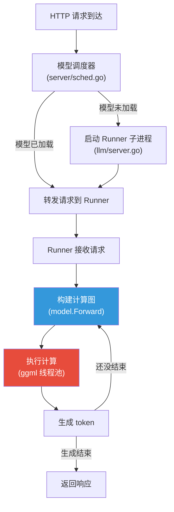

# Ollama 线程与并发分析报告

> **背景**：运行 Qwen3 模型（部分 CPU offload）时，单请求 latency 偏高且观测到线程锁等待。本报告分析 Ollama 整体的线程和锁使用机制。
> **适用版本**: 基于当前 `main` 分支代码
> **相关文档**: [Qwen3 单请求 Latency 分析](qwen3-cpu-offload-lock-analysis.md)（针对具体问题的深入分析）

---

## 执行摘要

### 你需要知道的 3 件事

1. **Ollama 的所有推理计算都在一个持久线程池中完成**。无论用哪条引擎路径，底层都是 ggml 的 C 层线程池在干活。线程在模型加载时创建，推理期间复用，不会每次请求重新创建。

2. **即使只有一个请求，线程之间也有大量等待**。CPU 线程池在每个计算节点（op）之间都有一次 barrier 同步（busy-wait），快线程空转等慢线程。一个 transformer layer 有 ~20 个 op，每个 op 后都要所有线程"到齐"才能继续。

3. **GPU 内存不够时，模型被切成多段在 CPU/GPU 之间交替执行**。每次切换都需要同步等待和数据拷贝，CPU 上的计算又比 GPU 慢得多。在部分 CPU offload 场景下，CPU split 是最大的耗时来源，而 CPU 内部的 barrier 等待又进一步拉长了这个时间。

### 核心结论

> **注意**：以下分析基于**单请求**场景。我们观测到即使只有一个请求在运行，也存在线程等待 lock 的现象。

| 结论 | 影响 | 建议 |
|------|------|------|
| **ggml barrier 是最大的单请求内等待来源** | 每个 op 后所有线程 busy-wait 同步，CPU 利用率虚高但实际做功少 | CPU 线程数匹配物理核心数，不要多开 |
| CPU/GPU split 切换有固定开销 | 每次切换都是一次 pipeline stall（sync + copy） | 让 CPU layer 连续放在一起，减少切换次数 |
| CPU split 计算慢是根本原因 | CPU 比 GPU 慢得多，直接拉长整体推理时间 | 尽量多放 layer 到 GPU（更激进的量化、量化 KV cache） |
| `schedMu` 在多请求场景下才是瓶颈 | 单请求无竞争，但多请求时会串行等待 | 单请求场景可以忽略 |

---

## 第一部分：整体架构（给所有读者）

### Ollama 的推理流程是什么样的？

当你发送一个聊天请求给 Ollama 时，经过的路径大致如下：

```
你的请求 (HTTP)
    ↓
Go 主进程 (HTTP Server + 模型调度器)
    ↓  exec.Command 启动子进程
Runner 子进程 (通过 HTTP 与主进程通信)
    ↓
模型推理引擎 (构建计算图 + 执行计算)
    ↓
ggml 线程池 (C/C++ 层，真正跑计算的地方)
    ↓
输出 token → 流式返回给你
```

**要点**：
- Go 主进程**不直接做推理计算**，它只负责接收请求、管理模型加载/卸载
- 真正的推理在一个**子进程**里完成（通过 `exec.Command` 启动）
- 子进程内部，计算线程由 ggml 的 **C 层线程池**管理

### 两条引擎路径

Ollama 有新旧两条推理引擎，但它们的线程管理方式完全相同：

| | llamarunner（旧引擎） | ollamarunner（新引擎） |
|---|---|---|
| 模型代码在哪 | llama.cpp C++ 代码 | Go `model/models/*` |
| 计算图怎么构建 | llama.cpp 内部 | Go 代码通过 `ml.Context` API |
| 计算谁来执行 | ggml C 线程池 | ggml C 线程池（相同） |
| 线程谁管理 | ggml C 层 | ggml C 层（相同） |

Qwen3、Gemma3 等新模型走 ollamarunner；部分旧模型 fallback 到 llamarunner。选择逻辑在 `llm/server.go:147-163`。

### 请求在系统内的生命周期



红色的"执行计算"是最耗时的部分，也是锁等待发生的地方。

---

## 第二部分：并发控制（给想理解锁等待的读者）

### 三把关键的锁

在 Ollama 的推理路径上，有三个主要的并发控制点，从外到内依次是：

```
请求进来
  ↓
[1] seqsSem (信号量) — 控制同时有多少个请求可以进入推理
  ↓
[2] s.mu (互斥锁) — 保护内部状态（序列信息、batch 数据）
  ↓
[3] schedMu (互斥锁) — 保护 ggml 调度器，一次只能一个计算
```

#### 1. `seqsSem` — 入口限流

**文件**: `runner/ollamarunner/runner.go:378`

这是一个信号量（semaphore），默认容量为 1（`OLLAMA_NUM_PARALLEL=1`）。意思是：**一次只有 1 个请求能进入推理流程**。其他请求排队等待。

如果你设置 `OLLAMA_NUM_PARALLEL=4`，可以有 4 个请求同时进入。但即便如此，它们到了 `schedMu` 还是得排队（见下面）。

#### 2. `s.mu` — 内部状态保护

**文件**: `runner/ollamarunner/runner.go:368`

这是一个普通的互斥锁，保护序列状态（哪些请求在处理、它们的 token 数据等）。它在以下时机**短暂**持有：
- 构建计算图时（`forwardBatch`）
- 收集 batch 数据时（`computeBatch` 开头）
- 采样/生成 token 时（`computeBatch` 末尾）

注意：`s.mu` 在**实际计算期间是释放的**（`runner.go:719` 释放，`runner.go:736` 重新获取）。所以这把锁通常不是瓶颈。

#### 3. `schedMu` — 最大的瓶颈

**文件**: `ml/backend/ggml/ggml.go:91`

```go
schedMu sync.Mutex // Only one Compute can run at a time
```

这是整个推理路径上**最关键的锁**。`ComputeWithNotify()` 在整个计算图执行期间持有它：

```
schedMu.Lock()
  → 执行所有 split（GPU split + CPU split + 数据拷贝 + 同步等待）
schedMu.Unlock()
```

如果一次计算需要 50ms，那其他想计算的 goroutine 就得等 50ms。部分 CPU offload 时计算更慢，这把锁持有得更久。

### 流水线的理想与现实

ollamarunner 设计了一个流水线机制——当 Batch N 在计算时，可以同时构建 Batch N+1 的计算图：

```
时间 →

Batch N:  [构建图] [===== 计算 (持有 schedMu) =====]
Batch N+1:         [构建图] [等待 schedMu...........] [===== 计算 =====]
```

图构建可以和计算重叠（因为构建图不需要 `schedMu`），但**计算本身严格串行**。在部分 CPU offload 场景下，计算时间远大于图构建时间，所以流水线的收益有限。

---

## 第三部分：线程池与计算细节（给想深入了解的读者）

### ggml 线程池的工作方式

ggml 的 CPU 线程池是一个**持久线程池**——线程在模型加载时创建，之后一直存在，直到模型卸载。

**文件**: `ml/backend/ggml/ggml/src/ggml-cpu/ggml-cpu.c`

#### 线程池结构

```c
// ggml-cpu.c:454-478
struct ggml_threadpool {
    ggml_mutex_t mutex;       // 条件变量用的互斥锁
    ggml_cond_t  cond;        // 等待新工作的条件变量

    // 同步原语
    atomic_int n_graph;           // 图计数 + 活跃线程数（位编码）
    atomic_int n_barrier;         // barrier 计数器
    atomic_int n_barrier_passed;  // barrier 通过计数器
    atomic_int current_chunk;     // work-stealing 的共享 chunk 索引

    atomic_bool stop;    // 停止线程池
    atomic_bool pause;   // 暂停线程池

    struct ggml_compute_state * workers;  // 每线程状态
    int n_threads;
    uint32_t poll;        // 轮询级别 (0 = 无轮询)
};
```

#### 线程等待新工作的两阶段策略

Worker 线程在空闲时不是立刻睡觉，而是先 polling 再 sleep：

```
有新工作? ──→ 执行计算
  ↑ (循环)
[阶段 1] busy-wait polling ~6.5M 次循环
  ↓ (超时)
[阶段 2] 进入 cond_wait 睡眠，等待被唤醒
```

这个设计在**低延迟**（polling 能快速响应）和**低功耗**（最终会 sleep）之间取得平衡。`poll` 参数控制 polling 轮次（默认 50）。

#### 计算图的执行模式

当一个计算图被提交执行时：

1. 主线程调用 `ggml_graph_compute_kickoff()` 唤醒所有 worker
2. **所有线程遍历图中的每一个节点**
3. 每个 op 内部，通过 `ith`（线程索引）和 `nth`（总线程数）分配工作
4. **每个节点执行完后，所有线程通过 barrier 同步**

```c
// ggml-cpu.c:2921-2963 — 每个线程的执行循环
for (int node_n = 0; node_n < cgraph->n_nodes; node_n++) {
    ggml_compute_forward(&params, node);   // 每个线程处理自己的数据片段
    ggml_barrier(state->threadpool);       // 等所有线程完成这个节点
}
```

#### Barrier 的代价

Barrier（`ggml-cpu.c:549-585`）是**无锁 busy-wait** 实现：

```c
// 简化版逻辑
if (我是最后到达的线程) {
    重置 barrier; 通知大家;
} else {
    while (barrier 没通过) {
        _mm_pause();  // CPU relax，但仍在空转
    }
}
```

这意味着：
- 一个 transformer layer 有 ~20 个 op → ~20 次 barrier
- 如果某个线程的计算量更大（工作不均衡），其他线程空转等待
- 线程数越多，barrier 的 overhead 占比越大

### MatMul 的 Work-Stealing 策略

MatMul 是最耗时的 op，它使用了更聪明的并行方式——work stealing：

**文件**: `ggml-cpu.c:1228-1420`

```
Step 1: 将矩阵分成 N 个 chunk
Step 2: 每个线程从自己的 ID 开始取一个 chunk
Step 3: 做完后，通过 atomic_fetch_add 取下一个可用 chunk
Step 4: 直到所有 chunk 做完
```

这比静态分配好——如果某个线程的 chunk 更快完成，它可以"偷"其他线程还没做的 chunk，实现动态负载均衡。

其他 op（softmax, RoPE, RMSNorm 等）使用更简单的**静态分片**：
```c
for (int i = ith; i < total; i += nth) {
    // 处理第 i 个元素
}
```

---

## 第四部分：多 Backend 调度（给想理解 CPU/GPU 切换的读者）

### 计算图如何被切割

当模型的一部分在 GPU、一部分在 CPU 时，ggml 的 backend scheduler 会把计算图切成多个 **split**：

**文件**: `ml/backend/ggml/ggml/src/ggml-backend.cpp:960`

切割分 5 个 pass：
1. 根据 op 支持性和 buffer 位置，为每个节点分配 backend
2. 向上传播 backend 分配（减少不必要的数据拷贝）
3. 向下传播
4. 处理 op 特殊要求
5. 按 backend 边界切割图，标识跨 backend 的输入

### Split 的执行是顺序的

**文件**: `ggml-backend.cpp:1480-1664`

```
for 每个 split (顺序):
    1. 拷贝该 split 需要的输入到目标 backend
    2. 在该 backend 上执行子图
    3. 记录完成事件
```

**Split 之间不是并行的**。CPU split 完成后才开始 GPU split，反之亦然。

### 每次 Backend 切换的代价

```
GPU split 结束
  → ggml_backend_synchronize(GPU)   // flush GPU pipeline（等 GPU 做完）
  → 拷贝中间张量到 CPU               // cudaMemcpy（数据搬运）
CPU split 开始
  → ggml_graph_compute()            // CPU 线程池执行
CPU split 结束
  → 拷贝结果张量回 GPU               // cudaMemcpy
GPU split 开始
```

每次切换都涉及**同步等待 + 数据拷贝**，这是不可避免的延迟。

### CUDA Backend 的特点

- 使用 stream 模型，计算提交后异步执行
- 同步通过 `cudaStreamSynchronize` 实现
- 跨 GPU 支持 `cudaMemcpyPeerAsync`
- 锁页内存（pinned memory）加速 Host↔Device 传输

### CPU Backend 的限制

CPU backend 的 async 接口全部为 NULL——所有操作都是同步的。这意味着从 GPU 拷贝数据到 CPU 时，必须先等 GPU 完成所有操作。

### MoE 模型的优化

对于 MoE（Mixture of Experts）模型，scheduler 做了一个重要优化（`ggml-backend.cpp:1516-1599`）：只拷贝被路由选中的 expert 权重，而非全部。这可以显著减少 CPU→GPU 的数据传输量。

---

## 第五部分：平台与环境因素

### NUMA 支持

**文件**: `ggml-cpu.c:518-700`

在多 NUMA 节点的服务器上，ggml 会：
- 检测 NUMA 拓扑（Linux 通过 `/sys/devices/system/`）
- 为每个 worker 设置 CPU 亲和性
- MatMul 在 NUMA 模式下改为静态分配（避免跨 NUMA 内存访问）

### Windows 11 的 CPU 核心 Parking 问题

**文件**: `ggml-cpu.c:2477-2488`

Windows 11 会激进地停用（park）CPU 核心以省电，导致线程被挤到少数核心上。ggml 通过设置 `THREAD_POWER_THROTTLING_STATE` 来对抗：

```c
// 告知系统不要对该线程进行执行速度节流
THREAD_POWER_THROTTLING_STATE t;
t.ControlMask = THREAD_POWER_THROTTLING_EXECUTION_SPEED;
t.StateMask   = 0;  // 禁用节流
SetThreadInformation(h, ThreadPowerThrottling, &t, sizeof(t));
```

### CGo 调用开销

Go 调用 C 函数（CGo）有约 50-100ns 的固定开销，调用期间 goroutine 绑定到 OS 线程。但因为计算时间远大于这个开销（毫秒 vs 纳秒），实际影响可以忽略。

---

## 附录：关键数字速查

| 参数 | 默认值 | 说明 |
|------|--------|------|
| CPU 线程数 | `runtime.NumCPU()` | 可通过 `NumThread` 配置 |
| 并行请求数 | 1 | `OLLAMA_NUM_PARALLEL` |
| Polling 级别 | 50 | 约 6.5M spin 循环/次 |
| MatMul chunk size | 16 | 单行矩阵时为 64 |
| Max threads | 512 | `GGML_MAX_N_THREADS` |
| Max NUMA nodes | 8 | 硬编码 |
| Pipeline copies | 4 | `GGML_SCHED_MAX_COPIES` |
| Cache line alignment | 64 bytes | |

## 附录：代码文件索引

| 文件 | 内容 |
|------|------|
| `llm/server.go` | Runner 子进程启动、引擎选择 |
| `runner/runner.go` | 子进程内引擎分发 |
| `runner/ollamarunner/runner.go` | 新引擎的主循环、锁管理 |
| `ml/backend/ggml/ggml.go` | Go↔ggml 桥接、`schedMu` |
| `ml/backend/ggml/ggml/src/ggml-cpu/ggml-cpu.c` | CPU 线程池、barrier、compute |
| `ml/backend/ggml/ggml/src/ggml-backend.cpp` | Backend scheduler、split 执行 |
| `ml/backend/ggml/ggml/src/ggml-cuda/ggml-cuda.cu` | CUDA backend 实现 |
| `model/models/qwen3/model.go` | Qwen3 模型实现 |
| `server/sched.go` | 模型调度器 |

## 附录：进一步调研方向

1. **Pipeline Parallelism**：`n_copies` 机制在实际推理中能减少多少 backend 切换延迟
2. **Flash Attention 的线程利用**：FA 可能有不同的并行模式
3. **llamafile SGEMM 效率**：与 ggml 原生 vec_dot 的对比
4. **GPU 多 Stream 并行**：GPU backend 内部是否有多流并行
5. **多用户并行时的资源竞争**：batch decode 场景的线程利用率
6. **Windows CPU 核心 Parking 的实际影响**：在 Windows 11 环境中的具体表现
