# Tracing 机制与 OllamaRunner Scheduler 内部实现

## 目录

- [1. Eval Callback 追踪机制](#1-eval-callback-追踪机制)
  - [1.1 整体架构 (上游 vs 我们的代码)](#11-整体架构-上游-vs-我们的代码)
  - [1.2 回调两阶段协议](#12-回调两阶段协议)
  - [1.3 CGO 桥接层](#13-cgo-桥接层)
  - [1.4 C 端调度行为变化](#14-c-端调度行为变化)
  - [1.5 ggml_backend_synchronize 到底做了什么](#15-ggml_backend_synchronize-到底做了什么)
  - [1.6 Profiler 数据流](#16-profiler-数据流)
- [2. GGML Backend Scheduler](#2-ggml-backend-scheduler)
  - [2.1 Scheduler 初始化与 parallel 参数](#21-scheduler-初始化与-parallel-参数)
  - [2.2 图分割算法 (split_graph)](#22-图分割算法-split_graph)
  - [2.3 Split 示例图解](#23-split-示例图解)
  - [2.4 GPU 内存分配与 Split 间的复用](#24-gpu-内存分配与-split-间的复用)
  - [2.5 分片执行 (compute_splits)](#25-分片执行-compute_splits)
  - [2.6 Event 同步机制](#26-event-同步机制)
- [3. OllamaRunner 完整调用链](#3-ollamarunner-完整调用链)
  - [3.1 主循环与 Pooling 模型](#31-主循环与-pooling-模型)
  - [3.2 ggml_context 是什么](#32-ggml_context-是什么)
  - [3.3 为什么叫"构图"？每次都要构图吗？](#33-为什么叫构图每次都要构图吗)
  - [3.4 Batch Size: 什么时候是 1，什么时候不是](#34-batch-size-什么时候是-1什么时候不是)
  - [3.5 懒同步机制](#35-懒同步机制)
- [4. 内存分配机制详解](#4-内存分配机制详解)
  - [4.1 权重分配](#41-分配系统-1-权重-ggml_backend_alloc_ctx_tensors_from_buft)
  - [4.2 计算图 (gallocr)](#42-分配系统-2-计算图-ggml_gallocr)
  - [4.3 运行时 Cache](#43-分配系统-3-运行时-cache-contextnew_tensor)
  - [4.4 完整生命周期](#44-三套系统的完整生命周期)
  - [4.5 USAGE_WEIGHTS 标记](#45-ggml_backend_buffer_usage_weights-的作用)
- [5. 完整调用链图](#5-完整调用链图)
- [6. 跨 Library GPU 混用的限制与优化机会](#6-跨-library-gpu-混用的限制与优化机会)
  - [6.1 问题场景](#61-问题场景)
  - [6.2 当前行为：ByLibrary 竞争选举](#62-当前行为bylibrary-竞争选举)
  - [6.3 限制作用的三个层次](#63-限制作用的三个层次)
  - [6.4 底层 GGML Scheduler 支持混合 Backend](#64-底层-ggml-scheduler-支持混合-backend)
  - [6.5 llamarunner 同样受限](#65-llamarunner-同样受限)
  - [6.6 iGPU (UMA) 的分阶段价值分析](#66-igpu-uma-的分阶段价值分析)
  - [6.7 Vulkan UMA 零拷贝机制（上游已实现）](#67-vulkan-uma-零拷贝机制上游已实现)
  - [6.8 Phase-Aware Scheduling 方案设计](#68-phase-aware-scheduling-方案设计)
- [7. CUDA + iGPU 下 80B MoE 模型的更多优化方向](#7-cuda--igpu-下-80b-moe-模型的更多优化方向)
  - [7.1 KV Cache 量化（已支持，立即可用）](#71-kv-cache-量化已支持立即可用)
  - [7.2 Speculative Decoding / EAGLE3（未支持，需实现）](#72-speculative-decoding--eagle3未支持需实现)
  - [7.3 MoE 感知层内拆分（未支持，需实现）](#73-moe-感知层内拆分未支持需实现)
  - [7.4 Hybrid 层类型感知分配（未支持，低成本可实现）](#74-hybrid-层类型感知分配未支持低成本可实现)
  - [7.5 优化方向对比与组合](#75-优化方向对比与组合)
  - [7.6 备选方案参考](#76-备选方案参考)

---

## 1. Eval Callback 追踪机制

### 1.1 整体架构 (上游 vs 我们的代码)

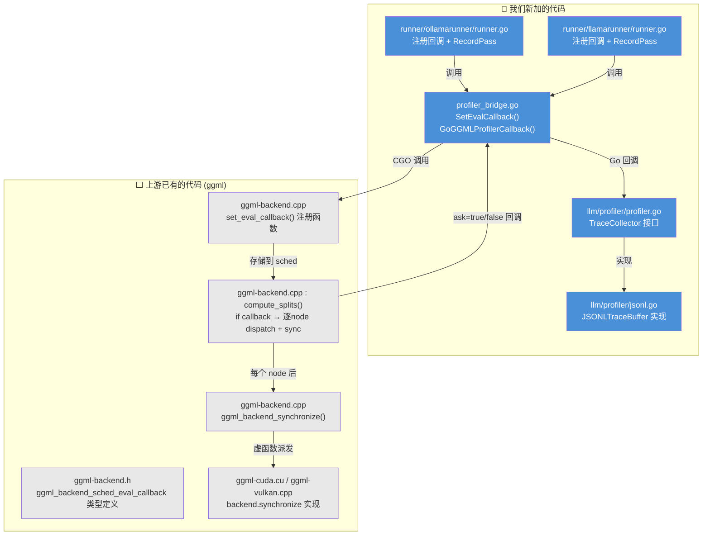

**总结**: 上游 ggml 提供了 eval callback 的完整基础设施（类型定义、注册、调度逻辑、synchronize）。我们只是:
1. 写了 CGO 桥接层把 Go profiler 接入上游回调
2. 实现了 `TraceCollector` 接口和 JSONL 输出
3. 在两个 runner 中注册回调和记录 pass 边界

### 1.2 回调两阶段协议

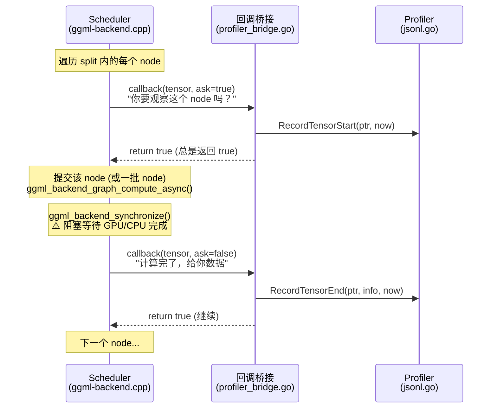

**关键点**:
- `ask=true` 时 profiler 记录 **开始时间** — 但此时 node 还没开始计算
- 然后 scheduler 提交计算 + synchronize 等待完成
- `ask=false` 时 profiler 记录 **结束时间** — 此时 node 已完成
- 所以 `t_end - t_start` = 提交 + 计算 + 同步的总时间

### 1.3 CGO 桥接层

**文件**: `ml/backend/ggml/profiler_bridge.go` (🔵 我们的代码)

数据流经 3 层:

```
C 回调                    CGO 桥接                  Go Profiler
─────────                ─────────                 ───────────
ggml compute_splits      ggmlProfilerEvalCallbackBridge    GoGGMLProfilerCallback
  │                        │                                │
  ├─ tensor指针 ──────────→├─ uintptr_t(handle) ──────────→├─ cgo.Handle → TraceCollector
  ├─ ask (bool) ──────────→├─ _Bool ──────────────────────→├─ bool(ask)
  └─ user_data ───────────→└─ cast to uintptr ─────────────└─ time.Now() 取时间
```

Go 注册:
```go
// profiler_bridge.go:34-48 (🔵 我们的代码)
func (b *Backend) SetEvalCallback(col profiler.TraceCollector) {
    if b.profilerHandle != 0 {
        b.profilerHandle.Delete()
        b.profilerHandle = 0
    }
    if col == nil {
        C.clearGGMLProfilerEvalCallback(b.sched)
        return
    }
    h := cgo.NewHandle(col)       // Go 对象 → 整数句柄
    b.profilerHandle = h
    C.setGGMLProfilerEvalCallback(b.sched, C.uintptr_t(uintptr(h)))
}
```

C 桥接:
```c
// profiler_bridge.go CGO preamble (🔵 我们的代码)
static _Bool ggmlProfilerEvalCallbackBridge(
    struct ggml_tensor* t, _Bool ask, void* user_data) {
    GoGGMLProfilerCallback((uintptr_t)user_data, (void*)t, ask);
    return 1;  // 永远返回 true，不取消计算
}
```

Go 导出函数:
```go
// profiler_bridge.go:50-68 (🔵 我们的代码)
//export GoGGMLProfilerCallback
func GoGGMLProfilerCallback(handle C.uintptr_t, tensorPtr unsafe.Pointer, ask C.bool) {
    col := cgo.Handle(handle).Value().(profiler.TraceCollector)
    ptr := uintptr(tensorPtr)
    now := time.Now().UnixNano()
    if bool(ask) {
        col.RecordTensorStart(ptr, now)
        return
    }
    t := (*C.struct_ggml_tensor)(tensorPtr)
    col.RecordTensorEnd(ptr, extractGGMLTensorInfo(t), now)
}
```

### 1.4 C 端调度行为变化

**关键逻辑在** `ggml-backend.cpp:1615-1652` (⬜ 上游代码, `compute_splits` 内部):

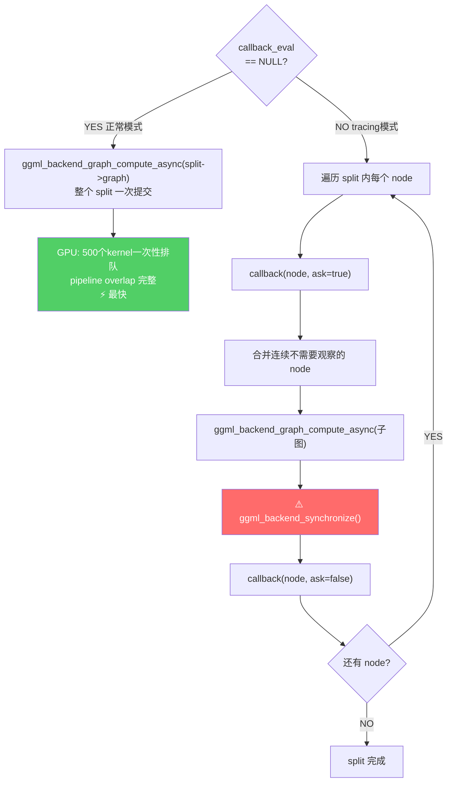

**性能影响**:

| 场景 | 行为 | 影响 |
|------|------|------|
| GPU (500+ nodes) | 每个 node 后 synchronize | **2x+ 减速**，pipeline overlap 完全丧失 |
| CPU (多线程) | 每个 graph_view 独立 compute | 线程池每次重建，但 per-node 计时准确 |
| CPU (单线程) | 同上 | 影响最小，计时最准确 |

### 1.5 ggml_backend_synchronize 到底做了什么

`ggml_backend_synchronize()` 是上游代码 (`ggml-backend.cpp:346-353`)，通过虚函数表派发到各 backend 的具体实现:

```c
// ggml-backend.cpp:346 (⬜ 上游)
void ggml_backend_synchronize(ggml_backend_t backend) {
    if (backend->iface.synchronize == NULL) return;
    backend->iface.synchronize(backend);
}
```

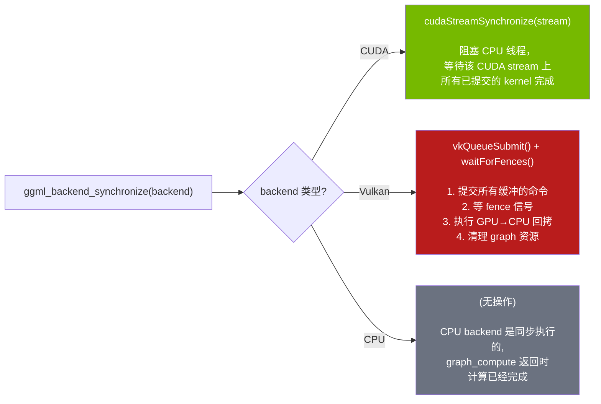

#### CUDA 实现 (`ggml-cuda.cu:2978-2984`)

```c
static void ggml_backend_cuda_synchronize(ggml_backend_t backend) {
    ggml_backend_cuda_context * cuda_ctx = (ggml_backend_cuda_context *)backend->context;
    CUDA_CHECK(cudaStreamSynchronize(cuda_ctx->stream()));
}
```

非常简单：一个 `cudaStreamSynchronize` 调用。但它的代价是 **阻塞 CPU 直到 GPU stream 上所有 kernel 完成**。在 tracing 模式下，每个 node 后都调用一次，这意味着:
- GPU 无法提前排队后续 kernel
- CPU 和 GPU 之间来回切换
- 彻底摧毁了 GPU pipeline 并行

#### Vulkan 实现 (`ggml-vulkan.cpp:12748-12755`)

```c
static void ggml_backend_vk_synchronize(ggml_backend_t backend) {
    ggml_backend_vk_context * ctx = (ggml_backend_vk_context *)backend->context;
    ggml_vk_synchronize(ctx);   // 提交命令 + 等 fence
    ggml_vk_graph_cleanup(ctx); // 清理资源
}
```

内部做更多事:
1. 结束 transfer context
2. 执行 host→device 内存拷贝
3. `vkQueueSubmit` 提交计算命令
4. `waitForFences` / spin-poll 等待 GPU 完成
5. 执行 device→host 内存拷贝
6. 清理 graph 资源

#### 为什么 tracing 对 GPU 影响大

```
正常模式 (无 callback):
CPU:  [提交 kernel 0] [提交 kernel 1] [提交 kernel 2] ... [提交 kernel 499] [sync 一次]
GPU:  ·····[kernel 0][kernel 1][kernel 2]..............................[kernel 499]
                     ↑ pipeline overlap: kernel 排队后立即开始

Tracing 模式 (有 callback):
CPU:  [提交 k0][===等 GPU===][回调][提交 k1][===等 GPU===][回调][提交 k2]...
GPU:  ·····[k0]··············idle··[k1]··············idle··[k2]····
                            ↑ GPU 大量时间在等 CPU 提交下一个
```

### 1.6 Profiler 数据流

**TraceCollector 接口** (`llm/profiler/profiler.go:9-28`, 🔵 我们的代码):

```go
type TraceCollector interface {
    RecordTensorStart(ptr uintptr, tStart int64)
    RecordTensorEnd(ptr uintptr, info TensorInfo, tEnd int64)
    RecordPassStart(passID int, nTokens int)
    RecordPassEnd(passID int, nNodes int)
    Flush(requestID string, model string) error
    Close() error
}
```

**JSONL 实现** (`llm/profiler/jsonl.go`, 🔵 我们的代码):

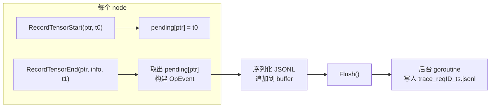

每条 JSONL 记录: `{type, pass_id, seq_id, op, name, src_names, out_shape, dtype, backend, t_start, t_end}`

---

## 2. GGML Backend Scheduler

### 2.1 Scheduler 初始化与 parallel 参数

**Scheduler 创建** (`ggml.go:387-395`):

```go
sched := C.ggml_backend_sched_new_ext(
    &schedBackends[0],     // backend 数组（按优先级排）
    &schedBufts[0],        // buffer 类型数组
    len(schedBackends),    // backend 数量
    maxGraphNodes,         // 图最大节点数
    false,                 // ← parallel=false
    true,                  // op_offload=true
    true,                  // alloc_buffers=true
)
```

#### `parallel=false` 是什么意思？

```c
// ggml-backend.cpp:1701
sched->n_copies = parallel ? GGML_SCHED_MAX_COPIES : 1;
```

`parallel` 控制的是 **pipeline parallelism（流水线并行）的 copy 数量**，不是 split 是否并行执行。

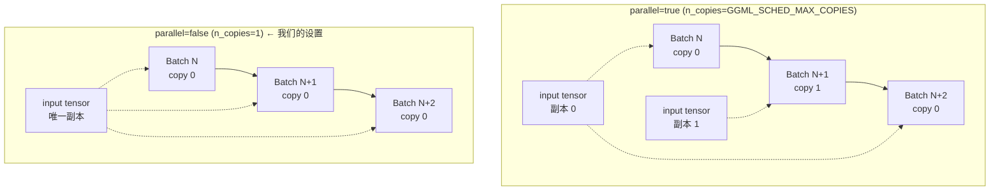

**parallel=true 时**:
- 为每个 backend 的每个 input tensor 创建 `n_copies` 个副本
- Batch N 用 copy 0 计算时，Batch N+1 可以往 copy 1 拷贝 input
- 实现 **compute 和 data transfer 的 overlap**
- 代价: `n_copies` 倍的 input tensor 内存

**parallel=false 时 (Ollama 的选择)**:
- 只有 1 个 copy，必须等当前 batch 完成才能拷贝下一个 batch 的 input
- 更少内存占用
- 对 Ollama 场景够用：因为 Go 层已经通过 `forwardBatch/computeBatch` 的 channel 实现了自己的 pipeline

**为什么不开 parallel**:

Ollama 的 pipeline 策略在 Go 层管理（`forwardBatch` 和 `computeBatch` 通过 channel 交替），不依赖 ggml scheduler 层的 multi-copy。开启 parallel 只会浪费内存而不增加吞吐。

### 2.2 图分割算法 (split_graph)

**函数**: `ggml_backend_sched_split_graph()` (`ggml-backend.cpp:960-1426`, ⬜ 上游代码)

5-pass 算法:

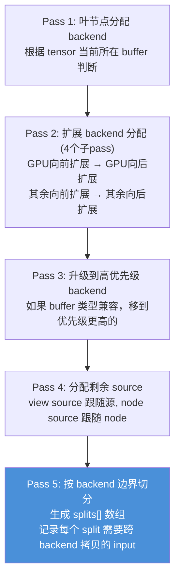

### 2.3 Split 示例图解

#### 场景 1: 模型完全在 GPU 上 (gpu_layers >= 总层数)

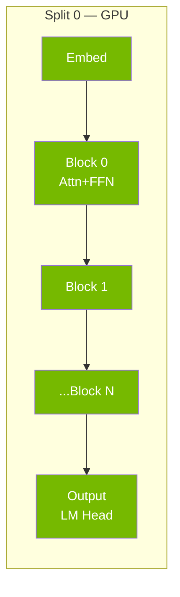

**结果**: 只有 **1 个 split**，全部在 GPU 执行。无跨 backend 拷贝。最优情况。

#### 场景 2: 部分 offload (gpu_layers=20, 模型有 32 层)

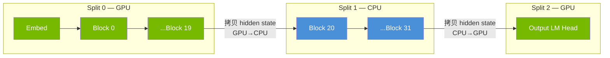

**结果**: **3 个 splits**。Split 边界处需要跨 backend 拷贝 hidden state tensor。
- Split 0 → Split 1: GPU→CPU 拷贝 (hidden state)
- Split 1 → Split 2: CPU→GPU 拷贝 (hidden state)

这就是 **sync events 想要测量的开销** — 每次跨 backend 拷贝的时间。

#### 为什么 Split 2 要回到 GPU？不累吗？

**因为 Output 层 (LM Head) 被分配在 GPU 上。** LM Head 是一个巨大的矩阵乘法 (`[hidden_dim × vocab_size]`，vocab 常常是 128K+），在 GPU 上比 CPU 快 10-100 倍，值得来回拷贝。

```
以 Qwen3 235B 为例 (hidden=8192, vocab=152064):
  LM Head MUL_MAT: 8192 × 152064 = 1.2B 参数
  CPU 执行: ~500ms
  GPU 执行: ~5ms
  GPU↔CPU 拷贝 hidden state: ~0.1ms (只有 8192 floats ≈ 32KB)

  来回拷贝的代价 << GPU 加速的收益
```

层分配的逻辑 (`ggml.go:207-229`):
- Embedding → CPU host memory (需要频繁从 CPU 访问)
- Repeating blocks → 按 `gpu_layers` 分配 (前 N 层 GPU，后面 CPU)
- **Output (LM Head) → 最高优先级 backend (GPU)** ← 这就是为什么要回 GPU

如果不回 GPU，LM Head 就要在 CPU 上做一个 vocab 级别的大矩阵乘法，会成为严重瓶颈。跨 backend 拷贝的只是 hidden state (几十 KB)，而 LM Head 计算量是 GB 级别的，所以这个来回是非常值得的。

#### 场景 3: 模型完全在 CPU (gpu_layers=0)

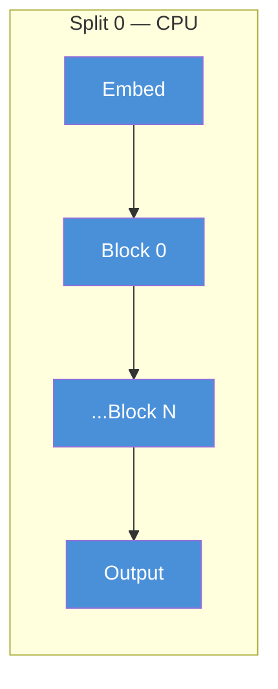

**结果**: 只有 **1 个 split**，全部 CPU。无跨 backend 拷贝。

#### 场景 4: MoE 模型部分 offload

#### 场景 4: MoE 模型部分 offload — 权重按需拷贝

##### 前提：权重跟随层分配，不是按类型分

Expert 权重的设备分配 **完全由 `gpu_layers` 决定**，跟 dense 模型一样是按层分配 (`ggml.go:332-346`)：

```
gpu_layers = 前 20 层在 GPU

层 0-19:  Attention 权重在 GPU ✅  Expert 权重也在 GPU ✅  → 不需要拷贝
层 20-31: Attention 权重在 CPU ✅  Expert 权重也在 CPU ✅  → 默认在 CPU 计算
```

代码通过 tensor 名字提取层号（如 `blk.5.ffn_gate_exps` → 层 5），然后用该层的设备分配：
```go
// ggml.go:332-346
layerIndex := extractFirstNumber(t.Name)  // "blk.5.ffn_gate_exps" → 5
createTensor(tensor{source: t}, layers[layerIndex].bts, layerIndex)
// layers[5] 是 GPU? → GPU buffer。是 CPU? → CPU buffer。
```

##### `op_offload`: CPU 层的计算也可以跑在 GPU 上

关键在于 scheduler 的 `op_offload` 机制 (`ggml-backend.cpp:862-875`):

```c
// 如果权重在 CPU host memory，且 op_offload=true，且 batch_size >= 32
if (sched->op_offload && sched->batch_size >= 32
    && src_backend_id == sched->n_backends - 1  // 在最低优先级 backend (CPU)
    && ggml_backend_buffer_is_host(src->buffer)) {
    // 尝试把计算 offload 到更高优先级 backend (GPU)
    for (b = 0; b < src_backend_id; b++) {
        if (ggml_backend_supports_op(sched->backends[b], tensor)
            && ggml_backend_offload_op(sched->backends[b], tensor)) {
            return b;  // → 在 GPU 上算！
        }
    }
}
```

**这就触发了权重拷贝**: 权重在 CPU 上，但计算被 offload 到 GPU → scheduler 必须把权重从 CPU 拷到 GPU。

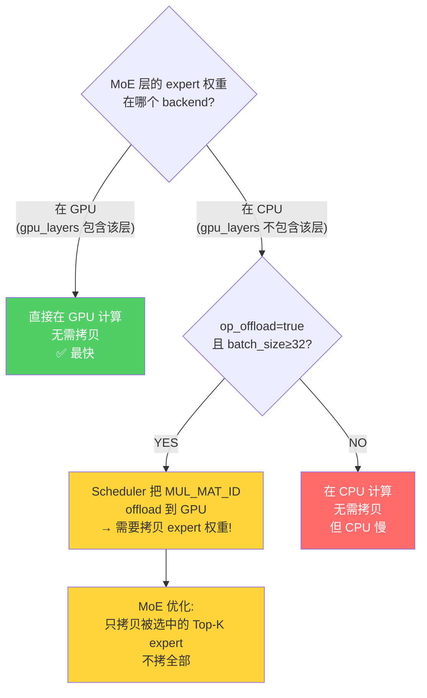

##### MoE 按需拷贝的具体实现

当 op_offload 触发后，scheduler 的 split 机制检测到 expert 权重在 CPU 但计算在 GPU，会把这些权重标记为 split 的 input。然后在 `compute_splits` 中 (`ggml-backend.cpp:1515-1599`):

```c
// 关键判断: input 是 WEIGHTS 且在 host (CPU) 内存，且 op 是 MUL_MAT_ID
if (buffer_usage == GGML_BACKEND_BUFFER_USAGE_WEIGHTS &&
    ggml_backend_buffer_is_host(input->buffer) &&
    node->op == GGML_OP_MUL_MAT_ID) {

    // 1. 读取 routing ids，确定哪些 expert 被选中
    ids = read_routing_ids(ids_tensor);
    used_ids = bitset_from_ids(ids);  // 标记使用到的 expert

    // 2. 只拷贝选中 expert 的权重数据
    for each consecutive group of used experts:
        copy_experts(first_id, last_id);
        // ggml_backend_tensor_set_async: CPU→GPU 异步拷贝
}
```

##### 拷贝量估算

expert 数量差异极大，从 GGUF 的 `expert_count` / `expert_used_count` 读取：

| 模型 | 总 expert | Top-K | 拷贝比例 | 每层拷贝量 (Q4_K_M 估) |
|------|----------|-------|---------|---------------------|
| Mixtral 8x7B | 8 | 2 | 25% | ~350 MB × 25% ≈ 88 MB |
| Qwen3-30B-A3B | 128 | 8 | 6.3% | expert 很小, ≈ 几十 MB |
| DeepSeek-V3 | 256 | 8 | 3.1% | 总量极大, 仍有 ~200 MB |

```
DeepSeek-V3 单层估算 (256 experts, top-8, Q4_K_M):
  总 expert 参数: ~671B × 大部分在 expert ≈ ~600B
  每层 expert: 600B / 61 layers / 256 experts ≈ 38M params/expert
  Q4_K_M: 38M × 0.56 bytes ≈ 21 MB/expert
  Top-8 拷贝: 21 × 8 ≈ 168 MB/层

  PCIe 4.0 x16 (~32 GB/s): 168MB / 32GB/s ≈ 5.3 ms/层
  如果 30 层在 CPU 且 offload: 5.3 × 30 ≈ 159 ms/batch

  对比 generation 一个 token 总耗时 ~30-50 ms
  → 权重拷贝时间 >> 计算时间，严重瓶颈
```

**结论**: MoE 的 op_offload 在 **prefill (batch≥32)** 时触发（GPU 计算快弥补拷贝开销），但在 **generation (batch=1, 或并发用户<32)** 时不触发（`batch_size >= 32` 条件不满足），此时 CPU 层的 expert 在 CPU 上算。

##### 代码中支持 MoE 的模型架构

均从 GGUF 读取 `expert_count` / `expert_used_count`:
- `qwen3` / `qwen3moe` — softmax routing
- `qwen35` / `qwen35moe` / `qwen3next` — 还支持 **shared expert**
- `deepseek2` — sigmoid routing + shared expert
- `glm4moelite` — sigmoid routing
- `llama4` — interleaved MoE (只有部分层是 MoE)
- `lfm2`, `nemotronh`, `gptoss`, `nomicbert` 等

#### 场景 5: 同一层内的 split (特殊情况)

即使同一层内，如果某些 op 不被当前 backend 支持，也会产生额外 split:

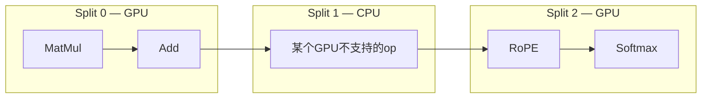

这种情况较少见，因为 Pass 2 的扩展算法会尽量把 op 合并到同一个 backend。

### 2.4 GPU 内存分配与 Split 间的复用

#### 两类内存：权重 vs 中间结果

首先区分两类 GPU 内存占用：

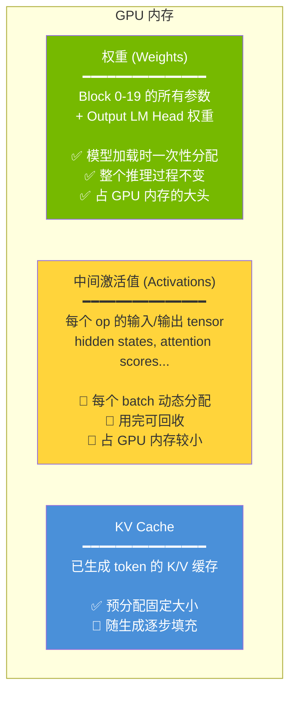

#### Split 间共享同一个 GPU buffer pool

**关键**: 所有 GPU split 共享同一个 GPU buffer pool（通过 `ggml_gallocr` 管理）。不是每个 split 独占自己的内存。

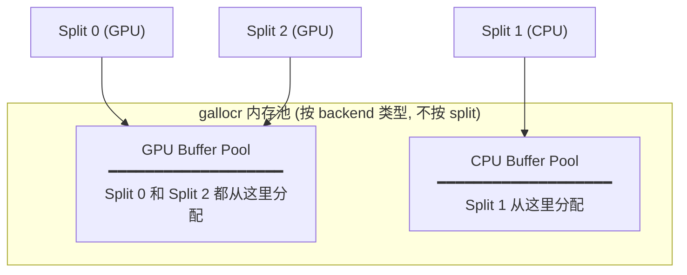

#### 中间激活值的生命周期管理

allocator 做了 **tensor 生命周期分析** (`ggml-alloc.c:631-830`)：追踪每个 tensor 被几个后续 op 引用 (`n_children`)。当引用计数归零，内存立即回收给池子。

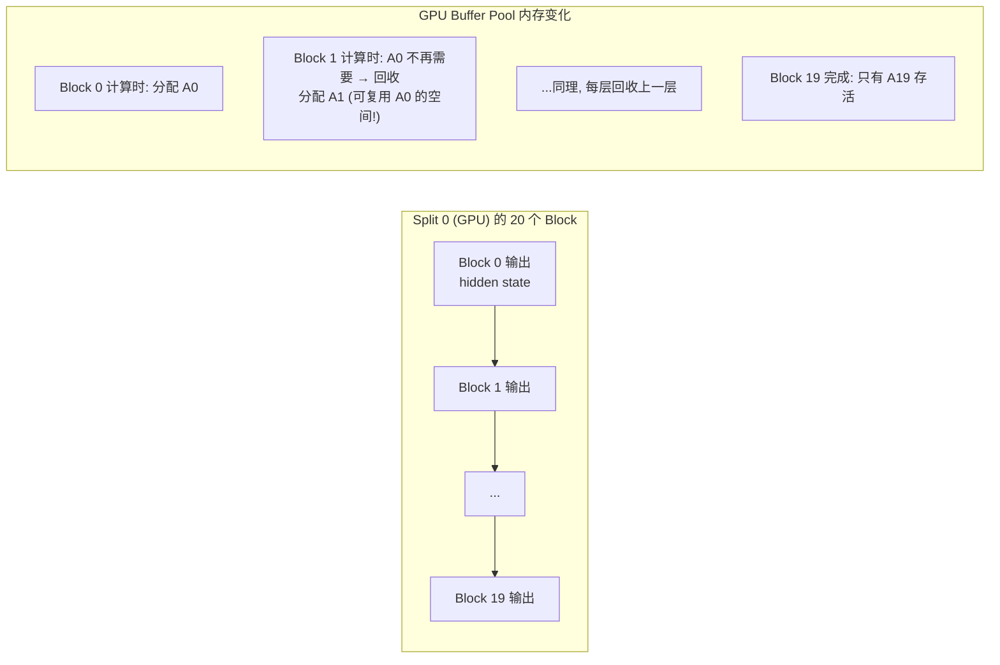

所以 GPU 内存中 **不会同时存在 20 层的中间结果**。每层的中间结果用完就回收，下一层复用同一块内存。GPU buffer pool 大小约等于 **一层的中间激活值**，不是所有层的总和。

#### 回答：Split 0 和 Split 2 的 GPU 内存关系

```
场景 2 (GPU→CPU→GPU) 的内存时间线:

时间 ──────────────────────────────────────────────→

GPU 权重内存:  [Block 0-19 权重][============永久占用============][LM Head 权重]
GPU 激活内存:  [Split0: 逐层分配/回收][空闲][        Split2: LM Head 激活       ]
CPU 权重内存:  [===============Block 20-31 权重==============]
CPU 激活内存:  [空闲][  Split1: 逐层分配/回收  ][空闲]
```

- **权重**: Block 0-19 + LM Head 在 GPU，Block 20-31 在 CPU。各自常驻，不回收。
- **激活值**: Split 0 的激活值在 Split 0 执行完后可以回收（除了要传给 Split 1 的 hidden state）。Split 2 复用同一个 GPU buffer pool。
- **不是"覆盖"**: 更准确地说是 allocator 的生命周期管理——不再需要的 tensor 的内存空间被回收，后续 tensor 可以分配到同一位置。
- **结论**: 所有 GPU split 合在一起占用的 GPU 内存 ≈ 所有 GPU 层的权重 + 峰值激活值 + KV cache。不是翻倍。

#### 权重会在 Split 间换入换出吗？

**不会。** 当前实现中，所有 GPU 层的权重在模型加载时一次性全部放入 GPU，永远不动。

你描述的场景（Split 0 用完 0-20 层权重后释放，Split 2 上传 50-60 层权重）叫做 **"layer swapping / weight offloading"**，这是一种节省显存的策略，但 Ollama 目前**没有实现**：

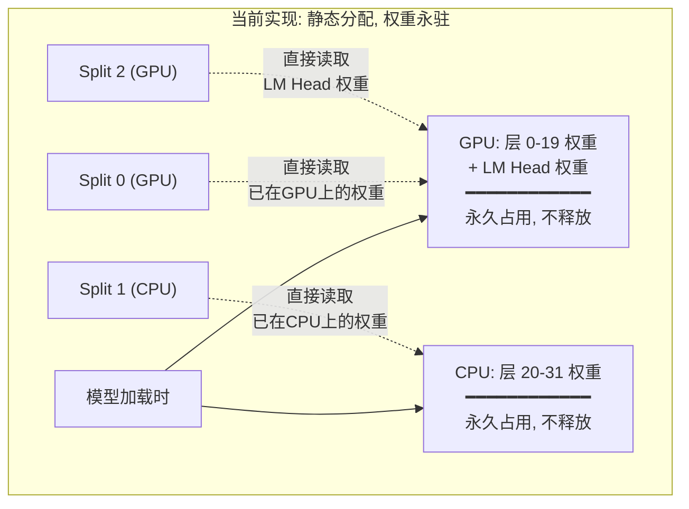

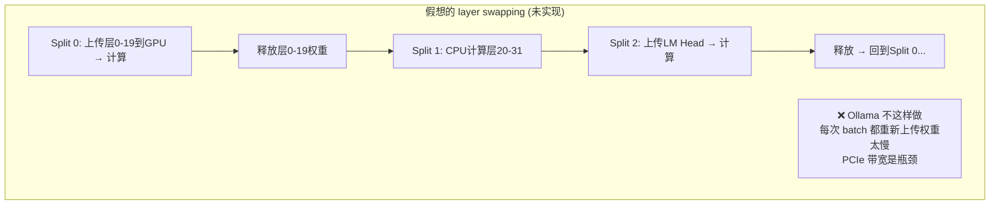

**为什么 dense 模型不这样做？** 权重很大（每层 ~273MB Q4_K_M），PCIe 3.0/4.0 带宽约 12-32 GB/s。上传 20 层权重 ≈ 5.5 GB 需要 ~170-460ms，而 generation 一个 token 只需 ~20ms。来回搬权重的开销远大于计算本身。

所以 `gpu_layers` 参数的意思就是："有多少层的权重**常驻** GPU"。显存不够就少放几层，让那些层永远在 CPU 上算。这是空间换时间的静态决策。

> **例外: MoE + op_offload。** 当 MoE 层被分配到 CPU（expert 权重在 CPU）时，scheduler 的 `op_offload` 机制可能仍然把 `MUL_MAT_ID` 计算节点分配到 GPU（因为 GPU 算得快）。这时才会发生 CPU→GPU 的 expert 权重按需拷贝。详见下文。

#### 权重和激活值的内存隔离

这是代码层面的 **硬保证**，不是优化策略：

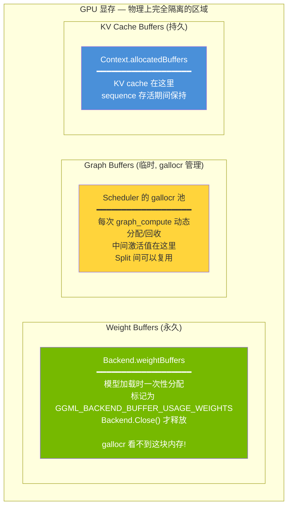

代码证据 (`ggml.go`):
- 权重: `ggml_backend_alloc_ctx_tensors_from_buft()` 分配，存入 `Backend.weightBuffers` map (Line 404-417)
- 激活: `ggml_backend_sched_reserve()` 通过 gallocr 分配 (Line 859)
- 两者用 **不同的分配函数、不同的 buffer 对象、不同的生命周期管理**

权重 buffer 被标记为 `GGML_BACKEND_BUFFER_USAGE_WEIGHTS`，gallocr 的分配器根本不知道这块内存的存在，不可能复用或覆盖。

#### 实际 VRAM 估算: Qwen2.5 32B (Q4_K_M)

> 注: 没有 "Qwen3.5 27B" 这个型号，最接近的 dense 模型是 Qwen2.5-32B。
> 参数: hidden=5120, layers=64, heads=40, kv_heads=8, head_dim=128, FFN_intermediate=27648, vocab=152064

**1) 权重 (Weight Buffers)**

| 量化 | 计算 | 大小 |
|------|------|------|
| FP16 | 32B × 2 bytes | **~64 GB** |
| Q8_0 | 32B × 1 byte | **~32 GB** |
| **Q4_K_M** | 32B × ~0.56 bytes | **~18 GB** |

每层权重分解 (Q4_K_M):
```
每层 ≈ 487M 参数:
  QKV proj: 5120 × (40+8+8) × 128    = 36.7M → ~20 MB
  O proj:   5120 × 5120               = 26.2M → ~15 MB
  FFN gate+up+down: 3 × 5120 × 27648  = 424.7M → ~238 MB
  Norms: 忽略不计
  ──────────────────────────────────────────
  每层 ≈ 273 MB (Q4_K_M)
  64 层 ≈ 17.1 GB
  + Embedding + LM Head ≈ 0.9 GB
  ──────────────────────────────────────────
  总权重 ≈ 18 GB
```

**2) KV Cache (32K context)**

```
每层 = 2(K+V) × kv_heads × head_dim × seq_len × dtype
     = 2 × 8 × 128 × 32768 × 2 bytes (FP16)
     = 128 MB/层

64 层 = 128 × 64 = 8192 MB ≈ 8 GB (FP16)
                              ≈ 4 GB (Q8_0 KV cache)
                              ≈ 2 GB (Q4_0 KV cache)
```

**3) 峰值激活值 (Graph Buffers)**

取决于阶段:

| 阶段 | batch | seq_len | 峰值激活 | 说明 |
|------|-------|---------|---------|------|
| **Generation** | 1 | 1 | **< 1 MB** | 每层: hidden_state(20KB) + FFN_intermediate(108KB) |
| **Prefill 32K** | 1 | 32768 | **~3.5 GB** | 峰值在 FFN: gate_up = 27648 × 32768 × FP32 |
| Prefill 512 | 1 | 512 | **~56 MB** | 常规 batch size |

> 注: Flash Attention 避免了 `[heads × seq × seq]` 的 attention score 矩阵展开，否则 32K 上下文需要 160+ GB。

生命周期管理使得 **同一时刻只需要一层的峰值激活值** — 上一层的中间结果在下一层开始前已回收。

**3.5 GB 的激活值需要预留吗？**

Graph buffer 是通过 `Reserve()` 预分配的 (`runner.go:1177`)。模型加载时，runner 用 **batchSize** (配置值，如 512 或 2048) 构建一个 dummy graph，调用 `ctx.Forward(t).Reserve()` 让 scheduler 预分配足够大的 buffer。

```
实际预分配大小 = 按 batchSize (如 2048) 计算的峰值激活
               ≠ 按 32K 计算

32K prefill 不是一次性 32K tokens：
  batchSize=512 时，32K prompt 分 64 次 prefill
  每次只处理 512 tokens → 峰值激活 ≈ 56 MB
  远小于 3.5 GB
```

所以实际预留的 Graph buffer 大小取决于 `batchSize`，不是 context length。3.5 GB 只是理论上一次性处理 32K tokens 的情况（实际不会发生，因为 batchSize 通常远小于 context length）。

| batchSize | 峰值 FFN 激活 | 说明 |
|-----------|-------------|------|
| 1 (generation) | ~108 KB | 可忽略 |
| 512 (默认) | ~56 MB | 这是实际预留大小 |
| 2048 | ~216 MB | 较大的 batch |
| 32768 (理论) | ~3.5 GB | 不会实际发生 |

**4) 汇总: Qwen2.5-32B Q4_K_M, 32K context, batchSize=512**

```
┌───────────────────────────────────────────────────┐
│ GPU 显存占用 (全部层放 GPU)                         │
│                                                   │
│ 权重 (Q4_K_M):         ~18.0 GB  █████████████   │
│ KV Cache (FP16, 32K):   ~8.0 GB  ██████          │
│ Graph Buffer (bs=512):   ~0.1 GB                  │
│ Scheduler 开销:          ~0.1 GB                  │
│ ─────────────────────────────────                 │
│ 总计:                   ~26 GB                    │
│                                                   │
│ → 需要 ≥ 32 GB 显卡 (留余量)                       │
│ → 24 GB 卡: offload ~10层到CPU                     │
│   (减少 ~2.7 GB 权重 + 对应 KV cache)              │
└───────────────────────────────────────────────────┘
```

### 2.5 分片执行 (compute_splits)

**函数**: `ggml_backend_sched_compute_splits()` (`ggml-backend.cpp:1480-1664`, ⬜ 上游代码)

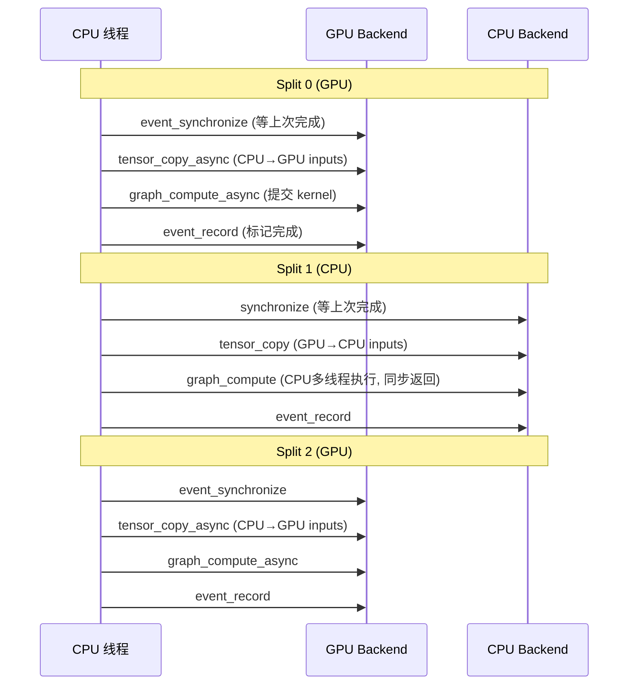

**注意**: Split 是 **顺序执行** 的（一个 split 完成后才开始下一个），因为它们之间有数据依赖。

### 2.6 Event 同步机制

**Event vs Synchronize 对比**:

| | `ggml_backend_synchronize` | `event_record` + `event_synchronize` |
|---|---|---|
| 做什么 | CPU 阻塞等 backend 所有工作完成 | 在 backend 命令流中插入标记，后续可查询/等待 |
| 阻塞谁 | CPU 线程 | CPU 线程 (synchronize) 或其他 backend (wait) |
| 精度 | 等全部完成 | 只等到特定点 |
| 用在哪 | tracing 的 per-node sync | split 间的 pipeline 协调 |
| parallel 模式 | 不使用 | `events[backend_id][copy_id]` 管理多 copy 协调 |

---

## 3. OllamaRunner 完整调用链

### 3.1 主循环与 Pooling 模型

**函数**: `Server.run()` (`runner/ollamarunner/runner.go:447-473`)

```go
func (s *Server) run(ctx context.Context) {
    // pooling_type 判断
    supportsAsync := pooling.Type(...) == pooling.TypeNone  // (Line 450)

    for {
        nextBatch := s.forwardBatch(previousBatch)

        if supportsAsync {
            go s.computeBatch(nextBatch)   // 异步: 生成式模型
        } else {
            s.computeBatch(nextBatch)       // 同步: embedding 模型
        }
        previousBatch = nextBatch
    }
}
```

#### `pooling_type` 是什么？

`pooling_type` 是模型配置中的一个属性，标识模型是否是 **embedding/pooling 模型**:

| pooling_type | 模型类型 | 例子 | supportsAsync |
|---|---|---|---|
| `TypeNone` (0) | **生成式模型** | Llama, Qwen, Gemma | `true` → `go computeBatch()` |
| `TypeMean/CLS/Last` | **Embedding 模型** | nomic-embed, bge | `false` → 同步 `computeBatch()` |

**为什么 embedding 模型不能异步?**

生成式模型是流式的（一次生成一个 token，可以边计算边准备下一个 batch）。而 embedding 模型是一次性的（输入整段文本，输出一个向量），不需要 pipeline，同步更简单也够用。

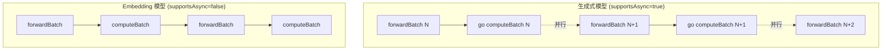

### 3.2 ggml_context 是什么

`ggml_context` 是 ggml 的核心数据结构，但它的名字容易让人误解。它 **不是** "计算上下文"或"GPU 上下文"，而是一个 **tensor 元数据的内存池**。

#### 结构定义 (`ggml.c:930-940`)

```c
struct ggml_context {
    size_t mem_size;           // 内存池大小
    void * mem_buffer;         // 内存池起始地址
    bool   mem_buffer_owned;   // 是否自己分配的
    bool   no_alloc;           // 是否跳过 tensor 数据分配

    int    n_objects;          // 对象计数

    struct ggml_object * objects_begin;  // 链表头
    struct ggml_object * objects_end;    // 链表尾
};
```

#### 它存什么？不存什么？

```mermaid
graph TB
    subgraph "ggml_context 内存池 (几 MB)"
        T1["ggml_tensor 元数据<br/>op=MUL_MAT, ne=[4096,4096]<br/>src[0]=ptr, src[1]=ptr<br/>data=NULL (指向backend buffer)"]
        T2["ggml_tensor 元数据<br/>op=ADD, ne=[4096]<br/>..."]
        T3["ggml_tensor 元数据<br/>..."]
        G["ggml_cgraph<br/>nodes[] 指针数组<br/>leafs[] 指针数组"]
    end

    subgraph "Backend Buffer (几 GB, 由 gallocr 管理)"
        D1["tensor 实际数据<br/>float[4096×4096]<br/>← 权重/激活值"]
        D2["tensor 实际数据<br/>float[4096]"]
    end

    T1 -.->|"data 指针"| D1
    T2 -.->|"data 指针"| D2
```

| 存在 ggml_context 里 | 存在 Backend Buffer 里 |
|---|---|
| tensor 的形状 (ne, nb) | tensor 的实际浮点数据 |
| tensor 的 op 类型 | 权重参数 |
| tensor 的 src 指针 (依赖关系) | 中间激活值 |
| 计算图 (ggml_cgraph) | KV cache |
| 几 MB | 几 GB |

#### 生命周期

```
每个 batch:
  NewContext()    → ggml_init() → 分配 ~几MB 的元数据内存池
  model.Forward() → 在池中创建 tensor 元数据 + 构建 graph
  ComputeWithNotify() → scheduler 读取 graph，执行计算
  ctx.Close()    → ggml_free() → 释放元数据内存池
                    (Backend Buffer 中的激活值也随之无效)
```

**类比**: ggml_context 就像是一张 **施工图纸** (tensor 元数据 + 计算图)，而 Backend Buffer 是 **实际的建筑材料** (浮点数据)。每次施工 (batch) 都画一张新图纸，但建筑材料的仓库 (buffer pool) 是复用的。

### 3.3 为什么叫"构图"？每次都要构图吗？

#### "图"是什么？

`model.Forward()` 不直接计算，而是构建一个 **计算图 (Computation Graph / DAG)**:

```mermaid
graph TD
    I["input tokens<br/>[batch_size]"] --> EMB["EMBEDDING<br/>token → vector"]
    EMB --> RM0["RMS_NORM"]
    RM0 --> Q["MUL_MAT (Q)"]
    RM0 --> K["MUL_MAT (K)"]
    RM0 --> V["MUL_MAT (V)"]
    Q --> ROPE_Q["ROPE"]
    K --> ROPE_K["ROPE"]
    ROPE_Q --> ATT["FLASH_ATTN_EXT"]
    ROPE_K --> ATT
    V --> ATT
    ATT --> PROJ["MUL_MAT (O proj)"]
    PROJ --> ADD["ADD (residual)"]
    EMB --> ADD
    ADD --> FF["... (FFN + 更多 Block) ..."]
    FF --> OUT["MUL_MAT (LM Head)<br/>→ logits"]

    style I fill:#ffd43b,color:#333
    style OUT fill:#ffd43b,color:#333
```

每个方框是一个 **ggml_tensor 节点**，代表一个运算。Forward 过程就是把这些节点和边连接起来，形成一个 DAG。**这就是"构图"**。

然后 `ComputeWithNotify()` 把这个图交给 scheduler，scheduler 切分、分配、执行。

#### 为什么每次都要重新构图？

```mermaid
flowchart TD
    A["每个 batch 都 NewContext()"] --> B["新的 ggml_context<br/>(新的内存池)"]
    B --> C["model.Forward() 构建新的 tensor DAG"]
    C --> D["所有 tensor 指针都是新的"]
    D --> E["graph_compute 执行"]
    E --> F["ctx.Close() 释放内存"]
    F --> A

    G["为什么不能复用?"] --> G1["batch_size 可能变化<br/>(1 token vs 512 tokens)"]
    G --> G2["sequence 组合可能变化<br/>(不同用户的不同请求)"]
    G --> G3["KV cache 位置变化<br/>(position 参数不同)"]
    G --> G4["tensor 指针每次不同<br/>(新 context = 新内存)"]
```

**根本原因**:
1. **输入形状变化**: prompt 阶段可能有 512 tokens，生成阶段只有 1 token。图的形状不同。
2. **动态参数**: position、sequence ID 等都影响 RoPE 和 attention mask。
3. **内存管理**: 每个 `ggml_context` 是一个临时内存池，用完即释放。复用需要完全不同的内存管理策略。

#### 有优化吗？

虽然上层每次重新构图，但底层有两个优化:

1. **Scheduler buffer 重用** (`ggml-backend.cpp:1428-1445`): 如果新图的 backend 分配与上一次相同，跳过 buffer 重新分配:
   ```c
   // 比较当前和上次的 node_backend_ids
   if (!backend_ids_changed) {
       // 尝试复用现有 buffer 分配
       if (ggml_gallocr_alloc_graph(sched->galloc, &sched->graph)) {
           // 成功! 跳过重新分配
       }
   }
   ```

2. **CUDA Graph Capture** (`ggml-cuda.cu:3059-3163`): CUDA backend 会检查图结构是否与上次相同（同样的 op、shape、stride）。如果相同，可以用 `cudaGraphExecUpdate` 就地更新而不重新 capture。但因为每次 context 的 tensor 指针不同，实际上很难命中。

### 3.3 computeBatch - 计算

**函数**: `Server.computeBatch()` (`runner/ollamarunner/runner.go:642-863`)

```
1. <-activeBatch.inputsReadyCh       // 等待 forward 完成
2. batch.Inputs.FromInts(batchInputs) // 填入 token 值
3. ctx.ComputeWithNotify(cb, output)  // 提交到 scheduler
   → split_graph → alloc_splits → compute_splits
4. outputs = modelOutput.Floats()     // 触发懒同步
5. for each seq: sample + send response
```

### 3.4 Batch Size: 什么时候是 1，什么时候不是

#### 两个阶段，完全不同的 batch size

```mermaid
graph LR
    subgraph "Prefill (Prompt Processing)"
        P["用户输入 512 tokens<br/>━━━━━━━━━━━━━━<br/>batch_size = min(512, s.batchSize)<br/>可能分多次: 512→256+256<br/><br/>一次处理多个 token"]
    end

    subgraph "Generation (Token-by-Token)"
        G["每次生成 1 个 token<br/>━━━━━━━━━━━━━━<br/>单用户: batch_size = 1<br/>3个用户并发: batch_size = 3<br/><br/>每个 sequence 贡献 1 个 token"]
    end

    P -->|"prompt 处理完毕"| G
```

#### Prefill 阶段

用户发送一段 prompt（比如 512 tokens），runner 会尽量塞满一个 batch:

```go
// runner.go:529-544 (简化)
batchSize := s.batchSize  // 配置值，通常 512 或 2048

for each sequence {
    for each token in seq.inputs {
        if len(batchInputs) + 1 > batchSize {
            break  // batch 满了
        }
        batchInputs = append(batchInputs, token)
    }
}
```

如果 prompt 有 2000 tokens，`batchSize=512`，会分 4 次 prefill: 512+512+512+464。

#### Generation 阶段

Prefill 完成后，每个 sequence 每次只生成 **1 个 token** (`runner.go:712-714`):

```go
// 每个 sequence 添加一个 placeholder token
nextToken := &input.Input{Token: 0}
seq.inputs = []*input.Input{nextToken}
```

但**多个用户可以合并到同一个 batch**:

```
单用户:                    batch = [token_A]                → batch_size = 1
3个用户同时生成:           batch = [token_A, token_B, token_C]  → batch_size = 3
1个用户在 prefill + 1个在生成: batch = [prompt_A×256, token_B]    → batch_size = 257
```

#### 实际典型情况

| 场景 | batch_size | 说明 |
|------|-----------|------|
| 单用户 generation | **1** | 最常见，每次 1 token |
| 单用户 prefill | **s.batchSize** (512) | 按配置值分批处理 prompt |
| N 用户并发 generation | **N** | 每用户 1 token，合并成一个 batch |
| 混合 (prefill + generation) | **variable** | Round-robin 收集，受 batchSize 上限 |

**对 tracing 的影响**: generation 阶段 `batch_size=1` 时，每个 pass 只有 1 个 token 通过所有层。图的形状与 `batch_size=512` 的 prefill 阶段完全不同（矩阵维度不同），所以每次都要重新构图。

### 3.5 懒同步机制

**关键实现** (`ml/backend/ggml/ggml.go:823-852`):

```mermaid
sequenceDiagram
    participant R as Runner
    participant C as Context
    participant S as Scheduler
    participant GPU as GPU

    R->>C: ComputeWithNotify(cb, output)
    C->>S: graph_compute_async(graph)
    S->>GPU: 提交所有 split (异步)
    S-->>C: 立即返回 (不等待!)
    C->>C: 把 sync 闭包挂到 output tensor
    C-->>R: 返回

    Note over R: 此时 GPU 还在计算中...

    R->>C: output.Floats()
    C->>C: 发现 needSync=true
    C->>S: ggml_backend_sched_synchronize()
    S->>GPU: 等待所有 backend 完成
    GPU-->>S: 完成
    S-->>C: 数据就绪
    C-->>R: 返回 float 数组
```

**效果**: `graph_compute_async` 提交后立即返回。只有当 `modelOutput.Floats()` 访问数据时才真正等待 GPU 完成。这让 Go 层可以在 GPU 计算期间做其他准备工作。

---

## 4. 内存分配机制详解

GGML backend 有 **三套完全独立的内存分配系统**，各自管理不同类型的数据：

```mermaid
graph TB
    subgraph "分配系统 1: 权重 (Weight Buffers)"
        W_ALLOC["ggml_backend_alloc_ctx_tensors_from_buft()<br/>━━━━━━━━━━━━━━━━━━━━━<br/>ggml-alloc.c:1199-1277"]
        W_STORE["Backend.weightBuffers map<br/>━━━━━━━━━━━━━━━━━━━━━<br/>ggml.go:119, 397-419"]
        W_FLAG["标记: GGML_BACKEND_BUFFER_USAGE_WEIGHTS"]
    end

    subgraph "分配系统 2: 计算图 (Graph Buffers via gallocr)"
        G_ALLOC["ggml_gallocr → ggml_dyn_tallocr<br/>━━━━━━━━━━━━━━━━━━━━━<br/>ggml-alloc.c:485-500"]
        G_SCHED["Scheduler.reserve() / alloc_splits()<br/>━━━━━━━━━━━━━━━━━━━━━<br/>ggml-backend.cpp:1428-1478"]
        G_LIFE["生命周期管理: n_children 引用计数<br/>用完即回收, in-place 复用"]
    end

    subgraph "分配系统 3: 运行时 Cache (Context Buffers)"
        C_ALLOC["Context.newTensor()<br/>━━━━━━━━━━━━━━━━━━━━━<br/>ggml.go:898-933"]
        C_STORE["Context.allocatedBuffers []<br/>━━━━━━━━━━━━━━━━━━━━━<br/>Context.Close() 时全部释放"]
    end

    style W_ALLOC fill:#76b900,color:#fff
    style W_STORE fill:#76b900,color:#fff
    style W_FLAG fill:#76b900,color:#fff
    style G_ALLOC fill:#ffd43b,color:#333
    style G_SCHED fill:#ffd43b,color:#333
    style G_LIFE fill:#ffd43b,color:#333
    style C_ALLOC fill:#4a90d9,color:#fff
    style C_STORE fill:#4a90d9,color:#fff
```

### 4.1 分配系统 1: 权重 (`ggml_backend_alloc_ctx_tensors_from_buft`)

**时机**: 模型加载时，一次性。
**文件**: `ggml-alloc.c:1199-1277`, Go 端 `ggml.go:248-419`

**流程**:

```mermaid
flowchart TD
    A["1. 解析 GGUF 文件<br/>获取所有 tensor 名称/形状"] --> B["2. 按 buffer type 分组<br/>创建 ggml_context (per device)"]
    B --> C["3. 在 context 中创建 tensor 描述符<br/>ggml_new_tensor() — 只分配元数据, 不分配数据"]
    C --> D["4. 调用 alloc_ctx_tensors_from_buft()<br/>一次性为 context 中所有 tensor 分配数据空间"]
    D --> E["5. 标记 GGML_BACKEND_BUFFER_USAGE_WEIGHTS<br/>存入 Backend.weightBuffers map"]
    E --> F["6. 从 GGUF 文件读取实际权重数据<br/>填入已分配的 buffer"]
```

**`alloc_ctx_tensors_from_buft` 内部算法** (`ggml-alloc.c:1211-1237`):

```c
// 遍历 context 中的所有 tensor
for each tensor t in ctx:
    size = GGML_PAD(alloc_size(t), alignment)

    if (accumulated_size + size > max_size) {
        // 当前 chunk 装不下了 → 分配当前 chunk, 开始新 chunk
        alloc_tensor_range(start, current, buft)
        start = t
        accumulated_size = 0
    }
    accumulated_size += size

// 如果有多个 chunk → 创建 multi_buffer
// 对于大模型, 单个 backend 可能需要多个 buffer chunk
```

**关键特性**:
- 顺序分配，不做生命周期分析（权重永久存活）
- 如果超过 backend 单次分配上限，自动分成多个 chunk
- 分配后标记 `USAGE_WEIGHTS`，gallocr 永远不会碰这块内存

### 4.2 分配系统 2: 计算图 (`ggml_gallocr`)

**时机**: 每次 `graph_compute` 时。
**文件**: `ggml-alloc.c:485-831`

这是最复杂的分配器，负责管理推理过程中的中间激活值。

#### gallocr 结构

```c
// ggml-alloc.c:485-500
struct ggml_gallocr {
    ggml_backend_buffer_type_t * bufts;     // 每个 backend 的 buffer 类型
    struct vbuffer ** buffers;               // 每个 backend 的实际 buffer
    struct ggml_dyn_tallocr ** buf_tallocs;  // 每个 backend 的动态分配器
    int n_buffers;                           // backend 数量

    struct ggml_hash_set hash_set;
    struct hash_node * hash_values;          // tensor → 生命周期信息

    struct node_alloc * node_allocs;         // 预计算的分配方案
    struct leaf_alloc * leaf_allocs;
};
```

#### 动态分配器 (`ggml_dyn_tallocr`)

```c
// ggml-alloc.c:124-136
struct ggml_dyn_tallocr {
    size_t alignment;
    size_t max_chunk_size;
    struct tallocr_chunk * chunks[16];  // 最多 16 个 chunk
    int n_chunks;
};

// 每个 chunk 维护一个 free block 列表
struct tallocr_chunk {
    struct free_block free_blocks[256]; // {offset, size} 排序数组
    int n_free_blocks;
    size_t max_size;
};
```

类似于一个简化版的 **内存堆管理器**: 分配时找最佳 fit 的 free block，释放时归还并合并相邻 free block。

#### 生命周期分析 (`hash_node`)

```c
// ggml-alloc.c:462-468
struct hash_node {
    int n_children;      // 有几个 op 使用此 tensor 作为输入
    int n_views;         // 有几个 view 引用此 tensor
    int buffer_id;       // 分配在哪个 backend buffer
    struct buffer_address addr;  // 在 buffer 中的地址
    bool allocated;      // 是否已分配
};
```

```mermaid
flowchart TD
    A["Phase 1: 引用计数<br/>遍历图, 统计每个 tensor 被几个后续 node 引用"] --> B["Phase 2: 分配 + 回收"]
    B --> C{"对每个 node"}
    C --> D["分配输出 tensor<br/>(或 in-place 复用 parent)"]
    D --> E["计算完成后, parent.n_children--"]
    E --> F{"n_children == 0<br/>且 n_views == 0?"}
    F -->|YES| G["FREE! 归还给 dyn_tallocr"]
    F -->|NO| H["保留, 还有后续 op 要用"]
    G --> C
    H --> C
```

**In-place 复用** (`ggml-alloc.c:640-689`): 如果一个 op 支持 in-place (如 ADD)，且 parent 只有这一个 child，直接复用 parent 的内存，零额外分配。

#### Reserve vs Alloc

| | `ggml_gallocr_reserve_n()` | `ggml_gallocr_alloc_graph()` |
|---|---|---|
| 时机 | 模型加载时 (预分配) | 每次 graph_compute |
| 做什么 | 模拟分配，确定所需 buffer 大小 | 实际分配，设置 tensor.data 指针 |
| 分配 buffer | 是，创建实际的 backend buffer | 否，复用 reserve 创建的 buffer |
| 调用方 | `Context.Reserve()` → `ggml_backend_sched_reserve()` | `ggml_backend_sched_alloc_splits()` |

### 4.3 分配系统 3: 运行时 Cache (`Context.newTensor`)

**时机**: 构图过程中，按需创建。
**文件**: `ggml.go:898-933`

用于 KV cache 等需要跨 batch 存活的 tensor:

```go
func (c *Context) newTensor(dtype ml.DType, shape []int) *Tensor {
    // 1. 创建 tensor 描述符 (只有元数据)
    t := C.ggml_new_tensor(c.ctx, cdtype, len(shape), shapeToGGML(shape))

    // 2. 按实际大小分配独立 buffer
    size := pad(C.ggml_backend_buft_get_alloc_size(c.buft, t),
                C.ggml_backend_buft_get_alignment(c.buft))
    b := C.ggml_backend_buft_alloc_buffer(c.buft, size)

    // 3. 绑定 buffer 到 tensor
    C.ggml_backend_tensor_alloc(b, t, C.ggml_backend_buffer_get_base(b))

    // 4. 加入清理列表
    *c.allocatedBuffers = append(*c.allocatedBuffers, b)
}
```

**与 gallocr 的区别**: 每个 tensor 独立一个 buffer (不共享、不做生命周期分析)。因为 KV cache 的生命周期跟随 sequence，不由计算图决定。

### 4.4 三套系统的完整生命周期

```
模型加载                                推理 (每个 batch)
━━━━━━━━━━━━━━━━━━━━━              ━━━━━━━━━━━━━━━━━━━━━

[系统1] 权重分配
  alloc_ctx_tensors_from_buft()
  → 永久占用, 标记 USAGE_WEIGHTS
  → 存入 weightBuffers map
                                    [系统3] KV cache 分配
[系统2] Graph buffer 预分配            Context.newTensor()
  Reserve() → gallocr 模拟分配        → 独立 buffer per tensor
  → 确定所需大小, 创建 buffer         → 跨 batch 存活

                                    [系统2] 激活值分配
                                      gallocr_alloc_graph()
                                      → 复用预分配的 buffer
                                      → n_children 引用计数
                                      → 用完即回收

                                    [系统3] Context.Close()
                                      → 释放 allocatedBuffers

Backend.Close()                     [系统2] buffer 不释放
  → 释放 weightBuffers                → 留给下一个 batch 复用
  → 释放 gallocr
```

### 4.5 `GGML_BACKEND_BUFFER_USAGE_WEIGHTS` 的作用

这个标记在以下位置被检查:

| 位置 | 用途 |
|------|------|
| `ggml.go:417` | 设置标记: `set_usage(b, WEIGHTS)` |
| `ggml-backend.cpp:1518` | **MoE 优化**: 检测 input 是 weight + host memory → 只拷贝选中 expert |
| `ggml-backend.cpp:862` | 判断 tensor 是否需要拷贝到其他 backend |
| `ggml-backend.cpp:1226` | 图分割时，检测权重所在位置影响 split 决策 |

**核心作用**: 告诉 scheduler "这个 buffer 里是权重，不是中间结果"。对 MoE 来说这个信息至关重要 — 只有标记了 `USAGE_WEIGHTS` 且在 host 内存上的 tensor，才会走 "只拷贝选中 expert" 的优化路径。

---

## 5. 完整调用链图

```
HTTP Request (/api/generate)
│
├─ Server.completion()                    [runner.go:865]
│  └─ NewSequence() + tokenize
│
└─ Server.run()                           [runner.go:447]  (后台 goroutine)
   │
   │  pooling_type == TypeNone ?
   │  ├─ YES (生成式): go computeBatch()  ← 异步, pipeline
   │  └─ NO  (embedding): computeBatch()  ← 同步
   │
   ├─ forwardBatch()                      [runner.go:476]  ← "构图"
   │  ├─ Backend.NewContext()             [ggml.go:676]
   │  │  └─ ggml_init() → 新的内存池
   │  │
   │  ├─ 收集 inputs (round-robin 多 sequence)
   │  │
   │  └─ model.Forward(ctx, model, batch) [各模型实现]
   │     └─ 构建 tensor DAG (不计算!)
   │        ├─ Embedding → MatMul → RoPE → Attention → ...
   │        └─ ctx.Forward(output) → ggml_build_forward_expand()
   │
   ├─ computeBatch()                      [runner.go:642]
   │  │
   │  ├─ ctx.ComputeWithNotify()         [ggml.go:823]
   │  │  │
   │  │  └─ ggml_backend_sched_graph_compute_async()   [ggml-backend.cpp]
   │  │     │
   │  │     ├─ split_graph()              [5-pass 分割]
   │  │     │  每个 split: {backend_id, node范围, 需要跨backend拷贝的inputs}
   │  │     │
   │  │     ├─ alloc_splits()             [buffer 分配, 尽量复用]
   │  │     │
   │  │     └─ compute_splits()           [顺序执行每个 split]
   │  │        │
   │  │        ├── 无 eval callback → 整个 split 一次 compute_async
   │  │        └── 有 eval callback → 逐 node: ask→compute→sync→observe
   │  │
   │  ├─ modelOutput.Floats()            → 触发 ggml_backend_sched_synchronize()
   │  │
   │  └─ 采样 token + 发送 response
   │
   └─ loop: previousBatch = nextBatch
```

---

## 6. 跨 Library GPU 混用的限制与优化机会

### 6.1 问题场景

考虑一台有以下配置的机器：

| 设备 | Backend | 显存/可用内存 | 计算速度 |
|------|---------|-------------|---------|
| NVIDIA RTX 4090 | CUDA | 24 GB VRAM | 极快 |
| Intel Arc / UHD iGPU | Vulkan | ~64 GB (UMA, 128GB RAM) | 慢但比 CPU 快 |

对于 80B MoE 模型（如 Qwen3-coder-next），**理想方案**是：

```
NVIDIA CUDA (24GB) → 高层（~25层，快速计算）
Intel iGPU Vulkan (64GB UMA) → 剩余层（~55层，比纯 CPU 快）
→ 全部 80 层上 GPU，无 CPU 回退
```

**但 Ollama 当前不支持这种混用。**

### 6.2 当前行为：ByLibrary 竞争选举

`buildLayout()` (`llm/server.go:954-996`) 按 Library 分组，各组独立竞争：

```go
// llm/server.go:954-996
gpuLayers := ml.GPULayersList{}
for _, gl := range ml.ByLibrary(gpus) {        // ← 按 Library 分组
    libraryGpuLayers := assignLayers(layers, gl, ...)
    if libraryGpuLayers.Sum() > gpuLayers.Sum() {
        gpuLayers = libraryGpuLayers             // ← 选层数最多的，其他全部丢弃
    }
}
```

对上述配置：

```
第1轮: CUDA 组 [NVIDIA 24GB]  → assignLayers → 25 层
第2轮: Vulkan 组 [iGPU 64GB]  → assignLayers → 80 层 (全部)
比较: 80 > 25 → Vulkan 组胜出，CUDA 组被整体丢弃
```

结果：**NVIDIA GPU 完全闲置，所有层跑 iGPU Vulkan**。这比 "NVIDIA 25层 + CPU 55层" 可能还慢，因为 iGPU Vulkan 的 FLOPS 远不如 NVIDIA CUDA。

### 6.3 限制作用的三个层次

**层次 1：设备发现去重** (`discover/runner.go:203-224`)

同一物理设备被多个 library 发现时（如 NVIDIA 同时被 CUDA 和 Vulkan 发现），会按 `PreferredLibrary()` 去重：

```go
// discover/runner.go:211-219
case ml.DuplicateDevice:
    if devices[i].PreferredLibrary(devices[j]) {
        droppedDevice = devices[j]     // CUDA 优先于 Vulkan
    }
```

`PreferredLibrary()` (`ml/device.go:552-559`): CUDA/ROCm 始终优先于 Vulkan。

> **注意**：NVIDIA 和 Intel iGPU 是**不同物理设备**（PCIID 不同），不会触发去重。两者都会保留在设备列表中，分别属于 CUDA 组和 Vulkan 组。

**层次 2：层分配分组** (`llm/server.go:955`)

如 6.2 所述，`ByLibrary()` 把设备按 Library 字段分成独立组，各组竞争，只保留一个胜者。

**层次 3：Backend 初始化过滤** (`ml/backend/ggml/ggml.go:367-372`)

未被分配到任何层的 backend 会被从 scheduler 中排除：

```go
// ggml.go:367-372
if !slices.Contains(cpuDeviceBufferType.bts, bt) {
    if c, ok := ctxs[bt]; !ok || C.ggml_get_first_tensor(c) == nil {
        continue  // ← 没有 tensor 分配到这个 backend，跳过
    }
}
```

### 6.4 底层 GGML Scheduler 支持混合 Backend

关键发现：**限制只在 Go 层（`buildLayout`），不在 C 层**。

GGML scheduler (`ggml-backend.cpp:1676-1706`) 接受任意多个不同 library 的 backend：

```c
// ggml-backend.cpp:1676
ggml_backend_sched_t ggml_backend_sched_new_ext(
    ggml_backend_t * backends,    // 可以是 [CUDA, Vulkan, CPU] 混合
    ggml_backend_buffer_type_t * bufts,
    int n_backends, ...
)
```

五遍 split 算法根据 tensor 的 buffer type 自动路由到正确的 backend，跨 backend 的数据拷贝在 `compute_splits()` 中自动完成（`ggml-backend.cpp:1515-1599`）。

即：如果上层把 CUDA 和 Vulkan backend 都传入 scheduler，并且把权重分别放在对应的 buffer 上，**scheduler 完全能正确处理混合执行**。

### 6.5 llamarunner 同样受限

两种 runner 都受 `buildLayout()` 约束，因为层分配在**它们之外**完成：

```
buildLayout() → GPULayersList → 传给 runner
```

**ollamarunner** (`runner/ollamarunner/runner.go:1321-1326`):

```go
params := ml.BackendParams{
    GPULayers: req.GPULayers,    // ← 来自 buildLayout()
}
```

→ 传给 `ggml.go:207-223` 的 `assignLayer()`，只给列表中的设备分配层。

**llamarunner** (`runner/llamarunner/runner.go:923-937`):

```go
gpuIDs := llama.EnumerateGPUs()
for _, layers := range req.GPULayers {    // ← 同样来自 buildLayout()
    for i := range gpuIDs {
        if gpuIDs[i].DeviceID == layers.DeviceID {
            numGPU += len(layers.Layers)
            tensorSplit = append(tensorSplit, float32(len(layers.Layers)))
            llamaIDs = append(llamaIDs, gpuIDs[i].LlamaID)
        }
    }
}
```

→ 传给 llama.cpp 的 `ModelParams.Devices`，只包含胜出组的设备 ID。

**测试用例也明确确认**了这个行为 (`llm/server_test.go:113-118`):

```go
{
    name:     "Multi GPU different libraries",
    gpus:     []ml.DeviceInfo{
        {DeviceID: ml.DeviceID{Library: "CUDA", ID: "gpu0"}, FreeMemory: 128MB},
        {DeviceID: ml.DeviceID{Library: "ROCm", ID: "gpu1"}, FreeMemory: 256MB},
    },
    expected: ml.GPULayersList{
        {DeviceID: ml.DeviceID{ID: "gpu1", Library: "ROCm"}, Layers: []int{0, 1}},
    },
    // ← 只有 ROCm gpu1 (256MB > 128MB)，CUDA gpu0 完全不用
}
```

### 6.6 iGPU (UMA) 的分阶段价值分析

直觉上 iGPU 和 CPU 共享同一块 RAM，没有独立显存优势。但需要分 prefill 和 decode 两个阶段分别讨论。

#### Decode 阶段（batch=1）：iGPU ≈ CPU，无优势

```
┌─────────────────────────────────────────────────┐
│              物理 RAM (128 GB, DDR5)             │
│         同一条内存总线，~90 GB/s 带宽            │
│                                                  │
│    CPU 直接访问 ←──────→ iGPU 通过 Vulkan 访问   │
└─────────────────────────────────────────────────┘
```

Decode 是**纯 memory-bandwidth bound**——每生成一个 token 要读一遍全部权重。iGPU 和 CPU 读同一块 RAM，带宽上限相同（DDR5 ~90 GB/s），**谁算都一样快**。

> 实测佐证 (llama.cpp #16230)：RTX 2060 上 Vulkan decode 164 t/s vs CUDA 163 t/s，几乎相同。Vulkan dispatch overhead（每次 ~10-50μs）对 decode 的毫秒级计算来说**微不足道**。

#### Prefill 阶段（batch=512）：iGPU 可能有优势

Prefill 是 **compute-bound**（大矩阵乘法）。这里算力对比才有意义：

| 设备 | FP32 TFLOPS | 来源 |
|------|-------------|------|
| CPU Arrow Lake 24核 (AVX2 only, **无 AVX-512**) | ~1.9 | 24c × 5GHz × 16 ops/cycle |
| CPU 12/13代 8P核 (AVX-512, 2×FMA) | ~2.8 | 8c × 5.5GHz × 64 ops/cycle |
| Intel UHD 770 (32 EU) | ~1.5 | Wikipedia: 1484-1588 GFLOPS |
| Intel Arc iGPU (128 EU, Xe-LPG) | ~4.0 | 按 EU 比例从 Xe-LP 数据估算 |

**关键发现：Arrow Lake 移除了 AVX-512，CPU 算力只有 ~1.9 TFLOPS。而 Arrow Lake 的 Arc iGPU (128 EU) 约 4 TFLOPS——是 CPU 的 2 倍。**

GPU 天生擅长大 batch 矩阵乘法的并行计算。ggml 的 Vulkan shader 使用 cooperative matrix / subgroup 操作，对 batch=512 的 matmul 效率较高。

> 实测佐证 (llama.cpp #19221)：Intel iGPU Vulkan 跑 DeepSeek-Qwen3 8B Q4_K_M 达到 ~965 t/s（含 prefill）。
> AMD Renoir APU (8 CU, 远弱于 Arrow Lake iGPU) 跑 Qwen3-30B Q8_0 prefill 达 101.88 t/s (llama.cpp #17715)。

#### 结论

| 阶段 | CPU vs iGPU | 谁更快 |
|------|-------------|--------|
| Decode (batch=1) | 相同带宽，CPU 零调度开销 | CPU 略优或持平 |
| Prefill (batch=512) | iGPU ~4 TFLOPS vs CPU ~1.9 TFLOPS (无 AVX-512) | **iGPU 可能 2× 快** |

这引出一个优化方向：**prefill 阶段让溢出层走 iGPU Vulkan，decode 阶段走 CPU**。

### 6.7 Vulkan UMA 零拷贝机制（上游已实现）

在讨论优化方案之前，需要理解一个关键事实：**Vulkan backend 在 UMA 系统上已实现零拷贝内存共享**。

#### UMA 检测

`ggml-vulkan.cpp:4436`：

```cpp
device->uma = device->properties.deviceType == vk::PhysicalDeviceType::eIntegratedGpu;
```

所有 iGPU 自动标记为 UMA。

#### 设备内存分配策略

`ggml_vk_create_buffer_device()` (`ggml-vulkan.cpp:2448-2451`)：

```cpp
} else if (device->uma) {
    // Fall back to host memory type
    buf = ggml_vk_create_buffer(device, size,
        {vk::MemoryPropertyFlagBits::eDeviceLocal,                              // 优先
         vk::MemoryPropertyFlagBits::eHostVisible | vk::MemoryPropertyFlagBits::eHostCoherent});  // fallback
}
```

UMA 系统上 `eDeviceLocal` 和 `eHostVisible` 指向同一块物理 RAM。所有 Vulkan buffer 都 CPU 可见。

#### 计算时零拷贝：直接用 CPU 指针

**这是核心机制**。每个计算函数（matmul、mul_mat_id 等）在 UMA 系统上会尝试直接使用 tensor 的 CPU 内存地址：

`ggml_vk_tensor_subbuffer()` (`ggml-vulkan.cpp:5807-5814`)：

```cpp
if (ctx->device->uma) {
    ggml_vk_host_get(ctx->device, tensor->data, buffer, offset);
    // ↑ 用 tensor 的 CPU 指针 (tensor->data) 查找对应的 VkBuffer 映射
    //   如果这块内存是通过 Vulkan 的 pinned memory 分配的，直接返回 VkBuffer
}
if (!buffer) {
    // 找不到映射才用 Vulkan 自己的 buffer
    buffer = buf_ctx->dev_buffer;
}
```

`ggml_vk_mul_mat()` (`ggml-vulkan.cpp:6698-6702`)：

```cpp
if (ctx->device->uma) {
    ggml_vk_host_get(ctx->device, src0->data, d_Qx, qx_buf_offset);  // 权重
    ggml_vk_host_get(ctx->device, src1->data, d_Qy, qy_buf_offset);  // 激活值
    src0_uma = d_Qx != nullptr;  // 如果找到映射 → GPU 直接读这块内存，零拷贝
}
```

`ggml_vk_host_get()` (`ggml-vulkan.cpp:5787-5800`) 的实现：

```cpp
static void ggml_vk_host_get(const vk_device& device, const void * ptr,
                              vk_buffer& buf, size_t& buf_offset) {
    buf = nullptr;
    for (size_t i = 0; i < device->pinned_memory.size(); i++) {
        const uint8_t* addr = (const uint8_t*) std::get<0>(device->pinned_memory[i]);
        const uint8_t* endr = addr + std::get<1>(device->pinned_memory[i]);
        if (ptr >= addr && ptr < endr) {
            buf = std::get<2>(device->pinned_memory[i]);  // 找到包含此地址的 VkBuffer
            buf_offset = ((const uint8_t *)ptr) - addr;
            break;
        }
    }
}
```

#### 读回数据也零拷贝

`ggml-vulkan.cpp:6227-6230`：

```cpp
if (src->memory_property_flags & vk::MemoryPropertyFlagBits::eHostVisible && src->device->uma) {
    memcpy(dst, (uint8_t *) src->ptr + offset, size);  // 直接 CPU memcpy，不走 GPU
}
```

#### 物理内存视图

```
┌───────────────────────────────────────────────────────────┐
│                  物理 RAM (128 GB, DDR5)                   │
│                                                            │
│  ┌─ Layer 25 权重 ────────────────────────────────────┐   │
│  │  物理页: 0x7F00_0000 - 0x7F25_0000                 │   │
│  │                                                     │   │
│  │  VkBuffer (pinned_memory 表中注册)                  │   │
│  │    → Vulkan shader 直接读 (prefill 计算)            │   │
│  │                                                     │   │
│  │  CPU 指针 (tensor->data, 通过 vkMapMemory 映射)    │   │
│  │    → CPU AVX2 直接读 (decode 计算)                  │   │
│  │                                                     │   │
│  │  同一块物理内存，两种访问路径，零拷贝               │   │
│  └─────────────────────────────────────────────────────┘   │
└───────────────────────────────────────────────────────────┘
```

**这意味着：在 UMA iGPU 上，CPU backend 和 Vulkan backend 之间切换计算不需要任何数据拷贝。** 权重、KV cache、激活值都可以被两个 backend 直接访问。

### 6.8 Phase-Aware Scheduling 方案设计

#### 理想行为

```
Prefill (compute-bound, batch=512):
  Layer 0-24  → NVIDIA CUDA (24GB VRAM, 最快)
  Layer 25-79 → Intel iGPU Vulkan (UMA, ~4 TFLOPS > CPU ~1.9 TFLOPS)

Decode (memory-bound, batch=1):
  Layer 0-24  → NVIDIA CUDA (24GB VRAM, 最快)
  Layer 25-79 → CPU (DDR5 90 GB/s, 与 iGPU 共享带宽，零调度开销)
```

**上游 Vulkan UMA 零拷贝已经解决了数据共享问题** (§6.7)，不需要担心 prefill/decode 切换时的数据拷贝。

#### 当前架构的限制

当前 `op_offload` (`ggml-backend.cpp:860-875`) 已经能按 batch_size 动态决定是否 offload：

```c
// ggml-backend.cpp:860-875 (现有逻辑)
if (op_offload && cur_backend_id > 0 && sched->batch_size >= 32) {
    // batch 大 → offload 到更高优先级的 backend (GPU)
}
```

但它只在已加入 scheduler 的 backend 之间做切换。当前由于 `ByLibrary` 竞争 (§6.2)，iGPU Vulkan backend 根本没有进入 scheduler，所以 `op_offload` 无从发挥。

#### 实现路径：两步改动

**第一步 (Go 层)：让 iGPU 进入 scheduler**

修改 `buildLayout()` (`llm/server.go`)，在 CUDA 组胜出后，将 UMA iGPU 附加为辅助设备。溢出层的权重仍分配到 CPU buffer（UMA 上 CPU 和 iGPU 访问同一物理内存），但 iGPU backend 被加入 scheduler。

```go
// 伪代码：buildLayout() 中，CUDA 组胜出后
for _, gpu := range vulkanGroup {
    if gpu.Integrated && gpu.UMA {
        // 不分配层给 iGPU，但确保 iGPU backend 进入 scheduler
        // op_offload 会在 prefill 时动态决定是否使用
    }
}
```

**第二步 (C 层)：`op_offload` 自动按 batch_size 切换**

现有 `op_offload` 逻辑 (`ggml-backend.cpp:860-875`) 已按 `batch_size >= 32` 做 offload。由于 UMA 零拷贝 (§6.7)，权重在 CPU buffer 上 → iGPU Vulkan 可以直接通过 `ggml_vk_host_get` 找到对应的 VkBuffer → 无需拷贝 → offload 到 iGPU 计算。

Decode 时 `batch_size = 1 < 32`，`op_offload` 不触发，计算留在 CPU。

**效果**：

```
Prefill (batch=512, batch >= 32 → op_offload 触发):
  溢出层: CPU buffer 上的权重 → iGPU 通过 UMA 零拷贝直接读 → Vulkan shader 计算

Decode (batch=1, batch < 32 → op_offload 不触发):
  溢出层: CPU buffer 上的权重 → CPU 直接读 → AVX2 计算
```

#### 需要验证的问题

1. **iGPU backend 未分配层时能否进入 scheduler？** — 当前 `ggml.go:367-372` 会跳过没有 tensor 的 backend。需要特殊处理让 UMA iGPU 即使没有直接分配的层也能作为 offload 目标。
2. **`op_offload` 的 UMA 路径是否正确？** — `ggml_vk_host_get` 能否找到 CPU 分配的权重？需要确认这些权重在 Vulkan pinned_memory 表中注册。
3. **实际 prefill 加速效果** — 理论上 iGPU ~4 TFLOPS vs CPU ~1.9 TFLOPS，但需要 llama-bench 实测。

---

## 7. CUDA + iGPU 下 80B MoE 模型的更多优化方向

以下分析基于 Qwen3-coder-next 80B Q4_K_M 在 NVIDIA 24GB + Intel iGPU (128GB RAM UMA) 上运行的场景。目标：**优化 prefill 速度（首 token 延迟）和 decode 速度（token/s 吞吐）**。

§6 的 Phase-Aware iGPU Offload 主攻 prefill。本章探讨与之互补的更多优化方向。

### 7.1 KV Cache 量化（已支持，立即可用）

#### 当前支持现状

Ollama **已完整支持** KV cache 量化：

- **配置方式**：环境变量 `OLLAMA_KV_CACHE_TYPE`（`envconfig/config.go:195`）
- **支持类型**（`fs/ggml/ggml.go:849-855, 908-919`）：

| 类型 | 每元素字节 | 相对 f16 | 条件 |
|------|-----------|---------|------|
| `f16` | 2.0 | 100% (默认) | 无 |
| `q8_0` | 1.0 | 50% | 需 Flash Attention |
| `q4_0` | 0.5 | 25% | 需 Flash Attention |

- **前提条件**：量化 KV cache 需要 Flash Attention 开启（`llm/server.go:224-258`，未开启时会 warning 并回退 f16）
- **模型支持**：Qwen3 全系列已支持（`fs/ggml/ggml.go:900-902`：`qwen3`, `qwen3moe`, `qwen35`, `qwen35moe`, `qwen3next`）

**注意**：Recurrent 层（GatedDeltaNet）的 state 始终用 f32（`fs/ggml/ggml.go:915`），不受 KV cache 类型影响。只有 full attention 层的 KV cache 被量化。

#### 对 CUDA + iGPU 场景的收益

以 32K context、Qwen3-coder-next 80B 为例（仅 full attention 层有 KV cache，约 20 层）：

```
KV cache f16: 20 层 × 32K × (K_dim + V_dim) × num_kv_heads × 2 bytes
KV cache q4_0: 同上 × 0.5 bytes → 节省 75%
```

GPU 24GB 中 KV cache 占比减少 → **能多放几层的权重到 GPU** → 减少溢出到 CPU 的层数。

#### 使用方式

```bash
OLLAMA_KV_CACHE_TYPE=q8_0 ollama serve   # 保守：50% 节省，质量损失极小
OLLAMA_KV_CACHE_TYPE=q4_0 ollama serve   # 激进：75% 节省，可能有轻微质量影响
```

### 7.2 Speculative Decoding / EAGLE3（未支持，需实现）

#### 原理

Speculative decoding 把 K 次逐 token decode 变成 1 次 batch=K 的验证：

```
无 speculative decoding:
  大模型 decode: token₁ → token₂ → ... → tokenₖ
  每个 token 读一遍所有权重 → K 次全量读取

有 speculative decoding:
  1. Draft head 快速草拟 K 个候选 token（轻量）
  2. 大模型一次 forward pass (batch=K) 验证
  → 只读一遍权重，产出 ~K 个 token（取决于接受率）
```

对 CPU 上的 55 溢出层，decode 瓶颈是内存带宽（DDR5 ~90 GB/s）。Speculative decoding 让每次权重读取产出更多 token，**等效带宽利用率提高 K × acceptance_rate 倍**。

代码生成场景接受率通常 70-80%，K=8 时等效 decode 吞吐提升 **×5-6**。

EAGLE3（如 [Aurora-Spec-Qwen3-Coder-Next-FP8](https://huggingface.co/togethercomputer/Aurora-Spec-Qwen3-Coder-Next-FP8)）是一种高效 draft head，直接利用目标模型的 hidden states 预测下一组 token，不需要独立的小模型。

#### 与 iGPU offload 的协同

验证阶段 batch=K（K=8-16），batch >= 32 时 `op_offload` 触发。如果 K 足够大，验证阶段的溢出层也能 offload 到 iGPU 加速。即使 K < 32 不触发 offload，单次读取产出多 token 本身就是巨大收益。

#### 当前 Ollama 支持现状

**未实现。** 详细调查结果：

- **上游 llama.cpp**：已有完整 speculative decoding 基础设施
  - `common_params_speculative` 结构体（`llama.cpp/common/common.h`）：draft model path、n_max、p_min 等参数
  - `common_sampler_sample_and_accept_n()`：draft-verify 采样逻辑
- **Ollama 层面**：完全未暴露
  - `api/types.go`：无 draft model、speculative 相关字段
  - `runner/`（两种 runner）：无多模型加载、无 draft-verify 流水线
  - `envconfig/`：无 `OLLAMA_DRAFT_MODEL` 等环境变量
  - `server/routes.go`：单模型请求处理，无并行模型调度

#### 实现所需改动

```
1. API 层: 新增 draft_model 参数 (api/types.go)
2. Server 层: scheduler 支持同时加载 draft + target 模型 (server/sched.go)
3. Runner 层: 实现 draft-verify 循环 (runner/ollamarunner/runner.go)
4. 模型层: 支持 EAGLE3 head 作为 draft model 的一种
```

改动量较大，涉及 API、scheduler、runner 三层。

### 7.3 MoE 感知层内拆分（未支持，需实现）

#### 原理

当前层分配以**整层**为单位：

```
当前: Layer N → 全部 tensor (attention + MoE FFN) → 同一设备
                ↓
GPU 24GB ÷ ~3.2GB/层 ≈ 7 层（含 KV cache 后更少）
→ Layer 8-79 的 attention 全在 CPU 上
```

MoE 感知拆分：在**同一层内**，把 attention（小、dense）和 MoE FFN（大、sparse）分到不同设备：

```
优化: Layer N → attention tensor → GPU
                MoE FFN tensor  → CPU/iGPU

Attention: 80 层 × ~200MB = 16GB → 全部放 GPU 24GB ✓
MoE FFN: 80 层 × ~3GB (Q4_K_M) → CPU/iGPU (UMA ~100GB)
```

**效果**：所有层的 attention/recurrent 都在 GPU 上快速计算，MoE FFN 在 CPU/iGPU 上利用稀疏性（top-8/128 = 6.25% 权重活跃）。

#### 当前 Ollama 支持现状

**不支持。** 层分配是**原子的**——同一层的所有 tensor 必须在同一设备。

**关键代码证据**：

`ggml.go:207-223` — `assignLayer()` 返回**单一设备**给整层：

```go
assignLayer := func(layer int) deviceBufferType {
    for _, p := range params.GPULayers {
        for _, l := range p.Layers {
            if l == layer {
                return gpuDeviceBufferTypes[i]  // ← 整层一个设备
            }
        }
    }
    return cpuDeviceBufferType
}
```

`ggml.go:340-341` — 所有 tensor 用层级设备分配：

```go
if layerIndex >= 0 {
    createTensor(tensor{source: t}, layers[layerIndex].bts, layerIndex)
    // ↑ blk.25.attn_q 和 blk.25.ffn_gate 都用 layers[25].bts（同一设备）
}
```

Tensor 名到层号的映射（`ggml.go:334-337`）只提取数字索引，不区分 tensor 类型：

```go
// "blk.25.attn_q.weight" → layerIndex = 25
// "blk.25.ffn_gate.0.weight" → layerIndex = 25
// 两者分配到相同设备
```

内存追踪也是 per-layer（`ml/device.go:146-161`）：`Weights[layer]` 和 `Cache[layer]` 按层索引，不按 tensor 类型拆分。

#### 实现所需改动

需要将"层级分配"改为"tensor 级分配"：

```
1. ggml.go: assignLayer() → assignTensor()，根据 tensor 名中的 "attn_"/"ffn_" 前缀分配不同设备
2. llm/server.go: buildLayout() 需要 per-tensor-type 的内存统计（attention 权重 vs FFN 权重分开算）
3. ml/device.go: DeviceMemory 需要 per-tensor-type 跟踪
4. GGML scheduler: 已天然支持同一层 tensor 在不同 backend（5-pass split 按 tensor buffer type 路由）
```

**好消息**：GGML scheduler 底层**已支持**同一层的 tensor 在不同 backend——只要权重被分配到不同的 buffer type，split 算法自动处理跨 backend 计算和数据传输。**改动集中在 Go 层的分配逻辑**。

### 7.4 Hybrid 层类型感知分配（未支持，低成本可实现）

#### 原理

Qwen3-coder-next 是 hybrid 架构，混合两种层：

- **Recurrent 层 (GatedDeltaNet)**：60/80 层（75%），`full_attention_interval=4` → `isRecurrent[i] = (i+1)%4 != 0`
  - 无 KV cache（固定大小 state，用 f32）
  - 计算量较轻（线性注意力 + 1D 卷积 + state 更新）
  - 权重较小（~150MB vs attention 的 ~200MB）

- **Full Attention 层**：20/80 层（25%）
  - 有 KV cache（随上下文增长）
  - 计算量较重（scaled dot-product attention，O(seq_len²)）
  - 权重较大

当前 `buildLayout()` (`llm/server.go:939-952`) **不区分层类型**，所有层统一从后往前贪心填充 GPU：

```go
// llm/server.go:1143 — greedyFit 从最后一层往前塞
for i := len(layers) - 1; i >= 0; i-- {
    // 不管 layer i 是 recurrent 还是 full attention
    // 只看 layers[i] 大小是否装得下
}
```

#### 优化思路

优先把 **full attention 层放 GPU**（计算重、有 KV cache 受益于 GPU 带宽），recurrent 层放 CPU（计算轻、无 KV cache）。

#### 当前支持现状

**不支持**，但 per-layer size 已经是准确的。

`buildLayout()` 计算每层的实际大小（`server.go:943-952`），包含该层的 weights + cache。由于 recurrent 层没有 KV cache（只有固定 state），它们在 `memory.GPU[j].Cache[i]` 中的数值比 attention 层小。所以 `greedyFit()` 实际上已经"知道"不同层大小不同。

但问题是：`greedyFit()` 从**最后一层往前**贪心塞（`server.go:1143`），不考虑哪种层更应该上 GPU。如果 layer 78 是 recurrent（小），layer 79 是 attention（大），当前逻辑先放 79（正好是 attention），但这只是巧合。

#### 实现所需改动

两种思路：

**思路 A：修改 greedyFit 的层排序**

不再从后往前，而是按"GPU 收益"排序：full attention 层优先，recurrent 层最后。

```
改动: llm/server.go greedyFit() — 传入层优先级排序
约 20 行 Go 代码
```

**思路 B：与 MoE 感知拆分联合（§7.3）**

如果已实现 tensor 级分配，自然可以把 attention 类 tensor 放 GPU、recurrent 类 tensor 视情况放 CPU。两个优化合为一体。

### 7.5 优化方向对比与组合

#### 单项收益预估

| 方向 | Prefill 收益 | Decode 收益 | 实现状态 | 改动量 |
|------|-------------|-------------|---------|--------|
| KV cache 量化 (§7.1) | 间接（GPU 多放层） | 间接（GPU 多放层） | **已支持** | 0（配环境变量） |
| iGPU offload (§6.8) | **直接 ×2**（溢出层） | 无 | 未实现 | ~30 行 C + Go |
| Speculative decoding (§7.2) | 无 | **直接 ×5-6** | 未实现 | 大（API+scheduler+runner） |
| MoE 感知拆分 (§7.3) | **直接**（全层 attn 上 GPU） | **直接**（全层 attn 上 GPU） | 未实现 | ~50 行 Go |
| Hybrid 层感知 (§7.4) | 间接（更优分配） | 间接（更优分配） | 未实现 | ~20 行 Go |

#### 组合效果（理想情况）

```
Baseline (当前):
  GPU: 7 层完整，CPU: 73 层完整
  Prefill: CPU 算力瓶颈
  Decode: CPU 带宽瓶颈

+ KV cache q8_0 (§7.1):
  GPU: ~10 层完整，CPU: ~70 层完整（GPU 多放 3 层）

+ MoE 感知拆分 (§7.3):
  GPU: 全部 80 层的 attention/recurrent（~16GB）
  CPU/iGPU: 全部 80 层的 MoE FFN（~35GB）
  → 所有层的 dense 计算都在 GPU 上

+ iGPU offload (§6.8):
  Prefill: MoE FFN 部分 offload 到 iGPU（~4 TFLOPS vs CPU ~1.9 TFLOPS）

+ Speculative decoding (§7.2):
  Decode: 每次权重读取产出 ~6 个 token 而非 1 个

+ Hybrid 层感知 (§7.4):
  进一步微调：full attention 层的 MoE FFN 优先 iGPU（计算更重）
```

#### 推荐实施顺序

```
第 1 步: KV cache 量化          — 零成本，立即收益
第 2 步: MoE 感知层内拆分       — 根本性改变 GPU 利用效率
第 3 步: iGPU prefill offload  — 加速溢出层的 prefill
第 4 步: Hybrid 层感知          — 可与第 2 步合并实现
第 5 步: Speculative decoding  — 改动最大，decode 收益最显著
```

### 7.6 备选方案参考

以下方案作为参考记录，不作为主要优化方向。

**方案 A：`buildLayout()` 跨 Library 合并**

适用于多张不同厂商 discrete GPU（NVIDIA + AMD）共存。修改 `buildLayout()` 在 `ByLibrary` 循环后新增一轮跨组竞争。~20 行 Go。当前不需要。

**方案 D：`OLLAMA_CROSS_LIBRARY=1` 环境变量**

跳过 `ByLibrary` 分组，所有 GPU 统一分配层。最简单但不区分 prefill/decode 阶段。~10 行 Go。
